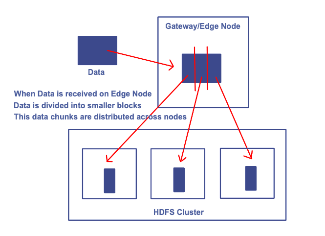
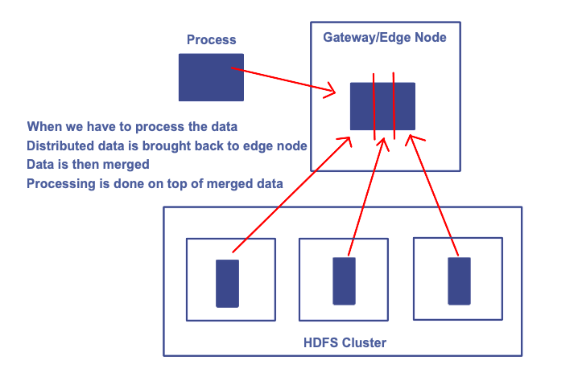
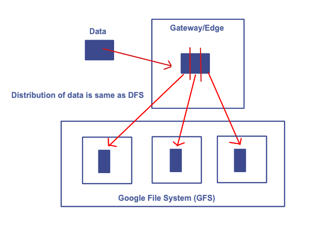
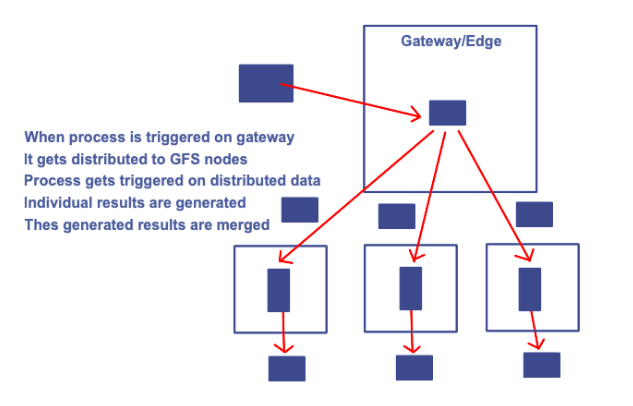

## 1. Evolution of Data Storage

**_1960s_**

- Data was stored in text files.
- Tools like notepad was used.

**_1970s_**

- Data was stored in DBMS.
- Tools like spreadsheet/excel was used.

**_1980s_**

- Internet evolution started.
- Birth of RDBMS (Larry Ellison).
- Data can be injected into database over internet.
- More frequently used data was stored in RDBMS.

**_1990s_**

- Data Warehouse was invented.
- Less used data (Historical data) was stored.
- When ever this dara was required, data is migrated back to RDBMS

**_1995_**

- Distributed File System (DFS) was invented.
- Founder: Doug Cutting

 

> Storing the data was well managed in DFS because data is well desitributed across nodes.

 

> Process is applied on merged data and results are generated

> This processing model is a failed model

> The size of gateway should be enormous to hold the entire merged data and process it.

> This increases the cost

**_2003_**

- People started wondering and requesting google to share how it is managing and processing data.
- Google released an open paper on Google file system (GFS) explaining how to store data efficiently
- This GFS storage working mechanism is similar to DFS.

 

**_2004_**

- Google released an open paper on MapReduce - explaining how to process data efficiently

 

**_2006_**

- Hadoop was invented
- hadoop = DFS + mapreduce

**_2008_**

- Everyone started complaining about challenges to bring data to Hadoop
- To address ingestion issues, Sqoop was invented
- Sqoop : Data Ingestion Tool

**_2009_**

- Everyone started realizing map reduce was very complex
- To address processing issues, Hive was invented
- HIVE: Data Processing Tools

**_2010_**

- Hadoop installation, maintenance and upgrades became a big challenge.
- CLOUDERA said : I will do everything, pay me for every service - installation, maintenance and upgrades

**_2012_**

- HortonWorks also said similar thing
- We will do the installation for free and pay me for maintenance and upgrades

**_2014_**

- SPARK was Launched.
- It was a birth of super power.

**_2017_**

- Cloudera bought HortonWorks

**_2024_**

- Over the past decade, cloud computing was also getting evolved.
- A new Evolution started: Cloud based Big Data Analytics powered by SPARK 
