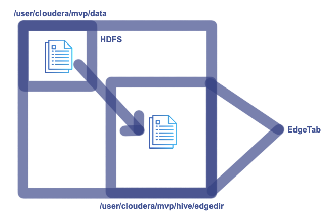

## HIVE

HIVE has its own personal space(kind of home directory)

- /user/hive/warehouse

- Every table in HIVE is mapped to a directory in HDFS.

> Note: By default if location is not provided, then during table creation, it will create sub directories in /user/hive/warehouse folder else it will create in specified location.


**_Default table creation syntax, creates a managed table._**


<br>

```sh
create table test(id int, name string)
```

- If we don’t specify delimiter, then default delimiter is blank (it means no separation between column data)

- So it’s always better to use a delimiter while creating table.

**_Default table creation with delimiter syntax_**

```sh
create table test(id int, name string) row format delimited fields terminated by ‘,’ ;
```

**_Default table creation at specific location with delimiter syntax_**


<br>

```sh
create table test(id int, name string) row format delimited fields terminated by ‘,’ location ‘/user/cloudera/testdir’;
```

### 1. Types of tables

- We can create 2 Types of tables

#### 1.1. Managed Table

By default managed table is created

> Generally used for intermittent or temporary tables

> If we drop the managed table, the data in the backend HDFS directory is also deleted.

Ex:
In hive terminal

```sh
create table test(id int, name string) row format delimited fields terminated by ‘,’ location ‘/user/cloudera/testdir’;
```

#### 1.2 External Table

> Generally used for tables where data is to be preserved

> If we drop the external table, the data in the backend HDFS directory will not be impacted.

Ex:
In hive terminal

```sh
create external table test(id int, name string) row format delimited fields terminated by ‘,’ location ‘/user/cloudera/testdir’;
```

### 2. Loading Data to HIVE tables

Data can be loaded from a file on edge node using hive shell.

#### 2.1 From Edge node

- Data can be loaded from edge node to hive table directly
- To load data from a file on Edge Node


<br>

```sh
load data local inpath ‘/home/cloudera/mvp/alldata’ into table test;
```

or

```sh
hadoop fs -put /home/cloudera/testdata /user/cloudera/testdir
```

#### 2.2 From HDFS node (locally)

- To load data from a file on HDFS Node


<br>

```sh
load data inpath ‘/user/cloudera/mvp/alldata’ into table test;
```

### 3. Partitions

- This is mainly used for performance tuning.
- Queries run faster with partitioned data.

**Data can be loaded into the partitioned table in 3 ways.**

>  Data is already partitioned and have separate files for each partition then use static load

**_Ex:_**

- INDTxns, USATxns, UKTxns files on edge node.
- Load individual txn data to partitioned table.
- Problem in static load is Each Partition has to be loaded separately.

> Data is present in a single file and generate partitions by specifying filters then use static insert

**_Ex:_**

- AllTxns on edge node
- Create a temp table
- Load AllTxn data to temple
- Insert the partitioned data to partitioned table from temp table

> Data is present in a single file and generate partition dynamically then use dynamic load

**_Ex:_**

- AllTxns on edge node
- Create a temp table
- Load AllTxn data to temple
- Insert the partitioned data to partitioned table from temp table without static filter(hard coded value)

#### 3.1 Static Load Partitions

>  Data is already partitioned and have separate files for each partition then use static load

**Uses static filter(hard coded condition) and load keyword**

Creating a partitioned table:

```sh
create table staticloadtab(id int, name string) partitioned by (country string) row format delimited fields terminated by ',' location '/user/cloudera/mvp/hive/staticloaddir';
```

**_Console:_**

```sh
hive> create table staticloadtab(id int, name string) partitioned by (country string) row format delimited fields terminated by ',' location '/user/cloudera/mvp/hive/staticloaddir';
OK
Time taken: 6.106 seconds
```

Load data from Partitioned files:

Partition 1:

```sh
load data local inpath '/home/cloudera/mvp/UsaTxns' into table staticloadtab partition(country='USA');
```

**_Console:_**

```sh
hive> create table staticloadtab(id int, name string) partitioned by (country string) row format delimited fields terminated by ',' location '/user/cloudera/mvp/hive/staticloaddir';
OK
Time taken: 6.106 seconds
```

Partition 2:

```sh
load data local inpath '/home/cloudera/mvp/INDTxns' into table staticloadtab partition(country='INDIA');
```

**_Console:_**

```sh
hive> load data local inpath '/home/cloudera/mvp/INDTxns' into table staticloadtab partition(country='INDIA');
Loading data to table default.staticloadtab partition (country=INDIA)
Partition default.staticloadtab{country=INDIA} stats: [numFiles=1, numRows=0, totalSize=37, rawDataSize=0]
OK
Time taken: 1.507 seconds
```

Partition 3:

```sh
load data local inpath '/home/cloudera/mvp/DubaiTxns' into table staticloadtab partition(country='DUBAI');
```

**_Console:_**

```sh
hive> load data local inpath '/home/cloudera/mvp/DubaiTxns' into table staticloadtab partition(country='DUBAI');
Loading data to table default.staticloadtab partition (country=DUBAI)
Partition default.staticloadtab{country=DUBAI} stats: [numFiles=1, numRows=0, totalSize=29, rawDataSize=0]
OK
Time taken: 1.445 seconds
```

Table data when queried:

```sh
hive> select * from staticloadtab;
OK
4	praveen	DUBAI
5	paru	DUBAI
1	mvp	INDIA
2	mvk	INDIA
3	mvnl	INDIA
7	siri	USA
Time taken: 1.375 seconds, Fetched: 6 row(s)
```

Partitioned files are loaded to respective subfolders.

```sh
[cloudera@quickstart ~]$ hadoop fs -ls /user/cloudera/mvp/hive/staticloaddir
Found 3 items
drwxr-xr-x   - cloudera cloudera          0 2025-03-08 23:22 /user/cloudera/mvp/hive/staticloaddir/country=DUBAI
drwxr-xr-x   - cloudera cloudera          0 2025-03-08 23:21 /user/cloudera/mvp/hive/staticloaddir/country=INDIA
drwxr-xr-x   - cloudera cloudera          0 2025-03-08 23:21 /user/cloudera/mvp/hive/staticloaddir/country=USA
[cloudera@quickstart ~]$ hadoop fs -ls /user/cloudera/mvp/hive/staticloaddir/country=DUBAI
Found 1 items
-rwxr-xr-x   1 cloudera cloudera         29 2025-03-08 23:22 /user/cloudera/mvp/hive/staticloaddir/country=DUBAI/DubaiTxns
[cloudera@quickstart ~]$ hadoop fs -cat /user/cloudera/mvp/hive/staticloaddir/country=DUBAI/DubaiTxns
4,praveen,Dubai
5,paru,Dubai
[cloudera@quickstart ~]$ hadoop fs -ls /user/cloudera/mvp/hive/staticloaddir/country=INDIA
Found 1 items
-rwxr-xr-x   1 cloudera cloudera         37 2025-03-08 23:21 /user/cloudera/mvp/hive/staticloaddir/country=INDIA/INDTxns
[cloudera@quickstart ~]$ hadoop fs -cat /user/cloudera/mvp/hive/staticloaddir/country=INDIA/INDTxns
1,mvp,India
2,mvk,India
3,mvnl,India
[cloudera@quickstart ~]$ hadoop fs -ls /user/cloudera/mvp/hive/staticloaddir/country=USA
Found 1 items
-rwxr-xr-x   1 cloudera cloudera         11 2025-03-08 23:21 /user/cloudera/mvp/hive/staticloaddir/country=USA/UsaTxns
[cloudera@quickstart ~]$ hadoop fs -cat /user/cloudera/mvp/hive/staticloaddir/country=USA/UsaTxns
7,siri,Usa
```

#### 3.2 Static Insert Partitions

> Data is present in a single file and generate partitions by specifying filters then use static insert

Creating a partitioned table:

```sh
create table staticinserttab(id int, name string) partitioned by (country string) row format delimited fields terminated by ',' location '/user/cloudera/mvp/hive/staticinsertdir';
```

**_Console:_**

```sh
hive> create table staticinserttab(id int, name string) partitioned by (country string) row format delimited fields terminated by ',' location '/user/cloudera/mvp/hive/staticinsertdir';
OK
Time taken: 0.216 seconds
```

Creating a temporary table:

```sh
create table temptab(id int, name string, country string) row format delimited fields terminated by ',' location '/user/cloudera/mvp/hive/helpdir';
```

**_Console:_**

```sh
hive> create table temptab(id int, name string, country string) row format delimited fields terminated by ',' location '/user/cloudera/mvp/hive/helpdir';
OK
Time taken: 3.602 seconds
```

Load data from a single file to temporary table:

```sh
load data local inpath '/home/cloudera/mvp/alldata' into table temptab;
```

**_Console:_**

```sh
hive> load data local inpath '/home/cloudera/mvp/alldata' into table temptab;
Loading data to table default.temptab
Table default.temptab stats: [numFiles=1, totalSize=91]
OK
Time taken: 2.202 seconds
```

Insert the partitioned data from temp table to partioned table:

Partition 1:

```sh
insert into staticinserttab partition(country='INDIA') select id, name from temptab where country='India';
```

**_Console:_**

```sh
hive> insert into staticinserttab partition(country='INDIA') select id, name from temptab where country='India';
Query ID = cloudera_20250309004545_535a969a-e34b-4c44-b2ef-619a16becf9f
Total jobs = 3
Launching Job 1 out of 3
Number of reduce tasks is set to 0 since there's no reduce operator
Starting Job = job_1741504565824_0004, Tracking URL = http://quickstart.cloudera:8088/proxy/application_1741504565824_0004/
Kill Command = /usr/lib/hadoop/bin/hadoop job  -kill job_1741504565824_0004
Hadoop job information for Stage-1: number of mappers: 1; number of reducers: 0
2025-03-09 00:45:57,066 Stage-1 map = 0%,  reduce = 0%
2025-03-09 00:46:30,175 Stage-1 map = 100%,  reduce = 0%, Cumulative CPU 12.52 sec
MapReduce Total cumulative CPU time: 12 seconds 520 msec
Ended Job = job_1741504565824_0004
Stage-4 is selected by condition resolver.
Stage-3 is filtered out by condition resolver.
Stage-5 is filtered out by condition resolver.
Moving data to: hdfs://quickstart.cloudera:8020/user/cloudera/mvp/hive/staticinsertdir/country=INDIA/.hive-staging_hive_2025-03-09_00-45-20_548_7848497846370373139-1/-ext-10000
Loading data to table default.staticinserttab partition (country=INDIA)
Partition default.staticinserttab{country=INDIA} stats: [numFiles=1, numRows=3, totalSize=19, rawDataSize=16]
MapReduce Jobs Launched:
Stage-Stage-1: Map: 1   Cumulative CPU: 12.52 sec   HDFS Read: 3895 HDFS Write: 112 SUCCESS
Total MapReduce CPU Time Spent: 12 seconds 520 msec
OK
Time taken: 74.415 seconds
```

Partition 2:

```sh
insert into staticinserttab partition(country='USA') select id, name from temptab where country='Usa';
```

**_Console:_**

```sh
hive> insert into staticinserttab partition(country='USA') select id, name from temptab where country='Usa';
Query ID = cloudera_20250309004747_bff3540b-9125-4ac2-bce0-a8375cc969cd
Total jobs = 3
Launching Job 1 out of 3
Number of reduce tasks is set to 0 since there's no reduce operator
Starting Job = job_1741504565824_0005, Tracking URL = http://quickstart.cloudera:8088/proxy/application_1741504565824_0005/
Kill Command = /usr/lib/hadoop/bin/hadoop job  -kill job_1741504565824_0005
Hadoop job information for Stage-1: number of mappers: 1; number of reducers: 0
2025-03-09 00:47:56,199 Stage-1 map = 0%,  reduce = 0%
2025-03-09 00:48:23,391 Stage-1 map = 100%,  reduce = 0%, Cumulative CPU 10.56 sec
MapReduce Total cumulative CPU time: 10 seconds 560 msec
Ended Job = job_1741504565824_0005
Stage-4 is selected by condition resolver.
Stage-3 is filtered out by condition resolver.
Stage-5 is filtered out by condition resolver.
Moving data to: hdfs://quickstart.cloudera:8020/user/cloudera/mvp/hive/staticinsertdir/country=USA/.hive-staging_hive_2025-03-09_00-47-24_973_5237597886580013251-1/-ext-10000
Loading data to table default.staticinserttab partition (country=USA)
Partition default.staticinserttab{country=USA} stats: [numFiles=1, numRows=2, totalSize=17, rawDataSize=15]
MapReduce Jobs Launched:
Stage-Stage-1: Map: 1   Cumulative CPU: 10.56 sec   HDFS Read: 3946 HDFS Write: 108 SUCCESS
Total MapReduce CPU Time Spent: 10 seconds 560 msec
OK
Time taken: 62.389 seconds
```

Partition 3:

```sh
insert into staticinserttab partition(country='DUBAI') select id, name from temptab where country='Dubai';
```

**_Console:_**

```sh
hive> insert into staticinserttab partition(country='DUBAI') select id, name from temptab where country='Dubai';
Query ID = cloudera_20250309005050_eee477da-b766-4dee-93ee-0ecdefc6a8e9
Total jobs = 3
Launching Job 1 out of 3
Number of reduce tasks is set to 0 since there's no reduce operator
Starting Job = job_1741504565824_0006, Tracking URL = http://quickstart.cloudera:8088/proxy/application_1741504565824_0006/
Kill Command = /usr/lib/hadoop/bin/hadoop job  -kill job_1741504565824_0006
Hadoop job information for Stage-1: number of mappers: 1; number of reducers: 0
2025-03-09 00:50:34,564 Stage-1 map = 0%,  reduce = 0%
2025-03-09 00:51:06,657 Stage-1 map = 100%,  reduce = 0%, Cumulative CPU 13.38 sec
MapReduce Total cumulative CPU time: 13 seconds 380 msec
Ended Job = job_1741504565824_0006
Stage-4 is selected by condition resolver.
Stage-3 is filtered out by condition resolver.
Stage-5 is filtered out by condition resolver.
Moving data to: hdfs://quickstart.cloudera:8020/user/cloudera/mvp/hive/staticinsertdir/country=DUBAI/.hive-staging_hive_2025-03-09_00-50-03_932_1955682547318587910-1/-ext-10000
Loading data to table default.staticinserttab partition (country=DUBAI)
Partition default.staticinserttab{country=DUBAI} stats: [numFiles=1, numRows=2, totalSize=17, rawDataSize=15]
MapReduce Jobs Launched:
Stage-Stage-1: Map: 1   Cumulative CPU: 13.38 sec   HDFS Read: 3958 HDFS Write: 110 SUCCESS
Total MapReduce CPU Time Spent: 13 seconds 380 msec
OK
Time taken: 66.618 seconds
```

Table data when queried:

```sh
hive> select * from staticinserttab;
OK
4	praveen	DUBAI
5	paru	DUBAI
1	mvp	INDIA
2	mvk	INDIA
3	mvnl	INDIA
7	siri	USA
6	krishna	USA
Time taken: 0.263 seconds, Fetched: 7 row(s)
```

Partitioned files are loaded to respective subfolders.

```sh
[cloudera@quickstart ~]$ hadoop fs -ls /user/cloudera/mvp/hive/staticinsertdir
Found 3 items
drwxr-xr-x   - cloudera cloudera          0 2025-03-09 00:51 /user/cloudera/mvp/hive/staticinsertdir/country=DUBAI
drwxr-xr-x   - cloudera cloudera          0 2025-03-09 00:46 /user/cloudera/mvp/hive/staticinsertdir/country=INDIA
drwxr-xr-x   - cloudera cloudera          0 2025-03-09 00:48 /user/cloudera/mvp/hive/staticinsertdir/country=USA
[cloudera@quickstart ~]$ hadoop fs -ls /user/cloudera/mvp/hive/staticinsertdir/country=DUBAI
Found 1 items
-rwxr-xr-x   1 cloudera cloudera         17 2025-03-09 00:51 /user/cloudera/mvp/hive/staticinsertdir/country=DUBAI/000000_0
[cloudera@quickstart ~]$ hadoop fs -cat /user/cloudera/mvp/hive/staticinsertdir/country=DUBAI/000000_0
4,praveen
5,paru
[cloudera@quickstart ~]$ hadoop fs -ls /user/cloudera/mvp/hive/staticinsertdir/country=INDIA
Found 1 items
-rwxr-xr-x   1 cloudera cloudera         19 2025-03-09 00:46 /user/cloudera/mvp/hive/staticinsertdir/country=INDIA/000000_0
[cloudera@quickstart ~]$ hadoop fs -cat /user/cloudera/mvp/hive/staticinsertdir/country=INDIA/000000_0
1,mvp
2,mvk
3,mvnl
[cloudera@quickstart ~]$ hadoop fs -ls /user/cloudera/mvp/hive/staticinsertdir/country=USA
Found 1 items
-rwxr-xr-x   1 cloudera cloudera         17 2025-03-09 00:48 /user/cloudera/mvp/hive/staticinsertdir/country=USA/000000_0
[cloudera@quickstart ~]$ hadoop fs -cat /user/cloudera/mvp/hive/staticinsertdir/country=USA/000000_0
7,siri
6,krishna
```

#### 3.3 Dynamic Partitions

> Data is present in a single file and generate partition dynamically then use dynamic load

Creating a partitioned table:

```sh
create table dynamictab (id int, name string) partitioned by (country string) row format delimited fields terminated by ',' location '/user/cloudera/mvp/hive/dynamicdir';
```

**_Console:_**

```sh
hive> create table dynamictab (id int, name string) partitioned by (country string) row format delimited fields terminated by ',' location '/user/cloudera/mvp/hive/dynamicdir';
OK
Time taken: 0.203 seconds
```

Creating a temporary table:

```sh
create table temptab (id int, name string, country string) row format delimited fields terminated by ',' location '/user/cloudera/mvp/hive/tempdir';
```

**_Console:_**

```sh
hive> create table temptab (id int, name string, country string) row format delimited fields terminated by ',' location '/user/cloudera/mvp/hive/tempdir';
OK
Time taken: 0.249 seconds
```

Load data from a single file to temporary table:

```sh
load data local inpath '/home/cloudera/mvp/alldata' into table temptab;
```

**_Console:_**

```sh
hive> load data local inpath '/home/cloudera/mvp/alldata' into table temptab;
Loading data to table default.temptab
Table default.temptab stats: [numFiles=2, numRows=0, totalSize=182, rawDataSize=0]
OK
Time taken: 0.904 seconds
```

Insert the partitioned data from temp table to partioned table:

- Dynamic partition strict mode requires at least one static partition column.

To turn this off in hive shell

```sh
set hive.exec.dynamic.partition.mode=nonstrict;
````

else it gives the following error

```sh
FAILED: SemanticException [Error 10096]: Dynamic partition strict mode requires at least one static partition column. To turn this off set hive.exec.dynamic.partition.mode=nonstrict
```

Partitions:

```sh
insert into dynamictab partition(country) select id, name, country from temptab;
```

**_Console:_**

```sh
hive> set hive.exec.dynamic.partition.mode=nonstrict;
hive> insert into dynamictab partition(country) select id, name, country from temptab;
Query ID = cloudera_20250309013333_972b59cd-7a76-438e-97b8-84f2d8926265
Total jobs = 3
Launching Job 1 out of 3
Number of reduce tasks is set to 0 since there's no reduce operator
Starting Job = job_1741504565824_0010, Tracking URL = http://quickstart.cloudera:8088/proxy/application_1741504565824_0010/
Kill Command = /usr/lib/hadoop/bin/hadoop job  -kill job_1741504565824_0010
Hadoop job information for Stage-1: number of mappers: 1; number of reducers: 0
2025-03-09 01:33:48,944 Stage-1 map = 0%,  reduce = 0%
2025-03-09 01:34:17,309 Stage-1 map = 100%,  reduce = 0%, Cumulative CPU 10.03 sec
MapReduce Total cumulative CPU time: 10 seconds 30 msec
Ended Job = job_1741504565824_0010
Stage-4 is selected by condition resolver.
Stage-3 is filtered out by condition resolver.
Stage-5 is filtered out by condition resolver.
Moving data to: hdfs://quickstart.cloudera:8020/user/cloudera/mvp/hive/dynamicdir/.hive-staging_hive_2025-03-09_01-33-17_954_3501840085633590582-1/-ext-10000
Loading data to table default.dynamictab partition (country=null)
	 Time taken for load dynamic partitions : 1070
	Loading partition {country=Usa}
	Loading partition {country=India}
	Loading partition {country=Dubai}
	 Time taken for adding to write entity : 3
Partition default.dynamictab{country=Dubai} stats: [numFiles=1, numRows=2, totalSize=17, rawDataSize=15]
Partition default.dynamictab{country=India} stats: [numFiles=1, numRows=3, totalSize=19, rawDataSize=16]
Partition default.dynamictab{country=Usa} stats: [numFiles=1, numRows=2, totalSize=17, rawDataSize=15]
MapReduce Jobs Launched:
Stage-Stage-1: Map: 1   Cumulative CPU: 10.03 sec   HDFS Read: 3737 HDFS Write: 241 SUCCESS
Total MapReduce CPU Time Spent: 10 seconds 30 msec
OK
Time taken: 63.036 seconds
```

Table data when queried:

```sh
hive> select * from dynamictab;
OK
4	praveen	Dubai
5	paru	Dubai
1	mvp	India
2	mvk	India
3	mvnl	India
7	siri	Usa
6	krishna	Usa
Time taken: 0.261 seconds, Fetched: 7 row(s)
```

Partitioned files are loaded to respective subfolders.

```sh
[cloudera@quickstart ~]$ hadoop fs -ls /user/cloudera/mvp/hive/dynamicdir
Found 3 items
drwxr-xr-x   - cloudera cloudera          0 2025-03-09 01:34 /user/cloudera/mvp/hive/dynamicdir/country=Dubai
drwxr-xr-x   - cloudera cloudera          0 2025-03-09 01:34 /user/cloudera/mvp/hive/dynamicdir/country=India
drwxr-xr-x   - cloudera cloudera          0 2025-03-09 01:34 /user/cloudera/mvp/hive/dynamicdir/country=Usa
[cloudera@quickstart ~]$ hadoop fs -ls /user/cloudera/mvp/hive/dynamicdir/country=Dubai
Found 1 items
-rwxr-xr-x   1 cloudera cloudera         17 2025-03-09 01:34 /user/cloudera/mvp/hive/dynamicdir/country=Dubai/000000_0
[cloudera@quickstart ~]$ hadoop fs -cat /user/cloudera/mvp/hive/dynamicdir/country=Dubai/000000_0
4,praveen
5,paru
[cloudera@quickstart ~]$ hadoop fs -ls /user/cloudera/mvp/hive/dynamicdir/country=India
Found 1 items
-rwxr-xr-x   1 cloudera cloudera         19 2025-03-09 01:34 /user/cloudera/mvp/hive/dynamicdir/country=India/000000_0
[cloudera@quickstart ~]$ hadoop fs -cat /user/cloudera/mvp/hive/dynamicdir/country=India/000000_0
1,mvp
2,mvk
3,mvnl
[cloudera@quickstart ~]$ hadoop fs -ls /user/cloudera/mvp/hive/dynamicdir/country=Usa
Found 1 items
-rwxr-xr-x   1 cloudera cloudera         17 2025-03-09 01:34 /user/cloudera/mvp/hive/dynamicdir/country=Usa/000000_0
[cloudera@quickstart ~]$ hadoop fs -cat /user/cloudera/mvp/hive/dynamicdir/country=Usa/000000_0
7,siri
6,krishna
```
