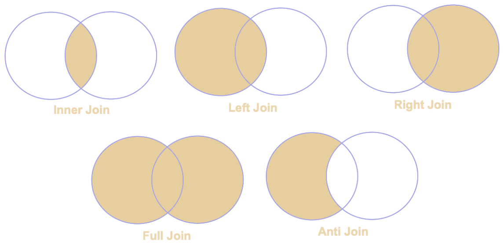

# Data Frames SQL & DSL Basics

## 1. Create Data Frames and SQL Views (Prerequisites)
Use the following code as a prerequisite for creating data frames and register data frames as SQL temporary views.
```sh
from pyspark.sql import SparkSession
from pyspark.sql.functions import *

# Initialize Spark session
spark = SparkSession.builder.appName('Test').getOrCreate()

# Input Data for creating Data Frames
data = [
    (0, "06-26-2011", 300.4, "Exercise", "GymnasticsPro", "cash"),
    (1, "05-26-2011", 200.0, "Exercise Band", "Weightlifting", "credit"),
    (2, "06-01-2011", 300.4, "Exercise", "Gymnastics Pro", "cash"),
    (3, "06-05-2011", 100.0, "Gymnastics", "Rings", "credit"),
    (4, "12-17-2011", 300.0, "Team Sports", "Field", "cash"),
    (5, "02-14-2011", 200.0, "Gymnastics", None, "cash"),
    (6, "06-05-2011", 100.0, "Exercise", "Rings", "credit"),
    (7, "12-17-2011", 300.0, "Team Sports", "Field", "cash"),
    (8, "02-14-2011", 200.0, "Gymnastics", None, "cash")
]
data1 = [
    (4, "12-17-2011", 300.0, "Team Sports", "Field", "cash"),
    (5, "02-14-2011", 200.0, "Gymnastics", None, "cash"),
    (6, "02-14-2011", 200.0, "Winter", None, "cash"),
    (7, "02-14-2011", 200.0, "Winter", None, "cash")
]
data2 = [
    (1, "raj"),
    (2, "ravi"),
    (3, "sai"),
    (5, "rani")
]
data3 = [
    (1, "mouse"),
    (3, "mobile"),
    (7, "laptop")
]

# Create Data Frame
df = spark.createDataFrame(data, ["id", "tdate", "amount", "category", "product", "spendby"])
df1 = spark.createDataFrame(data1, ["id", "tdate", "amount", "category", "product", "spendby"])
cust = spark.createDataFrame(data2, ["id", "name"])
prod = spark.createDataFrame(data3, ["id", "product"])

# Register DataFrame as a temporary SQL table(Required only if using SQL)
df.createOrReplaceTempView("df")
df1.createOrReplaceTempView("df1")
cust.createOrReplaceTempView("cust")
prod.createOrReplaceTempView("prod")

print("=============Data Frame View (DF Data)===============")
df.show()
print("=============Data Frame View (DF1 Data)===============")
df1.show()
print("=============Data Frame View (Cust Data)===============")
cust.show()
print("=============Data Frame View (Prod Data)===============")
prod.show()

```
### _Output Data Frame Views_
When the prerequisite code is executed, following data frames are created and displayed.

**DF View:**
| id|     tdate|amount|     category|       product|spendby|
| ------ | ------ | ------ | ------| ------ | ------|
|  0|06-26-2011| 300.4|     Exercise| GymnasticsPro|   cash|
|  1|05-26-2011| 200.0|Exercise Band| Weightlifting| credit|
|  2|06-01-2011| 300.4|     Exercise|Gymnastics Pro|   cash|
|  3|06-05-2011| 100.0|   Gymnastics|         Rings| credit|
|  4|12-17-2011| 300.0|  Team Sports|         Field|   cash|
|  5|02-14-2011| 200.0|   Gymnastics|          NULL|   cash|
|  6|06-05-2011| 100.0|     Exercise|         Rings| credit|
|  7|12-17-2011| 300.0|  Team Sports|         Field|   cash|
|  8|02-14-2011| 200.0|   Gymnastics|          NULL|   cash|

**DF1 View:**
| id|     tdate|amount|   category|product|spendby|
| ------ | ------ | ------ | ------| ------ | ------|
|  4|12-17-2011| 300.0|Team Sports|  Field|   cash|
|  5|02-14-2011| 200.0| Gymnastics|   NULL|   cash|
|  6|02-14-2011| 200.0|     Winter|   NULL|   cash|
|  7|02-14-2011| 200.0|     Winter|   NULL|   cash|

**Cust View:**
| id|name|
| ------ | ------ |
|  1| raj|
|  2|ravi|
|  3| sai|
|  5|rani|

**Prod View:**
| id|product|
| ------ | ------ |
|  1|  mouse|
|  3| mobile|
|  7| laptop|

## 2. Basic Queries
Data can be processed using Spark SQL or DSL.
Following are few sample ways to process data using SQL or DSL.
### 2.1. Select all columns
**Using SQL:**
```sh
spark.sql("select * from df").show()
```

**Using DSL:**
```sh
df.select("*").show()
```

**Output Using SQL/DSL:**
| id|     tdate|amount|     category|       product|spendby|
| ------ | ------ | ------ | ------ | ------ | ------ |
|  0|06-26-2011| 300.4|     Exercise| GymnasticsPro|   cash|
|  1|05-26-2011| 200.0|Exercise Band| Weightlifting| credit|
|  2|06-01-2011| 300.4|     Exercise|Gymnastics Pro|   cash|
|  3|06-05-2011| 100.0|   Gymnastics|         Rings| credit|
|  4|12-17-2011| 300.0|  Team Sports|         Field|   cash|
|  5|02-14-2011| 200.0|   Gymnastics|          NULL|   cash|
|  6|06-05-2011| 100.0|     Exercise|         Rings| credit|
|  7|12-17-2011| 300.0|  Team Sports|         Field|   cash|
|  8|02-14-2011| 200.0|   Gymnastics|          NULL|   cash|

### 2.2. Select specific columns
**Using SQL:**
```sh
spark.sql("select id, tdate from df").show()
```

**Using DSL:**
```sh
df.select("id","tdate").show()
```

**Output Using SQL/DSL:**
| id|     tdate|
| ------ | ------ |
|  0|06-26-2011|
|  1|05-26-2011|
|  2|06-01-2011|
|  3|06-05-2011|
|  4|12-17-2011|
|  5|02-14-2011|
|  6|06-05-2011|
|  7|12-17-2011|
|  8|02-14-2011|

### 2.3. Single Column Filter
**Using SQL:**
```sh
spark.sql("select * from df where spendby='cash'").show()
```

**Using DSL:**
```sh
df.filter("spendby='cash'").show()
```

**Output Using SQL/DSL:**
| id|     tdate|amount|     category|       product|spendby|
| ------ | ------ | ------ | ------ | ------ | ------ |
|  0|06-26-2011| 300.4|   Exercise| GymnasticsPro|   cash|
|  2|06-01-2011| 300.4|   Exercise|Gymnastics Pro|   cash|
|  4|12-17-2011| 300.0|Team Sports|         Field|   cash|
|  5|02-14-2011| 200.0| Gymnastics|          NULL|   cash|
|  7|12-17-2011| 300.0|Team Sports|         Field|   cash|
|  8|02-14-2011| 200.0| Gymnastics|          NULL|   cash|

### 2.4. Multi Column Filter
**Using SQL:**
```sh
spark.sql("select * from df where category='Exercise' and spendby='cash'").show()
```

**Using DSL:**
```sh
df.filter("category='Exercise' and spendby='cash'").show()
```

**Output Using SQL/DSL:**
| id|     tdate|amount|     category|       product|spendby|
| ------ | ------ | ------ | ------ | ------ | ------ |
|  0|06-26-2011| 300.4|Exercise| GymnasticsPro|   cash|
|  2|06-01-2011| 300.4|Exercise|Gymnastics Pro|   cash|

### 2.5. Multi Value Filter (IN Clause)
**Using SQL:**
```sh
spark.sql("select * from df where category in ('Exercise','Gymnastics')").show()
```

**Using DSL:**
```sh
df.filter("category in ('Exercise', 'Gymnastics')").show()
```
or
```sh
df.filter(col("category").isin("Exercise","Gymnastics")).show()
```
**Output Using SQL/DSL:**
| id|     tdate|amount|     category|       product|spendby|
| ------ | ------ | ------ | ------ | ------ | ------ |
|  0|06-26-2011| 300.4|  Exercise| GymnasticsPro|   cash|
|  2|06-01-2011| 300.4|  Exercise|Gymnastics Pro|   cash|
|  3|06-05-2011| 100.0|Gymnastics|         Rings| credit|
|  5|02-14-2011| 200.0|Gymnastics|          NULL|   cash|
|  6|06-05-2011| 100.0|  Exercise|         Rings| credit|
|  8|02-14-2011| 200.0|Gymnastics|          NULL|   cash|

### 2.6. Not IN Clause
**Using SQL:**
```sh
spark.sql("select * from df where category not in ('Exercise','Gymnastics')").show()
```

**Using DSL:**
```sh
df.filter("category not in ('Exercise', 'Gymnastics')").show()
```
or
```sh
df.filter(~col("category").isin("Exercise","Gymnastics")).show()
```
**Output Using SQL/DSL:**
| id|     tdate|amount|     category|       product|spendby|
| ------ | ------ | ------ | ------ | ------ | ------ |
|  1|05-26-2011| 200.0|Exercise Band|Weightlifting| credit|
|  4|12-17-2011| 300.0|  Team Sports|        Field|   cash|
|  7|12-17-2011| 300.0|  Team Sports|        Field|   cash|

### 2.7. Like filter
**Using SQL:**
```sh
spark.sql("select * from df where product like 'Gymnastics%'").show()
```

**Using DSL:**
```sh
df.filter("product like 'Gymnastics%'").show()
```
or
```sh
df.filter(col("product").like("Gymnastics%")).show()
```
**Output Using SQL/DSL:**
| id|     tdate|amount|     category|       product|spendby|
| ------ | ------ | ------ | ------ | ------ | ------ |
|  0|06-26-2011| 300.4|Exercise| GymnasticsPro|   cash|
|  2|06-01-2011| 300.4|Exercise|Gymnastics Pro|   cash|

### 2.8. Not Like filter
**Using SQL:**
```sh
spark.sql("select * from df where product not like 'Gymnastics%'").show()
```

**Using DSL:**
```sh
df.filter("product not like 'Gymnastics%'").show()
```
or
```sh
df.filter(~col("product").like("Gymnastics%")).show()
```
**Output Using SQL/DSL:**
| id|     tdate|amount|     category|       product|spendby|
| ------ | ------ | ------ | ------ | ------ | ------ |
|  1|05-26-2011| 200.0|Exercise Band|Weightlifting| credit|
|  3|06-05-2011| 100.0|   Gymnastics|        Rings| credit|
|  4|12-17-2011| 300.0|  Team Sports|        Field|   cash|
|  6|06-05-2011| 100.0|     Exercise|        Rings| credit|
|  7|12-17-2011| 300.0|  Team Sports|        Field|   cash|

### 2.9. Null filter
**Using SQL:**
```sh
spark.sql("select * from df where product is null").show()
```

**Using DSL:**
```sh
df.filter("product is null").show()
```
or
```sh
df.filter(col("product").isNull()).show()
```
**Output Using SQL/DSL:**
| id|     tdate|amount|     category|       product|spendby|
| ------ | ------ | ------ | ------ | ------ | ------ |
|  5|02-14-2011| 200.0|Gymnastics|   NULL|   cash|
|  8|02-14-2011| 200.0|Gymnastics|   NULL|   cash|

### 2.10. Not Null filter
**Using SQL:**
```sh
spark.sql("select * from df where product is not null").show()
```

**Using DSL:**
```sh
df.filter("product is not null").show()
```
or
```sh
df.filter(col("product").isNotNull()).show()
```
**Output Using SQL/DSL:**
| id|     tdate|amount|     category|       product|spendby|
| ------ | ------ | ------ | ------ | ------ | ------ |
|  0|06-26-2011| 300.4|     Exercise| GymnasticsPro|   cash|
|  1|05-26-2011| 200.0|Exercise Band| Weightlifting| credit|
|  2|06-01-2011| 300.4|     Exercise|Gymnastics Pro|   cash|
|  3|06-05-2011| 100.0|   Gymnastics|         Rings| credit|
|  4|12-17-2011| 300.0|  Team Sports|         Field|   cash|
|  6|06-05-2011| 100.0|     Exercise|         Rings| credit|
|  7|12-17-2011| 300.0|  Team Sports|         Field|   cash|

### 2.11. Max Function
**Using SQL:**
```sh
spark.sql("select max(amount) as max_amount from df").show()
```

**Using DSL:**
```sh
df.agg(max("amount").alias("max_amount")).show()
```

**Output Using SQL/DSL:**
|max_amount|
| ------ |
|     300.4|

### 2.12. Min Function
**Using SQL:**
```sh
spark.sql("select min(amount) as min_amount from df").show()
```

**Using DSL:**
```sh
df.agg(min("amount").alias("min_amount")).show()
```

**Output Using SQL/DSL:**

|min_amount|
| ------ |
|     100.0|

### 2.13. Count Function
**Using SQL:**
```sh
spark.sql("select count(1) as count from df").show()
```
or
```sh
spark.sql("select count(*) as count from df").show()
```
**Using DSL:**
```sh
df.agg(count("*").alias("count")).show()
```

**Output Using SQL/DSL:**
|count|
| ------ |
|    9|

### 2.14. Conditional Statement
**Using SQL:**
```sh
spark.sql("select *, case when spendby='cash' then 0 else 1 end as status from df").show()
```
**Using DSL:**
```sh
df.selectExpr("*","case when spendby='cash' then 0 else 1 end as status").show()
```

**Output Using SQL/DSL:**
| id|     tdate|amount|     category|       product|spendby|status|
| ------ | ------ | ------ | ------ | ------ | ------ | ------ |
|  0|06-26-2011| 300.4|     Exercise| GymnasticsPro|   cash|     0|
|  1|05-26-2011| 200.0|Exercise Band| Weightlifting| credit|     1|
|  2|06-01-2011| 300.4|     Exercise|Gymnastics Pro|   cash|     0|
|  3|06-05-2011| 100.0|   Gymnastics|         Rings| credit|     1|
|  4|12-17-2011| 300.0|  Team Sports|         Field|   cash|     0|
|  5|02-14-2011| 200.0|   Gymnastics|          NULL|   cash|     0|
|  6|06-05-2011| 100.0|     Exercise|         Rings| credit|     1|
|  7|12-17-2011| 300.0|  Team Sports|         Field|   cash|     0|
|  8|02-14-2011| 200.0|   Gymnastics|          NULL|   cash|     0|

### 2.15. Concat Function
**Using SQL:**
```sh
spark.sql("select category,product,concat(category,'~',product) as concat_data from df").show()
```
**Using DSL:**
```sh
df.selectExpr("category", "product", "concat(category,'~',product) as concat_data").show()
```

**Output Using SQL/DSL:**
|     category|       product|       concat_data|
| ------ | ------ | ------ |
|     Exercise| GymnasticsPro|Exercise~Gymnasti...|
|Exercise Band| Weightlifting|Exercise Band~Wei...|
|     Exercise|Gymnastics Pro|Exercise~Gymnasti...|
|   Gymnastics|         Rings|    Gymnastics~Rings|
|  Team Sports|         Field|   Team Sports~Field|
|   Gymnastics|          NULL|                NULL|
|     Exercise|         Rings|      Exercise~Rings|
|  Team Sports|         Field|   Team Sports~Field|
|   Gymnastics|          NULL|                NULL|

### 2.16. Concat multiple columns with same delimiter
**Using SQL:**
```sh
spark.sql("select category,product,spendby,concat_ws('~', category,product,spendby) as concat_data from df").show()
```
**Using DSL:**
```sh
df.selectExpr("category", "product", "spendby", "concat_ws('~', category, product,spendby) as concat_data").show()
```

**Output Using SQL/DSL:**
|     category|       product|spendby|         concat_data|
| ------ | ------ | ------ | ------ |
|     Exercise| GymnasticsPro|   cash|Exercise~Gymnasti...|
|Exercise Band| Weightlifting| credit|Exercise Band~Wei...|
|     Exercise|Gymnastics Pro|   cash|Exercise~Gymnasti...|
|   Gymnastics|         Rings| credit|Gymnastics~Rings~...|
|  Team Sports|         Field|   cash|Team Sports~Field...|
|   Gymnastics|          NULL|   cash|     Gymnastics~cash|
|     Exercise|         Rings| credit|Exercise~Rings~cr...|
|  Team Sports|         Field|   cash|Team Sports~Field...|
|   Gymnastics|          NULL|   cash|     Gymnastics~cash|

### 2.17. Lower case function
**Using SQL:**
```sh
spark.sql("select category,lower(category)  as lowercase_data from df").show()
```
**Using DSL:**
```sh
df.selectExpr("category", "lower(category) as lowercase_data").show()
```

**Output Using SQL/DSL:**
|     category|lowercase_data|
| ------ | ------ |
|     Exercise|      exercise|
|Exercise Band| exercise band|
|     Exercise|      exercise|
|   Gymnastics|    gymnastics|
|  Team Sports|   team sports|
|   Gymnastics|    gymnastics|
|     Exercise|      exercise|
|  Team Sports|   team sports|
|   Gymnastics|    gymnastics|

### 2.18. Upper case function
**Using SQL:**
```sh
spark.sql("select category, upper(category)  as uppercase_data from df").show()
```
**Using DSL:**
```sh
df.selectExpr("category", "upper(category) as uppercase_data").show()
```

**Output Using SQL/DSL:**
|     category|uppercase_data|
| ------ | ------ |
|     Exercise|      EXERCISE|
|Exercise Band| EXERCISE BAND|
|     Exercise|      EXERCISE|
|   Gymnastics|    GYMNASTICS|
|  Team Sports|   TEAM SPORTS|
|   Gymnastics|    GYMNASTICS|
|     Exercise|      EXERCISE|
|  Team Sports|   TEAM SPORTS|
|   Gymnastics|    GYMNASTICS|

### 2.19. Ceil function
**Using SQL:**
```sh
spark.sql("select amount,ceil(amount) as ceil_data from df").show()
```
**Using DSL:**
```sh
df.selectExpr("amount", "ceil(amount) as ceil_data").show()
```

**Output Using SQL/DSL:**
|amount|ceil_data|
| ------ | ------ |
| 300.4|      301|
| 200.0|      200|
| 300.4|      301|
| 100.0|      100|
| 300.0|      300|
| 200.0|      200|
| 100.0|      100|
| 300.0|      300|
| 200.0|      200|

### 2.20. Round function
**Using SQL:**
```sh
spark.sql("select amount, round(amount) as round_data from df").show()
```
**Using DSL:**
```sh
df.selectExpr("amount", "round(amount) as round_data").show()
```

**Output Using SQL/DSL:**
|amount|round_data|
| ------ | ------ |
| 300.4|     300.0|
| 200.0|     200.0|
| 300.4|     300.0|
| 100.0|     100.0|
| 300.0|     300.0|
| 200.0|     200.0|
| 100.0|     100.0|
| 300.0|     300.0|
| 200.0|     200.0|

### 2.21. Coalesce function
**Using SQL:**
```sh
spark.sql("select product,coalesce(product, 'NA') as modified_data from df").show()
```
**Using DSL:**
```sh
df.selectExpr("product", "coalesce(product, 'NA') as modified_data").show()
```

**Output Using SQL/DSL:**
|       product| modified_data|
| ------ | ------ |
| GymnasticsPro| GymnasticsPro|
| Weightlifting| Weightlifting|
|Gymnastics Pro|Gymnastics Pro|
|         Rings|         Rings|
|         Field|         Field|
|          NULL|            NA|
|         Rings|         Rings|
|         Field|         Field|
|          NULL|            NA|

### 2.22. Distinct function
**Using SQL:**
```sh
spark.sql("select distinct category from df").show()
```
**Using DSL:**
```sh
df.select("category").distinct().show()
```

**Output Using SQL/DSL:**
|     category|
| ------ |
|   Gymnastics|
|  Team Sports|
|     Exercise|
|Exercise Band|

### 2.23. Distinct function on multiple columns
**Using SQL:**
```sh
spark.sql("select distinct category, spendby from df").show()
```
**Using DSL:**
```sh
df.select("category", "spendby").distinct().show()
```

**Output Using SQL/DSL:**
|     category|spendby|
| ------ | ------ |
|   Gymnastics|   cash|
|     Exercise|   cash|
|     Exercise| credit|
|  Team Sports|   cash|
|Exercise Band| credit|
|   Gymnastics| credit|

### 2.24. Substring function
**Using SQL:**
```sh
spark.sql("select substring(tdate, 7,4) as year from df").show()
```
**Using DSL:**
```sh
df.selectExpr("substring(tdate, 7,4) as year").show()
```

**Output Using SQL/DSL:**
|year|
| ------ |
|2011|
|2011|
|2011|
|2011|
|2011|
|2011|
|2011|
|2011|
|2011|

### 2.25. Split function
**Using SQL:**
```sh
spark.sql("select split(tdate, '-')[2] as year from df").show()
```
**Using DSL:**
```sh
df.selectExpr("split(tdate, '-')[2] as year").show()
```

**Output Using SQL/DSL:**
|year|
| ------ |
|2011|
|2011|
|2011|
|2011|
|2011|
|2011|
|2011|
|2011|
|2011|

### 2.26. Union All
**Using SQL:**
```sh
spark.sql("select * from df union all select * from df1").show()
```
**Using DSL:**
deprecated in PySpark 3.0 and has been replaced by union() which now behaves like unionAll by default (i.e., it retains duplicates)
```sh
df.select("*").unionAll(df1.select("*")).show()
```
or
```sh
df.select("*").union(df1.select("*")).show()
```

**Output Using SQL/DSL:**
| id|     tdate|amount|     category|       product|spendby|
| ------ | ------ | ------ | ------ | ------ | ------ |
|  0|06-26-2011| 300.4|     Exercise| GymnasticsPro|   cash|
|  1|05-26-2011| 200.0|Exercise Band| Weightlifting| credit|
|  2|06-01-2011| 300.4|     Exercise|Gymnastics Pro|   cash|
|  3|06-05-2011| 100.0|   Gymnastics|         Rings| credit|
|  4|12-17-2011| 300.0|  Team Sports|         Field|   cash|
|  5|02-14-2011| 200.0|   Gymnastics|          NULL|   cash|
|  6|06-05-2011| 100.0|     Exercise|         Rings| credit|
|  7|12-17-2011| 300.0|  Team Sports|         Field|   cash|
|  8|02-14-2011| 200.0|   Gymnastics|          NULL|   cash|
|  4|12-17-2011| 300.0|  Team Sports|         Field|   cash|
|  5|02-14-2011| 200.0|   Gymnastics|          NULL|   cash|
|  6|02-14-2011| 200.0|       Winter|          NULL|   cash|
|  7|02-14-2011| 200.0|       Winter|          NULL|   cash|

### 2.27. Union
**Using SQL:**
```sh
spark.sql("select * from df union select * from df1").show()
```
**Using DSL:**
union() which now behaves like unionAll by default (i.e., it retains duplicates).
to eliminate duplicates use distinct function.
```sh
df.select("*").union(df1.select("*")).distinct().show()
```

**Output Using SQL/DSL:**
| id|     tdate|amount|     category|       product|spendby|
| ------ | ------ | ------ | ------ | ------ | ------ |
|  3|06-05-2011| 100.0|   Gymnastics|         Rings| credit|
|  1|05-26-2011| 200.0|Exercise Band| Weightlifting| credit|
|  2|06-01-2011| 300.4|     Exercise|Gymnastics Pro|   cash|
|  6|06-05-2011| 100.0|     Exercise|         Rings| credit|
|  4|12-17-2011| 300.0|  Team Sports|         Field|   cash|
|  7|12-17-2011| 300.0|  Team Sports|         Field|   cash|
|  0|06-26-2011| 300.4|     Exercise| GymnasticsPro|   cash|
|  8|02-14-2011| 200.0|   Gymnastics|          NULL|   cash|
|  5|02-14-2011| 200.0|   Gymnastics|          NULL|   cash|
|  6|02-14-2011| 200.0|       Winter|          NULL|   cash|
|  7|02-14-2011| 200.0|       Winter|          NULL|   cash|

### 2.28. Sum Aggregation
**Using SQL:**
```sh
spark.sql("select sum(amount) as sum from df").show()
```
**Using DSL:**
```sh
df.agg(sum("amount").alias("sum")).show()
```

**Output Using SQL/DSL:**
|   sum|
| ------ |
|2000.8|

### 2.29. Group by & Aggregation
**Using SQL:**
```sh
spark.sql("select category, sum(amount) as sum from df group by category").show()
```
**Using DSL:**
```sh
df.groupby("category").agg(sum("amount").alias("sum")).show()
```

**Output Using SQL/DSL:**
|     category|  sum|
| ------ | ------ |
|   Gymnastics|500.0|
|  Team Sports|600.0|
|     Exercise|700.8|
|Exercise Band|200.0|

### 2.30. Group by multi column & Aggregation
**Using SQL:**
```sh
spark.sql("select category,spendby, sum(amount) as sum from df group by category,spendby").show()
```
**Using DSL:**
```sh
df.groupby("category","spendby").agg(sum("amount").alias("sum")).show()
```

**Output Using SQL/DSL:**
|     category|spendby|  sum|
| ------ | ------ | ------ |
|   Gymnastics|   cash|400.0|
|     Exercise|   cash|600.8|
|     Exercise| credit|100.0|
|  Team Sports|   cash|600.0|
|Exercise Band| credit|200.0|
|   Gymnastics| credit|100.0|

### 2.31. Multiple Aggregation Functions
**Using SQL:**
```sh
spark.sql("select category, sum(amount) as sum, count(1) as count from df group by category").show()
```
**Using DSL:**
```sh
df.groupby("category").agg(sum("amount").alias("sum"),count("*").alias("count")).show()
```

**Output Using SQL/DSL:**
|     category|  sum|count|
| ------ | ------ | ------ |
|   Gymnastics|500.0|    3|
|  Team Sports|600.0|    2|
|     Exercise|700.8|    3|
|Exercise Band|200.0|    1|

### 2.32. Max Aggregation
**Using SQL:**
```sh
spark.sql("select category, max(amount) as max_amount from df group by category").show()
```
**Using DSL:**
```sh
df.groupby("category").agg(max("amount").alias("max_amount")).show()
```

**Output Using SQL/DSL:**
|     category|max_amount|
| ------ | ------ |
|   Gymnastics|     200.0|
|  Team Sports|     300.0|
|     Exercise|     300.4|
|Exercise Band|     200.0|

### 2.33. Aggregation & Order by
**Using SQL:**
default: asc
```sh
spark.sql("select category,product, sum(amount) from df group by category,product order by category,product").show()
```
**Using DSL:**
```sh
df.groupby("category", "product").agg(sum("amount").alias("sum")).orderBy("category","product").show()
```

**Output Using SQL/DSL:**
|     category|       product|  sum|
| ------ | ------ | ------ |
|     Exercise|Gymnastics Pro|300.4|
|     Exercise| GymnasticsPro|300.4|
|     Exercise|         Rings|100.0|
|Exercise Band| Weightlifting|200.0|
|   Gymnastics|          NULL|400.0|
|   Gymnastics|         Rings|100.0|
|  Team Sports|         Field|600.0|

order by: desc
```sh
spark.sql("select category,product, sum(amount) as sum from df group by category,product order by category,product desc").show()
```
**Using DSL:**
```sh
df.groupby("category", "product").agg(sum("amount").alias("sum")).orderBy(desc("category"), desc("product")).show()
```
**Output Using SQL/DSL:**
|     category|       product|  sum|
| ------ | ------ | ------ |
|  Team Sports|         Field|600.0|
|   Gymnastics|         Rings|100.0|
|   Gymnastics|          NULL|400.0|
|Exercise Band| Weightlifting|200.0|
|     Exercise|         Rings|100.0|
|     Exercise| GymnasticsPro|300.4|
|     Exercise|Gymnastics Pro|300.4|

### 2.34. Group by & Aggregation
**Using SQL:**
```sh
spark.sql("select category, sum(amount) as sum from df group by category").show()
```
**Using DSL:**
```sh
df.groupby("category").agg(sum("amount").alias("sum")).show()
```

**Output Using SQL/DSL:**
|     category|  sum|
| ------ | ------ |
|   Gymnastics|500.0|
|  Team Sports|600.0|
|     Exercise|700.8|
|Exercise Band|200.0|

### 2.35. Window Functions: Row Number
**Using SQL:**
```sh
spark.sql("select category, amount, row_number() over (partition by category order by amount desc) as rownum from df").show()
```
**Using DSL:**
```sh

```

**Output Using SQL/DSL:**
|     category|amount|rownum|
| ------ | ------ | ------ |
|     Exercise| 300.4|     1|
|     Exercise| 300.4|     2|
|     Exercise| 100.0|     3|
|Exercise Band| 200.0|     1|
|   Gymnastics| 200.0|     1|
|   Gymnastics| 200.0|     2|
|   Gymnastics| 100.0|     3|
|  Team Sports| 300.0|     1|
|  Team Sports| 300.0|     2|

### 2.36. Window Functions: Dense Rank
**Using SQL:**
```sh
spark.sql("select category, amount,dense_rank() over (partition by category order by amount desc) as dense_rank from df").show()
```
**Using DSL:**
```sh

```

**Output Using SQL/DSL:**
|     category|amount|dense_rank|
| ------ | ------ | ------ |
|     Exercise| 300.4|         1|
|     Exercise| 300.4|         1|
|     Exercise| 100.0|         2|
|Exercise Band| 200.0|         1|
|   Gymnastics| 200.0|         1|
|   Gymnastics| 200.0|         1|
|   Gymnastics| 100.0|         2|
|  Team Sports| 300.0|         1|
|  Team Sports| 300.0|         1|

### 2.37. Window Functions: Rank
**Using SQL:**
```sh
spark.sql("select category, amount,rank() over (partition by category order by amount desc) as dense_rank from df").show()
```
**Using DSL:**
```sh

```

**Output Using SQL/DSL:**
|     category|amount|rank|
| ------ | ------ | ------ |
|     Exercise| 300.4|   1|
|     Exercise| 300.4|   1|
|     Exercise| 100.0|   3|
|Exercise Band| 200.0|   1|
|   Gymnastics| 200.0|   1|
|   Gymnastics| 200.0|   1|
|   Gymnastics| 100.0|   3|
|  Team Sports| 300.0|   1|
|  Team Sports| 300.0|   1|

### 2.38. Window Functions: Lead
**Using SQL:**
```sh
spark.sql("select category, lead(amount) over (partition by category order by amount desc) as lead from df").show()
```
**Using DSL:**
```sh

```

**Output Using SQL/DSL:**
|     category| lead|
| ------ | ------ |
|     Exercise|300.4|
|     Exercise|100.0|
|     Exercise| NULL|
|Exercise Band| NULL|
|   Gymnastics|200.0|
|   Gymnastics|100.0|
|   Gymnastics| NULL|
|  Team Sports|300.0|
|  Team Sports| NULL|

### 2.39. Window Functions: Lag
**Using SQL:**
```sh
spark.sql("select category, lag(amount) over (partition by category order by amount desc) as lag from df").show()
```
**Using DSL:**
```sh

```

**Output Using SQL/DSL:**
|     category|  lag|
| ------ | ------ |
|     Exercise| NULL|
|     Exercise|300.4|
|     Exercise|300.4|
|Exercise Band| NULL|
|   Gymnastics| NULL|
|   Gymnastics|200.0|
|   Gymnastics|200.0|
|  Team Sports| NULL|
|  Team Sports|300.0|

### 2.40. Having Clause
**Using SQL:**
```sh
spark.sql("select category, sum(amount) as amt from df group by category having amt > 300").show()
```
**Using DSL:**
```sh
df.groupby("category").agg(sum("amount").alias("amt")).filter("amt>300").show()
```
or
```sh
df.groupby("category").agg(sum("amount").alias("amt")).filter(col("amt")>300).show()
```
**Output Using SQL/DSL:**
|   category|  amt|
| ------ | ------ |
| Gymnastics|500.0|
|Team Sports|600.0|
|   Exercise|700.8|

## Joins

### 2.41. Inner Join
**Using SQL:**
```sh
spark.sql("select cust.*,prod.product from cust join prod on cust.id=prod.id").show()
```
**Using DSL:**
```sh
cust.select("*").join(prod.select("id","product"), on="id", how="inner").show()
```

**Output Using SQL/DSL:**
| id|name|product|
| ------ | ------ | ------ |
|  1| raj|  mouse|
|  3| sai| mobile|

### 2.42. Left Join
**Using SQL:**
```sh
spark.sql("select cust.*,prod.product from cust left join prod on cust.id=prod.id").show()
```
**Using DSL:**
```sh
cust.select("*").join(prod.select("id","product"), on="id", how="left").show()
```

**Output Using SQL/DSL:**
| id|name|product|
| ------ | ------ | ------ |
|  5|rani|   NULL|
|  1| raj|  mouse|
|  3| sai| mobile|
|  2|ravi|   NULL|

### 2.43. Right Join
**Using SQL:**
```sh
spark.sql("select prod.*,cust.name from cust left join prod on cust.id=prod.id").show()
```
**Using DSL:**
```sh
cust.select("id","name").join(prod.select("*"), on="id", how="inner").show()
```

**Output Using SQL/DSL:**
| id|name|product|
| ------ | ------ | ------ |
|  1| raj|  mouse|
|  3| sai| mobile|

### 2.44. Full Join

**Using SQL:**

```sh
spark.sql("select prod.*,cust.name from cust full join prod using(id)").show()
```
or
```sh
spark.sql("select cust.*,prod.product from cust full join prod using(id)").show()
```
**Using DSL:**
```sh
cust.select("*").join(prod.select("id","product"), on="id", how="full").show()
```

**Output Using SQL/DSL:**
| id|name|product|
| ------ | ------ | ------ |
|  1| raj|  mouse|
|  2|ravi|   NULL|
|  3| sai| mobile|
|  5|rani|   NULL|
|  7|NULL| laptop|

### 2.45. Anti Join
**Using SQL:**
```sh
spark.sql("select cust.* from cust anti join prod on cust.id=prod.id").show()
```
**Using DSL:**
```sh
cust.select("*").join(prod, on="id", how="anti").show()
```

**Output Using SQL/DSL:**
| id|name|
| ------ | ------ |
|  5|rani|
|  2|ravi|

### 2.46. Date Format
Convert to date
**Using SQL:**
```sh
spark.sql("select tdate, to_date(tdate,'MM-dd-yyyy') as modified_date from df").show()
```
**Using DSL:**
```sh
df.selectExpr("tdate", "to_date(tdate, 'MM-dd-yyyy') as modified_date").show()
```

**Output Using SQL/DSL:**
|     tdate|modified_date|
| ------ | ------ |
|06-26-2011|   2011-06-26|
|05-26-2011|   2011-05-26|
|06-01-2011|   2011-06-01|
|06-05-2011|   2011-06-05|
|12-17-2011|   2011-12-17|
|02-14-2011|   2011-02-14|
|06-05-2011|   2011-06-05|
|12-17-2011|   2011-12-17|
|02-14-2011|   2011-02-14|

Extract year
**Using SQL:**
```sh
spark.sql("select tdate, year(to_date(tdate,'MM-dd-yyyy')) as year from df").show()
```
**Using DSL:**
```sh
df.selectExpr("tdate", "year(to_date(tdate, 'MM-dd-yyyy')) as year").show()
```

**Output Using SQL/DSL:**
|     tdate|year|
| ------ | ------ |
|06-26-2011|2011|
|05-26-2011|2011|
|06-01-2011|2011|
|06-05-2011|2011|
|12-17-2011|2011|
|02-14-2011|2011|
|06-05-2011|2011|
|12-17-2011|2011|
|02-14-2011|2011|

Extract month
**Using SQL:**
```sh
spark.sql("select tdate, month(to_date(tdate,'MM-dd-yyyy')) as month from df").show()
```
**Using DSL:**
```sh
df.selectExpr("tdate", "month(to_date(tdate, 'MM-dd-yyyy')) as month").show()
```

**Output Using SQL/DSL:**
|     tdate|month|
| ------ | ------ |
|06-26-2011|    6|
|05-26-2011|    5|
|06-01-2011|    6|
|06-05-2011|    6|
|12-17-2011|   12|
|02-14-2011|    2|
|06-05-2011|    6|
|12-17-2011|   12|
|02-14-2011|    2|

Extract day
**Using SQL:**
```sh
spark.sql("select tdate, day(to_date(tdate,'MM-dd-yyyy')) as day from df").show()
```
**Using DSL:**
```sh
df.selectExpr("tdate", "day(to_date(tdate, 'MM-dd-yyyy'))as day").show()
```

**Output Using SQL/DSL:**
|     tdate|day|
| ------ | ------ |
|06-26-2011| 26|
|05-26-2011| 26|
|06-01-2011|  1|
|06-05-2011|  5|
|12-17-2011| 17|
|02-14-2011| 14|
|06-05-2011|  5|
|12-17-2011| 17|
|02-14-2011| 14|

Extract year using data_format()
**Using SQL:**
```sh
spark.sql("select tdate, date_format(to_date(tdate,'MM-dd-yyyy'), 'yyyy') as modified_date from df").show()
```
**Using DSL:**
```sh
df.selectExpr("tdate", "date_format(to_date(tdate, 'MM-dd-yyyy'), 'yyyy') as year").show()
```

**Output Using SQL/DSL:**
|     tdate|year|
| ------ | ------ |
|06-26-2011|2011|
|05-26-2011|2011|
|06-01-2011|2011|
|06-05-2011|2011|
|12-17-2011|2011|
|02-14-2011|2011|
|06-05-2011|2011|
|12-17-2011|2011|
|02-14-2011|2011|

### 2.47. Sub Queries
**Using SQL:**
```sh

```
**Using DSL:**
```sh

```

**Output Using SQL/DSL:**
