# Sqoop Import & Export Commands

Using Sqoop
- Direct Imports are possible
- Portion Imports are possible
- Incremental Imports are possible
- Modified Imports are possible
- Serialized Imports are possible
- Exports are possible

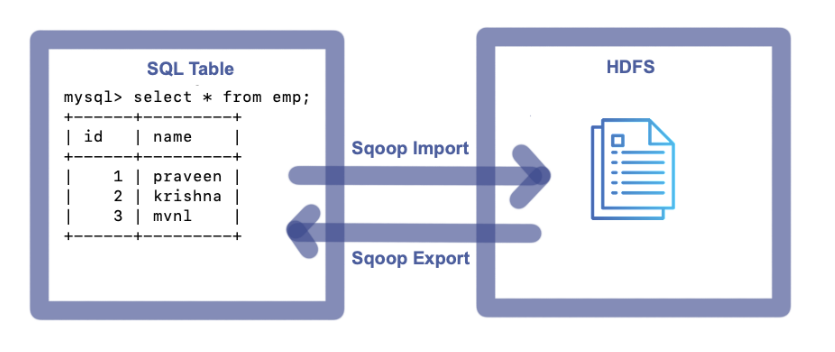
<br>

> Import --> Data from RDBMS to HDFS

> Export --> Data from HDFS to RDBMS


## 1. Sqoop Import Command

Following basic details are required
- Hostname
- PortNumber
- Database
- Username
- Password
- Table
- Target

_Sqoop Import Template:_

```sh
sqoop import --connect jdbc:mysql://<Hostname>:<PortNumber>/<Database> --username <Username> --password <Password> --table <TableName> --target-dir <TargetDirectory>
```

### 1.1 Sqoop full import from a single table

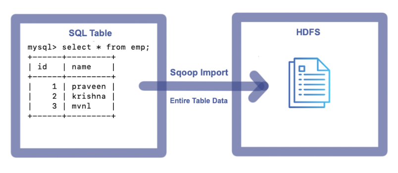
<br>

To import entire table data to HDFS, execute the following Command

```sh
sqoop import --connect jdbc:mysql://localhost:3306/mvp --username root --password cloudera --m 1 --table emp --delete-target-dir --target-dir /user/cloudera/mvp/tablefullimp
```

**_Console:_**

```sh
Warning: /usr/lib/sqoop/../accumulo does not exist! Accumulo imports will fail.
Please set $ACCUMULO_HOME to the root of your Accumulo installation.
25/02/28 19:36:03 INFO sqoop.Sqoop: Running Sqoop version: 1.4.6-cdh5.12.0
25/02/28 19:36:03 WARN tool.BaseSqoopTool: Setting your password on the command-line is insecure. Consider using -P instead.
25/02/28 19:36:04 INFO manager.MySQLManager: Preparing to use a MySQL streaming resultset.
25/02/28 19:36:04 INFO tool.CodeGenTool: Beginning code generation
25/02/28 19:36:06 INFO manager.SqlManager: Executing SQL statement: SELECT t.* FROM `emp` AS t LIMIT 1
25/02/28 19:36:06 INFO manager.SqlManager: Executing SQL statement: SELECT t.* FROM `emp` AS t LIMIT 1
25/02/28 19:36:06 INFO orm.CompilationManager: HADOOP_MAPRED_HOME is /usr/lib/hadoop-mapreduce
Note: /tmp/sqoop-cloudera/compile/246a4c39472ecd2a52f1874420880399/emp.java uses or overrides a deprecated API.
Note: Recompile with -Xlint:deprecation for details.
25/02/28 19:36:15 INFO orm.CompilationManager: Writing jar file: /tmp/sqoop-cloudera/compile/246a4c39472ecd2a52f1874420880399/emp.jar
25/02/28 19:36:21 INFO tool.ImportTool: Destination directory /user/cloudera/mvp/tablefullimp deleted.
25/02/28 19:36:21 WARN manager.MySQLManager: It looks like you are importing from mysql.
25/02/28 19:36:21 WARN manager.MySQLManager: This transfer can be faster! Use the --direct
25/02/28 19:36:21 WARN manager.MySQLManager: option to exercise a MySQL-specific fast path.
25/02/28 19:36:21 INFO manager.MySQLManager: Setting zero DATETIME behavior to convertToNull (mysql)
25/02/28 19:36:21 INFO mapreduce.ImportJobBase: Beginning import of emp
25/02/28 19:36:21 INFO Configuration.deprecation: mapred.job.tracker is deprecated. Instead, use mapreduce.jobtracker.address
25/02/28 19:36:21 INFO Configuration.deprecation: mapred.jar is deprecated. Instead, use mapreduce.job.jar
25/02/28 19:36:22 INFO Configuration.deprecation: mapred.map.tasks is deprecated. Instead, use mapreduce.job.maps
25/02/28 19:36:22 INFO client.RMProxy: Connecting to ResourceManager at /0.0.0.0:8032
25/02/28 19:36:36 INFO db.DBInputFormat: Using read commited transaction isolation
25/02/28 19:36:36 INFO mapreduce.JobSubmitter: number of splits:1
25/02/28 19:36:37 INFO mapreduce.JobSubmitter: Submitting tokens for job: job_1740798011012_0001
25/02/28 19:36:41 INFO impl.YarnClientImpl: Submitted application application_1740798011012_0001
25/02/28 19:36:41 INFO mapreduce.Job: The url to track the job: http://quickstart.cloudera:8088/proxy/application_1740798011012_0001/
25/02/28 19:36:41 INFO mapreduce.Job: Running job: job_1740798011012_0001
25/02/28 19:37:29 INFO mapreduce.Job: Job job_1740798011012_0001 running in uber mode : false
25/02/28 19:37:29 INFO mapreduce.Job:  map 0% reduce 0%
25/02/28 19:37:59 INFO mapreduce.Job:  map 100% reduce 0%
25/02/28 19:38:00 INFO mapreduce.Job: Job job_1740798011012_0001 completed successfully
25/02/28 19:38:01 INFO mapreduce.Job: Counters: 30
	File System Counters
		FILE: Number of bytes read=0
		FILE: Number of bytes written=151398
		FILE: Number of read operations=0
		FILE: Number of large read operations=0
		FILE: Number of write operations=0
		HDFS: Number of bytes read=87
		HDFS: Number of bytes written=27
		HDFS: Number of read operations=4
		HDFS: Number of large read operations=0
		HDFS: Number of write operations=2
	Job Counters
		Launched map tasks=1
		Other local map tasks=1
		Total time spent by all maps in occupied slots (ms)=25414
		Total time spent by all reduces in occupied slots (ms)=0
		Total time spent by all map tasks (ms)=25414
		Total vcore-milliseconds taken by all map tasks=25414
		Total megabyte-milliseconds taken by all map tasks=26023936
	Map-Reduce Framework
		Map input records=3
		Map output records=3
		Input split bytes=87
		Spilled Records=0
		Failed Shuffles=0
		Merged Map outputs=0
		GC time elapsed (ms)=224
		CPU time spent (ms)=6400
		Physical memory (bytes) snapshot=192737280
		Virtual memory (bytes) snapshot=1583419392
		Total committed heap usage (bytes)=137887744
	File Input Format Counters
		Bytes Read=0
	File Output Format Counters
		Bytes Written=27
25/02/28 19:38:01 INFO mapreduce.ImportJobBase: Transferred 27 bytes in 99.5933 seconds (0.2711 bytes/sec)
25/02/28 19:38:01 INFO mapreduce.ImportJobBase: Retrieved 3 records.
```

**_Imported File on HDFS:_**

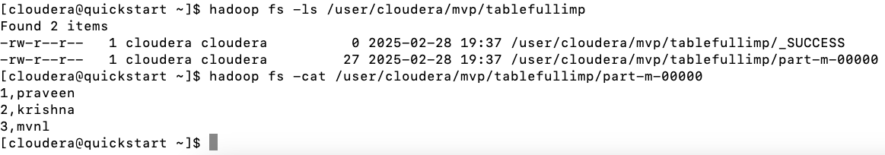
<br>

### 1.2 Sqoop Full Import from single table with specific columns

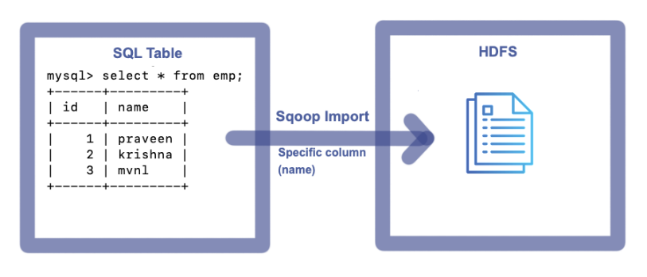
<br>

To import specific columns data from a table to HDFS, execute the following Command

```sh
sqoop import --connect jdbc:mysql://localhost:3306/mvp --username root --password cloudera --m 1 --table emp --delete-target-dir --target-dir /user/cloudera/mvp/tablefullimpreqcols --columns "name"
```

**_Console:_**

```sh
Warning: /usr/lib/sqoop/../accumulo does not exist! Accumulo imports will fail.
Please set $ACCUMULO_HOME to the root of your Accumulo installation.
25/02/28 19:55:58 INFO sqoop.Sqoop: Running Sqoop version: 1.4.6-cdh5.12.0
25/02/28 19:55:58 WARN tool.BaseSqoopTool: Setting your password on the command-line is insecure. Consider using -P instead.
25/02/28 19:55:59 INFO manager.MySQLManager: Preparing to use a MySQL streaming resultset.
25/02/28 19:55:59 INFO tool.CodeGenTool: Beginning code generation
25/02/28 19:56:01 INFO manager.SqlManager: Executing SQL statement: SELECT t.* FROM `emp` AS t LIMIT 1
25/02/28 19:56:01 INFO manager.SqlManager: Executing SQL statement: SELECT t.* FROM `emp` AS t LIMIT 1
25/02/28 19:56:01 INFO orm.CompilationManager: HADOOP_MAPRED_HOME is /usr/lib/hadoop-mapreduce
Note: /tmp/sqoop-cloudera/compile/ea27d9644e6043629fb8b8f0e1df5f98/emp.java uses or overrides a deprecated API.
Note: Recompile with -Xlint:deprecation for details.
25/02/28 19:56:10 INFO orm.CompilationManager: Writing jar file: /tmp/sqoop-cloudera/compile/ea27d9644e6043629fb8b8f0e1df5f98/emp.jar
25/02/28 19:56:16 INFO tool.ImportTool: Destination directory /user/cloudera/mvp/tablefullimpreqcols deleted.
25/02/28 19:56:16 WARN manager.MySQLManager: It looks like you are importing from mysql.
25/02/28 19:56:16 WARN manager.MySQLManager: This transfer can be faster! Use the --direct
25/02/28 19:56:16 WARN manager.MySQLManager: option to exercise a MySQL-specific fast path.
25/02/28 19:56:16 INFO manager.MySQLManager: Setting zero DATETIME behavior to convertToNull (mysql)
25/02/28 19:56:16 INFO mapreduce.ImportJobBase: Beginning import of emp
25/02/28 19:56:16 INFO Configuration.deprecation: mapred.job.tracker is deprecated. Instead, use mapreduce.jobtracker.address
25/02/28 19:56:16 INFO Configuration.deprecation: mapred.jar is deprecated. Instead, use mapreduce.job.jar
25/02/28 19:56:16 INFO Configuration.deprecation: mapred.map.tasks is deprecated. Instead, use mapreduce.job.maps
25/02/28 19:56:16 INFO client.RMProxy: Connecting to ResourceManager at /0.0.0.0:8032
25/02/28 19:56:23 INFO db.DBInputFormat: Using read commited transaction isolation
25/02/28 19:56:23 INFO mapreduce.JobSubmitter: number of splits:1
25/02/28 19:56:24 INFO mapreduce.JobSubmitter: Submitting tokens for job: job_1740798011012_0002
25/02/28 19:56:26 INFO impl.YarnClientImpl: Submitted application application_1740798011012_0002
25/02/28 19:56:27 INFO mapreduce.Job: The url to track the job: http://quickstart.cloudera:8088/proxy/application_1740798011012_0002/
25/02/28 19:56:27 INFO mapreduce.Job: Running job: job_1740798011012_0002
25/02/28 19:57:00 INFO mapreduce.Job: Job job_1740798011012_0002 running in uber mode : false
25/02/28 19:57:00 INFO mapreduce.Job:  map 0% reduce 0%
25/02/28 19:57:33 INFO mapreduce.Job:  map 100% reduce 0%
25/02/28 19:57:34 INFO mapreduce.Job: Job job_1740798011012_0002 completed successfully
25/02/28 19:57:34 INFO mapreduce.Job: Counters: 30
	File System Counters
		FILE: Number of bytes read=0
		FILE: Number of bytes written=151541
		FILE: Number of read operations=0
		FILE: Number of large read operations=0
		FILE: Number of write operations=0
		HDFS: Number of bytes read=87
		HDFS: Number of bytes written=21
		HDFS: Number of read operations=4
		HDFS: Number of large read operations=0
		HDFS: Number of write operations=2
	Job Counters
		Launched map tasks=1
		Other local map tasks=1
		Total time spent by all maps in occupied slots (ms)=30135
		Total time spent by all reduces in occupied slots (ms)=0
		Total time spent by all map tasks (ms)=30135
		Total vcore-milliseconds taken by all map tasks=30135
		Total megabyte-milliseconds taken by all map tasks=30858240
	Map-Reduce Framework
		Map input records=3
		Map output records=3
		Input split bytes=87
		Spilled Records=0
		Failed Shuffles=0
		Merged Map outputs=0
		GC time elapsed (ms)=446
		CPU time spent (ms)=6510
		Physical memory (bytes) snapshot=185925632
		Virtual memory (bytes) snapshot=1558097920
		Total committed heap usage (bytes)=137887744
	File Input Format Counters
		Bytes Read=0
	File Output Format Counters
		Bytes Written=21
25/02/28 19:57:34 INFO mapreduce.ImportJobBase: Transferred 21 bytes in 78.2253 seconds (0.2685 bytes/sec)
25/02/28 19:57:34 INFO mapreduce.ImportJobBase: Retrieved 3 records.
```

**_Imported File on HDFS:_**

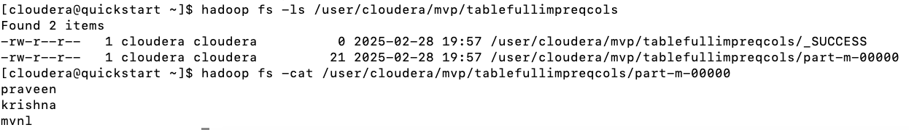
<br>

### 1.3. Sqoop Portion Imports from a single table

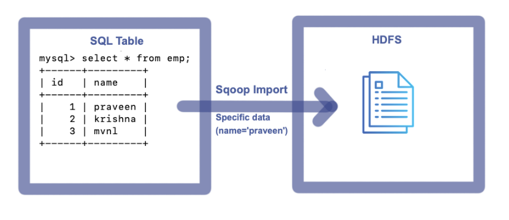
<br>

To import specific data(records) from a table to HDFS, execute the following Command

```sh
sqoop import --connect jdbc:mysql://localhost:3306/mvp --username root --password cloudera --m 1 --table emp --delete-target-dir --target-dir /user/cloudera/mvp/tableportionimp --where "name='praveen'"
```

**_Console:_**

```sh
Warning: /usr/lib/sqoop/../accumulo does not exist! Accumulo imports will fail.
Please set $ACCUMULO_HOME to the root of your Accumulo installation.
25/02/28 20:27:21 INFO sqoop.Sqoop: Running Sqoop version: 1.4.6-cdh5.12.0
25/02/28 20:27:21 WARN tool.BaseSqoopTool: Setting your password on the command-line is insecure. Consider using -P instead.
25/02/28 20:27:22 INFO manager.MySQLManager: Preparing to use a MySQL streaming resultset.
25/02/28 20:27:22 INFO tool.CodeGenTool: Beginning code generation
25/02/28 20:27:24 INFO manager.SqlManager: Executing SQL statement: SELECT t.* FROM `emp` AS t LIMIT 1
25/02/28 20:27:25 INFO manager.SqlManager: Executing SQL statement: SELECT t.* FROM `emp` AS t LIMIT 1
25/02/28 20:27:25 INFO orm.CompilationManager: HADOOP_MAPRED_HOME is /usr/lib/hadoop-mapreduce
Note: /tmp/sqoop-cloudera/compile/64dc7b3d60b45dbc506f18daec0b2316/emp.java uses or overrides a deprecated API.
Note: Recompile with -Xlint:deprecation for details.
25/02/28 20:27:34 INFO orm.CompilationManager: Writing jar file: /tmp/sqoop-cloudera/compile/64dc7b3d60b45dbc506f18daec0b2316/emp.jar
25/02/28 20:27:39 INFO tool.ImportTool: Destination directory /user/cloudera/mvp/tableportionimp deleted.
25/02/28 20:27:39 WARN manager.MySQLManager: It looks like you are importing from mysql.
25/02/28 20:27:39 WARN manager.MySQLManager: This transfer can be faster! Use the --direct
25/02/28 20:27:39 WARN manager.MySQLManager: option to exercise a MySQL-specific fast path.
25/02/28 20:27:39 INFO manager.MySQLManager: Setting zero DATETIME behavior to convertToNull (mysql)
25/02/28 20:27:39 INFO mapreduce.ImportJobBase: Beginning import of emp
25/02/28 20:27:39 INFO Configuration.deprecation: mapred.job.tracker is deprecated. Instead, use mapreduce.jobtracker.address
25/02/28 20:27:39 INFO Configuration.deprecation: mapred.jar is deprecated. Instead, use mapreduce.job.jar
25/02/28 20:27:39 INFO Configuration.deprecation: mapred.map.tasks is deprecated. Instead, use mapreduce.job.maps
25/02/28 20:27:40 INFO client.RMProxy: Connecting to ResourceManager at /0.0.0.0:8032
25/02/28 20:27:47 INFO db.DBInputFormat: Using read commited transaction isolation
25/02/28 20:27:47 INFO mapreduce.JobSubmitter: number of splits:1
25/02/28 20:27:48 INFO mapreduce.JobSubmitter: Submitting tokens for job: job_1740798011012_0003
25/02/28 20:27:50 INFO impl.YarnClientImpl: Submitted application application_1740798011012_0003
25/02/28 20:27:50 INFO mapreduce.Job: The url to track the job: http://quickstart.cloudera:8088/proxy/application_1740798011012_0003/
25/02/28 20:27:50 INFO mapreduce.Job: Running job: job_1740798011012_0003
25/02/28 20:28:26 INFO mapreduce.Job: Job job_1740798011012_0003 running in uber mode : false
25/02/28 20:28:26 INFO mapreduce.Job:  map 0% reduce 0%
25/02/28 20:28:54 INFO mapreduce.Job:  map 100% reduce 0%
25/02/28 20:28:55 INFO mapreduce.Job: Job job_1740798011012_0003 completed successfully
25/02/28 20:28:55 INFO mapreduce.Job: Counters: 30
	File System Counters
		FILE: Number of bytes read=0
		FILE: Number of bytes written=151700
		FILE: Number of read operations=0
		FILE: Number of large read operations=0
		FILE: Number of write operations=0
		HDFS: Number of bytes read=87
		HDFS: Number of bytes written=10
		HDFS: Number of read operations=4
		HDFS: Number of large read operations=0
		HDFS: Number of write operations=2
	Job Counters
		Launched map tasks=1
		Other local map tasks=1
		Total time spent by all maps in occupied slots (ms)=25249
		Total time spent by all reduces in occupied slots (ms)=0
		Total time spent by all map tasks (ms)=25249
		Total vcore-milliseconds taken by all map tasks=25249
		Total megabyte-milliseconds taken by all map tasks=25854976
	Map-Reduce Framework
		Map input records=1
		Map output records=1
		Input split bytes=87
		Spilled Records=0
		Failed Shuffles=0
		Merged Map outputs=0
		GC time elapsed (ms)=264
		CPU time spent (ms)=5770
		Physical memory (bytes) snapshot=191295488
		Virtual memory (bytes) snapshot=1575731200
		Total committed heap usage (bytes)=137887744
	File Input Format Counters
		Bytes Read=0
	File Output Format Counters
		Bytes Written=10
25/02/28 20:28:55 INFO mapreduce.ImportJobBase: Transferred 10 bytes in 75.7572 seconds (0.132 bytes/sec)
25/02/28 20:28:55 INFO mapreduce.ImportJobBase: Retrieved 1 records.
```

**_Imported File on HDFS:_**

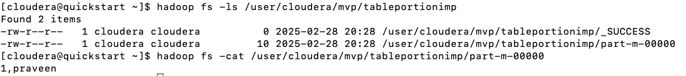
<br>

### 1.4. Sqoop Portion Imports from a single table with specific columns

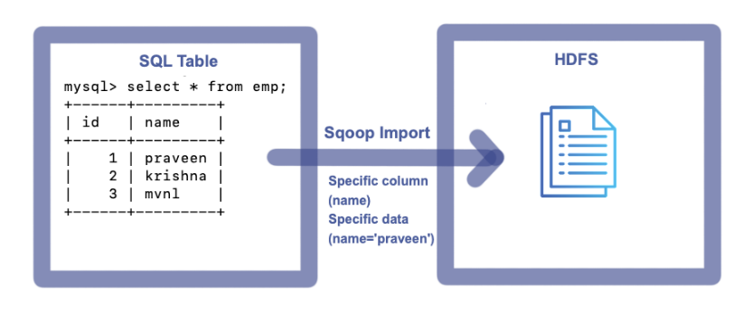
<br>

To import specific columns of specific data(records) from a table to HDFS, execute the following Command

```sh
sqoop import --connect jdbc:mysql://localhost:3306/mvp --username root --password cloudera --m 1 --table emp --delete-target-dir --target-dir /user/cloudera/mvp/tableportionimpreqcols --where "name='praveen'" --columns "name"
```

**_Console:_**

```sh
Warning: /usr/lib/sqoop/../accumulo does not exist! Accumulo imports will fail.
Please set $ACCUMULO_HOME to the root of your Accumulo installation.
25/02/28 20:45:55 INFO sqoop.Sqoop: Running Sqoop version: 1.4.6-cdh5.12.0
25/02/28 20:45:55 WARN tool.BaseSqoopTool: Setting your password on the command-line is insecure. Consider using -P instead.
25/02/28 20:45:56 INFO manager.MySQLManager: Preparing to use a MySQL streaming resultset.
25/02/28 20:45:56 INFO tool.CodeGenTool: Beginning code generation
25/02/28 20:45:59 INFO manager.SqlManager: Executing SQL statement: SELECT t.* FROM `emp` AS t LIMIT 1
25/02/28 20:45:59 INFO manager.SqlManager: Executing SQL statement: SELECT t.* FROM `emp` AS t LIMIT 1
25/02/28 20:45:59 INFO orm.CompilationManager: HADOOP_MAPRED_HOME is /usr/lib/hadoop-mapreduce
Note: /tmp/sqoop-cloudera/compile/688644f01568b30bc65cee3a0a712835/emp.java uses or overrides a deprecated API.
Note: Recompile with -Xlint:deprecation for details.
25/02/28 20:46:07 INFO orm.CompilationManager: Writing jar file: /tmp/sqoop-cloudera/compile/688644f01568b30bc65cee3a0a712835/emp.jar
25/02/28 20:46:12 INFO tool.ImportTool: Destination directory /user/cloudera/mvp/tableportionimpreqcols deleted.
25/02/28 20:46:12 WARN manager.MySQLManager: It looks like you are importing from mysql.
25/02/28 20:46:12 WARN manager.MySQLManager: This transfer can be faster! Use the --direct
25/02/28 20:46:12 WARN manager.MySQLManager: option to exercise a MySQL-specific fast path.
25/02/28 20:46:12 INFO manager.MySQLManager: Setting zero DATETIME behavior to convertToNull (mysql)
25/02/28 20:46:12 INFO mapreduce.ImportJobBase: Beginning import of emp
25/02/28 20:46:12 INFO Configuration.deprecation: mapred.job.tracker is deprecated. Instead, use mapreduce.jobtracker.address
25/02/28 20:46:13 INFO Configuration.deprecation: mapred.jar is deprecated. Instead, use mapreduce.job.jar
25/02/28 20:46:13 INFO Configuration.deprecation: mapred.map.tasks is deprecated. Instead, use mapreduce.job.maps
25/02/28 20:46:13 INFO client.RMProxy: Connecting to ResourceManager at /0.0.0.0:8032
25/02/28 20:46:20 INFO db.DBInputFormat: Using read commited transaction isolation
25/02/28 20:46:20 INFO mapreduce.JobSubmitter: number of splits:1
25/02/28 20:46:21 INFO mapreduce.JobSubmitter: Submitting tokens for job: job_1740798011012_0004
25/02/28 20:46:23 INFO impl.YarnClientImpl: Submitted application application_1740798011012_0004
25/02/28 20:46:23 INFO mapreduce.Job: The url to track the job: http://quickstart.cloudera:8088/proxy/application_1740798011012_0004/
25/02/28 20:46:23 INFO mapreduce.Job: Running job: job_1740798011012_0004
25/02/28 20:46:52 INFO mapreduce.Job: Job job_1740798011012_0004 running in uber mode : false
25/02/28 20:46:52 INFO mapreduce.Job:  map 0% reduce 0%
25/02/28 20:47:20 INFO mapreduce.Job:  map 100% reduce 0%
25/02/28 20:47:21 INFO mapreduce.Job: Job job_1740798011012_0004 completed successfully
25/02/28 20:47:22 INFO mapreduce.Job: Counters: 30
	File System Counters
		FILE: Number of bytes read=0
		FILE: Number of bytes written=151847
		FILE: Number of read operations=0
		FILE: Number of large read operations=0
		FILE: Number of write operations=0
		HDFS: Number of bytes read=87
		HDFS: Number of bytes written=8
		HDFS: Number of read operations=4
		HDFS: Number of large read operations=0
		HDFS: Number of write operations=2
	Job Counters
		Launched map tasks=1
		Other local map tasks=1
		Total time spent by all maps in occupied slots (ms)=24128
		Total time spent by all reduces in occupied slots (ms)=0
		Total time spent by all map tasks (ms)=24128
		Total vcore-milliseconds taken by all map tasks=24128
		Total megabyte-milliseconds taken by all map tasks=24707072
	Map-Reduce Framework
		Map input records=1
		Map output records=1
		Input split bytes=87
		Spilled Records=0
		Failed Shuffles=0
		Merged Map outputs=0
		GC time elapsed (ms)=351
		CPU time spent (ms)=6460
		Physical memory (bytes) snapshot=185425920
		Virtual memory (bytes) snapshot=1569693696
		Total committed heap usage (bytes)=140509184
	File Input Format Counters
		Bytes Read=0
	File Output Format Counters
		Bytes Written=8
25/02/28 20:47:22 INFO mapreduce.ImportJobBase: Transferred 8 bytes in 69.3222 seconds (0.1154 bytes/sec)
25/02/28 20:47:22 INFO mapreduce.ImportJobBase: Retrieved 1 records.
```

**_Imported File on HDFS:_**

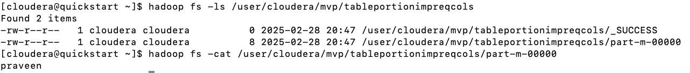
<br>

### 1.5. Sqoop Incremental import from a single table

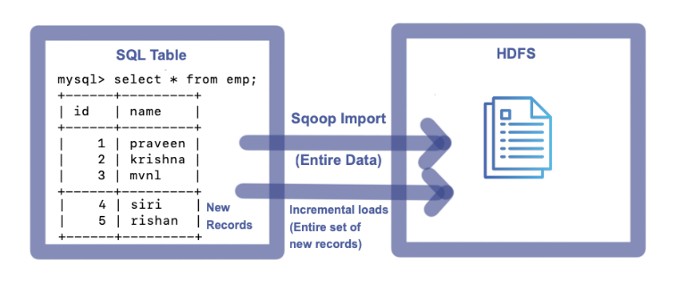
<br>

To import entire data from a table to HDFS, execute the following Command

```sh
sqoop import --connect jdbc:mysql://localhost:3306/mvp --username root --password cloudera --m 1 --table emp --delete-target-dir --target-dir /user/cloudera/mvp/tableincimp
```

**_Console:_**

```sh
Warning: /usr/lib/sqoop/../accumulo does not exist! Accumulo imports will fail.
Please set $ACCUMULO_HOME to the root of your Accumulo installation.
25/02/28 23:26:24 INFO sqoop.Sqoop: Running Sqoop version: 1.4.6-cdh5.12.0
25/02/28 23:26:24 WARN tool.BaseSqoopTool: Setting your password on the command-line is insecure. Consider using -P instead.
25/02/28 23:26:25 INFO manager.MySQLManager: Preparing to use a MySQL streaming resultset.
25/02/28 23:26:25 INFO tool.CodeGenTool: Beginning code generation
25/02/28 23:26:27 INFO manager.SqlManager: Executing SQL statement: SELECT t.* FROM `emp` AS t LIMIT 1
25/02/28 23:26:28 INFO manager.SqlManager: Executing SQL statement: SELECT t.* FROM `emp` AS t LIMIT 1
25/02/28 23:26:28 INFO orm.CompilationManager: HADOOP_MAPRED_HOME is /usr/lib/hadoop-mapreduce
Note: /tmp/sqoop-cloudera/compile/709335cb0cc2d51abc924536e9e29008/emp.java uses or overrides a deprecated API.
Note: Recompile with -Xlint:deprecation for details.
25/02/28 23:26:37 INFO orm.CompilationManager: Writing jar file: /tmp/sqoop-cloudera/compile/709335cb0cc2d51abc924536e9e29008/emp.jar
25/02/28 23:26:42 INFO tool.ImportTool: Destination directory /user/cloudera/mvp/tableincimp deleted.
25/02/28 23:26:42 WARN manager.MySQLManager: It looks like you are importing from mysql.
25/02/28 23:26:42 WARN manager.MySQLManager: This transfer can be faster! Use the --direct
25/02/28 23:26:42 WARN manager.MySQLManager: option to exercise a MySQL-specific fast path.
25/02/28 23:26:42 INFO manager.MySQLManager: Setting zero DATETIME behavior to convertToNull (mysql)
25/02/28 23:26:42 INFO mapreduce.ImportJobBase: Beginning import of emp
25/02/28 23:26:42 INFO Configuration.deprecation: mapred.job.tracker is deprecated. Instead, use mapreduce.jobtracker.address
25/02/28 23:26:42 INFO Configuration.deprecation: mapred.jar is deprecated. Instead, use mapreduce.job.jar
25/02/28 23:26:42 INFO Configuration.deprecation: mapred.map.tasks is deprecated. Instead, use mapreduce.job.maps
25/02/28 23:26:43 INFO client.RMProxy: Connecting to ResourceManager at /0.0.0.0:8032
25/02/28 23:26:50 INFO db.DBInputFormat: Using read commited transaction isolation
25/02/28 23:26:50 INFO mapreduce.JobSubmitter: number of splits:1
25/02/28 23:26:51 INFO mapreduce.JobSubmitter: Submitting tokens for job: job_1740805975825_0002
25/02/28 23:26:53 INFO impl.YarnClientImpl: Submitted application application_1740805975825_0002
25/02/28 23:26:53 INFO mapreduce.Job: The url to track the job: http://quickstart.cloudera:8088/proxy/application_1740805975825_0002/
25/02/28 23:26:53 INFO mapreduce.Job: Running job: job_1740805975825_0002
25/02/28 23:27:26 INFO mapreduce.Job: Job job_1740805975825_0002 running in uber mode : false
25/02/28 23:27:26 INFO mapreduce.Job:  map 0% reduce 0%
25/02/28 23:27:50 INFO mapreduce.Job:  map 100% reduce 0%
25/02/28 23:27:51 INFO mapreduce.Job: Job job_1740805975825_0002 completed successfully
25/02/28 23:27:52 INFO mapreduce.Job: Counters: 30
	File System Counters
		FILE: Number of bytes read=0
		FILE: Number of bytes written=151396
		FILE: Number of read operations=0
		FILE: Number of large read operations=0
		FILE: Number of write operations=0
		HDFS: Number of bytes read=87
		HDFS: Number of bytes written=27
		HDFS: Number of read operations=4
		HDFS: Number of large read operations=0
		HDFS: Number of write operations=2
	Job Counters
		Launched map tasks=1
		Other local map tasks=1
		Total time spent by all maps in occupied slots (ms)=21662
		Total time spent by all reduces in occupied slots (ms)=0
		Total time spent by all map tasks (ms)=21662
		Total vcore-milliseconds taken by all map tasks=21662
		Total megabyte-milliseconds taken by all map tasks=22181888
	Map-Reduce Framework
		Map input records=3
		Map output records=3
		Input split bytes=87
		Spilled Records=0
		Failed Shuffles=0
		Merged Map outputs=0
		GC time elapsed (ms)=217
		CPU time spent (ms)=6240
		Physical memory (bytes) snapshot=183148544
		Virtual memory (bytes) snapshot=1574682624
		Total committed heap usage (bytes)=140509184
	File Input Format Counters
		Bytes Read=0
	File Output Format Counters
		Bytes Written=27
25/02/28 23:27:52 INFO mapreduce.ImportJobBase: Transferred 27 bytes in 69.1183 seconds (0.3906 bytes/sec)
25/02/28 23:27:52 INFO mapreduce.ImportJobBase: Retrieved 3 records.
```

**_Imported File on HDFS:_**

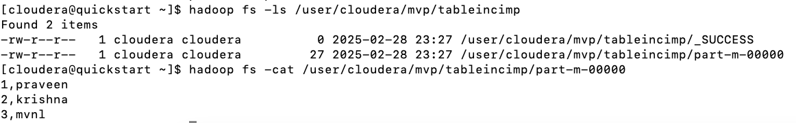
<br>

To perform incremental loads(for new records) from a table to HDFS, execute the following Command

```sh
sqoop import --connect jdbc:mysql://localhost:3306/mvp --username root --password cloudera --m 1 --table emp --target-dir /user/cloudera/mvp/tableincimp --incremental append --check-column id --last-value 3
```
> last value -> previous imported last record value.

**_Console:_**

```sh
Warning: /usr/lib/sqoop/../accumulo does not exist! Accumulo imports will fail.
Please set $ACCUMULO_HOME to the root of your Accumulo installation.
25/02/28 23:33:59 INFO sqoop.Sqoop: Running Sqoop version: 1.4.6-cdh5.12.0
25/02/28 23:33:59 WARN tool.BaseSqoopTool: Setting your password on the command-line is insecure. Consider using -P instead.
25/02/28 23:34:00 INFO manager.MySQLManager: Preparing to use a MySQL streaming resultset.
25/02/28 23:34:00 INFO tool.CodeGenTool: Beginning code generation
25/02/28 23:34:03 INFO manager.SqlManager: Executing SQL statement: SELECT t.* FROM `emp` AS t LIMIT 1
25/02/28 23:34:03 INFO manager.SqlManager: Executing SQL statement: SELECT t.* FROM `emp` AS t LIMIT 1
25/02/28 23:34:03 INFO orm.CompilationManager: HADOOP_MAPRED_HOME is /usr/lib/hadoop-mapreduce
Note: /tmp/sqoop-cloudera/compile/6308063bb89cf71877c26f02cbee01c7/emp.java uses or overrides a deprecated API.
Note: Recompile with -Xlint:deprecation for details.
25/02/28 23:34:12 INFO orm.CompilationManager: Writing jar file: /tmp/sqoop-cloudera/compile/6308063bb89cf71877c26f02cbee01c7/emp.jar
25/02/28 23:34:17 INFO tool.ImportTool: Maximal id query for free form incremental import: SELECT MAX(`id`) FROM `emp`
25/02/28 23:34:17 INFO tool.ImportTool: Incremental import based on column `id`
25/02/28 23:34:17 INFO tool.ImportTool: Lower bound value: 3
25/02/28 23:34:17 INFO tool.ImportTool: Upper bound value: 5
25/02/28 23:34:17 WARN manager.MySQLManager: It looks like you are importing from mysql.
25/02/28 23:34:17 WARN manager.MySQLManager: This transfer can be faster! Use the --direct
25/02/28 23:34:17 WARN manager.MySQLManager: option to exercise a MySQL-specific fast path.
25/02/28 23:34:17 INFO manager.MySQLManager: Setting zero DATETIME behavior to convertToNull (mysql)
25/02/28 23:34:17 INFO mapreduce.ImportJobBase: Beginning import of emp
25/02/28 23:34:17 INFO Configuration.deprecation: mapred.job.tracker is deprecated. Instead, use mapreduce.jobtracker.address
25/02/28 23:34:17 INFO Configuration.deprecation: mapred.jar is deprecated. Instead, use mapreduce.job.jar
25/02/28 23:34:17 INFO Configuration.deprecation: mapred.map.tasks is deprecated. Instead, use mapreduce.job.maps
25/02/28 23:34:18 INFO client.RMProxy: Connecting to ResourceManager at /0.0.0.0:8032
25/02/28 23:34:25 INFO db.DBInputFormat: Using read commited transaction isolation
25/02/28 23:34:25 INFO mapreduce.JobSubmitter: number of splits:1
25/02/28 23:34:26 INFO mapreduce.JobSubmitter: Submitting tokens for job: job_1740805975825_0003
25/02/28 23:34:28 INFO impl.YarnClientImpl: Submitted application application_1740805975825_0003
25/02/28 23:34:29 INFO mapreduce.Job: The url to track the job: http://quickstart.cloudera:8088/proxy/application_1740805975825_0003/
25/02/28 23:34:29 INFO mapreduce.Job: Running job: job_1740805975825_0003
25/02/28 23:34:58 INFO mapreduce.Job: Job job_1740805975825_0003 running in uber mode : false
25/02/28 23:34:58 INFO mapreduce.Job:  map 0% reduce 0%
25/02/28 23:35:25 INFO mapreduce.Job:  map 100% reduce 0%
25/02/28 23:35:25 INFO mapreduce.Job: Job job_1740805975825_0003 completed successfully
25/02/28 23:35:25 INFO mapreduce.Job: Counters: 30
	File System Counters
		FILE: Number of bytes read=0
		FILE: Number of bytes written=152030
		FILE: Number of read operations=0
		FILE: Number of large read operations=0
		FILE: Number of write operations=0
		HDFS: Number of bytes read=87
		HDFS: Number of bytes written=16
		HDFS: Number of read operations=4
		HDFS: Number of large read operations=0
		HDFS: Number of write operations=2
	Job Counters
		Launched map tasks=1
		Other local map tasks=1
		Total time spent by all maps in occupied slots (ms)=24217
		Total time spent by all reduces in occupied slots (ms)=0
		Total time spent by all map tasks (ms)=24217
		Total vcore-milliseconds taken by all map tasks=24217
		Total megabyte-milliseconds taken by all map tasks=24798208
	Map-Reduce Framework
		Map input records=2
		Map output records=2
		Input split bytes=87
		Spilled Records=0
		Failed Shuffles=0
		Merged Map outputs=0
		GC time elapsed (ms)=196
		CPU time spent (ms)=4960
		Physical memory (bytes) snapshot=195522560
		Virtual memory (bytes) snapshot=1574383616
		Total committed heap usage (bytes)=141557760
	File Input Format Counters
		Bytes Read=0
	File Output Format Counters
		Bytes Written=16
25/02/28 23:35:25 INFO mapreduce.ImportJobBase: Transferred 16 bytes in 68.1809 seconds (0.2347 bytes/sec)
25/02/28 23:35:25 INFO mapreduce.ImportJobBase: Retrieved 2 records.
25/02/28 23:35:26 INFO util.AppendUtils: Appending to directory tableincimp
25/02/28 23:35:26 INFO util.AppendUtils: Using found partition 1
25/02/28 23:35:26 INFO tool.ImportTool: Incremental import complete! To run another incremental import of all data following this import, supply the following arguments:
25/02/28 23:35:26 INFO tool.ImportTool:  --incremental append
25/02/28 23:35:26 INFO tool.ImportTool:   --check-column id
25/02/28 23:35:26 INFO tool.ImportTool:   --last-value 5
25/02/28 23:35:26 INFO tool.ImportTool: (Consider saving this with 'sqoop job --create')
```

**_Imported File on HDFS:_**

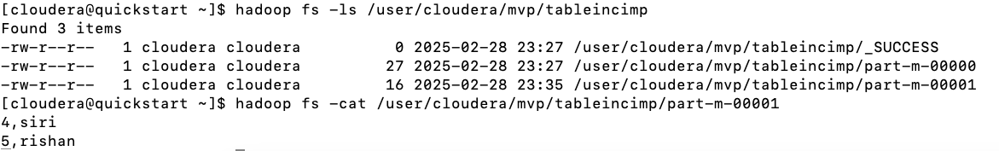
<br>

> A new part file gets created for each incremental run.
> Last value has to be noted down, in case incremental run is executed manually.

### 1.6. Sqoop Full import using Query clause


<br>

To import entire table data to HDFS, execute the following Command

```sh
sqoop import --connect jdbc:mysql://localhost:3306/mvp --username root --password cloudera --m 1 --delete-target-dir --target-dir /user/cloudera/mvp/queryfullimp --query "select * from emp where \$CONDITIONS"
```

**_Console:_**

```sh
Warning: /usr/lib/sqoop/../accumulo does not exist! Accumulo imports will fail.
Please set $ACCUMULO_HOME to the root of your Accumulo installation.
25/02/28 23:58:19 INFO sqoop.Sqoop: Running Sqoop version: 1.4.6-cdh5.12.0
25/02/28 23:58:19 WARN tool.BaseSqoopTool: Setting your password on the command-line is insecure. Consider using -P instead.
25/02/28 23:58:20 INFO manager.MySQLManager: Preparing to use a MySQL streaming resultset.
25/02/28 23:58:20 INFO tool.CodeGenTool: Beginning code generation
25/02/28 23:58:22 INFO manager.SqlManager: Executing SQL statement: select * from emp where  (1 = 0)
25/02/28 23:58:22 INFO manager.SqlManager: Executing SQL statement: select * from emp where  (1 = 0)
25/02/28 23:58:22 INFO manager.SqlManager: Executing SQL statement: select * from emp where  (1 = 0)
25/02/28 23:58:22 INFO orm.CompilationManager: HADOOP_MAPRED_HOME is /usr/lib/hadoop-mapreduce
Note: /tmp/sqoop-cloudera/compile/7111c12015b6f5a76e835b4008f292ac/QueryResult.java uses or overrides a deprecated API.
Note: Recompile with -Xlint:deprecation for details.
25/02/28 23:58:31 INFO orm.CompilationManager: Writing jar file: /tmp/sqoop-cloudera/compile/7111c12015b6f5a76e835b4008f292ac/QueryResult.jar
25/02/28 23:58:37 INFO tool.ImportTool: Destination directory /user/cloudera/mvp/queryfullimp deleted.
25/02/28 23:58:37 INFO mapreduce.ImportJobBase: Beginning query import.
25/02/28 23:58:37 INFO Configuration.deprecation: mapred.job.tracker is deprecated. Instead, use mapreduce.jobtracker.address
25/02/28 23:58:37 INFO Configuration.deprecation: mapred.jar is deprecated. Instead, use mapreduce.job.jar
25/02/28 23:58:37 INFO Configuration.deprecation: mapred.map.tasks is deprecated. Instead, use mapreduce.job.maps
25/02/28 23:58:38 INFO client.RMProxy: Connecting to ResourceManager at /0.0.0.0:8032
25/02/28 23:58:45 INFO db.DBInputFormat: Using read commited transaction isolation
25/02/28 23:58:45 INFO mapreduce.JobSubmitter: number of splits:1
25/02/28 23:58:46 INFO mapreduce.JobSubmitter: Submitting tokens for job: job_1740805975825_0004
25/02/28 23:58:48 INFO impl.YarnClientImpl: Submitted application application_1740805975825_0004
25/02/28 23:58:48 INFO mapreduce.Job: The url to track the job: http://quickstart.cloudera:8088/proxy/application_1740805975825_0004/
25/02/28 23:58:48 INFO mapreduce.Job: Running job: job_1740805975825_0004
25/02/28 23:59:18 INFO mapreduce.Job: Job job_1740805975825_0004 running in uber mode : false
25/02/28 23:59:18 INFO mapreduce.Job:  map 0% reduce 0%
25/02/28 23:59:44 INFO mapreduce.Job:  map 100% reduce 0%
25/02/28 23:59:45 INFO mapreduce.Job: Job job_1740805975825_0004 completed successfully
25/02/28 23:59:46 INFO mapreduce.Job: Counters: 30
	File System Counters
		FILE: Number of bytes read=0
		FILE: Number of bytes written=151252
		FILE: Number of read operations=0
		FILE: Number of large read operations=0
		FILE: Number of write operations=0
		HDFS: Number of bytes read=87
		HDFS: Number of bytes written=27
		HDFS: Number of read operations=4
		HDFS: Number of large read operations=0
		HDFS: Number of write operations=2
	Job Counters
		Launched map tasks=1
		Other local map tasks=1
		Total time spent by all maps in occupied slots (ms)=22894
		Total time spent by all reduces in occupied slots (ms)=0
		Total time spent by all map tasks (ms)=22894
		Total vcore-milliseconds taken by all map tasks=22894
		Total megabyte-milliseconds taken by all map tasks=23443456
	Map-Reduce Framework
		Map input records=3
		Map output records=3
		Input split bytes=87
		Spilled Records=0
		Failed Shuffles=0
		Merged Map outputs=0
		GC time elapsed (ms)=443
		CPU time spent (ms)=6200
		Physical memory (bytes) snapshot=193097728
		Virtual memory (bytes) snapshot=1573556224
		Total committed heap usage (bytes)=141557760
	File Input Format Counters
		Bytes Read=0
	File Output Format Counters
		Bytes Written=27
25/02/28 23:59:46 INFO mapreduce.ImportJobBase: Transferred 27 bytes in 68.6509 seconds (0.3933 bytes/sec)
25/02/28 23:59:46 INFO mapreduce.ImportJobBase: Retrieved 3 records.
```

**_Imported File on HDFS:_**


<br>

### 1.7. Sqoop Full import using Query clause with specific columns


<br>

To import specific columns data from a table to HDFS, execute the following Command

```sh
sqoop import --connect jdbc:mysql://localhost:3306/mvp --username root --password cloudera --m 1 --delete-target-dir --target-dir /user/cloudera/mvp/queryfullimpreqcols --query "select name from emp where \$CONDITIONS"
```

**_Console:_**

```sh
Warning: /usr/lib/sqoop/../accumulo does not exist! Accumulo imports will fail.
Please set $ACCUMULO_HOME to the root of your Accumulo installation.
25/03/01 00:07:45 INFO sqoop.Sqoop: Running Sqoop version: 1.4.6-cdh5.12.0
25/03/01 00:07:45 WARN tool.BaseSqoopTool: Setting your password on the command-line is insecure. Consider using -P instead.
25/03/01 00:07:46 INFO manager.MySQLManager: Preparing to use a MySQL streaming resultset.
25/03/01 00:07:46 INFO tool.CodeGenTool: Beginning code generation
25/03/01 00:07:48 INFO manager.SqlManager: Executing SQL statement: select name from emp where  (1 = 0)
25/03/01 00:07:48 INFO manager.SqlManager: Executing SQL statement: select name from emp where  (1 = 0)
25/03/01 00:07:48 INFO manager.SqlManager: Executing SQL statement: select name from emp where  (1 = 0)
25/03/01 00:07:48 INFO orm.CompilationManager: HADOOP_MAPRED_HOME is /usr/lib/hadoop-mapreduce
Note: /tmp/sqoop-cloudera/compile/59808ce725730d9d0dff89cd31cd83e1/QueryResult.java uses or overrides a deprecated API.
Note: Recompile with -Xlint:deprecation for details.
25/03/01 00:07:56 INFO orm.CompilationManager: Writing jar file: /tmp/sqoop-cloudera/compile/59808ce725730d9d0dff89cd31cd83e1/QueryResult.jar
25/03/01 00:08:03 INFO tool.ImportTool: Destination directory /user/cloudera/mvp/queryfullimpreqcols deleted.
25/03/01 00:08:03 INFO mapreduce.ImportJobBase: Beginning query import.
25/03/01 00:08:03 INFO Configuration.deprecation: mapred.job.tracker is deprecated. Instead, use mapreduce.jobtracker.address
25/03/01 00:08:03 INFO Configuration.deprecation: mapred.jar is deprecated. Instead, use mapreduce.job.jar
25/03/01 00:08:03 INFO Configuration.deprecation: mapred.map.tasks is deprecated. Instead, use mapreduce.job.maps
25/03/01 00:08:03 INFO client.RMProxy: Connecting to ResourceManager at /0.0.0.0:8032
25/03/01 00:08:10 INFO db.DBInputFormat: Using read commited transaction isolation
25/03/01 00:08:10 INFO mapreduce.JobSubmitter: number of splits:1
25/03/01 00:08:11 INFO mapreduce.JobSubmitter: Submitting tokens for job: job_1740805975825_0005
25/03/01 00:08:12 INFO impl.YarnClientImpl: Submitted application application_1740805975825_0005
25/03/01 00:08:12 INFO mapreduce.Job: The url to track the job: http://quickstart.cloudera:8088/proxy/application_1740805975825_0005/
25/03/01 00:08:12 INFO mapreduce.Job: Running job: job_1740805975825_0005
25/03/01 00:08:41 INFO mapreduce.Job: Job job_1740805975825_0005 running in uber mode : false
25/03/01 00:08:41 INFO mapreduce.Job:  map 0% reduce 0%
25/03/01 00:09:10 INFO mapreduce.Job:  map 100% reduce 0%
25/03/01 00:09:11 INFO mapreduce.Job: Job job_1740805975825_0005 completed successfully
25/03/01 00:09:12 INFO mapreduce.Job: Counters: 30
	File System Counters
		FILE: Number of bytes read=0
		FILE: Number of bytes written=151272
		FILE: Number of read operations=0
		FILE: Number of large read operations=0
		FILE: Number of write operations=0
		HDFS: Number of bytes read=87
		HDFS: Number of bytes written=21
		HDFS: Number of read operations=4
		HDFS: Number of large read operations=0
		HDFS: Number of write operations=2
	Job Counters
		Launched map tasks=1
		Other local map tasks=1
		Total time spent by all maps in occupied slots (ms)=26203
		Total time spent by all reduces in occupied slots (ms)=0
		Total time spent by all map tasks (ms)=26203
		Total vcore-milliseconds taken by all map tasks=26203
		Total megabyte-milliseconds taken by all map tasks=26831872
	Map-Reduce Framework
		Map input records=3
		Map output records=3
		Input split bytes=87
		Spilled Records=0
		Failed Shuffles=0
		Merged Map outputs=0
		GC time elapsed (ms)=479
		CPU time spent (ms)=7420
		Physical memory (bytes) snapshot=191488000
		Virtual memory (bytes) snapshot=1571495936
		Total committed heap usage (bytes)=141557760
	File Input Format Counters
		Bytes Read=0
	File Output Format Counters
		Bytes Written=21
25/03/01 00:09:12 INFO mapreduce.ImportJobBase: Transferred 21 bytes in 69.0572 seconds (0.3041 bytes/sec)
25/03/01 00:09:12 INFO mapreduce.ImportJobBase: Retrieved 3 records.
```

**_Imported File on HDFS:_**

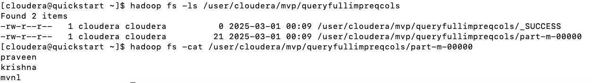
<br>

### 1.8. Sqoop Portion import using Query clause


<br>

To import specific data(records) from a table to HDFS, execute the following Command

```sh
sqoop import --connect jdbc:mysql://localhost:3306/mvp --username root --password cloudera --m 1 --delete-target-dir --target-dir /user/cloudera/mvp/queryportionimp --query "select * from emp where name='praveen' and \$CONDITIONS"
```

**_Console:_**

```sh
Warning: /usr/lib/sqoop/../accumulo does not exist! Accumulo imports will fail.
Please set $ACCUMULO_HOME to the root of your Accumulo installation.
25/03/01 00:18:42 INFO sqoop.Sqoop: Running Sqoop version: 1.4.6-cdh5.12.0
25/03/01 00:18:42 WARN tool.BaseSqoopTool: Setting your password on the command-line is insecure. Consider using -P instead.
25/03/01 00:18:43 INFO manager.MySQLManager: Preparing to use a MySQL streaming resultset.
25/03/01 00:18:43 INFO tool.CodeGenTool: Beginning code generation
25/03/01 00:18:45 INFO manager.SqlManager: Executing SQL statement: select * from emp where name='praveen' and  (1 = 0)
25/03/01 00:18:45 INFO manager.SqlManager: Executing SQL statement: select * from emp where name='praveen' and  (1 = 0)
25/03/01 00:18:45 INFO manager.SqlManager: Executing SQL statement: select * from emp where name='praveen' and  (1 = 0)
25/03/01 00:18:45 INFO orm.CompilationManager: HADOOP_MAPRED_HOME is /usr/lib/hadoop-mapreduce
Note: /tmp/sqoop-cloudera/compile/b66bba55550e869a8ad53cb9ae9a2fe7/QueryResult.java uses or overrides a deprecated API.
Note: Recompile with -Xlint:deprecation for details.
25/03/01 00:18:54 INFO orm.CompilationManager: Writing jar file: /tmp/sqoop-cloudera/compile/b66bba55550e869a8ad53cb9ae9a2fe7/QueryResult.jar
25/03/01 00:19:00 INFO tool.ImportTool: Destination directory /user/cloudera/mvp/queryportionimp deleted.
25/03/01 00:19:00 INFO mapreduce.ImportJobBase: Beginning query import.
25/03/01 00:19:00 INFO Configuration.deprecation: mapred.job.tracker is deprecated. Instead, use mapreduce.jobtracker.address
25/03/01 00:19:00 INFO Configuration.deprecation: mapred.jar is deprecated. Instead, use mapreduce.job.jar
25/03/01 00:19:01 INFO Configuration.deprecation: mapred.map.tasks is deprecated. Instead, use mapreduce.job.maps
25/03/01 00:19:01 INFO client.RMProxy: Connecting to ResourceManager at /0.0.0.0:8032
25/03/01 00:19:08 INFO db.DBInputFormat: Using read commited transaction isolation
25/03/01 00:19:08 INFO mapreduce.JobSubmitter: number of splits:1
25/03/01 00:19:09 INFO mapreduce.JobSubmitter: Submitting tokens for job: job_1740805975825_0006
25/03/01 00:19:11 INFO impl.YarnClientImpl: Submitted application application_1740805975825_0006
25/03/01 00:19:11 INFO mapreduce.Job: The url to track the job: http://quickstart.cloudera:8088/proxy/application_1740805975825_0006/
25/03/01 00:19:11 INFO mapreduce.Job: Running job: job_1740805975825_0006
25/03/01 00:19:40 INFO mapreduce.Job: Job job_1740805975825_0006 running in uber mode : false
25/03/01 00:19:40 INFO mapreduce.Job:  map 0% reduce 0%
25/03/01 00:20:08 INFO mapreduce.Job:  map 100% reduce 0%
25/03/01 00:20:09 INFO mapreduce.Job: Job job_1740805975825_0006 completed successfully
25/03/01 00:20:10 INFO mapreduce.Job: Counters: 30
	File System Counters
		FILE: Number of bytes read=0
		FILE: Number of bytes written=151296
		FILE: Number of read operations=0
		FILE: Number of large read operations=0
		FILE: Number of write operations=0
		HDFS: Number of bytes read=87
		HDFS: Number of bytes written=10
		HDFS: Number of read operations=4
		HDFS: Number of large read operations=0
		HDFS: Number of write operations=2
	Job Counters
		Launched map tasks=1
		Other local map tasks=1
		Total time spent by all maps in occupied slots (ms)=23910
		Total time spent by all reduces in occupied slots (ms)=0
		Total time spent by all map tasks (ms)=23910
		Total vcore-milliseconds taken by all map tasks=23910
		Total megabyte-milliseconds taken by all map tasks=24483840
	Map-Reduce Framework
		Map input records=1
		Map output records=1
		Input split bytes=87
		Spilled Records=0
		Failed Shuffles=0
		Merged Map outputs=0
		GC time elapsed (ms)=693
		CPU time spent (ms)=6970
		Physical memory (bytes) snapshot=186609664
		Virtual memory (bytes) snapshot=1567703040
		Total committed heap usage (bytes)=140509184
	File Input Format Counters
		Bytes Read=0
	File Output Format Counters
		Bytes Written=10
25/03/01 00:20:10 INFO mapreduce.ImportJobBase: Transferred 10 bytes in 69.0521 seconds (0.1448 bytes/sec)
25/03/01 00:20:10 INFO mapreduce.ImportJobBase: Retrieved 1 records.
```

**_Imported File on HDFS:_**

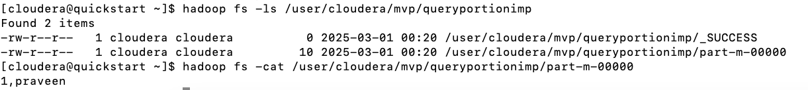
<br>

### 1.9. Sqoop Portion import using Query clause with specific columns


<br>

To import specific columns of specific data(records) from a table to HDFS, execute the following Command

```sh
sqoop import --connect jdbc:mysql://localhost:3306/mvp --username root --password cloudera --m 1 --delete-target-dir --target-dir /user/cloudera/mvp/queryportionimpreqcols --query "select name from emp where name='praveen' and \$CONDITIONS"
```

**_Console:_**

```sh
Warning: /usr/lib/sqoop/../accumulo does not exist! Accumulo imports will fail.
Please set $ACCUMULO_HOME to the root of your Accumulo installation.
25/03/01 00:24:51 INFO sqoop.Sqoop: Running Sqoop version: 1.4.6-cdh5.12.0
25/03/01 00:24:51 WARN tool.BaseSqoopTool: Setting your password on the command-line is insecure. Consider using -P instead.
25/03/01 00:24:52 INFO manager.MySQLManager: Preparing to use a MySQL streaming resultset.
25/03/01 00:24:52 INFO tool.CodeGenTool: Beginning code generation
25/03/01 00:24:54 INFO manager.SqlManager: Executing SQL statement: select name from emp where name='praveen' and  (1 = 0)
25/03/01 00:24:54 INFO manager.SqlManager: Executing SQL statement: select name from emp where name='praveen' and  (1 = 0)
25/03/01 00:24:54 INFO manager.SqlManager: Executing SQL statement: select name from emp where name='praveen' and  (1 = 0)
25/03/01 00:24:54 INFO orm.CompilationManager: HADOOP_MAPRED_HOME is /usr/lib/hadoop-mapreduce
Note: /tmp/sqoop-cloudera/compile/c5f6048d6c58e35534c0598f2a5c1656/QueryResult.java uses or overrides a deprecated API.
Note: Recompile with -Xlint:deprecation for details.
25/03/01 00:25:03 INFO orm.CompilationManager: Writing jar file: /tmp/sqoop-cloudera/compile/c5f6048d6c58e35534c0598f2a5c1656/QueryResult.jar
25/03/01 00:25:08 INFO tool.ImportTool: Destination directory /user/cloudera/mvp/queryportionimpreqcols deleted.
25/03/01 00:25:08 INFO mapreduce.ImportJobBase: Beginning query import.
25/03/01 00:25:08 INFO Configuration.deprecation: mapred.job.tracker is deprecated. Instead, use mapreduce.jobtracker.address
25/03/01 00:25:08 INFO Configuration.deprecation: mapred.jar is deprecated. Instead, use mapreduce.job.jar
25/03/01 00:25:08 INFO Configuration.deprecation: mapred.map.tasks is deprecated. Instead, use mapreduce.job.maps
25/03/01 00:25:09 INFO client.RMProxy: Connecting to ResourceManager at /0.0.0.0:8032
25/03/01 00:25:15 INFO db.DBInputFormat: Using read commited transaction isolation
25/03/01 00:25:15 INFO mapreduce.JobSubmitter: number of splits:1
25/03/01 00:25:16 INFO mapreduce.JobSubmitter: Submitting tokens for job: job_1740805975825_0007
25/03/01 00:25:18 INFO impl.YarnClientImpl: Submitted application application_1740805975825_0007
25/03/01 00:25:19 INFO mapreduce.Job: The url to track the job: http://quickstart.cloudera:8088/proxy/application_1740805975825_0007/
25/03/01 00:25:19 INFO mapreduce.Job: Running job: job_1740805975825_0007
25/03/01 00:25:47 INFO mapreduce.Job: Job job_1740805975825_0007 running in uber mode : false
25/03/01 00:25:47 INFO mapreduce.Job:  map 0% reduce 0%
25/03/01 00:26:11 INFO mapreduce.Job:  map 100% reduce 0%
25/03/01 00:26:12 INFO mapreduce.Job: Job job_1740805975825_0007 completed successfully
25/03/01 00:26:13 INFO mapreduce.Job: Counters: 30
	File System Counters
		FILE: Number of bytes read=0
		FILE: Number of bytes written=151316
		FILE: Number of read operations=0
		FILE: Number of large read operations=0
		FILE: Number of write operations=0
		HDFS: Number of bytes read=87
		HDFS: Number of bytes written=8
		HDFS: Number of read operations=4
		HDFS: Number of large read operations=0
		HDFS: Number of write operations=2
	Job Counters
		Launched map tasks=1
		Other local map tasks=1
		Total time spent by all maps in occupied slots (ms)=22114
		Total time spent by all reduces in occupied slots (ms)=0
		Total time spent by all map tasks (ms)=22114
		Total vcore-milliseconds taken by all map tasks=22114
		Total megabyte-milliseconds taken by all map tasks=22644736
	Map-Reduce Framework
		Map input records=1
		Map output records=1
		Input split bytes=87
		Spilled Records=0
		Failed Shuffles=0
		Merged Map outputs=0
		GC time elapsed (ms)=595
		CPU time spent (ms)=5920
		Physical memory (bytes) snapshot=189321216
		Virtual memory (bytes) snapshot=1572831232
		Total committed heap usage (bytes)=137887744
	File Input Format Counters
		Bytes Read=0
	File Output Format Counters
		Bytes Written=8
25/03/01 00:26:13 INFO mapreduce.ImportJobBase: Transferred 8 bytes in 64.02 seconds (0.125 bytes/sec)
25/03/01 00:26:13 INFO mapreduce.ImportJobBase: Retrieved 1 records.
```

**_Imported File on HDFS:_**


<br>

### 1.10.	Sqoop Incremental Imports using query clause


<br>

To import entire data from a table to HDFS, execute the following Command

```sh
sqoop import --connect jdbc:mysql://localhost:3306/mvp --username root --password cloudera --m 1 --delete-target-dir --target-dir /user/cloudera/mvp/queryincimp --query "select * from emp where \$CONDITIONS"
```

**_Console:_**

```sh
Warning: /usr/lib/sqoop/../accumulo does not exist! Accumulo imports will fail.
Please set $ACCUMULO_HOME to the root of your Accumulo installation.
25/03/01 00:30:05 INFO sqoop.Sqoop: Running Sqoop version: 1.4.6-cdh5.12.0
25/03/01 00:30:05 WARN tool.BaseSqoopTool: Setting your password on the command-line is insecure. Consider using -P instead.
25/03/01 00:30:06 INFO manager.MySQLManager: Preparing to use a MySQL streaming resultset.
25/03/01 00:30:06 INFO tool.CodeGenTool: Beginning code generation
25/03/01 00:30:08 INFO manager.SqlManager: Executing SQL statement: select * from emp where  (1 = 0)
25/03/01 00:30:08 INFO manager.SqlManager: Executing SQL statement: select * from emp where  (1 = 0)
25/03/01 00:30:09 INFO manager.SqlManager: Executing SQL statement: select * from emp where  (1 = 0)
25/03/01 00:30:09 INFO orm.CompilationManager: HADOOP_MAPRED_HOME is /usr/lib/hadoop-mapreduce
Note: /tmp/sqoop-cloudera/compile/615a181c8ab5f6f960c2abbcbc505fe8/QueryResult.java uses or overrides a deprecated API.
Note: Recompile with -Xlint:deprecation for details.
25/03/01 00:30:17 INFO orm.CompilationManager: Writing jar file: /tmp/sqoop-cloudera/compile/615a181c8ab5f6f960c2abbcbc505fe8/QueryResult.jar
25/03/01 00:30:23 INFO tool.ImportTool: Destination directory /user/cloudera/mvp/queryincimp deleted.
25/03/01 00:30:23 INFO mapreduce.ImportJobBase: Beginning query import.
25/03/01 00:30:23 INFO Configuration.deprecation: mapred.job.tracker is deprecated. Instead, use mapreduce.jobtracker.address
25/03/01 00:30:23 INFO Configuration.deprecation: mapred.jar is deprecated. Instead, use mapreduce.job.jar
25/03/01 00:30:23 INFO Configuration.deprecation: mapred.map.tasks is deprecated. Instead, use mapreduce.job.maps
25/03/01 00:30:23 INFO client.RMProxy: Connecting to ResourceManager at /0.0.0.0:8032
25/03/01 00:30:30 INFO db.DBInputFormat: Using read commited transaction isolation
25/03/01 00:30:30 INFO mapreduce.JobSubmitter: number of splits:1
25/03/01 00:30:31 INFO mapreduce.JobSubmitter: Submitting tokens for job: job_1740805975825_0008
25/03/01 00:30:33 INFO impl.YarnClientImpl: Submitted application application_1740805975825_0008
25/03/01 00:30:33 INFO mapreduce.Job: The url to track the job: http://quickstart.cloudera:8088/proxy/application_1740805975825_0008/
25/03/01 00:30:33 INFO mapreduce.Job: Running job: job_1740805975825_0008
25/03/01 00:31:01 INFO mapreduce.Job: Job job_1740805975825_0008 running in uber mode : false
25/03/01 00:31:01 INFO mapreduce.Job:  map 0% reduce 0%
25/03/01 00:31:27 INFO mapreduce.Job:  map 100% reduce 0%
25/03/01 00:31:28 INFO mapreduce.Job: Job job_1740805975825_0008 completed successfully
25/03/01 00:31:29 INFO mapreduce.Job: Counters: 30
	File System Counters
		FILE: Number of bytes read=0
		FILE: Number of bytes written=151250
		FILE: Number of read operations=0
		FILE: Number of large read operations=0
		FILE: Number of write operations=0
		HDFS: Number of bytes read=87
		HDFS: Number of bytes written=27
		HDFS: Number of read operations=4
		HDFS: Number of large read operations=0
		HDFS: Number of write operations=2
	Job Counters
		Launched map tasks=1
		Other local map tasks=1
		Total time spent by all maps in occupied slots (ms)=22522
		Total time spent by all reduces in occupied slots (ms)=0
		Total time spent by all map tasks (ms)=22522
		Total vcore-milliseconds taken by all map tasks=22522
		Total megabyte-milliseconds taken by all map tasks=23062528
	Map-Reduce Framework
		Map input records=3
		Map output records=3
		Input split bytes=87
		Spilled Records=0
		Failed Shuffles=0
		Merged Map outputs=0
		GC time elapsed (ms)=208
		CPU time spent (ms)=8350
		Physical memory (bytes) snapshot=195792896
		Virtual memory (bytes) snapshot=1577033728
		Total committed heap usage (bytes)=141557760
	File Input Format Counters
		Bytes Read=0
	File Output Format Counters
		Bytes Written=27
25/03/01 00:31:29 INFO mapreduce.ImportJobBase: Transferred 27 bytes in 66.0334 seconds (0.4089 bytes/sec)
25/03/01 00:31:29 INFO mapreduce.ImportJobBase: Retrieved 3 records.
```

**_Imported File on HDFS:_**


<br>

To perform incremental loads(for new records) from a table to HDFS, execute the following Command

```sh
sqoop import --connect jdbc:mysql://localhost:3306/mvp --username root --password cloudera --m 1 --target-dir /user/cloudera/mvp/queryincimp --query "select * from emp where \$CONDITIONS" --incremental append --check-column id --last-value 3
```

> last value -> previous imported last record value.

**_Console:_**

```sh
Warning: /usr/lib/sqoop/../accumulo does not exist! Accumulo imports will fail.
Please set $ACCUMULO_HOME to the root of your Accumulo installation.
25/03/01 00:36:34 INFO sqoop.Sqoop: Running Sqoop version: 1.4.6-cdh5.12.0
25/03/01 00:36:34 WARN tool.BaseSqoopTool: Setting your password on the command-line is insecure. Consider using -P instead.
25/03/01 00:36:35 INFO manager.MySQLManager: Preparing to use a MySQL streaming resultset.
25/03/01 00:36:35 INFO tool.CodeGenTool: Beginning code generation
25/03/01 00:36:37 INFO manager.SqlManager: Executing SQL statement: select * from emp where  (1 = 0)
25/03/01 00:36:37 INFO manager.SqlManager: Executing SQL statement: select * from emp where  (1 = 0)
25/03/01 00:36:37 INFO manager.SqlManager: Executing SQL statement: select * from emp where  (1 = 0)
25/03/01 00:36:37 INFO orm.CompilationManager: HADOOP_MAPRED_HOME is /usr/lib/hadoop-mapreduce
Note: /tmp/sqoop-cloudera/compile/1f2b90aa195ee48ec4ce15faae2af3f4/QueryResult.java uses or overrides a deprecated API.
Note: Recompile with -Xlint:deprecation for details.
25/03/01 00:36:46 INFO orm.CompilationManager: Writing jar file: /tmp/sqoop-cloudera/compile/1f2b90aa195ee48ec4ce15faae2af3f4/QueryResult.jar
25/03/01 00:36:51 INFO tool.ImportTool: Maximal id query for free form incremental import: SELECT MAX(`id`) FROM (select * from emp where (1 = 1)) sqoop_import_query_alias
25/03/01 00:36:51 INFO tool.ImportTool: Incremental import based on column `id`
25/03/01 00:36:51 INFO tool.ImportTool: Lower bound value: 3
25/03/01 00:36:51 INFO tool.ImportTool: Upper bound value: 5
25/03/01 00:36:51 INFO mapreduce.ImportJobBase: Beginning query import.
25/03/01 00:36:51 INFO Configuration.deprecation: mapred.job.tracker is deprecated. Instead, use mapreduce.jobtracker.address
25/03/01 00:36:51 INFO Configuration.deprecation: mapred.jar is deprecated. Instead, use mapreduce.job.jar
25/03/01 00:36:51 INFO Configuration.deprecation: mapred.map.tasks is deprecated. Instead, use mapreduce.job.maps
25/03/01 00:36:51 INFO client.RMProxy: Connecting to ResourceManager at /0.0.0.0:8032
25/03/01 00:36:58 INFO db.DBInputFormat: Using read commited transaction isolation
25/03/01 00:36:59 INFO mapreduce.JobSubmitter: number of splits:1
25/03/01 00:36:59 INFO mapreduce.JobSubmitter: Submitting tokens for job: job_1740805975825_0009
25/03/01 00:37:02 INFO impl.YarnClientImpl: Submitted application application_1740805975825_0009
25/03/01 00:37:02 INFO mapreduce.Job: The url to track the job: http://quickstart.cloudera:8088/proxy/application_1740805975825_0009/
25/03/01 00:37:02 INFO mapreduce.Job: Running job: job_1740805975825_0009
25/03/01 00:37:31 INFO mapreduce.Job: Job job_1740805975825_0009 running in uber mode : false
25/03/01 00:37:31 INFO mapreduce.Job:  map 0% reduce 0%
25/03/01 00:37:54 INFO mapreduce.Job:  map 100% reduce 0%
25/03/01 00:37:55 INFO mapreduce.Job: Job job_1740805975825_0009 completed successfully
25/03/01 00:37:56 INFO mapreduce.Job: Counters: 30
	File System Counters
		FILE: Number of bytes read=0
		FILE: Number of bytes written=151627
		FILE: Number of read operations=0
		FILE: Number of large read operations=0
		FILE: Number of write operations=0
		HDFS: Number of bytes read=87
		HDFS: Number of bytes written=16
		HDFS: Number of read operations=4
		HDFS: Number of large read operations=0
		HDFS: Number of write operations=2
	Job Counters
		Launched map tasks=1
		Other local map tasks=1
		Total time spent by all maps in occupied slots (ms)=20806
		Total time spent by all reduces in occupied slots (ms)=0
		Total time spent by all map tasks (ms)=20806
		Total vcore-milliseconds taken by all map tasks=20806
		Total megabyte-milliseconds taken by all map tasks=21305344
	Map-Reduce Framework
		Map input records=2
		Map output records=2
		Input split bytes=87
		Spilled Records=0
		Failed Shuffles=0
		Merged Map outputs=0
		GC time elapsed (ms)=295
		CPU time spent (ms)=7290
		Physical memory (bytes) snapshot=187510784
		Virtual memory (bytes) snapshot=1573253120
		Total committed heap usage (bytes)=141557760
	File Input Format Counters
		Bytes Read=0
	File Output Format Counters
		Bytes Written=16
25/03/01 00:37:56 INFO mapreduce.ImportJobBase: Transferred 16 bytes in 64.7883 seconds (0.247 bytes/sec)
25/03/01 00:37:56 INFO mapreduce.ImportJobBase: Retrieved 2 records.
25/03/01 00:37:56 INFO util.AppendUtils: Appending to directory queryincimp
25/03/01 00:37:56 INFO util.AppendUtils: Using found partition 1
25/03/01 00:37:56 INFO tool.ImportTool: Incremental import complete! To run another incremental import of all data following this import, supply the following arguments:
25/03/01 00:37:56 INFO tool.ImportTool:  --incremental append
25/03/01 00:37:56 INFO tool.ImportTool:   --check-column id
25/03/01 00:37:56 INFO tool.ImportTool:   --last-value 5
25/03/01 00:37:56 INFO tool.ImportTool: (Consider saving this with 'sqoop job --create')
```

**_Imported File on HDFS:_**


<br>

> A new part file gets created for each incremental run.

> Last value has to be noted down, in case incremental run is executed manually.

### 1.11.	Sqoop Query Full Imports using Joins

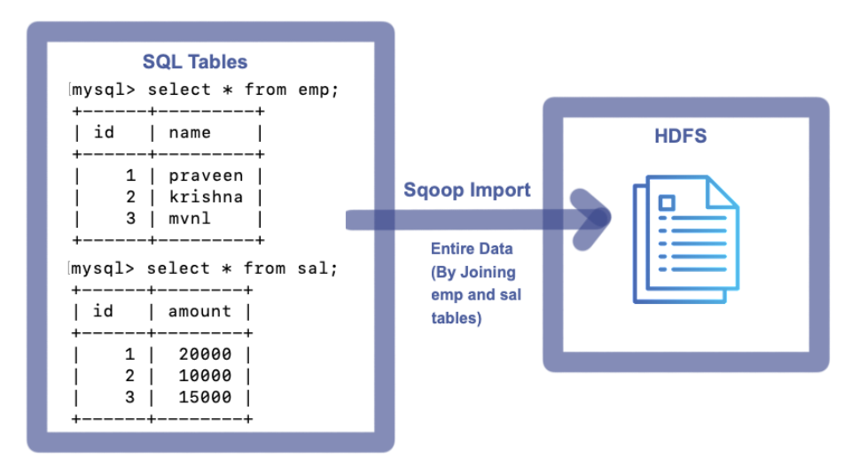
<br>

To import entire table data to HDFS, execute the following Command

```sh
sqoop import --connect jdbc:mysql://localhost:3306/mvp --username root --password cloudera --m 1 --delete-target-dir --target-dir /user/cloudera/mvp/queryfullimpusingjoins --query "select e.*,s.amount from emp e join sal s on e.id= s.id where \$CONDITIONS"
```

**_Console:_**

```sh
Warning: /usr/lib/sqoop/../accumulo does not exist! Accumulo imports will fail.
Please set $ACCUMULO_HOME to the root of your Accumulo installation.
25/03/01 02:03:27 INFO sqoop.Sqoop: Running Sqoop version: 1.4.6-cdh5.12.0
25/03/01 02:03:27 WARN tool.BaseSqoopTool: Setting your password on the command-line is insecure. Consider using -P instead.
25/03/01 02:03:28 INFO manager.MySQLManager: Preparing to use a MySQL streaming resultset.
25/03/01 02:03:28 INFO tool.CodeGenTool: Beginning code generation
25/03/01 02:03:30 INFO manager.SqlManager: Executing SQL statement: select e.*,s.amount from emp e join sal s on e.id= s.id where  (1 = 0)
25/03/01 02:03:30 INFO manager.SqlManager: Executing SQL statement: select e.*,s.amount from emp e join sal s on e.id= s.id where  (1 = 0)
25/03/01 02:03:30 INFO manager.SqlManager: Executing SQL statement: select e.*,s.amount from emp e join sal s on e.id= s.id where  (1 = 0)
25/03/01 02:03:30 INFO orm.CompilationManager: HADOOP_MAPRED_HOME is /usr/lib/hadoop-mapreduce
Note: /tmp/sqoop-cloudera/compile/8742e36c9f3e3089a4cb5055455c29e0/QueryResult.java uses or overrides a deprecated API.
Note: Recompile with -Xlint:deprecation for details.
25/03/01 02:03:40 INFO orm.CompilationManager: Writing jar file: /tmp/sqoop-cloudera/compile/8742e36c9f3e3089a4cb5055455c29e0/QueryResult.jar
25/03/01 02:03:46 INFO tool.ImportTool: Destination directory /user/cloudera/mvp/queryfullimpusingjoins deleted.
25/03/01 02:03:46 INFO mapreduce.ImportJobBase: Beginning query import.
25/03/01 02:03:46 INFO Configuration.deprecation: mapred.job.tracker is deprecated. Instead, use mapreduce.jobtracker.address
25/03/01 02:03:46 INFO Configuration.deprecation: mapred.jar is deprecated. Instead, use mapreduce.job.jar
25/03/01 02:03:46 INFO Configuration.deprecation: mapred.map.tasks is deprecated. Instead, use mapreduce.job.maps
25/03/01 02:03:47 INFO client.RMProxy: Connecting to ResourceManager at /0.0.0.0:8032
25/03/01 02:03:54 INFO db.DBInputFormat: Using read commited transaction isolation
25/03/01 02:03:55 INFO mapreduce.JobSubmitter: number of splits:1
25/03/01 02:03:55 INFO mapreduce.JobSubmitter: Submitting tokens for job: job_1740822586699_0001
25/03/01 02:03:59 INFO impl.YarnClientImpl: Submitted application application_1740822586699_0001
25/03/01 02:04:00 INFO mapreduce.Job: The url to track the job: http://quickstart.cloudera:8088/proxy/application_1740822586699_0001/
25/03/01 02:04:00 INFO mapreduce.Job: Running job: job_1740822586699_0001
25/03/01 02:04:43 INFO mapreduce.Job: Job job_1740822586699_0001 running in uber mode : false
25/03/01 02:04:43 INFO mapreduce.Job:  map 0% reduce 0%
25/03/01 02:05:17 INFO mapreduce.Job:  map 100% reduce 0%
25/03/01 02:05:18 INFO mapreduce.Job: Job job_1740822586699_0001 completed successfully
25/03/01 02:05:19 INFO mapreduce.Job: Counters: 30
	File System Counters
		FILE: Number of bytes read=0
		FILE: Number of bytes written=151348
		FILE: Number of read operations=0
		FILE: Number of large read operations=0
		FILE: Number of write operations=0
		HDFS: Number of bytes read=87
		HDFS: Number of bytes written=45
		HDFS: Number of read operations=4
		HDFS: Number of large read operations=0
		HDFS: Number of write operations=2
	Job Counters
		Launched map tasks=1
		Other local map tasks=1
		Total time spent by all maps in occupied slots (ms)=28816
		Total time spent by all reduces in occupied slots (ms)=0
		Total time spent by all map tasks (ms)=28816
		Total vcore-milliseconds taken by all map tasks=28816
		Total megabyte-milliseconds taken by all map tasks=29507584
	Map-Reduce Framework
		Map input records=3
		Map output records=3
		Input split bytes=87
		Spilled Records=0
		Failed Shuffles=0
		Merged Map outputs=0
		GC time elapsed (ms)=216
		CPU time spent (ms)=5610
		Physical memory (bytes) snapshot=185499648
		Virtual memory (bytes) snapshot=1574395904
		Total committed heap usage (bytes)=137887744
	File Input Format Counters
		Bytes Read=0
	File Output Format Counters
		Bytes Written=45
25/03/01 02:05:19 INFO mapreduce.ImportJobBase: Transferred 45 bytes in 92.2163 seconds (0.488 bytes/sec)
25/03/01 02:05:19 INFO mapreduce.ImportJobBase: Retrieved 3 records.
```

**_Imported File on HDFS:_**

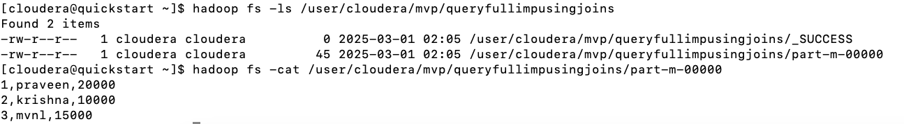
<br>

### 1.12. Sqoop Query Full Imports with specific columns using Joins

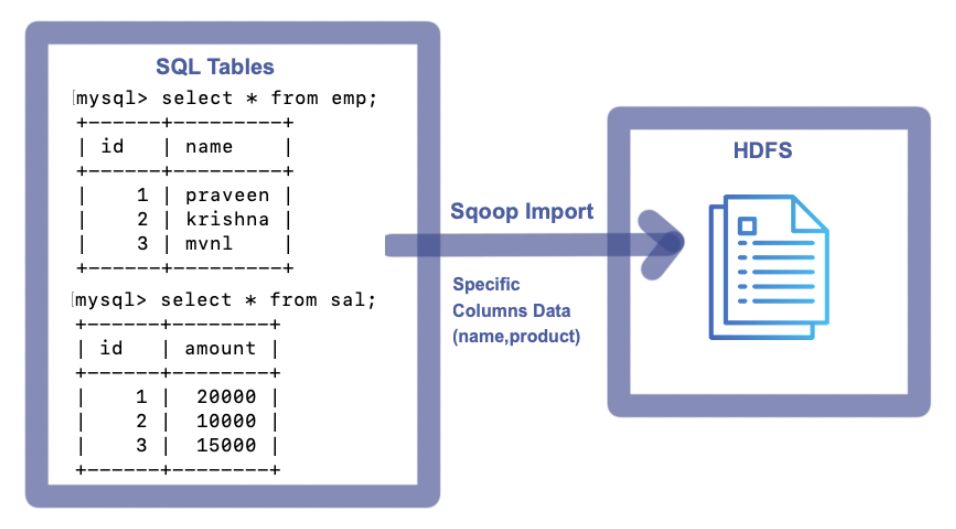
<br>

To import entire table data to HDFS, execute the following Command

```sh
sqoop import --connect jdbc:mysql://localhost:3306/mvp --username root --password cloudera --m 1 --delete-target-dir --target-dir /user/cloudera/mvp/queryfullimpusingjoinsreqcols --query "select e.name,s.amount from emp e join sal s on e.id= s.id where \$CONDITIONS"
```

**_Console:_**

```sh
Warning: /usr/lib/sqoop/../accumulo does not exist! Accumulo imports will fail.
Please set $ACCUMULO_HOME to the root of your Accumulo installation.
25/03/01 02:18:01 INFO sqoop.Sqoop: Running Sqoop version: 1.4.6-cdh5.12.0
25/03/01 02:18:01 WARN tool.BaseSqoopTool: Setting your password on the command-line is insecure. Consider using -P instead.
25/03/01 02:18:02 INFO manager.MySQLManager: Preparing to use a MySQL streaming resultset.
25/03/01 02:18:02 INFO tool.CodeGenTool: Beginning code generation
25/03/01 02:18:05 INFO manager.SqlManager: Executing SQL statement: select e.name,s.amount from emp e join sal s on e.id= s.id where  (1 = 0)
25/03/01 02:18:05 INFO manager.SqlManager: Executing SQL statement: select e.name,s.amount from emp e join sal s on e.id= s.id where  (1 = 0)
25/03/01 02:18:05 INFO manager.SqlManager: Executing SQL statement: select e.name,s.amount from emp e join sal s on e.id= s.id where  (1 = 0)
25/03/01 02:18:05 INFO orm.CompilationManager: HADOOP_MAPRED_HOME is /usr/lib/hadoop-mapreduce
Note: /tmp/sqoop-cloudera/compile/8adff5d7cdfbdc8b280fa50d02b105c5/QueryResult.java uses or overrides a deprecated API.
Note: Recompile with -Xlint:deprecation for details.
25/03/01 02:18:14 INFO orm.CompilationManager: Writing jar file: /tmp/sqoop-cloudera/compile/8adff5d7cdfbdc8b280fa50d02b105c5/QueryResult.jar
25/03/01 02:18:19 INFO tool.ImportTool: Destination directory /user/cloudera/mvp/queryfullimpusingjoinsreqcols deleted.
25/03/01 02:18:19 INFO mapreduce.ImportJobBase: Beginning query import.
25/03/01 02:18:19 INFO Configuration.deprecation: mapred.job.tracker is deprecated. Instead, use mapreduce.jobtracker.address
25/03/01 02:18:20 INFO Configuration.deprecation: mapred.jar is deprecated. Instead, use mapreduce.job.jar
25/03/01 02:18:20 INFO Configuration.deprecation: mapred.map.tasks is deprecated. Instead, use mapreduce.job.maps
25/03/01 02:18:20 INFO client.RMProxy: Connecting to ResourceManager at /0.0.0.0:8032
25/03/01 02:18:27 INFO db.DBInputFormat: Using read commited transaction isolation
25/03/01 02:18:27 INFO mapreduce.JobSubmitter: number of splits:1
25/03/01 02:18:28 INFO mapreduce.JobSubmitter: Submitting tokens for job: job_1740822586699_0002
25/03/01 02:18:31 INFO impl.YarnClientImpl: Submitted application application_1740822586699_0002
25/03/01 02:18:31 INFO mapreduce.Job: The url to track the job: http://quickstart.cloudera:8088/proxy/application_1740822586699_0002/
25/03/01 02:18:31 INFO mapreduce.Job: Running job: job_1740822586699_0002
25/03/01 02:19:07 INFO mapreduce.Job: Job job_1740822586699_0002 running in uber mode : false
25/03/01 02:19:07 INFO mapreduce.Job:  map 0% reduce 0%
25/03/01 02:19:36 INFO mapreduce.Job:  map 100% reduce 0%
25/03/01 02:19:38 INFO mapreduce.Job: Job job_1740822586699_0002 completed successfully
25/03/01 02:19:39 INFO mapreduce.Job: Counters: 30
	File System Counters
		FILE: Number of bytes read=0
		FILE: Number of bytes written=151368
		FILE: Number of read operations=0
		FILE: Number of large read operations=0
		FILE: Number of write operations=0
		HDFS: Number of bytes read=87
		HDFS: Number of bytes written=39
		HDFS: Number of read operations=4
		HDFS: Number of large read operations=0
		HDFS: Number of write operations=2
	Job Counters
		Launched map tasks=1
		Other local map tasks=1
		Total time spent by all maps in occupied slots (ms)=26180
		Total time spent by all reduces in occupied slots (ms)=0
		Total time spent by all map tasks (ms)=26180
		Total vcore-milliseconds taken by all map tasks=26180
		Total megabyte-milliseconds taken by all map tasks=26808320
	Map-Reduce Framework
		Map input records=3
		Map output records=3
		Input split bytes=87
		Spilled Records=0
		Failed Shuffles=0
		Merged Map outputs=0
		GC time elapsed (ms)=379
		CPU time spent (ms)=6120
		Physical memory (bytes) snapshot=180019200
		Virtual memory (bytes) snapshot=1559019520
		Total committed heap usage (bytes)=137887744
	File Input Format Counters
		Bytes Read=0
	File Output Format Counters
		Bytes Written=39
25/03/01 02:19:39 INFO mapreduce.ImportJobBase: Transferred 39 bytes in 79.4511 seconds (0.4909 bytes/sec)
25/03/01 02:19:39 INFO mapreduce.ImportJobBase: Retrieved 3 records.
```

**_Imported File on HDFS:_**


<br>

### 1.13.	Sqoop Query Portion Imports using Joins

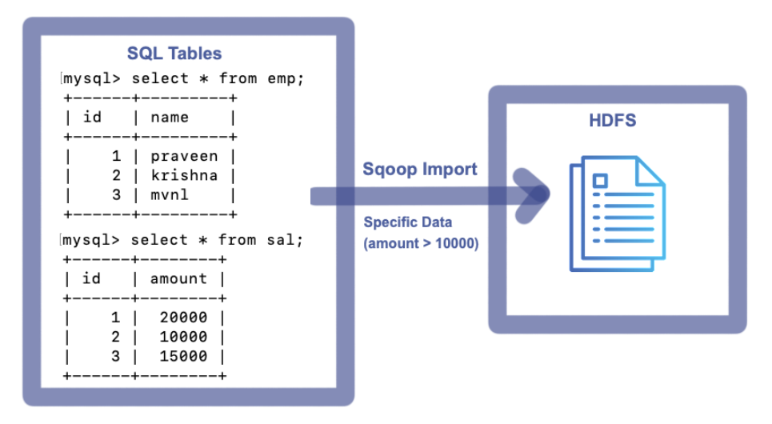
<br>

To import entire table data to HDFS, execute the following Command

```sh
sqoop import --connect jdbc:mysql://localhost:3306/mvp --username root --password cloudera --m 1 --delete-target-dir --target-dir /user/cloudera/mvp/queryportionimpusingjoins --query "select e.*,s.amount from emp e join sal s on e.id= s.id where s.amount>10000 and \$CONDITIONS"
```

**_Console:_**

```sh
Warning: /usr/lib/sqoop/../accumulo does not exist! Accumulo imports will fail.
Please set $ACCUMULO_HOME to the root of your Accumulo installation.
25/03/01 02:29:32 INFO sqoop.Sqoop: Running Sqoop version: 1.4.6-cdh5.12.0
25/03/01 02:29:32 WARN tool.BaseSqoopTool: Setting your password on the command-line is insecure. Consider using -P instead.
25/03/01 02:29:33 INFO manager.MySQLManager: Preparing to use a MySQL streaming resultset.
25/03/01 02:29:33 INFO tool.CodeGenTool: Beginning code generation
25/03/01 02:29:35 INFO manager.SqlManager: Executing SQL statement: select e.*,s.amount from emp e join sal s on e.id= s.id where s.amount>10000 and  (1 = 0)
25/03/01 02:29:35 INFO manager.SqlManager: Executing SQL statement: select e.*,s.amount from emp e join sal s on e.id= s.id where s.amount>10000 and  (1 = 0)
25/03/01 02:29:36 INFO manager.SqlManager: Executing SQL statement: select e.*,s.amount from emp e join sal s on e.id= s.id where s.amount>10000 and  (1 = 0)
25/03/01 02:29:36 INFO orm.CompilationManager: HADOOP_MAPRED_HOME is /usr/lib/hadoop-mapreduce
Note: /tmp/sqoop-cloudera/compile/5879e6889fd1145e5efa733261968494/QueryResult.java uses or overrides a deprecated API.
Note: Recompile with -Xlint:deprecation for details.
25/03/01 02:29:45 INFO orm.CompilationManager: Writing jar file: /tmp/sqoop-cloudera/compile/5879e6889fd1145e5efa733261968494/QueryResult.jar
25/03/01 02:29:51 INFO tool.ImportTool: Destination directory /user/cloudera/mvp/queryportionimpusingjoins deleted.
25/03/01 02:29:51 INFO mapreduce.ImportJobBase: Beginning query import.
25/03/01 02:29:51 INFO Configuration.deprecation: mapred.job.tracker is deprecated. Instead, use mapreduce.jobtracker.address
25/03/01 02:29:51 INFO Configuration.deprecation: mapred.jar is deprecated. Instead, use mapreduce.job.jar
25/03/01 02:29:51 INFO Configuration.deprecation: mapred.map.tasks is deprecated. Instead, use mapreduce.job.maps
25/03/01 02:29:51 INFO client.RMProxy: Connecting to ResourceManager at /0.0.0.0:8032
25/03/01 02:29:58 INFO db.DBInputFormat: Using read commited transaction isolation
25/03/01 02:29:59 INFO mapreduce.JobSubmitter: number of splits:1
25/03/01 02:29:59 INFO mapreduce.JobSubmitter: Submitting tokens for job: job_1740822586699_0003
25/03/01 02:30:02 INFO impl.YarnClientImpl: Submitted application application_1740822586699_0003
25/03/01 02:30:02 INFO mapreduce.Job: The url to track the job: http://quickstart.cloudera:8088/proxy/application_1740822586699_0003/
25/03/01 02:30:02 INFO mapreduce.Job: Running job: job_1740822586699_0003
25/03/01 02:30:38 INFO mapreduce.Job: Job job_1740822586699_0003 running in uber mode : false
25/03/01 02:30:38 INFO mapreduce.Job:  map 0% reduce 0%
25/03/01 02:31:09 INFO mapreduce.Job:  map 100% reduce 0%
25/03/01 02:31:10 INFO mapreduce.Job: Job job_1740822586699_0003 completed successfully
25/03/01 02:31:11 INFO mapreduce.Job: Counters: 30
	File System Counters
		FILE: Number of bytes read=0
		FILE: Number of bytes written=151398
		FILE: Number of read operations=0
		FILE: Number of large read operations=0
		FILE: Number of write operations=0
		HDFS: Number of bytes read=87
		HDFS: Number of bytes written=29
		HDFS: Number of read operations=4
		HDFS: Number of large read operations=0
		HDFS: Number of write operations=2
	Job Counters
		Launched map tasks=1
		Other local map tasks=1
		Total time spent by all maps in occupied slots (ms)=27206
		Total time spent by all reduces in occupied slots (ms)=0
		Total time spent by all map tasks (ms)=27206
		Total vcore-milliseconds taken by all map tasks=27206
		Total megabyte-milliseconds taken by all map tasks=27858944
	Map-Reduce Framework
		Map input records=2
		Map output records=2
		Input split bytes=87
		Spilled Records=0
		Failed Shuffles=0
		Merged Map outputs=0
		GC time elapsed (ms)=364
		CPU time spent (ms)=6410
		Physical memory (bytes) snapshot=181723136
		Virtual memory (bytes) snapshot=1566208000
		Total committed heap usage (bytes)=137887744
	File Input Format Counters
		Bytes Read=0
	File Output Format Counters
		Bytes Written=29
25/03/01 02:31:11 INFO mapreduce.ImportJobBase: Transferred 29 bytes in 79.7353 seconds (0.3637 bytes/sec)
25/03/01 02:31:11 INFO mapreduce.ImportJobBase: Retrieved 2 records.
```

**_Imported File on HDFS:_**

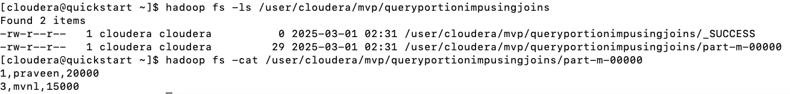
<br>

### 1.14.	Sqoop Query Portion Imports with specific columns using Joins

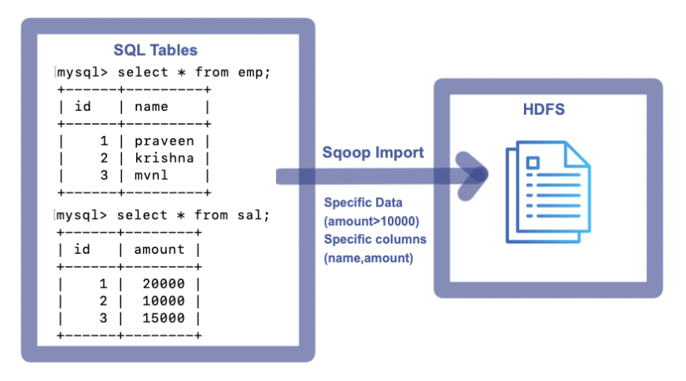
<br>

To import entire table data to HDFS, execute the following Command

```sh
sqoop import --connect jdbc:mysql://localhost:3306/mvp --username root --password cloudera --m 1 --delete-target-dir --target-dir /user/cloudera/mvp/queryportionimpusingjoinsreqcols --query "select e.name,s.amount from emp e join sal s on e.id= s.id where s.amount>10000 and \$CONDITIONS"
```

**_Console:_**

```sh
Warning: /usr/lib/sqoop/../accumulo does not exist! Accumulo imports will fail.
Please set $ACCUMULO_HOME to the root of your Accumulo installation.
25/03/01 04:45:07 INFO sqoop.Sqoop: Running Sqoop version: 1.4.6-cdh5.12.0
25/03/01 04:45:07 WARN tool.BaseSqoopTool: Setting your password on the command-line is insecure. Consider using -P instead.
25/03/01 04:45:08 INFO manager.MySQLManager: Preparing to use a MySQL streaming resultset.
25/03/01 04:45:08 INFO tool.CodeGenTool: Beginning code generation
25/03/01 04:45:11 INFO manager.SqlManager: Executing SQL statement: select e.name,s.amount from emp e join sal s on e.id= s.id where s.amount>10000 and  (1 = 0)
25/03/01 04:45:11 INFO manager.SqlManager: Executing SQL statement: select e.name,s.amount from emp e join sal s on e.id= s.id where s.amount>10000 and  (1 = 0)
25/03/01 04:45:11 INFO manager.SqlManager: Executing SQL statement: select e.name,s.amount from emp e join sal s on e.id= s.id where s.amount>10000 and  (1 = 0)
25/03/01 04:45:11 INFO orm.CompilationManager: HADOOP_MAPRED_HOME is /usr/lib/hadoop-mapreduce
Note: /tmp/sqoop-cloudera/compile/5e65ba6b717c4a7d938de298034ebc51/QueryResult.java uses or overrides a deprecated API.
Note: Recompile with -Xlint:deprecation for details.
25/03/01 04:45:25 INFO orm.CompilationManager: Writing jar file: /tmp/sqoop-cloudera/compile/5e65ba6b717c4a7d938de298034ebc51/QueryResult.jar
25/03/01 04:45:36 INFO tool.ImportTool: Destination directory /user/cloudera/mvp/queryportionimpusingjoinsreqcols deleted.
25/03/01 04:45:36 INFO mapreduce.ImportJobBase: Beginning query import.
25/03/01 04:45:36 INFO Configuration.deprecation: mapred.job.tracker is deprecated. Instead, use mapreduce.jobtracker.address
25/03/01 04:45:36 INFO Configuration.deprecation: mapred.jar is deprecated. Instead, use mapreduce.job.jar
25/03/01 04:45:36 INFO Configuration.deprecation: mapred.map.tasks is deprecated. Instead, use mapreduce.job.maps
25/03/01 04:45:36 INFO client.RMProxy: Connecting to ResourceManager at /0.0.0.0:8032
25/03/01 04:45:45 INFO db.DBInputFormat: Using read commited transaction isolation
25/03/01 04:45:45 INFO mapreduce.JobSubmitter: number of splits:1
25/03/01 04:45:46 INFO mapreduce.JobSubmitter: Submitting tokens for job: job_1740822586699_0004
25/03/01 04:45:48 INFO impl.YarnClientImpl: Submitted application application_1740822586699_0004
25/03/01 04:45:48 INFO mapreduce.Job: The url to track the job: http://quickstart.cloudera:8088/proxy/application_1740822586699_0004/
25/03/01 04:45:48 INFO mapreduce.Job: Running job: job_1740822586699_0004
25/03/01 04:46:27 INFO mapreduce.Job: Job job_1740822586699_0004 running in uber mode : false
25/03/01 04:46:27 INFO mapreduce.Job:  map 0% reduce 0%
25/03/01 04:46:54 INFO mapreduce.Job:  map 100% reduce 0%
25/03/01 04:46:55 INFO mapreduce.Job: Job job_1740822586699_0004 completed successfully
25/03/01 04:46:56 INFO mapreduce.Job: Counters: 30
	File System Counters
		FILE: Number of bytes read=0
		FILE: Number of bytes written=151418
		FILE: Number of read operations=0
		FILE: Number of large read operations=0
		FILE: Number of write operations=0
		HDFS: Number of bytes read=87
		HDFS: Number of bytes written=25
		HDFS: Number of read operations=4
		HDFS: Number of large read operations=0
		HDFS: Number of write operations=2
	Job Counters
		Launched map tasks=1
		Other local map tasks=1
		Total time spent by all maps in occupied slots (ms)=24941
		Total time spent by all reduces in occupied slots (ms)=0
		Total time spent by all map tasks (ms)=24941
		Total vcore-milliseconds taken by all map tasks=24941
		Total megabyte-milliseconds taken by all map tasks=25539584
	Map-Reduce Framework
		Map input records=2
		Map output records=2
		Input split bytes=87
		Spilled Records=0
		Failed Shuffles=0
		Merged Map outputs=0
		GC time elapsed (ms)=231
		CPU time spent (ms)=6200
		Physical memory (bytes) snapshot=196034560
		Virtual memory (bytes) snapshot=1570164736
		Total committed heap usage (bytes)=137887744
	File Input Format Counters
		Bytes Read=0
	File Output Format Counters
		Bytes Written=25
25/03/01 04:46:56 INFO mapreduce.ImportJobBase: Transferred 25 bytes in 79.8126 seconds (0.3132 bytes/sec)
25/03/01 04:46:56 INFO mapreduce.ImportJobBase: Retrieved 2 records.
```

**_Imported File on HDFS:_**

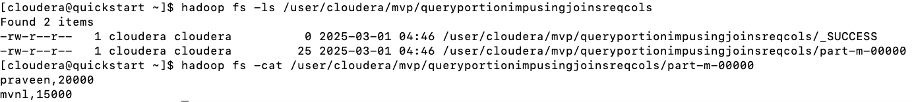
<br>
