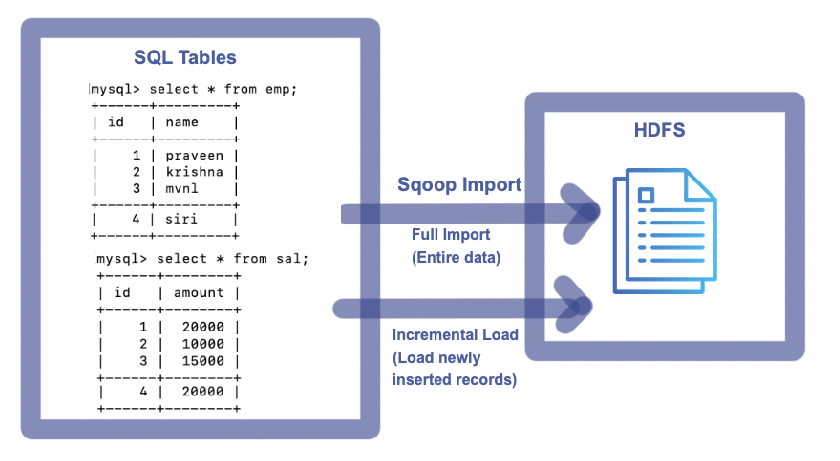
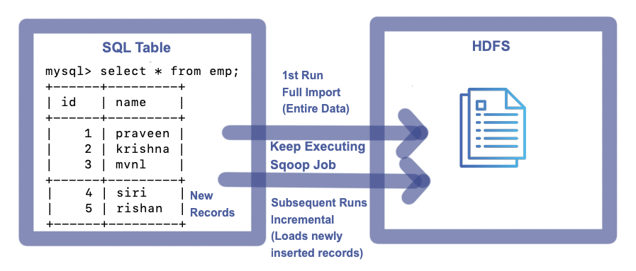
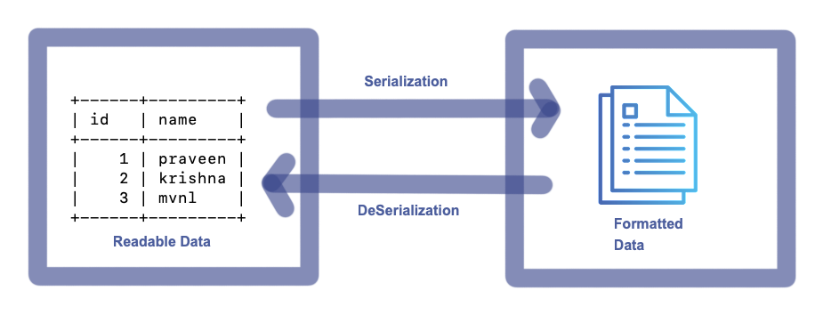

# Sqoop Import & Export Commands

Using Sqoop
- Direct Imports are possible
- Portion Imports are possible
- Incremental Imports are possible
- Modified Imports are possible
- Serialized Imports are possible
- Exports are possible


<br>

> Import --> Data from RDBMS to HDFS

> Export --> Data from HDFS to RDBMS


## 1. Sqoop Import Command

Following basic details are required
- Hostname
- PortNumber
- Database
- Username
- Password
- Table
- Target

**_Sqoop Import Template:_**

```sh
sqoop import --connect jdbc:mysql://<Hostname>:<PortNumber>/<Database> --username <Username> --password <Password> --table <TableName> --target-dir <TargetDirectory>
```

### 1.1. Sqoop Full Import

Import entire data from SQL table to HDFS.

#### 1.1.1. Sqoop Full Import from a single table


<br>

To import entire table data to HDFS, execute the following Command

```sh
sqoop import --connect jdbc:mysql://localhost:3306/mvp --username root --password cloudera --m 1 --table emp --delete-target-dir --target-dir /user/cloudera/mvp/tablefullimp
```

**_Console:_**

```sh
Warning: /usr/lib/sqoop/../accumulo does not exist! Accumulo imports will fail.
Please set $ACCUMULO_HOME to the root of your Accumulo installation.
25/02/28 19:36:03 INFO sqoop.Sqoop: Running Sqoop version: 1.4.6-cdh5.12.0
25/02/28 19:36:03 WARN tool.BaseSqoopTool: Setting your password on the command-line is insecure. Consider using -P instead.
25/02/28 19:36:04 INFO manager.MySQLManager: Preparing to use a MySQL streaming resultset.
25/02/28 19:36:04 INFO tool.CodeGenTool: Beginning code generation
25/02/28 19:36:06 INFO manager.SqlManager: Executing SQL statement: SELECT t.* FROM `emp` AS t LIMIT 1
25/02/28 19:36:06 INFO manager.SqlManager: Executing SQL statement: SELECT t.* FROM `emp` AS t LIMIT 1
25/02/28 19:36:06 INFO orm.CompilationManager: HADOOP_MAPRED_HOME is /usr/lib/hadoop-mapreduce
Note: /tmp/sqoop-cloudera/compile/246a4c39472ecd2a52f1874420880399/emp.java uses or overrides a deprecated API.
Note: Recompile with -Xlint:deprecation for details.
25/02/28 19:36:15 INFO orm.CompilationManager: Writing jar file: /tmp/sqoop-cloudera/compile/246a4c39472ecd2a52f1874420880399/emp.jar
25/02/28 19:36:21 INFO tool.ImportTool: Destination directory /user/cloudera/mvp/tablefullimp deleted.
25/02/28 19:36:21 WARN manager.MySQLManager: It looks like you are importing from mysql.
25/02/28 19:36:21 WARN manager.MySQLManager: This transfer can be faster! Use the --direct
25/02/28 19:36:21 WARN manager.MySQLManager: option to exercise a MySQL-specific fast path.
25/02/28 19:36:21 INFO manager.MySQLManager: Setting zero DATETIME behavior to convertToNull (mysql)
25/02/28 19:36:21 INFO mapreduce.ImportJobBase: Beginning import of emp
25/02/28 19:36:21 INFO Configuration.deprecation: mapred.job.tracker is deprecated. Instead, use mapreduce.jobtracker.address
25/02/28 19:36:21 INFO Configuration.deprecation: mapred.jar is deprecated. Instead, use mapreduce.job.jar
25/02/28 19:36:22 INFO Configuration.deprecation: mapred.map.tasks is deprecated. Instead, use mapreduce.job.maps
25/02/28 19:36:22 INFO client.RMProxy: Connecting to ResourceManager at /0.0.0.0:8032
25/02/28 19:36:36 INFO db.DBInputFormat: Using read commited transaction isolation
25/02/28 19:36:36 INFO mapreduce.JobSubmitter: number of splits:1
25/02/28 19:36:37 INFO mapreduce.JobSubmitter: Submitting tokens for job: job_1740798011012_0001
25/02/28 19:36:41 INFO impl.YarnClientImpl: Submitted application application_1740798011012_0001
25/02/28 19:36:41 INFO mapreduce.Job: The url to track the job: http://quickstart.cloudera:8088/proxy/application_1740798011012_0001/
25/02/28 19:36:41 INFO mapreduce.Job: Running job: job_1740798011012_0001
25/02/28 19:37:29 INFO mapreduce.Job: Job job_1740798011012_0001 running in uber mode : false
25/02/28 19:37:29 INFO mapreduce.Job:  map 0% reduce 0%
25/02/28 19:37:59 INFO mapreduce.Job:  map 100% reduce 0%
25/02/28 19:38:00 INFO mapreduce.Job: Job job_1740798011012_0001 completed successfully
25/02/28 19:38:01 INFO mapreduce.Job: Counters: 30
	File System Counters
		FILE: Number of bytes read=0
		FILE: Number of bytes written=151398
		FILE: Number of read operations=0
		FILE: Number of large read operations=0
		FILE: Number of write operations=0
		HDFS: Number of bytes read=87
		HDFS: Number of bytes written=27
		HDFS: Number of read operations=4
		HDFS: Number of large read operations=0
		HDFS: Number of write operations=2
	Job Counters
		Launched map tasks=1
		Other local map tasks=1
		Total time spent by all maps in occupied slots (ms)=25414
		Total time spent by all reduces in occupied slots (ms)=0
		Total time spent by all map tasks (ms)=25414
		Total vcore-milliseconds taken by all map tasks=25414
		Total megabyte-milliseconds taken by all map tasks=26023936
	Map-Reduce Framework
		Map input records=3
		Map output records=3
		Input split bytes=87
		Spilled Records=0
		Failed Shuffles=0
		Merged Map outputs=0
		GC time elapsed (ms)=224
		CPU time spent (ms)=6400
		Physical memory (bytes) snapshot=192737280
		Virtual memory (bytes) snapshot=1583419392
		Total committed heap usage (bytes)=137887744
	File Input Format Counters
		Bytes Read=0
	File Output Format Counters
		Bytes Written=27
25/02/28 19:38:01 INFO mapreduce.ImportJobBase: Transferred 27 bytes in 99.5933 seconds (0.2711 bytes/sec)
25/02/28 19:38:01 INFO mapreduce.ImportJobBase: Retrieved 3 records.
```

**_Imported File on HDFS:_**


<br>

#### 1.1.2. Sqoop Full Import from single table with specific columns


<br>

To import specific columns data from a table to HDFS, execute the following Command

```sh
sqoop import --connect jdbc:mysql://localhost:3306/mvp --username root --password cloudera --m 1 --table emp --delete-target-dir --target-dir /user/cloudera/mvp/tablefullimpreqcols --columns "name"
```

**_Console:_**

```sh
Warning: /usr/lib/sqoop/../accumulo does not exist! Accumulo imports will fail.
Please set $ACCUMULO_HOME to the root of your Accumulo installation.
25/02/28 19:55:58 INFO sqoop.Sqoop: Running Sqoop version: 1.4.6-cdh5.12.0
25/02/28 19:55:58 WARN tool.BaseSqoopTool: Setting your password on the command-line is insecure. Consider using -P instead.
25/02/28 19:55:59 INFO manager.MySQLManager: Preparing to use a MySQL streaming resultset.
25/02/28 19:55:59 INFO tool.CodeGenTool: Beginning code generation
25/02/28 19:56:01 INFO manager.SqlManager: Executing SQL statement: SELECT t.* FROM `emp` AS t LIMIT 1
25/02/28 19:56:01 INFO manager.SqlManager: Executing SQL statement: SELECT t.* FROM `emp` AS t LIMIT 1
25/02/28 19:56:01 INFO orm.CompilationManager: HADOOP_MAPRED_HOME is /usr/lib/hadoop-mapreduce
Note: /tmp/sqoop-cloudera/compile/ea27d9644e6043629fb8b8f0e1df5f98/emp.java uses or overrides a deprecated API.
Note: Recompile with -Xlint:deprecation for details.
25/02/28 19:56:10 INFO orm.CompilationManager: Writing jar file: /tmp/sqoop-cloudera/compile/ea27d9644e6043629fb8b8f0e1df5f98/emp.jar
25/02/28 19:56:16 INFO tool.ImportTool: Destination directory /user/cloudera/mvp/tablefullimpreqcols deleted.
25/02/28 19:56:16 WARN manager.MySQLManager: It looks like you are importing from mysql.
25/02/28 19:56:16 WARN manager.MySQLManager: This transfer can be faster! Use the --direct
25/02/28 19:56:16 WARN manager.MySQLManager: option to exercise a MySQL-specific fast path.
25/02/28 19:56:16 INFO manager.MySQLManager: Setting zero DATETIME behavior to convertToNull (mysql)
25/02/28 19:56:16 INFO mapreduce.ImportJobBase: Beginning import of emp
25/02/28 19:56:16 INFO Configuration.deprecation: mapred.job.tracker is deprecated. Instead, use mapreduce.jobtracker.address
25/02/28 19:56:16 INFO Configuration.deprecation: mapred.jar is deprecated. Instead, use mapreduce.job.jar
25/02/28 19:56:16 INFO Configuration.deprecation: mapred.map.tasks is deprecated. Instead, use mapreduce.job.maps
25/02/28 19:56:16 INFO client.RMProxy: Connecting to ResourceManager at /0.0.0.0:8032
25/02/28 19:56:23 INFO db.DBInputFormat: Using read commited transaction isolation
25/02/28 19:56:23 INFO mapreduce.JobSubmitter: number of splits:1
25/02/28 19:56:24 INFO mapreduce.JobSubmitter: Submitting tokens for job: job_1740798011012_0002
25/02/28 19:56:26 INFO impl.YarnClientImpl: Submitted application application_1740798011012_0002
25/02/28 19:56:27 INFO mapreduce.Job: The url to track the job: http://quickstart.cloudera:8088/proxy/application_1740798011012_0002/
25/02/28 19:56:27 INFO mapreduce.Job: Running job: job_1740798011012_0002
25/02/28 19:57:00 INFO mapreduce.Job: Job job_1740798011012_0002 running in uber mode : false
25/02/28 19:57:00 INFO mapreduce.Job:  map 0% reduce 0%
25/02/28 19:57:33 INFO mapreduce.Job:  map 100% reduce 0%
25/02/28 19:57:34 INFO mapreduce.Job: Job job_1740798011012_0002 completed successfully
25/02/28 19:57:34 INFO mapreduce.Job: Counters: 30
	File System Counters
		FILE: Number of bytes read=0
		FILE: Number of bytes written=151541
		FILE: Number of read operations=0
		FILE: Number of large read operations=0
		FILE: Number of write operations=0
		HDFS: Number of bytes read=87
		HDFS: Number of bytes written=21
		HDFS: Number of read operations=4
		HDFS: Number of large read operations=0
		HDFS: Number of write operations=2
	Job Counters
		Launched map tasks=1
		Other local map tasks=1
		Total time spent by all maps in occupied slots (ms)=30135
		Total time spent by all reduces in occupied slots (ms)=0
		Total time spent by all map tasks (ms)=30135
		Total vcore-milliseconds taken by all map tasks=30135
		Total megabyte-milliseconds taken by all map tasks=30858240
	Map-Reduce Framework
		Map input records=3
		Map output records=3
		Input split bytes=87
		Spilled Records=0
		Failed Shuffles=0
		Merged Map outputs=0
		GC time elapsed (ms)=446
		CPU time spent (ms)=6510
		Physical memory (bytes) snapshot=185925632
		Virtual memory (bytes) snapshot=1558097920
		Total committed heap usage (bytes)=137887744
	File Input Format Counters
		Bytes Read=0
	File Output Format Counters
		Bytes Written=21
25/02/28 19:57:34 INFO mapreduce.ImportJobBase: Transferred 21 bytes in 78.2253 seconds (0.2685 bytes/sec)
25/02/28 19:57:34 INFO mapreduce.ImportJobBase: Retrieved 3 records.
```

**_Imported File on HDFS:_**


<br>

#### 1.1.3. Sqoop Full import using Query clause


<br>

To import entire table data to HDFS, execute the following Command

```sh
sqoop import --connect jdbc:mysql://localhost:3306/mvp --username root --password cloudera --m 1 --delete-target-dir --target-dir /user/cloudera/mvp/queryfullimp --query "select * from emp where \$CONDITIONS"
```

**_Console:_**

```sh
Warning: /usr/lib/sqoop/../accumulo does not exist! Accumulo imports will fail.
Please set $ACCUMULO_HOME to the root of your Accumulo installation.
25/02/28 23:58:19 INFO sqoop.Sqoop: Running Sqoop version: 1.4.6-cdh5.12.0
25/02/28 23:58:19 WARN tool.BaseSqoopTool: Setting your password on the command-line is insecure. Consider using -P instead.
25/02/28 23:58:20 INFO manager.MySQLManager: Preparing to use a MySQL streaming resultset.
25/02/28 23:58:20 INFO tool.CodeGenTool: Beginning code generation
25/02/28 23:58:22 INFO manager.SqlManager: Executing SQL statement: select * from emp where  (1 = 0)
25/02/28 23:58:22 INFO manager.SqlManager: Executing SQL statement: select * from emp where  (1 = 0)
25/02/28 23:58:22 INFO manager.SqlManager: Executing SQL statement: select * from emp where  (1 = 0)
25/02/28 23:58:22 INFO orm.CompilationManager: HADOOP_MAPRED_HOME is /usr/lib/hadoop-mapreduce
Note: /tmp/sqoop-cloudera/compile/7111c12015b6f5a76e835b4008f292ac/QueryResult.java uses or overrides a deprecated API.
Note: Recompile with -Xlint:deprecation for details.
25/02/28 23:58:31 INFO orm.CompilationManager: Writing jar file: /tmp/sqoop-cloudera/compile/7111c12015b6f5a76e835b4008f292ac/QueryResult.jar
25/02/28 23:58:37 INFO tool.ImportTool: Destination directory /user/cloudera/mvp/queryfullimp deleted.
25/02/28 23:58:37 INFO mapreduce.ImportJobBase: Beginning query import.
25/02/28 23:58:37 INFO Configuration.deprecation: mapred.job.tracker is deprecated. Instead, use mapreduce.jobtracker.address
25/02/28 23:58:37 INFO Configuration.deprecation: mapred.jar is deprecated. Instead, use mapreduce.job.jar
25/02/28 23:58:37 INFO Configuration.deprecation: mapred.map.tasks is deprecated. Instead, use mapreduce.job.maps
25/02/28 23:58:38 INFO client.RMProxy: Connecting to ResourceManager at /0.0.0.0:8032
25/02/28 23:58:45 INFO db.DBInputFormat: Using read commited transaction isolation
25/02/28 23:58:45 INFO mapreduce.JobSubmitter: number of splits:1
25/02/28 23:58:46 INFO mapreduce.JobSubmitter: Submitting tokens for job: job_1740805975825_0004
25/02/28 23:58:48 INFO impl.YarnClientImpl: Submitted application application_1740805975825_0004
25/02/28 23:58:48 INFO mapreduce.Job: The url to track the job: http://quickstart.cloudera:8088/proxy/application_1740805975825_0004/
25/02/28 23:58:48 INFO mapreduce.Job: Running job: job_1740805975825_0004
25/02/28 23:59:18 INFO mapreduce.Job: Job job_1740805975825_0004 running in uber mode : false
25/02/28 23:59:18 INFO mapreduce.Job:  map 0% reduce 0%
25/02/28 23:59:44 INFO mapreduce.Job:  map 100% reduce 0%
25/02/28 23:59:45 INFO mapreduce.Job: Job job_1740805975825_0004 completed successfully
25/02/28 23:59:46 INFO mapreduce.Job: Counters: 30
	File System Counters
		FILE: Number of bytes read=0
		FILE: Number of bytes written=151252
		FILE: Number of read operations=0
		FILE: Number of large read operations=0
		FILE: Number of write operations=0
		HDFS: Number of bytes read=87
		HDFS: Number of bytes written=27
		HDFS: Number of read operations=4
		HDFS: Number of large read operations=0
		HDFS: Number of write operations=2
	Job Counters
		Launched map tasks=1
		Other local map tasks=1
		Total time spent by all maps in occupied slots (ms)=22894
		Total time spent by all reduces in occupied slots (ms)=0
		Total time spent by all map tasks (ms)=22894
		Total vcore-milliseconds taken by all map tasks=22894
		Total megabyte-milliseconds taken by all map tasks=23443456
	Map-Reduce Framework
		Map input records=3
		Map output records=3
		Input split bytes=87
		Spilled Records=0
		Failed Shuffles=0
		Merged Map outputs=0
		GC time elapsed (ms)=443
		CPU time spent (ms)=6200
		Physical memory (bytes) snapshot=193097728
		Virtual memory (bytes) snapshot=1573556224
		Total committed heap usage (bytes)=141557760
	File Input Format Counters
		Bytes Read=0
	File Output Format Counters
		Bytes Written=27
25/02/28 23:59:46 INFO mapreduce.ImportJobBase: Transferred 27 bytes in 68.6509 seconds (0.3933 bytes/sec)
25/02/28 23:59:46 INFO mapreduce.ImportJobBase: Retrieved 3 records.
```

**_Imported File on HDFS:_**


<br>

#### 1.1.4. Sqoop Full import using Query clause with specific columns


<br>

To import specific columns data from a table to HDFS, execute the following Command

```sh
sqoop import --connect jdbc:mysql://localhost:3306/mvp --username root --password cloudera --m 1 --delete-target-dir --target-dir /user/cloudera/mvp/queryfullimpreqcols --query "select name from emp where \$CONDITIONS"
```

**_Console:_**

```sh
Warning: /usr/lib/sqoop/../accumulo does not exist! Accumulo imports will fail.
Please set $ACCUMULO_HOME to the root of your Accumulo installation.
25/03/01 00:07:45 INFO sqoop.Sqoop: Running Sqoop version: 1.4.6-cdh5.12.0
25/03/01 00:07:45 WARN tool.BaseSqoopTool: Setting your password on the command-line is insecure. Consider using -P instead.
25/03/01 00:07:46 INFO manager.MySQLManager: Preparing to use a MySQL streaming resultset.
25/03/01 00:07:46 INFO tool.CodeGenTool: Beginning code generation
25/03/01 00:07:48 INFO manager.SqlManager: Executing SQL statement: select name from emp where  (1 = 0)
25/03/01 00:07:48 INFO manager.SqlManager: Executing SQL statement: select name from emp where  (1 = 0)
25/03/01 00:07:48 INFO manager.SqlManager: Executing SQL statement: select name from emp where  (1 = 0)
25/03/01 00:07:48 INFO orm.CompilationManager: HADOOP_MAPRED_HOME is /usr/lib/hadoop-mapreduce
Note: /tmp/sqoop-cloudera/compile/59808ce725730d9d0dff89cd31cd83e1/QueryResult.java uses or overrides a deprecated API.
Note: Recompile with -Xlint:deprecation for details.
25/03/01 00:07:56 INFO orm.CompilationManager: Writing jar file: /tmp/sqoop-cloudera/compile/59808ce725730d9d0dff89cd31cd83e1/QueryResult.jar
25/03/01 00:08:03 INFO tool.ImportTool: Destination directory /user/cloudera/mvp/queryfullimpreqcols deleted.
25/03/01 00:08:03 INFO mapreduce.ImportJobBase: Beginning query import.
25/03/01 00:08:03 INFO Configuration.deprecation: mapred.job.tracker is deprecated. Instead, use mapreduce.jobtracker.address
25/03/01 00:08:03 INFO Configuration.deprecation: mapred.jar is deprecated. Instead, use mapreduce.job.jar
25/03/01 00:08:03 INFO Configuration.deprecation: mapred.map.tasks is deprecated. Instead, use mapreduce.job.maps
25/03/01 00:08:03 INFO client.RMProxy: Connecting to ResourceManager at /0.0.0.0:8032
25/03/01 00:08:10 INFO db.DBInputFormat: Using read commited transaction isolation
25/03/01 00:08:10 INFO mapreduce.JobSubmitter: number of splits:1
25/03/01 00:08:11 INFO mapreduce.JobSubmitter: Submitting tokens for job: job_1740805975825_0005
25/03/01 00:08:12 INFO impl.YarnClientImpl: Submitted application application_1740805975825_0005
25/03/01 00:08:12 INFO mapreduce.Job: The url to track the job: http://quickstart.cloudera:8088/proxy/application_1740805975825_0005/
25/03/01 00:08:12 INFO mapreduce.Job: Running job: job_1740805975825_0005
25/03/01 00:08:41 INFO mapreduce.Job: Job job_1740805975825_0005 running in uber mode : false
25/03/01 00:08:41 INFO mapreduce.Job:  map 0% reduce 0%
25/03/01 00:09:10 INFO mapreduce.Job:  map 100% reduce 0%
25/03/01 00:09:11 INFO mapreduce.Job: Job job_1740805975825_0005 completed successfully
25/03/01 00:09:12 INFO mapreduce.Job: Counters: 30
	File System Counters
		FILE: Number of bytes read=0
		FILE: Number of bytes written=151272
		FILE: Number of read operations=0
		FILE: Number of large read operations=0
		FILE: Number of write operations=0
		HDFS: Number of bytes read=87
		HDFS: Number of bytes written=21
		HDFS: Number of read operations=4
		HDFS: Number of large read operations=0
		HDFS: Number of write operations=2
	Job Counters
		Launched map tasks=1
		Other local map tasks=1
		Total time spent by all maps in occupied slots (ms)=26203
		Total time spent by all reduces in occupied slots (ms)=0
		Total time spent by all map tasks (ms)=26203
		Total vcore-milliseconds taken by all map tasks=26203
		Total megabyte-milliseconds taken by all map tasks=26831872
	Map-Reduce Framework
		Map input records=3
		Map output records=3
		Input split bytes=87
		Spilled Records=0
		Failed Shuffles=0
		Merged Map outputs=0
		GC time elapsed (ms)=479
		CPU time spent (ms)=7420
		Physical memory (bytes) snapshot=191488000
		Virtual memory (bytes) snapshot=1571495936
		Total committed heap usage (bytes)=141557760
	File Input Format Counters
		Bytes Read=0
	File Output Format Counters
		Bytes Written=21
25/03/01 00:09:12 INFO mapreduce.ImportJobBase: Transferred 21 bytes in 69.0572 seconds (0.3041 bytes/sec)
25/03/01 00:09:12 INFO mapreduce.ImportJobBase: Retrieved 3 records.
```

**_Imported File on HDFS:_**


<br>

#### 1.1.5.	Sqoop Query Full Imports using Joins


<br>

To import entire join records data to HDFS, execute the following Command

```sh
sqoop import --connect jdbc:mysql://localhost:3306/mvp --username root --password cloudera --m 1 --delete-target-dir --target-dir /user/cloudera/mvp/queryfullimpusingjoins --query "select e.*,s.amount from emp e join sal s on e.id= s.id where \$CONDITIONS"
```

**_Console:_**

```sh
Warning: /usr/lib/sqoop/../accumulo does not exist! Accumulo imports will fail.
Please set $ACCUMULO_HOME to the root of your Accumulo installation.
25/03/01 02:03:27 INFO sqoop.Sqoop: Running Sqoop version: 1.4.6-cdh5.12.0
25/03/01 02:03:27 WARN tool.BaseSqoopTool: Setting your password on the command-line is insecure. Consider using -P instead.
25/03/01 02:03:28 INFO manager.MySQLManager: Preparing to use a MySQL streaming resultset.
25/03/01 02:03:28 INFO tool.CodeGenTool: Beginning code generation
25/03/01 02:03:30 INFO manager.SqlManager: Executing SQL statement: select e.*,s.amount from emp e join sal s on e.id= s.id where  (1 = 0)
25/03/01 02:03:30 INFO manager.SqlManager: Executing SQL statement: select e.*,s.amount from emp e join sal s on e.id= s.id where  (1 = 0)
25/03/01 02:03:30 INFO manager.SqlManager: Executing SQL statement: select e.*,s.amount from emp e join sal s on e.id= s.id where  (1 = 0)
25/03/01 02:03:30 INFO orm.CompilationManager: HADOOP_MAPRED_HOME is /usr/lib/hadoop-mapreduce
Note: /tmp/sqoop-cloudera/compile/8742e36c9f3e3089a4cb5055455c29e0/QueryResult.java uses or overrides a deprecated API.
Note: Recompile with -Xlint:deprecation for details.
25/03/01 02:03:40 INFO orm.CompilationManager: Writing jar file: /tmp/sqoop-cloudera/compile/8742e36c9f3e3089a4cb5055455c29e0/QueryResult.jar
25/03/01 02:03:46 INFO tool.ImportTool: Destination directory /user/cloudera/mvp/queryfullimpusingjoins deleted.
25/03/01 02:03:46 INFO mapreduce.ImportJobBase: Beginning query import.
25/03/01 02:03:46 INFO Configuration.deprecation: mapred.job.tracker is deprecated. Instead, use mapreduce.jobtracker.address
25/03/01 02:03:46 INFO Configuration.deprecation: mapred.jar is deprecated. Instead, use mapreduce.job.jar
25/03/01 02:03:46 INFO Configuration.deprecation: mapred.map.tasks is deprecated. Instead, use mapreduce.job.maps
25/03/01 02:03:47 INFO client.RMProxy: Connecting to ResourceManager at /0.0.0.0:8032
25/03/01 02:03:54 INFO db.DBInputFormat: Using read commited transaction isolation
25/03/01 02:03:55 INFO mapreduce.JobSubmitter: number of splits:1
25/03/01 02:03:55 INFO mapreduce.JobSubmitter: Submitting tokens for job: job_1740822586699_0001
25/03/01 02:03:59 INFO impl.YarnClientImpl: Submitted application application_1740822586699_0001
25/03/01 02:04:00 INFO mapreduce.Job: The url to track the job: http://quickstart.cloudera:8088/proxy/application_1740822586699_0001/
25/03/01 02:04:00 INFO mapreduce.Job: Running job: job_1740822586699_0001
25/03/01 02:04:43 INFO mapreduce.Job: Job job_1740822586699_0001 running in uber mode : false
25/03/01 02:04:43 INFO mapreduce.Job:  map 0% reduce 0%
25/03/01 02:05:17 INFO mapreduce.Job:  map 100% reduce 0%
25/03/01 02:05:18 INFO mapreduce.Job: Job job_1740822586699_0001 completed successfully
25/03/01 02:05:19 INFO mapreduce.Job: Counters: 30
	File System Counters
		FILE: Number of bytes read=0
		FILE: Number of bytes written=151348
		FILE: Number of read operations=0
		FILE: Number of large read operations=0
		FILE: Number of write operations=0
		HDFS: Number of bytes read=87
		HDFS: Number of bytes written=45
		HDFS: Number of read operations=4
		HDFS: Number of large read operations=0
		HDFS: Number of write operations=2
	Job Counters
		Launched map tasks=1
		Other local map tasks=1
		Total time spent by all maps in occupied slots (ms)=28816
		Total time spent by all reduces in occupied slots (ms)=0
		Total time spent by all map tasks (ms)=28816
		Total vcore-milliseconds taken by all map tasks=28816
		Total megabyte-milliseconds taken by all map tasks=29507584
	Map-Reduce Framework
		Map input records=3
		Map output records=3
		Input split bytes=87
		Spilled Records=0
		Failed Shuffles=0
		Merged Map outputs=0
		GC time elapsed (ms)=216
		CPU time spent (ms)=5610
		Physical memory (bytes) snapshot=185499648
		Virtual memory (bytes) snapshot=1574395904
		Total committed heap usage (bytes)=137887744
	File Input Format Counters
		Bytes Read=0
	File Output Format Counters
		Bytes Written=45
25/03/01 02:05:19 INFO mapreduce.ImportJobBase: Transferred 45 bytes in 92.2163 seconds (0.488 bytes/sec)
25/03/01 02:05:19 INFO mapreduce.ImportJobBase: Retrieved 3 records.
```

**_Imported File on HDFS:_**


<br>

#### 1.1.6. Sqoop Query Full Imports with specific columns using Joins


<br>

To import specific columns of join records to HDFS, execute the following Command

```sh
sqoop import --connect jdbc:mysql://localhost:3306/mvp --username root --password cloudera --m 1 --delete-target-dir --target-dir /user/cloudera/mvp/queryfullimpusingjoinsreqcols --query "select e.name,s.amount from emp e join sal s on e.id= s.id where \$CONDITIONS"
```

**_Console:_**

```sh
Warning: /usr/lib/sqoop/../accumulo does not exist! Accumulo imports will fail.
Please set $ACCUMULO_HOME to the root of your Accumulo installation.
25/03/01 02:18:01 INFO sqoop.Sqoop: Running Sqoop version: 1.4.6-cdh5.12.0
25/03/01 02:18:01 WARN tool.BaseSqoopTool: Setting your password on the command-line is insecure. Consider using -P instead.
25/03/01 02:18:02 INFO manager.MySQLManager: Preparing to use a MySQL streaming resultset.
25/03/01 02:18:02 INFO tool.CodeGenTool: Beginning code generation
25/03/01 02:18:05 INFO manager.SqlManager: Executing SQL statement: select e.name,s.amount from emp e join sal s on e.id= s.id where  (1 = 0)
25/03/01 02:18:05 INFO manager.SqlManager: Executing SQL statement: select e.name,s.amount from emp e join sal s on e.id= s.id where  (1 = 0)
25/03/01 02:18:05 INFO manager.SqlManager: Executing SQL statement: select e.name,s.amount from emp e join sal s on e.id= s.id where  (1 = 0)
25/03/01 02:18:05 INFO orm.CompilationManager: HADOOP_MAPRED_HOME is /usr/lib/hadoop-mapreduce
Note: /tmp/sqoop-cloudera/compile/8adff5d7cdfbdc8b280fa50d02b105c5/QueryResult.java uses or overrides a deprecated API.
Note: Recompile with -Xlint:deprecation for details.
25/03/01 02:18:14 INFO orm.CompilationManager: Writing jar file: /tmp/sqoop-cloudera/compile/8adff5d7cdfbdc8b280fa50d02b105c5/QueryResult.jar
25/03/01 02:18:19 INFO tool.ImportTool: Destination directory /user/cloudera/mvp/queryfullimpusingjoinsreqcols deleted.
25/03/01 02:18:19 INFO mapreduce.ImportJobBase: Beginning query import.
25/03/01 02:18:19 INFO Configuration.deprecation: mapred.job.tracker is deprecated. Instead, use mapreduce.jobtracker.address
25/03/01 02:18:20 INFO Configuration.deprecation: mapred.jar is deprecated. Instead, use mapreduce.job.jar
25/03/01 02:18:20 INFO Configuration.deprecation: mapred.map.tasks is deprecated. Instead, use mapreduce.job.maps
25/03/01 02:18:20 INFO client.RMProxy: Connecting to ResourceManager at /0.0.0.0:8032
25/03/01 02:18:27 INFO db.DBInputFormat: Using read commited transaction isolation
25/03/01 02:18:27 INFO mapreduce.JobSubmitter: number of splits:1
25/03/01 02:18:28 INFO mapreduce.JobSubmitter: Submitting tokens for job: job_1740822586699_0002
25/03/01 02:18:31 INFO impl.YarnClientImpl: Submitted application application_1740822586699_0002
25/03/01 02:18:31 INFO mapreduce.Job: The url to track the job: http://quickstart.cloudera:8088/proxy/application_1740822586699_0002/
25/03/01 02:18:31 INFO mapreduce.Job: Running job: job_1740822586699_0002
25/03/01 02:19:07 INFO mapreduce.Job: Job job_1740822586699_0002 running in uber mode : false
25/03/01 02:19:07 INFO mapreduce.Job:  map 0% reduce 0%
25/03/01 02:19:36 INFO mapreduce.Job:  map 100% reduce 0%
25/03/01 02:19:38 INFO mapreduce.Job: Job job_1740822586699_0002 completed successfully
25/03/01 02:19:39 INFO mapreduce.Job: Counters: 30
	File System Counters
		FILE: Number of bytes read=0
		FILE: Number of bytes written=151368
		FILE: Number of read operations=0
		FILE: Number of large read operations=0
		FILE: Number of write operations=0
		HDFS: Number of bytes read=87
		HDFS: Number of bytes written=39
		HDFS: Number of read operations=4
		HDFS: Number of large read operations=0
		HDFS: Number of write operations=2
	Job Counters
		Launched map tasks=1
		Other local map tasks=1
		Total time spent by all maps in occupied slots (ms)=26180
		Total time spent by all reduces in occupied slots (ms)=0
		Total time spent by all map tasks (ms)=26180
		Total vcore-milliseconds taken by all map tasks=26180
		Total megabyte-milliseconds taken by all map tasks=26808320
	Map-Reduce Framework
		Map input records=3
		Map output records=3
		Input split bytes=87
		Spilled Records=0
		Failed Shuffles=0
		Merged Map outputs=0
		GC time elapsed (ms)=379
		CPU time spent (ms)=6120
		Physical memory (bytes) snapshot=180019200
		Virtual memory (bytes) snapshot=1559019520
		Total committed heap usage (bytes)=137887744
	File Input Format Counters
		Bytes Read=0
	File Output Format Counters
		Bytes Written=39
25/03/01 02:19:39 INFO mapreduce.ImportJobBase: Transferred 39 bytes in 79.4511 seconds (0.4909 bytes/sec)
25/03/01 02:19:39 INFO mapreduce.ImportJobBase: Retrieved 3 records.
```

**_Imported File on HDFS:_**


<br>


### 1.2. Sqoop Portion Imports

Import specific records from a SQL table to HDFS.

#### 1.2.1. Sqoop Portion Imports from a single table


<br>

To import specific records from a table to HDFS, execute the following Command

```sh
sqoop import --connect jdbc:mysql://localhost:3306/mvp --username root --password cloudera --m 1 --table emp --delete-target-dir --target-dir /user/cloudera/mvp/tableportionimp --where "name='praveen'"
```

**_Console:_**

```sh
Warning: /usr/lib/sqoop/../accumulo does not exist! Accumulo imports will fail.
Please set $ACCUMULO_HOME to the root of your Accumulo installation.
25/02/28 20:27:21 INFO sqoop.Sqoop: Running Sqoop version: 1.4.6-cdh5.12.0
25/02/28 20:27:21 WARN tool.BaseSqoopTool: Setting your password on the command-line is insecure. Consider using -P instead.
25/02/28 20:27:22 INFO manager.MySQLManager: Preparing to use a MySQL streaming resultset.
25/02/28 20:27:22 INFO tool.CodeGenTool: Beginning code generation
25/02/28 20:27:24 INFO manager.SqlManager: Executing SQL statement: SELECT t.* FROM `emp` AS t LIMIT 1
25/02/28 20:27:25 INFO manager.SqlManager: Executing SQL statement: SELECT t.* FROM `emp` AS t LIMIT 1
25/02/28 20:27:25 INFO orm.CompilationManager: HADOOP_MAPRED_HOME is /usr/lib/hadoop-mapreduce
Note: /tmp/sqoop-cloudera/compile/64dc7b3d60b45dbc506f18daec0b2316/emp.java uses or overrides a deprecated API.
Note: Recompile with -Xlint:deprecation for details.
25/02/28 20:27:34 INFO orm.CompilationManager: Writing jar file: /tmp/sqoop-cloudera/compile/64dc7b3d60b45dbc506f18daec0b2316/emp.jar
25/02/28 20:27:39 INFO tool.ImportTool: Destination directory /user/cloudera/mvp/tableportionimp deleted.
25/02/28 20:27:39 WARN manager.MySQLManager: It looks like you are importing from mysql.
25/02/28 20:27:39 WARN manager.MySQLManager: This transfer can be faster! Use the --direct
25/02/28 20:27:39 WARN manager.MySQLManager: option to exercise a MySQL-specific fast path.
25/02/28 20:27:39 INFO manager.MySQLManager: Setting zero DATETIME behavior to convertToNull (mysql)
25/02/28 20:27:39 INFO mapreduce.ImportJobBase: Beginning import of emp
25/02/28 20:27:39 INFO Configuration.deprecation: mapred.job.tracker is deprecated. Instead, use mapreduce.jobtracker.address
25/02/28 20:27:39 INFO Configuration.deprecation: mapred.jar is deprecated. Instead, use mapreduce.job.jar
25/02/28 20:27:39 INFO Configuration.deprecation: mapred.map.tasks is deprecated. Instead, use mapreduce.job.maps
25/02/28 20:27:40 INFO client.RMProxy: Connecting to ResourceManager at /0.0.0.0:8032
25/02/28 20:27:47 INFO db.DBInputFormat: Using read commited transaction isolation
25/02/28 20:27:47 INFO mapreduce.JobSubmitter: number of splits:1
25/02/28 20:27:48 INFO mapreduce.JobSubmitter: Submitting tokens for job: job_1740798011012_0003
25/02/28 20:27:50 INFO impl.YarnClientImpl: Submitted application application_1740798011012_0003
25/02/28 20:27:50 INFO mapreduce.Job: The url to track the job: http://quickstart.cloudera:8088/proxy/application_1740798011012_0003/
25/02/28 20:27:50 INFO mapreduce.Job: Running job: job_1740798011012_0003
25/02/28 20:28:26 INFO mapreduce.Job: Job job_1740798011012_0003 running in uber mode : false
25/02/28 20:28:26 INFO mapreduce.Job:  map 0% reduce 0%
25/02/28 20:28:54 INFO mapreduce.Job:  map 100% reduce 0%
25/02/28 20:28:55 INFO mapreduce.Job: Job job_1740798011012_0003 completed successfully
25/02/28 20:28:55 INFO mapreduce.Job: Counters: 30
	File System Counters
		FILE: Number of bytes read=0
		FILE: Number of bytes written=151700
		FILE: Number of read operations=0
		FILE: Number of large read operations=0
		FILE: Number of write operations=0
		HDFS: Number of bytes read=87
		HDFS: Number of bytes written=10
		HDFS: Number of read operations=4
		HDFS: Number of large read operations=0
		HDFS: Number of write operations=2
	Job Counters
		Launched map tasks=1
		Other local map tasks=1
		Total time spent by all maps in occupied slots (ms)=25249
		Total time spent by all reduces in occupied slots (ms)=0
		Total time spent by all map tasks (ms)=25249
		Total vcore-milliseconds taken by all map tasks=25249
		Total megabyte-milliseconds taken by all map tasks=25854976
	Map-Reduce Framework
		Map input records=1
		Map output records=1
		Input split bytes=87
		Spilled Records=0
		Failed Shuffles=0
		Merged Map outputs=0
		GC time elapsed (ms)=264
		CPU time spent (ms)=5770
		Physical memory (bytes) snapshot=191295488
		Virtual memory (bytes) snapshot=1575731200
		Total committed heap usage (bytes)=137887744
	File Input Format Counters
		Bytes Read=0
	File Output Format Counters
		Bytes Written=10
25/02/28 20:28:55 INFO mapreduce.ImportJobBase: Transferred 10 bytes in 75.7572 seconds (0.132 bytes/sec)
25/02/28 20:28:55 INFO mapreduce.ImportJobBase: Retrieved 1 records.
```

**_Imported File on HDFS:_**


<br>

#### 1.2.2. Sqoop Portion Imports from a single table with specific columns


<br>

To import specific columns of specific records from a table to HDFS, execute the following Command

```sh
sqoop import --connect jdbc:mysql://localhost:3306/mvp --username root --password cloudera --m 1 --table emp --delete-target-dir --target-dir /user/cloudera/mvp/tableportionimpreqcols --where "name='praveen'" --columns "name"
```

**_Console:_**

```sh
Warning: /usr/lib/sqoop/../accumulo does not exist! Accumulo imports will fail.
Please set $ACCUMULO_HOME to the root of your Accumulo installation.
25/02/28 20:45:55 INFO sqoop.Sqoop: Running Sqoop version: 1.4.6-cdh5.12.0
25/02/28 20:45:55 WARN tool.BaseSqoopTool: Setting your password on the command-line is insecure. Consider using -P instead.
25/02/28 20:45:56 INFO manager.MySQLManager: Preparing to use a MySQL streaming resultset.
25/02/28 20:45:56 INFO tool.CodeGenTool: Beginning code generation
25/02/28 20:45:59 INFO manager.SqlManager: Executing SQL statement: SELECT t.* FROM `emp` AS t LIMIT 1
25/02/28 20:45:59 INFO manager.SqlManager: Executing SQL statement: SELECT t.* FROM `emp` AS t LIMIT 1
25/02/28 20:45:59 INFO orm.CompilationManager: HADOOP_MAPRED_HOME is /usr/lib/hadoop-mapreduce
Note: /tmp/sqoop-cloudera/compile/688644f01568b30bc65cee3a0a712835/emp.java uses or overrides a deprecated API.
Note: Recompile with -Xlint:deprecation for details.
25/02/28 20:46:07 INFO orm.CompilationManager: Writing jar file: /tmp/sqoop-cloudera/compile/688644f01568b30bc65cee3a0a712835/emp.jar
25/02/28 20:46:12 INFO tool.ImportTool: Destination directory /user/cloudera/mvp/tableportionimpreqcols deleted.
25/02/28 20:46:12 WARN manager.MySQLManager: It looks like you are importing from mysql.
25/02/28 20:46:12 WARN manager.MySQLManager: This transfer can be faster! Use the --direct
25/02/28 20:46:12 WARN manager.MySQLManager: option to exercise a MySQL-specific fast path.
25/02/28 20:46:12 INFO manager.MySQLManager: Setting zero DATETIME behavior to convertToNull (mysql)
25/02/28 20:46:12 INFO mapreduce.ImportJobBase: Beginning import of emp
25/02/28 20:46:12 INFO Configuration.deprecation: mapred.job.tracker is deprecated. Instead, use mapreduce.jobtracker.address
25/02/28 20:46:13 INFO Configuration.deprecation: mapred.jar is deprecated. Instead, use mapreduce.job.jar
25/02/28 20:46:13 INFO Configuration.deprecation: mapred.map.tasks is deprecated. Instead, use mapreduce.job.maps
25/02/28 20:46:13 INFO client.RMProxy: Connecting to ResourceManager at /0.0.0.0:8032
25/02/28 20:46:20 INFO db.DBInputFormat: Using read commited transaction isolation
25/02/28 20:46:20 INFO mapreduce.JobSubmitter: number of splits:1
25/02/28 20:46:21 INFO mapreduce.JobSubmitter: Submitting tokens for job: job_1740798011012_0004
25/02/28 20:46:23 INFO impl.YarnClientImpl: Submitted application application_1740798011012_0004
25/02/28 20:46:23 INFO mapreduce.Job: The url to track the job: http://quickstart.cloudera:8088/proxy/application_1740798011012_0004/
25/02/28 20:46:23 INFO mapreduce.Job: Running job: job_1740798011012_0004
25/02/28 20:46:52 INFO mapreduce.Job: Job job_1740798011012_0004 running in uber mode : false
25/02/28 20:46:52 INFO mapreduce.Job:  map 0% reduce 0%
25/02/28 20:47:20 INFO mapreduce.Job:  map 100% reduce 0%
25/02/28 20:47:21 INFO mapreduce.Job: Job job_1740798011012_0004 completed successfully
25/02/28 20:47:22 INFO mapreduce.Job: Counters: 30
	File System Counters
		FILE: Number of bytes read=0
		FILE: Number of bytes written=151847
		FILE: Number of read operations=0
		FILE: Number of large read operations=0
		FILE: Number of write operations=0
		HDFS: Number of bytes read=87
		HDFS: Number of bytes written=8
		HDFS: Number of read operations=4
		HDFS: Number of large read operations=0
		HDFS: Number of write operations=2
	Job Counters
		Launched map tasks=1
		Other local map tasks=1
		Total time spent by all maps in occupied slots (ms)=24128
		Total time spent by all reduces in occupied slots (ms)=0
		Total time spent by all map tasks (ms)=24128
		Total vcore-milliseconds taken by all map tasks=24128
		Total megabyte-milliseconds taken by all map tasks=24707072
	Map-Reduce Framework
		Map input records=1
		Map output records=1
		Input split bytes=87
		Spilled Records=0
		Failed Shuffles=0
		Merged Map outputs=0
		GC time elapsed (ms)=351
		CPU time spent (ms)=6460
		Physical memory (bytes) snapshot=185425920
		Virtual memory (bytes) snapshot=1569693696
		Total committed heap usage (bytes)=140509184
	File Input Format Counters
		Bytes Read=0
	File Output Format Counters
		Bytes Written=8
25/02/28 20:47:22 INFO mapreduce.ImportJobBase: Transferred 8 bytes in 69.3222 seconds (0.1154 bytes/sec)
25/02/28 20:47:22 INFO mapreduce.ImportJobBase: Retrieved 1 records.
```

**_Imported File on HDFS:_**


<br>

#### 1.2.3. Sqoop Portion import using Query clause


<br>

To import specific records from a table to HDFS, execute the following Command

```sh
sqoop import --connect jdbc:mysql://localhost:3306/mvp --username root --password cloudera --m 1 --delete-target-dir --target-dir /user/cloudera/mvp/queryportionimp --query "select * from emp where name='praveen' and \$CONDITIONS"
```

**_Console:_**

```sh
Warning: /usr/lib/sqoop/../accumulo does not exist! Accumulo imports will fail.
Please set $ACCUMULO_HOME to the root of your Accumulo installation.
25/03/01 00:18:42 INFO sqoop.Sqoop: Running Sqoop version: 1.4.6-cdh5.12.0
25/03/01 00:18:42 WARN tool.BaseSqoopTool: Setting your password on the command-line is insecure. Consider using -P instead.
25/03/01 00:18:43 INFO manager.MySQLManager: Preparing to use a MySQL streaming resultset.
25/03/01 00:18:43 INFO tool.CodeGenTool: Beginning code generation
25/03/01 00:18:45 INFO manager.SqlManager: Executing SQL statement: select * from emp where name='praveen' and  (1 = 0)
25/03/01 00:18:45 INFO manager.SqlManager: Executing SQL statement: select * from emp where name='praveen' and  (1 = 0)
25/03/01 00:18:45 INFO manager.SqlManager: Executing SQL statement: select * from emp where name='praveen' and  (1 = 0)
25/03/01 00:18:45 INFO orm.CompilationManager: HADOOP_MAPRED_HOME is /usr/lib/hadoop-mapreduce
Note: /tmp/sqoop-cloudera/compile/b66bba55550e869a8ad53cb9ae9a2fe7/QueryResult.java uses or overrides a deprecated API.
Note: Recompile with -Xlint:deprecation for details.
25/03/01 00:18:54 INFO orm.CompilationManager: Writing jar file: /tmp/sqoop-cloudera/compile/b66bba55550e869a8ad53cb9ae9a2fe7/QueryResult.jar
25/03/01 00:19:00 INFO tool.ImportTool: Destination directory /user/cloudera/mvp/queryportionimp deleted.
25/03/01 00:19:00 INFO mapreduce.ImportJobBase: Beginning query import.
25/03/01 00:19:00 INFO Configuration.deprecation: mapred.job.tracker is deprecated. Instead, use mapreduce.jobtracker.address
25/03/01 00:19:00 INFO Configuration.deprecation: mapred.jar is deprecated. Instead, use mapreduce.job.jar
25/03/01 00:19:01 INFO Configuration.deprecation: mapred.map.tasks is deprecated. Instead, use mapreduce.job.maps
25/03/01 00:19:01 INFO client.RMProxy: Connecting to ResourceManager at /0.0.0.0:8032
25/03/01 00:19:08 INFO db.DBInputFormat: Using read commited transaction isolation
25/03/01 00:19:08 INFO mapreduce.JobSubmitter: number of splits:1
25/03/01 00:19:09 INFO mapreduce.JobSubmitter: Submitting tokens for job: job_1740805975825_0006
25/03/01 00:19:11 INFO impl.YarnClientImpl: Submitted application application_1740805975825_0006
25/03/01 00:19:11 INFO mapreduce.Job: The url to track the job: http://quickstart.cloudera:8088/proxy/application_1740805975825_0006/
25/03/01 00:19:11 INFO mapreduce.Job: Running job: job_1740805975825_0006
25/03/01 00:19:40 INFO mapreduce.Job: Job job_1740805975825_0006 running in uber mode : false
25/03/01 00:19:40 INFO mapreduce.Job:  map 0% reduce 0%
25/03/01 00:20:08 INFO mapreduce.Job:  map 100% reduce 0%
25/03/01 00:20:09 INFO mapreduce.Job: Job job_1740805975825_0006 completed successfully
25/03/01 00:20:10 INFO mapreduce.Job: Counters: 30
	File System Counters
		FILE: Number of bytes read=0
		FILE: Number of bytes written=151296
		FILE: Number of read operations=0
		FILE: Number of large read operations=0
		FILE: Number of write operations=0
		HDFS: Number of bytes read=87
		HDFS: Number of bytes written=10
		HDFS: Number of read operations=4
		HDFS: Number of large read operations=0
		HDFS: Number of write operations=2
	Job Counters
		Launched map tasks=1
		Other local map tasks=1
		Total time spent by all maps in occupied slots (ms)=23910
		Total time spent by all reduces in occupied slots (ms)=0
		Total time spent by all map tasks (ms)=23910
		Total vcore-milliseconds taken by all map tasks=23910
		Total megabyte-milliseconds taken by all map tasks=24483840
	Map-Reduce Framework
		Map input records=1
		Map output records=1
		Input split bytes=87
		Spilled Records=0
		Failed Shuffles=0
		Merged Map outputs=0
		GC time elapsed (ms)=693
		CPU time spent (ms)=6970
		Physical memory (bytes) snapshot=186609664
		Virtual memory (bytes) snapshot=1567703040
		Total committed heap usage (bytes)=140509184
	File Input Format Counters
		Bytes Read=0
	File Output Format Counters
		Bytes Written=10
25/03/01 00:20:10 INFO mapreduce.ImportJobBase: Transferred 10 bytes in 69.0521 seconds (0.1448 bytes/sec)
25/03/01 00:20:10 INFO mapreduce.ImportJobBase: Retrieved 1 records.
```

**_Imported File on HDFS:_**


<br>

#### 1.2.4. Sqoop Portion import using Query clause with specific columns


<br>

To import specific columns of specific records from a table to HDFS, execute the following Command

```sh
sqoop import --connect jdbc:mysql://localhost:3306/mvp --username root --password cloudera --m 1 --delete-target-dir --target-dir /user/cloudera/mvp/queryportionimpreqcols --query "select name from emp where name='praveen' and \$CONDITIONS"
```

**_Console:_**

```sh
Warning: /usr/lib/sqoop/../accumulo does not exist! Accumulo imports will fail.
Please set $ACCUMULO_HOME to the root of your Accumulo installation.
25/03/01 00:24:51 INFO sqoop.Sqoop: Running Sqoop version: 1.4.6-cdh5.12.0
25/03/01 00:24:51 WARN tool.BaseSqoopTool: Setting your password on the command-line is insecure. Consider using -P instead.
25/03/01 00:24:52 INFO manager.MySQLManager: Preparing to use a MySQL streaming resultset.
25/03/01 00:24:52 INFO tool.CodeGenTool: Beginning code generation
25/03/01 00:24:54 INFO manager.SqlManager: Executing SQL statement: select name from emp where name='praveen' and  (1 = 0)
25/03/01 00:24:54 INFO manager.SqlManager: Executing SQL statement: select name from emp where name='praveen' and  (1 = 0)
25/03/01 00:24:54 INFO manager.SqlManager: Executing SQL statement: select name from emp where name='praveen' and  (1 = 0)
25/03/01 00:24:54 INFO orm.CompilationManager: HADOOP_MAPRED_HOME is /usr/lib/hadoop-mapreduce
Note: /tmp/sqoop-cloudera/compile/c5f6048d6c58e35534c0598f2a5c1656/QueryResult.java uses or overrides a deprecated API.
Note: Recompile with -Xlint:deprecation for details.
25/03/01 00:25:03 INFO orm.CompilationManager: Writing jar file: /tmp/sqoop-cloudera/compile/c5f6048d6c58e35534c0598f2a5c1656/QueryResult.jar
25/03/01 00:25:08 INFO tool.ImportTool: Destination directory /user/cloudera/mvp/queryportionimpreqcols deleted.
25/03/01 00:25:08 INFO mapreduce.ImportJobBase: Beginning query import.
25/03/01 00:25:08 INFO Configuration.deprecation: mapred.job.tracker is deprecated. Instead, use mapreduce.jobtracker.address
25/03/01 00:25:08 INFO Configuration.deprecation: mapred.jar is deprecated. Instead, use mapreduce.job.jar
25/03/01 00:25:08 INFO Configuration.deprecation: mapred.map.tasks is deprecated. Instead, use mapreduce.job.maps
25/03/01 00:25:09 INFO client.RMProxy: Connecting to ResourceManager at /0.0.0.0:8032
25/03/01 00:25:15 INFO db.DBInputFormat: Using read commited transaction isolation
25/03/01 00:25:15 INFO mapreduce.JobSubmitter: number of splits:1
25/03/01 00:25:16 INFO mapreduce.JobSubmitter: Submitting tokens for job: job_1740805975825_0007
25/03/01 00:25:18 INFO impl.YarnClientImpl: Submitted application application_1740805975825_0007
25/03/01 00:25:19 INFO mapreduce.Job: The url to track the job: http://quickstart.cloudera:8088/proxy/application_1740805975825_0007/
25/03/01 00:25:19 INFO mapreduce.Job: Running job: job_1740805975825_0007
25/03/01 00:25:47 INFO mapreduce.Job: Job job_1740805975825_0007 running in uber mode : false
25/03/01 00:25:47 INFO mapreduce.Job:  map 0% reduce 0%
25/03/01 00:26:11 INFO mapreduce.Job:  map 100% reduce 0%
25/03/01 00:26:12 INFO mapreduce.Job: Job job_1740805975825_0007 completed successfully
25/03/01 00:26:13 INFO mapreduce.Job: Counters: 30
	File System Counters
		FILE: Number of bytes read=0
		FILE: Number of bytes written=151316
		FILE: Number of read operations=0
		FILE: Number of large read operations=0
		FILE: Number of write operations=0
		HDFS: Number of bytes read=87
		HDFS: Number of bytes written=8
		HDFS: Number of read operations=4
		HDFS: Number of large read operations=0
		HDFS: Number of write operations=2
	Job Counters
		Launched map tasks=1
		Other local map tasks=1
		Total time spent by all maps in occupied slots (ms)=22114
		Total time spent by all reduces in occupied slots (ms)=0
		Total time spent by all map tasks (ms)=22114
		Total vcore-milliseconds taken by all map tasks=22114
		Total megabyte-milliseconds taken by all map tasks=22644736
	Map-Reduce Framework
		Map input records=1
		Map output records=1
		Input split bytes=87
		Spilled Records=0
		Failed Shuffles=0
		Merged Map outputs=0
		GC time elapsed (ms)=595
		CPU time spent (ms)=5920
		Physical memory (bytes) snapshot=189321216
		Virtual memory (bytes) snapshot=1572831232
		Total committed heap usage (bytes)=137887744
	File Input Format Counters
		Bytes Read=0
	File Output Format Counters
		Bytes Written=8
25/03/01 00:26:13 INFO mapreduce.ImportJobBase: Transferred 8 bytes in 64.02 seconds (0.125 bytes/sec)
25/03/01 00:26:13 INFO mapreduce.ImportJobBase: Retrieved 1 records.
```

**_Imported File on HDFS:_**


<br>


#### 1.2.5.	Sqoop Query Portion Imports using Joins


<br>

To import specific join records to HDFS, execute the following Command

```sh
sqoop import --connect jdbc:mysql://localhost:3306/mvp --username root --password cloudera --m 1 --delete-target-dir --target-dir /user/cloudera/mvp/queryportionimpusingjoins --query "select e.*,s.amount from emp e join sal s on e.id= s.id where s.amount>10000 and \$CONDITIONS"
```

**_Console:_**

```sh
Warning: /usr/lib/sqoop/../accumulo does not exist! Accumulo imports will fail.
Please set $ACCUMULO_HOME to the root of your Accumulo installation.
25/03/01 02:29:32 INFO sqoop.Sqoop: Running Sqoop version: 1.4.6-cdh5.12.0
25/03/01 02:29:32 WARN tool.BaseSqoopTool: Setting your password on the command-line is insecure. Consider using -P instead.
25/03/01 02:29:33 INFO manager.MySQLManager: Preparing to use a MySQL streaming resultset.
25/03/01 02:29:33 INFO tool.CodeGenTool: Beginning code generation
25/03/01 02:29:35 INFO manager.SqlManager: Executing SQL statement: select e.*,s.amount from emp e join sal s on e.id= s.id where s.amount>10000 and  (1 = 0)
25/03/01 02:29:35 INFO manager.SqlManager: Executing SQL statement: select e.*,s.amount from emp e join sal s on e.id= s.id where s.amount>10000 and  (1 = 0)
25/03/01 02:29:36 INFO manager.SqlManager: Executing SQL statement: select e.*,s.amount from emp e join sal s on e.id= s.id where s.amount>10000 and  (1 = 0)
25/03/01 02:29:36 INFO orm.CompilationManager: HADOOP_MAPRED_HOME is /usr/lib/hadoop-mapreduce
Note: /tmp/sqoop-cloudera/compile/5879e6889fd1145e5efa733261968494/QueryResult.java uses or overrides a deprecated API.
Note: Recompile with -Xlint:deprecation for details.
25/03/01 02:29:45 INFO orm.CompilationManager: Writing jar file: /tmp/sqoop-cloudera/compile/5879e6889fd1145e5efa733261968494/QueryResult.jar
25/03/01 02:29:51 INFO tool.ImportTool: Destination directory /user/cloudera/mvp/queryportionimpusingjoins deleted.
25/03/01 02:29:51 INFO mapreduce.ImportJobBase: Beginning query import.
25/03/01 02:29:51 INFO Configuration.deprecation: mapred.job.tracker is deprecated. Instead, use mapreduce.jobtracker.address
25/03/01 02:29:51 INFO Configuration.deprecation: mapred.jar is deprecated. Instead, use mapreduce.job.jar
25/03/01 02:29:51 INFO Configuration.deprecation: mapred.map.tasks is deprecated. Instead, use mapreduce.job.maps
25/03/01 02:29:51 INFO client.RMProxy: Connecting to ResourceManager at /0.0.0.0:8032
25/03/01 02:29:58 INFO db.DBInputFormat: Using read commited transaction isolation
25/03/01 02:29:59 INFO mapreduce.JobSubmitter: number of splits:1
25/03/01 02:29:59 INFO mapreduce.JobSubmitter: Submitting tokens for job: job_1740822586699_0003
25/03/01 02:30:02 INFO impl.YarnClientImpl: Submitted application application_1740822586699_0003
25/03/01 02:30:02 INFO mapreduce.Job: The url to track the job: http://quickstart.cloudera:8088/proxy/application_1740822586699_0003/
25/03/01 02:30:02 INFO mapreduce.Job: Running job: job_1740822586699_0003
25/03/01 02:30:38 INFO mapreduce.Job: Job job_1740822586699_0003 running in uber mode : false
25/03/01 02:30:38 INFO mapreduce.Job:  map 0% reduce 0%
25/03/01 02:31:09 INFO mapreduce.Job:  map 100% reduce 0%
25/03/01 02:31:10 INFO mapreduce.Job: Job job_1740822586699_0003 completed successfully
25/03/01 02:31:11 INFO mapreduce.Job: Counters: 30
	File System Counters
		FILE: Number of bytes read=0
		FILE: Number of bytes written=151398
		FILE: Number of read operations=0
		FILE: Number of large read operations=0
		FILE: Number of write operations=0
		HDFS: Number of bytes read=87
		HDFS: Number of bytes written=29
		HDFS: Number of read operations=4
		HDFS: Number of large read operations=0
		HDFS: Number of write operations=2
	Job Counters
		Launched map tasks=1
		Other local map tasks=1
		Total time spent by all maps in occupied slots (ms)=27206
		Total time spent by all reduces in occupied slots (ms)=0
		Total time spent by all map tasks (ms)=27206
		Total vcore-milliseconds taken by all map tasks=27206
		Total megabyte-milliseconds taken by all map tasks=27858944
	Map-Reduce Framework
		Map input records=2
		Map output records=2
		Input split bytes=87
		Spilled Records=0
		Failed Shuffles=0
		Merged Map outputs=0
		GC time elapsed (ms)=364
		CPU time spent (ms)=6410
		Physical memory (bytes) snapshot=181723136
		Virtual memory (bytes) snapshot=1566208000
		Total committed heap usage (bytes)=137887744
	File Input Format Counters
		Bytes Read=0
	File Output Format Counters
		Bytes Written=29
25/03/01 02:31:11 INFO mapreduce.ImportJobBase: Transferred 29 bytes in 79.7353 seconds (0.3637 bytes/sec)
25/03/01 02:31:11 INFO mapreduce.ImportJobBase: Retrieved 2 records.
```

**_Imported File on HDFS:_**


<br>

#### 1.2.6.	Sqoop Query Portion Imports with specific columns using Joins


<br>

To import specific columns of specific records to HDFS, execute the following Command

```sh
sqoop import --connect jdbc:mysql://localhost:3306/mvp --username root --password cloudera --m 1 --delete-target-dir --target-dir /user/cloudera/mvp/queryportionimpusingjoinsreqcols --query "select e.name,s.amount from emp e join sal s on e.id= s.id where s.amount>10000 and \$CONDITIONS"
```

**_Console:_**

```sh
Warning: /usr/lib/sqoop/../accumulo does not exist! Accumulo imports will fail.
Please set $ACCUMULO_HOME to the root of your Accumulo installation.
25/03/01 04:45:07 INFO sqoop.Sqoop: Running Sqoop version: 1.4.6-cdh5.12.0
25/03/01 04:45:07 WARN tool.BaseSqoopTool: Setting your password on the command-line is insecure. Consider using -P instead.
25/03/01 04:45:08 INFO manager.MySQLManager: Preparing to use a MySQL streaming resultset.
25/03/01 04:45:08 INFO tool.CodeGenTool: Beginning code generation
25/03/01 04:45:11 INFO manager.SqlManager: Executing SQL statement: select e.name,s.amount from emp e join sal s on e.id= s.id where s.amount>10000 and  (1 = 0)
25/03/01 04:45:11 INFO manager.SqlManager: Executing SQL statement: select e.name,s.amount from emp e join sal s on e.id= s.id where s.amount>10000 and  (1 = 0)
25/03/01 04:45:11 INFO manager.SqlManager: Executing SQL statement: select e.name,s.amount from emp e join sal s on e.id= s.id where s.amount>10000 and  (1 = 0)
25/03/01 04:45:11 INFO orm.CompilationManager: HADOOP_MAPRED_HOME is /usr/lib/hadoop-mapreduce
Note: /tmp/sqoop-cloudera/compile/5e65ba6b717c4a7d938de298034ebc51/QueryResult.java uses or overrides a deprecated API.
Note: Recompile with -Xlint:deprecation for details.
25/03/01 04:45:25 INFO orm.CompilationManager: Writing jar file: /tmp/sqoop-cloudera/compile/5e65ba6b717c4a7d938de298034ebc51/QueryResult.jar
25/03/01 04:45:36 INFO tool.ImportTool: Destination directory /user/cloudera/mvp/queryportionimpusingjoinsreqcols deleted.
25/03/01 04:45:36 INFO mapreduce.ImportJobBase: Beginning query import.
25/03/01 04:45:36 INFO Configuration.deprecation: mapred.job.tracker is deprecated. Instead, use mapreduce.jobtracker.address
25/03/01 04:45:36 INFO Configuration.deprecation: mapred.jar is deprecated. Instead, use mapreduce.job.jar
25/03/01 04:45:36 INFO Configuration.deprecation: mapred.map.tasks is deprecated. Instead, use mapreduce.job.maps
25/03/01 04:45:36 INFO client.RMProxy: Connecting to ResourceManager at /0.0.0.0:8032
25/03/01 04:45:45 INFO db.DBInputFormat: Using read commited transaction isolation
25/03/01 04:45:45 INFO mapreduce.JobSubmitter: number of splits:1
25/03/01 04:45:46 INFO mapreduce.JobSubmitter: Submitting tokens for job: job_1740822586699_0004
25/03/01 04:45:48 INFO impl.YarnClientImpl: Submitted application application_1740822586699_0004
25/03/01 04:45:48 INFO mapreduce.Job: The url to track the job: http://quickstart.cloudera:8088/proxy/application_1740822586699_0004/
25/03/01 04:45:48 INFO mapreduce.Job: Running job: job_1740822586699_0004
25/03/01 04:46:27 INFO mapreduce.Job: Job job_1740822586699_0004 running in uber mode : false
25/03/01 04:46:27 INFO mapreduce.Job:  map 0% reduce 0%
25/03/01 04:46:54 INFO mapreduce.Job:  map 100% reduce 0%
25/03/01 04:46:55 INFO mapreduce.Job: Job job_1740822586699_0004 completed successfully
25/03/01 04:46:56 INFO mapreduce.Job: Counters: 30
	File System Counters
		FILE: Number of bytes read=0
		FILE: Number of bytes written=151418
		FILE: Number of read operations=0
		FILE: Number of large read operations=0
		FILE: Number of write operations=0
		HDFS: Number of bytes read=87
		HDFS: Number of bytes written=25
		HDFS: Number of read operations=4
		HDFS: Number of large read operations=0
		HDFS: Number of write operations=2
	Job Counters
		Launched map tasks=1
		Other local map tasks=1
		Total time spent by all maps in occupied slots (ms)=24941
		Total time spent by all reduces in occupied slots (ms)=0
		Total time spent by all map tasks (ms)=24941
		Total vcore-milliseconds taken by all map tasks=24941
		Total megabyte-milliseconds taken by all map tasks=25539584
	Map-Reduce Framework
		Map input records=2
		Map output records=2
		Input split bytes=87
		Spilled Records=0
		Failed Shuffles=0
		Merged Map outputs=0
		GC time elapsed (ms)=231
		CPU time spent (ms)=6200
		Physical memory (bytes) snapshot=196034560
		Virtual memory (bytes) snapshot=1570164736
		Total committed heap usage (bytes)=137887744
	File Input Format Counters
		Bytes Read=0
	File Output Format Counters
		Bytes Written=25
25/03/01 04:46:56 INFO mapreduce.ImportJobBase: Transferred 25 bytes in 79.8126 seconds (0.3132 bytes/sec)
25/03/01 04:46:56 INFO mapreduce.ImportJobBase: Retrieved 2 records.
```

**_Imported File on HDFS:_**


<br>

### 1.3. Sqoop Incremental Import

Import entire data on first run and newly inserted records on subsequent runs from SQL table to HDFS.

#### 1.3.1. Sqoop Incremental Import from a single table


<br>

**_Full Import:_**

To import entire data from a table to HDFS, execute the following Command

```sh
sqoop import --connect jdbc:mysql://localhost:3306/mvp --username root --password cloudera --m 1 --table emp --delete-target-dir --target-dir /user/cloudera/mvp/tableincimp
```

**_Console:_**

```sh
Warning: /usr/lib/sqoop/../accumulo does not exist! Accumulo imports will fail.
Please set $ACCUMULO_HOME to the root of your Accumulo installation.
25/02/28 23:26:24 INFO sqoop.Sqoop: Running Sqoop version: 1.4.6-cdh5.12.0
25/02/28 23:26:24 WARN tool.BaseSqoopTool: Setting your password on the command-line is insecure. Consider using -P instead.
25/02/28 23:26:25 INFO manager.MySQLManager: Preparing to use a MySQL streaming resultset.
25/02/28 23:26:25 INFO tool.CodeGenTool: Beginning code generation
25/02/28 23:26:27 INFO manager.SqlManager: Executing SQL statement: SELECT t.* FROM `emp` AS t LIMIT 1
25/02/28 23:26:28 INFO manager.SqlManager: Executing SQL statement: SELECT t.* FROM `emp` AS t LIMIT 1
25/02/28 23:26:28 INFO orm.CompilationManager: HADOOP_MAPRED_HOME is /usr/lib/hadoop-mapreduce
Note: /tmp/sqoop-cloudera/compile/709335cb0cc2d51abc924536e9e29008/emp.java uses or overrides a deprecated API.
Note: Recompile with -Xlint:deprecation for details.
25/02/28 23:26:37 INFO orm.CompilationManager: Writing jar file: /tmp/sqoop-cloudera/compile/709335cb0cc2d51abc924536e9e29008/emp.jar
25/02/28 23:26:42 INFO tool.ImportTool: Destination directory /user/cloudera/mvp/tableincimp deleted.
25/02/28 23:26:42 WARN manager.MySQLManager: It looks like you are importing from mysql.
25/02/28 23:26:42 WARN manager.MySQLManager: This transfer can be faster! Use the --direct
25/02/28 23:26:42 WARN manager.MySQLManager: option to exercise a MySQL-specific fast path.
25/02/28 23:26:42 INFO manager.MySQLManager: Setting zero DATETIME behavior to convertToNull (mysql)
25/02/28 23:26:42 INFO mapreduce.ImportJobBase: Beginning import of emp
25/02/28 23:26:42 INFO Configuration.deprecation: mapred.job.tracker is deprecated. Instead, use mapreduce.jobtracker.address
25/02/28 23:26:42 INFO Configuration.deprecation: mapred.jar is deprecated. Instead, use mapreduce.job.jar
25/02/28 23:26:42 INFO Configuration.deprecation: mapred.map.tasks is deprecated. Instead, use mapreduce.job.maps
25/02/28 23:26:43 INFO client.RMProxy: Connecting to ResourceManager at /0.0.0.0:8032
25/02/28 23:26:50 INFO db.DBInputFormat: Using read commited transaction isolation
25/02/28 23:26:50 INFO mapreduce.JobSubmitter: number of splits:1
25/02/28 23:26:51 INFO mapreduce.JobSubmitter: Submitting tokens for job: job_1740805975825_0002
25/02/28 23:26:53 INFO impl.YarnClientImpl: Submitted application application_1740805975825_0002
25/02/28 23:26:53 INFO mapreduce.Job: The url to track the job: http://quickstart.cloudera:8088/proxy/application_1740805975825_0002/
25/02/28 23:26:53 INFO mapreduce.Job: Running job: job_1740805975825_0002
25/02/28 23:27:26 INFO mapreduce.Job: Job job_1740805975825_0002 running in uber mode : false
25/02/28 23:27:26 INFO mapreduce.Job:  map 0% reduce 0%
25/02/28 23:27:50 INFO mapreduce.Job:  map 100% reduce 0%
25/02/28 23:27:51 INFO mapreduce.Job: Job job_1740805975825_0002 completed successfully
25/02/28 23:27:52 INFO mapreduce.Job: Counters: 30
	File System Counters
		FILE: Number of bytes read=0
		FILE: Number of bytes written=151396
		FILE: Number of read operations=0
		FILE: Number of large read operations=0
		FILE: Number of write operations=0
		HDFS: Number of bytes read=87
		HDFS: Number of bytes written=27
		HDFS: Number of read operations=4
		HDFS: Number of large read operations=0
		HDFS: Number of write operations=2
	Job Counters
		Launched map tasks=1
		Other local map tasks=1
		Total time spent by all maps in occupied slots (ms)=21662
		Total time spent by all reduces in occupied slots (ms)=0
		Total time spent by all map tasks (ms)=21662
		Total vcore-milliseconds taken by all map tasks=21662
		Total megabyte-milliseconds taken by all map tasks=22181888
	Map-Reduce Framework
		Map input records=3
		Map output records=3
		Input split bytes=87
		Spilled Records=0
		Failed Shuffles=0
		Merged Map outputs=0
		GC time elapsed (ms)=217
		CPU time spent (ms)=6240
		Physical memory (bytes) snapshot=183148544
		Virtual memory (bytes) snapshot=1574682624
		Total committed heap usage (bytes)=140509184
	File Input Format Counters
		Bytes Read=0
	File Output Format Counters
		Bytes Written=27
25/02/28 23:27:52 INFO mapreduce.ImportJobBase: Transferred 27 bytes in 69.1183 seconds (0.3906 bytes/sec)
25/02/28 23:27:52 INFO mapreduce.ImportJobBase: Retrieved 3 records.
```

**_Imported File on HDFS:_**


<br>

**_Run Incrmental:_**

To perform incremental loads(for newly inserted records) from a table to HDFS, execute the following Command

```sh
sqoop import --connect jdbc:mysql://localhost:3306/mvp --username root --password cloudera --m 1 --table emp --target-dir /user/cloudera/mvp/tableincimp --incremental append --check-column id --last-value 3
```

> last value -> previous imported last record value.

**_Console:_**

```sh
Warning: /usr/lib/sqoop/../accumulo does not exist! Accumulo imports will fail.
Please set $ACCUMULO_HOME to the root of your Accumulo installation.
25/02/28 23:33:59 INFO sqoop.Sqoop: Running Sqoop version: 1.4.6-cdh5.12.0
25/02/28 23:33:59 WARN tool.BaseSqoopTool: Setting your password on the command-line is insecure. Consider using -P instead.
25/02/28 23:34:00 INFO manager.MySQLManager: Preparing to use a MySQL streaming resultset.
25/02/28 23:34:00 INFO tool.CodeGenTool: Beginning code generation
25/02/28 23:34:03 INFO manager.SqlManager: Executing SQL statement: SELECT t.* FROM `emp` AS t LIMIT 1
25/02/28 23:34:03 INFO manager.SqlManager: Executing SQL statement: SELECT t.* FROM `emp` AS t LIMIT 1
25/02/28 23:34:03 INFO orm.CompilationManager: HADOOP_MAPRED_HOME is /usr/lib/hadoop-mapreduce
Note: /tmp/sqoop-cloudera/compile/6308063bb89cf71877c26f02cbee01c7/emp.java uses or overrides a deprecated API.
Note: Recompile with -Xlint:deprecation for details.
25/02/28 23:34:12 INFO orm.CompilationManager: Writing jar file: /tmp/sqoop-cloudera/compile/6308063bb89cf71877c26f02cbee01c7/emp.jar
25/02/28 23:34:17 INFO tool.ImportTool: Maximal id query for free form incremental import: SELECT MAX(`id`) FROM `emp`
25/02/28 23:34:17 INFO tool.ImportTool: Incremental import based on column `id`
25/02/28 23:34:17 INFO tool.ImportTool: Lower bound value: 3
25/02/28 23:34:17 INFO tool.ImportTool: Upper bound value: 5
25/02/28 23:34:17 WARN manager.MySQLManager: It looks like you are importing from mysql.
25/02/28 23:34:17 WARN manager.MySQLManager: This transfer can be faster! Use the --direct
25/02/28 23:34:17 WARN manager.MySQLManager: option to exercise a MySQL-specific fast path.
25/02/28 23:34:17 INFO manager.MySQLManager: Setting zero DATETIME behavior to convertToNull (mysql)
25/02/28 23:34:17 INFO mapreduce.ImportJobBase: Beginning import of emp
25/02/28 23:34:17 INFO Configuration.deprecation: mapred.job.tracker is deprecated. Instead, use mapreduce.jobtracker.address
25/02/28 23:34:17 INFO Configuration.deprecation: mapred.jar is deprecated. Instead, use mapreduce.job.jar
25/02/28 23:34:17 INFO Configuration.deprecation: mapred.map.tasks is deprecated. Instead, use mapreduce.job.maps
25/02/28 23:34:18 INFO client.RMProxy: Connecting to ResourceManager at /0.0.0.0:8032
25/02/28 23:34:25 INFO db.DBInputFormat: Using read commited transaction isolation
25/02/28 23:34:25 INFO mapreduce.JobSubmitter: number of splits:1
25/02/28 23:34:26 INFO mapreduce.JobSubmitter: Submitting tokens for job: job_1740805975825_0003
25/02/28 23:34:28 INFO impl.YarnClientImpl: Submitted application application_1740805975825_0003
25/02/28 23:34:29 INFO mapreduce.Job: The url to track the job: http://quickstart.cloudera:8088/proxy/application_1740805975825_0003/
25/02/28 23:34:29 INFO mapreduce.Job: Running job: job_1740805975825_0003
25/02/28 23:34:58 INFO mapreduce.Job: Job job_1740805975825_0003 running in uber mode : false
25/02/28 23:34:58 INFO mapreduce.Job:  map 0% reduce 0%
25/02/28 23:35:25 INFO mapreduce.Job:  map 100% reduce 0%
25/02/28 23:35:25 INFO mapreduce.Job: Job job_1740805975825_0003 completed successfully
25/02/28 23:35:25 INFO mapreduce.Job: Counters: 30
	File System Counters
		FILE: Number of bytes read=0
		FILE: Number of bytes written=152030
		FILE: Number of read operations=0
		FILE: Number of large read operations=0
		FILE: Number of write operations=0
		HDFS: Number of bytes read=87
		HDFS: Number of bytes written=16
		HDFS: Number of read operations=4
		HDFS: Number of large read operations=0
		HDFS: Number of write operations=2
	Job Counters
		Launched map tasks=1
		Other local map tasks=1
		Total time spent by all maps in occupied slots (ms)=24217
		Total time spent by all reduces in occupied slots (ms)=0
		Total time spent by all map tasks (ms)=24217
		Total vcore-milliseconds taken by all map tasks=24217
		Total megabyte-milliseconds taken by all map tasks=24798208
	Map-Reduce Framework
		Map input records=2
		Map output records=2
		Input split bytes=87
		Spilled Records=0
		Failed Shuffles=0
		Merged Map outputs=0
		GC time elapsed (ms)=196
		CPU time spent (ms)=4960
		Physical memory (bytes) snapshot=195522560
		Virtual memory (bytes) snapshot=1574383616
		Total committed heap usage (bytes)=141557760
	File Input Format Counters
		Bytes Read=0
	File Output Format Counters
		Bytes Written=16
25/02/28 23:35:25 INFO mapreduce.ImportJobBase: Transferred 16 bytes in 68.1809 seconds (0.2347 bytes/sec)
25/02/28 23:35:25 INFO mapreduce.ImportJobBase: Retrieved 2 records.
25/02/28 23:35:26 INFO util.AppendUtils: Appending to directory tableincimp
25/02/28 23:35:26 INFO util.AppendUtils: Using found partition 1
25/02/28 23:35:26 INFO tool.ImportTool: Incremental import complete! To run another incremental import of all data following this import, supply the following arguments:
25/02/28 23:35:26 INFO tool.ImportTool:  --incremental append
25/02/28 23:35:26 INFO tool.ImportTool:   --check-column id
25/02/28 23:35:26 INFO tool.ImportTool:   --last-value 5
25/02/28 23:35:26 INFO tool.ImportTool: (Consider saving this with 'sqoop job --create')
```

**_Imported File on HDFS:_**


<br>

> A new part file gets created for each incremental run.

> Last value has to be noted down, in case incremental run is executed manually.

#### 1.3.2.	Sqoop Incremental Imports using query clause


<br>

**_Full Import:_**

To import entire data from a table to HDFS, execute the following Command

```sh
sqoop import --connect jdbc:mysql://localhost:3306/mvp --username root --password cloudera --m 1 --delete-target-dir --target-dir /user/cloudera/mvp/queryincimp --query "select * from emp where \$CONDITIONS"
```

**_Console:_**

```sh
Warning: /usr/lib/sqoop/../accumulo does not exist! Accumulo imports will fail.
Please set $ACCUMULO_HOME to the root of your Accumulo installation.
25/03/01 00:30:05 INFO sqoop.Sqoop: Running Sqoop version: 1.4.6-cdh5.12.0
25/03/01 00:30:05 WARN tool.BaseSqoopTool: Setting your password on the command-line is insecure. Consider using -P instead.
25/03/01 00:30:06 INFO manager.MySQLManager: Preparing to use a MySQL streaming resultset.
25/03/01 00:30:06 INFO tool.CodeGenTool: Beginning code generation
25/03/01 00:30:08 INFO manager.SqlManager: Executing SQL statement: select * from emp where  (1 = 0)
25/03/01 00:30:08 INFO manager.SqlManager: Executing SQL statement: select * from emp where  (1 = 0)
25/03/01 00:30:09 INFO manager.SqlManager: Executing SQL statement: select * from emp where  (1 = 0)
25/03/01 00:30:09 INFO orm.CompilationManager: HADOOP_MAPRED_HOME is /usr/lib/hadoop-mapreduce
Note: /tmp/sqoop-cloudera/compile/615a181c8ab5f6f960c2abbcbc505fe8/QueryResult.java uses or overrides a deprecated API.
Note: Recompile with -Xlint:deprecation for details.
25/03/01 00:30:17 INFO orm.CompilationManager: Writing jar file: /tmp/sqoop-cloudera/compile/615a181c8ab5f6f960c2abbcbc505fe8/QueryResult.jar
25/03/01 00:30:23 INFO tool.ImportTool: Destination directory /user/cloudera/mvp/queryincimp deleted.
25/03/01 00:30:23 INFO mapreduce.ImportJobBase: Beginning query import.
25/03/01 00:30:23 INFO Configuration.deprecation: mapred.job.tracker is deprecated. Instead, use mapreduce.jobtracker.address
25/03/01 00:30:23 INFO Configuration.deprecation: mapred.jar is deprecated. Instead, use mapreduce.job.jar
25/03/01 00:30:23 INFO Configuration.deprecation: mapred.map.tasks is deprecated. Instead, use mapreduce.job.maps
25/03/01 00:30:23 INFO client.RMProxy: Connecting to ResourceManager at /0.0.0.0:8032
25/03/01 00:30:30 INFO db.DBInputFormat: Using read commited transaction isolation
25/03/01 00:30:30 INFO mapreduce.JobSubmitter: number of splits:1
25/03/01 00:30:31 INFO mapreduce.JobSubmitter: Submitting tokens for job: job_1740805975825_0008
25/03/01 00:30:33 INFO impl.YarnClientImpl: Submitted application application_1740805975825_0008
25/03/01 00:30:33 INFO mapreduce.Job: The url to track the job: http://quickstart.cloudera:8088/proxy/application_1740805975825_0008/
25/03/01 00:30:33 INFO mapreduce.Job: Running job: job_1740805975825_0008
25/03/01 00:31:01 INFO mapreduce.Job: Job job_1740805975825_0008 running in uber mode : false
25/03/01 00:31:01 INFO mapreduce.Job:  map 0% reduce 0%
25/03/01 00:31:27 INFO mapreduce.Job:  map 100% reduce 0%
25/03/01 00:31:28 INFO mapreduce.Job: Job job_1740805975825_0008 completed successfully
25/03/01 00:31:29 INFO mapreduce.Job: Counters: 30
	File System Counters
		FILE: Number of bytes read=0
		FILE: Number of bytes written=151250
		FILE: Number of read operations=0
		FILE: Number of large read operations=0
		FILE: Number of write operations=0
		HDFS: Number of bytes read=87
		HDFS: Number of bytes written=27
		HDFS: Number of read operations=4
		HDFS: Number of large read operations=0
		HDFS: Number of write operations=2
	Job Counters
		Launched map tasks=1
		Other local map tasks=1
		Total time spent by all maps in occupied slots (ms)=22522
		Total time spent by all reduces in occupied slots (ms)=0
		Total time spent by all map tasks (ms)=22522
		Total vcore-milliseconds taken by all map tasks=22522
		Total megabyte-milliseconds taken by all map tasks=23062528
	Map-Reduce Framework
		Map input records=3
		Map output records=3
		Input split bytes=87
		Spilled Records=0
		Failed Shuffles=0
		Merged Map outputs=0
		GC time elapsed (ms)=208
		CPU time spent (ms)=8350
		Physical memory (bytes) snapshot=195792896
		Virtual memory (bytes) snapshot=1577033728
		Total committed heap usage (bytes)=141557760
	File Input Format Counters
		Bytes Read=0
	File Output Format Counters
		Bytes Written=27
25/03/01 00:31:29 INFO mapreduce.ImportJobBase: Transferred 27 bytes in 66.0334 seconds (0.4089 bytes/sec)
25/03/01 00:31:29 INFO mapreduce.ImportJobBase: Retrieved 3 records.
```

**_Imported File on HDFS:_**


<br>

**_Run Incremental:_**

To perform incremental loads for newly iserted records from a table to HDFS, execute the following Command

```sh
sqoop import --connect jdbc:mysql://localhost:3306/mvp --username root --password cloudera --m 1 --target-dir /user/cloudera/mvp/queryincimp --query "select * from emp where \$CONDITIONS" --incremental append --check-column id --last-value 3
```

> last value -> previous imported last record value.

**_Console:_**

```sh
Warning: /usr/lib/sqoop/../accumulo does not exist! Accumulo imports will fail.
Please set $ACCUMULO_HOME to the root of your Accumulo installation.
25/03/01 00:36:34 INFO sqoop.Sqoop: Running Sqoop version: 1.4.6-cdh5.12.0
25/03/01 00:36:34 WARN tool.BaseSqoopTool: Setting your password on the command-line is insecure. Consider using -P instead.
25/03/01 00:36:35 INFO manager.MySQLManager: Preparing to use a MySQL streaming resultset.
25/03/01 00:36:35 INFO tool.CodeGenTool: Beginning code generation
25/03/01 00:36:37 INFO manager.SqlManager: Executing SQL statement: select * from emp where  (1 = 0)
25/03/01 00:36:37 INFO manager.SqlManager: Executing SQL statement: select * from emp where  (1 = 0)
25/03/01 00:36:37 INFO manager.SqlManager: Executing SQL statement: select * from emp where  (1 = 0)
25/03/01 00:36:37 INFO orm.CompilationManager: HADOOP_MAPRED_HOME is /usr/lib/hadoop-mapreduce
Note: /tmp/sqoop-cloudera/compile/1f2b90aa195ee48ec4ce15faae2af3f4/QueryResult.java uses or overrides a deprecated API.
Note: Recompile with -Xlint:deprecation for details.
25/03/01 00:36:46 INFO orm.CompilationManager: Writing jar file: /tmp/sqoop-cloudera/compile/1f2b90aa195ee48ec4ce15faae2af3f4/QueryResult.jar
25/03/01 00:36:51 INFO tool.ImportTool: Maximal id query for free form incremental import: SELECT MAX(`id`) FROM (select * from emp where (1 = 1)) sqoop_import_query_alias
25/03/01 00:36:51 INFO tool.ImportTool: Incremental import based on column `id`
25/03/01 00:36:51 INFO tool.ImportTool: Lower bound value: 3
25/03/01 00:36:51 INFO tool.ImportTool: Upper bound value: 5
25/03/01 00:36:51 INFO mapreduce.ImportJobBase: Beginning query import.
25/03/01 00:36:51 INFO Configuration.deprecation: mapred.job.tracker is deprecated. Instead, use mapreduce.jobtracker.address
25/03/01 00:36:51 INFO Configuration.deprecation: mapred.jar is deprecated. Instead, use mapreduce.job.jar
25/03/01 00:36:51 INFO Configuration.deprecation: mapred.map.tasks is deprecated. Instead, use mapreduce.job.maps
25/03/01 00:36:51 INFO client.RMProxy: Connecting to ResourceManager at /0.0.0.0:8032
25/03/01 00:36:58 INFO db.DBInputFormat: Using read commited transaction isolation
25/03/01 00:36:59 INFO mapreduce.JobSubmitter: number of splits:1
25/03/01 00:36:59 INFO mapreduce.JobSubmitter: Submitting tokens for job: job_1740805975825_0009
25/03/01 00:37:02 INFO impl.YarnClientImpl: Submitted application application_1740805975825_0009
25/03/01 00:37:02 INFO mapreduce.Job: The url to track the job: http://quickstart.cloudera:8088/proxy/application_1740805975825_0009/
25/03/01 00:37:02 INFO mapreduce.Job: Running job: job_1740805975825_0009
25/03/01 00:37:31 INFO mapreduce.Job: Job job_1740805975825_0009 running in uber mode : false
25/03/01 00:37:31 INFO mapreduce.Job:  map 0% reduce 0%
25/03/01 00:37:54 INFO mapreduce.Job:  map 100% reduce 0%
25/03/01 00:37:55 INFO mapreduce.Job: Job job_1740805975825_0009 completed successfully
25/03/01 00:37:56 INFO mapreduce.Job: Counters: 30
	File System Counters
		FILE: Number of bytes read=0
		FILE: Number of bytes written=151627
		FILE: Number of read operations=0
		FILE: Number of large read operations=0
		FILE: Number of write operations=0
		HDFS: Number of bytes read=87
		HDFS: Number of bytes written=16
		HDFS: Number of read operations=4
		HDFS: Number of large read operations=0
		HDFS: Number of write operations=2
	Job Counters
		Launched map tasks=1
		Other local map tasks=1
		Total time spent by all maps in occupied slots (ms)=20806
		Total time spent by all reduces in occupied slots (ms)=0
		Total time spent by all map tasks (ms)=20806
		Total vcore-milliseconds taken by all map tasks=20806
		Total megabyte-milliseconds taken by all map tasks=21305344
	Map-Reduce Framework
		Map input records=2
		Map output records=2
		Input split bytes=87
		Spilled Records=0
		Failed Shuffles=0
		Merged Map outputs=0
		GC time elapsed (ms)=295
		CPU time spent (ms)=7290
		Physical memory (bytes) snapshot=187510784
		Virtual memory (bytes) snapshot=1573253120
		Total committed heap usage (bytes)=141557760
	File Input Format Counters
		Bytes Read=0
	File Output Format Counters
		Bytes Written=16
25/03/01 00:37:56 INFO mapreduce.ImportJobBase: Transferred 16 bytes in 64.7883 seconds (0.247 bytes/sec)
25/03/01 00:37:56 INFO mapreduce.ImportJobBase: Retrieved 2 records.
25/03/01 00:37:56 INFO util.AppendUtils: Appending to directory queryincimp
25/03/01 00:37:56 INFO util.AppendUtils: Using found partition 1
25/03/01 00:37:56 INFO tool.ImportTool: Incremental import complete! To run another incremental import of all data following this import, supply the following arguments:
25/03/01 00:37:56 INFO tool.ImportTool:  --incremental append
25/03/01 00:37:56 INFO tool.ImportTool:   --check-column id
25/03/01 00:37:56 INFO tool.ImportTool:   --last-value 5
25/03/01 00:37:56 INFO tool.ImportTool: (Consider saving this with 'sqoop job --create')
```

**_Imported File on HDFS:_**


<br>

> A new part file gets created for each incremental run.

> Last value has to be noted down, in case incremental run is executed manually.


#### 1.3.3.	Sqoop Query Incremental Imports using Joins


<br>

**_Full Import:_**

To import entire join records to HDFS, execute the following Command

```sh
sqoop import --connect jdbc:mysql://localhost:3306/mvp --username root --password cloudera --m 1 --delete-target-dir --target-dir /user/cloudera/mvp/queryincimpusingjoins --query "select e.*,s.amount from emp e join sal s on e.id= s.id where \$CONDITIONS"
```

**_Console:_**

```sh
Warning: /usr/lib/sqoop/../accumulo does not exist! Accumulo imports will fail.
Please set $ACCUMULO_HOME to the root of your Accumulo installation.
25/03/01 06:16:57 INFO sqoop.Sqoop: Running Sqoop version: 1.4.6-cdh5.12.0
25/03/01 06:16:57 WARN tool.BaseSqoopTool: Setting your password on the command-line is insecure. Consider using -P instead.
25/03/01 06:16:58 INFO manager.MySQLManager: Preparing to use a MySQL streaming resultset.
25/03/01 06:16:58 INFO tool.CodeGenTool: Beginning code generation
25/03/01 06:17:01 INFO manager.SqlManager: Executing SQL statement: select e.*,s.amount from emp e join sal s on e.id= s.id where  (1 = 0)
25/03/01 06:17:01 INFO manager.SqlManager: Executing SQL statement: select e.*,s.amount from emp e join sal s on e.id= s.id where  (1 = 0)
25/03/01 06:17:01 INFO manager.SqlManager: Executing SQL statement: select e.*,s.amount from emp e join sal s on e.id= s.id where  (1 = 0)
25/03/01 06:17:01 INFO orm.CompilationManager: HADOOP_MAPRED_HOME is /usr/lib/hadoop-mapreduce
Note: /tmp/sqoop-cloudera/compile/5f674676276c4db9ede6ea824cd55b8d/QueryResult.java uses or overrides a deprecated API.
Note: Recompile with -Xlint:deprecation for details.
25/03/01 06:17:10 INFO orm.CompilationManager: Writing jar file: /tmp/sqoop-cloudera/compile/5f674676276c4db9ede6ea824cd55b8d/QueryResult.jar
25/03/01 06:17:16 INFO tool.ImportTool: Destination directory /user/cloudera/mvp/queryincimpusingjoins deleted.
25/03/01 06:17:16 INFO mapreduce.ImportJobBase: Beginning query import.
25/03/01 06:17:16 INFO Configuration.deprecation: mapred.job.tracker is deprecated. Instead, use mapreduce.jobtracker.address
25/03/01 06:17:17 INFO Configuration.deprecation: mapred.jar is deprecated. Instead, use mapreduce.job.jar
25/03/01 06:17:17 INFO Configuration.deprecation: mapred.map.tasks is deprecated. Instead, use mapreduce.job.maps
25/03/01 06:17:17 INFO client.RMProxy: Connecting to ResourceManager at /0.0.0.0:8032
25/03/01 06:17:25 INFO db.DBInputFormat: Using read commited transaction isolation
25/03/01 06:17:25 INFO mapreduce.JobSubmitter: number of splits:1
25/03/01 06:17:27 INFO mapreduce.JobSubmitter: Submitting tokens for job: job_1740822586699_0005
25/03/01 06:17:29 INFO impl.YarnClientImpl: Submitted application application_1740822586699_0005
25/03/01 06:17:29 INFO mapreduce.Job: The url to track the job: http://quickstart.cloudera:8088/proxy/application_1740822586699_0005/
25/03/01 06:17:29 INFO mapreduce.Job: Running job: job_1740822586699_0005
25/03/01 06:18:07 INFO mapreduce.Job: Job job_1740822586699_0005 running in uber mode : false
25/03/01 06:18:07 INFO mapreduce.Job:  map 0% reduce 0%
25/03/01 06:18:36 INFO mapreduce.Job:  map 100% reduce 0%
25/03/01 06:18:38 INFO mapreduce.Job: Job job_1740822586699_0005 completed successfully
25/03/01 06:18:38 INFO mapreduce.Job: Counters: 30
	File System Counters
		FILE: Number of bytes read=0
		FILE: Number of bytes written=151346
		FILE: Number of read operations=0
		FILE: Number of large read operations=0
		FILE: Number of write operations=0
		HDFS: Number of bytes read=87
		HDFS: Number of bytes written=45
		HDFS: Number of read operations=4
		HDFS: Number of large read operations=0
		HDFS: Number of write operations=2
	Job Counters
		Launched map tasks=1
		Other local map tasks=1
		Total time spent by all maps in occupied slots (ms)=25653
		Total time spent by all reduces in occupied slots (ms)=0
		Total time spent by all map tasks (ms)=25653
		Total vcore-milliseconds taken by all map tasks=25653
		Total megabyte-milliseconds taken by all map tasks=26268672
	Map-Reduce Framework
		Map input records=3
		Map output records=3
		Input split bytes=87
		Spilled Records=0
		Failed Shuffles=0
		Merged Map outputs=0
		GC time elapsed (ms)=236
		CPU time spent (ms)=6810
		Physical memory (bytes) snapshot=186195968
		Virtual memory (bytes) snapshot=1574932480
		Total committed heap usage (bytes)=141557760
	File Input Format Counters
		Bytes Read=0
	File Output Format Counters
		Bytes Written=45
25/03/01 06:18:38 INFO mapreduce.ImportJobBase: Transferred 45 bytes in 81.6508 seconds (0.5511 bytes/sec)
25/03/01 06:18:38 INFO mapreduce.ImportJobBase: Retrieved 3 records.
```

**_Imported File on HDFS:_**


<br>

**_Run Incremental:_**

To perform incremental loads for new inserted records by joins from a table to HDFS, execute the following Command

```sh
sqoop import --connect jdbc:mysql://localhost:3306/mvp --username root --password cloudera --m 1 --target-dir /user/cloudera/mvp/queryincimpusingjoins --query "select e.*,s.amount from emp e join sal s using (id) where \$CONDITIONS" --incremental append --check-column id --last-value 3
```

> last value -> previous imported last record value.

**_Console:_**

```sh
Warning: /usr/lib/sqoop/../accumulo does not exist! Accumulo imports will fail.
Please set $ACCUMULO_HOME to the root of your Accumulo installation.
25/03/01 06:38:06 INFO sqoop.Sqoop: Running Sqoop version: 1.4.6-cdh5.12.0
25/03/01 06:38:06 WARN tool.BaseSqoopTool: Setting your password on the command-line is insecure. Consider using -P instead.
25/03/01 06:38:07 INFO manager.MySQLManager: Preparing to use a MySQL streaming resultset.
25/03/01 06:38:08 INFO tool.CodeGenTool: Beginning code generation
25/03/01 06:38:10 INFO manager.SqlManager: Executing SQL statement: select e.*,s.amount from emp e join sal s using (id) where  (1 = 0)
25/03/01 06:38:10 INFO manager.SqlManager: Executing SQL statement: select e.*,s.amount from emp e join sal s using (id) where  (1 = 0)
25/03/01 06:38:10 INFO manager.SqlManager: Executing SQL statement: select e.*,s.amount from emp e join sal s using (id) where  (1 = 0)
25/03/01 06:38:10 INFO orm.CompilationManager: HADOOP_MAPRED_HOME is /usr/lib/hadoop-mapreduce
Note: /tmp/sqoop-cloudera/compile/84f7909882653bbd59fcf6564081850b/QueryResult.java uses or overrides a deprecated API.
Note: Recompile with -Xlint:deprecation for details.
25/03/01 06:38:20 INFO orm.CompilationManager: Writing jar file: /tmp/sqoop-cloudera/compile/84f7909882653bbd59fcf6564081850b/QueryResult.jar
25/03/01 06:38:25 INFO tool.ImportTool: Maximal id query for free form incremental import: SELECT MAX(`id`) FROM (select e.*,s.amount from emp e join sal s using (id) where (1 = 1)) sqoop_import_query_alias
25/03/01 06:38:25 INFO tool.ImportTool: Incremental import based on column `id`
25/03/01 06:38:25 INFO tool.ImportTool: Lower bound value: 3
25/03/01 06:38:25 INFO tool.ImportTool: Upper bound value: 4
25/03/01 06:38:25 INFO mapreduce.ImportJobBase: Beginning query import.
25/03/01 06:38:25 INFO Configuration.deprecation: mapred.job.tracker is deprecated. Instead, use mapreduce.jobtracker.address
25/03/01 06:38:25 INFO Configuration.deprecation: mapred.jar is deprecated. Instead, use mapreduce.job.jar
25/03/01 06:38:25 INFO Configuration.deprecation: mapred.map.tasks is deprecated. Instead, use mapreduce.job.maps
25/03/01 06:38:25 INFO client.RMProxy: Connecting to ResourceManager at /0.0.0.0:8032
25/03/01 06:38:32 INFO db.DBInputFormat: Using read commited transaction isolation
25/03/01 06:38:32 INFO mapreduce.JobSubmitter: number of splits:1
25/03/01 06:38:33 INFO mapreduce.JobSubmitter: Submitting tokens for job: job_1740822586699_0006
25/03/01 06:38:36 INFO impl.YarnClientImpl: Submitted application application_1740822586699_0006
25/03/01 06:38:36 INFO mapreduce.Job: The url to track the job: http://quickstart.cloudera:8088/proxy/application_1740822586699_0006/
25/03/01 06:38:36 INFO mapreduce.Job: Running job: job_1740822586699_0006
25/03/01 06:39:05 INFO mapreduce.Job: Job job_1740822586699_0006 running in uber mode : false
25/03/01 06:39:05 INFO mapreduce.Job:  map 0% reduce 0%
25/03/01 06:39:32 INFO mapreduce.Job:  map 100% reduce 0%
25/03/01 06:39:33 INFO mapreduce.Job: Job job_1740822586699_0006 completed successfully
25/03/01 06:39:33 INFO mapreduce.Job: Counters: 30
	File System Counters
		FILE: Number of bytes read=0
		FILE: Number of bytes written=151707
		FILE: Number of read operations=0
		FILE: Number of large read operations=0
		FILE: Number of write operations=0
		HDFS: Number of bytes read=87
		HDFS: Number of bytes written=13
		HDFS: Number of read operations=4
		HDFS: Number of large read operations=0
		HDFS: Number of write operations=2
	Job Counters
		Launched map tasks=1
		Other local map tasks=1
		Total time spent by all maps in occupied slots (ms)=22741
		Total time spent by all reduces in occupied slots (ms)=0
		Total time spent by all map tasks (ms)=22741
		Total vcore-milliseconds taken by all map tasks=22741
		Total megabyte-milliseconds taken by all map tasks=23286784
	Map-Reduce Framework
		Map input records=1
		Map output records=1
		Input split bytes=87
		Spilled Records=0
		Failed Shuffles=0
		Merged Map outputs=0
		GC time elapsed (ms)=427
		CPU time spent (ms)=5930
		Physical memory (bytes) snapshot=189112320
		Virtual memory (bytes) snapshot=1572683776
		Total committed heap usage (bytes)=137887744
	File Input Format Counters
		Bytes Read=0
	File Output Format Counters
		Bytes Written=13
25/03/01 06:39:33 INFO mapreduce.ImportJobBase: Transferred 13 bytes in 68.4378 seconds (0.19 bytes/sec)
25/03/01 06:39:33 INFO mapreduce.ImportJobBase: Retrieved 1 records.
25/03/01 06:39:33 INFO util.AppendUtils: Appending to directory queryincimpusingjoins
25/03/01 06:39:33 INFO util.AppendUtils: Using found partition 1
25/03/01 06:39:33 INFO tool.ImportTool: Incremental import complete! To run another incremental import of all data following this import, supply the following arguments:
25/03/01 06:39:33 INFO tool.ImportTool:  --incremental append
25/03/01 06:39:33 INFO tool.ImportTool:   --check-column id
25/03/01 06:39:33 INFO tool.ImportTool:   --last-value 4
25/03/01 06:39:33 INFO tool.ImportTool: (Consider saving this with 'sqoop job --create')
```

**_Imported File on HDFS:_**


<br>

> A new part file gets created for each incremental run.

> Last value has to be noted down, in case incremental run is executed manually.

### 1.4.	Automations using Sqoop Job

It is a three step process

- Password file creation
- Create Sqoop Job
- Keep Executing the Job

**_Password File Creation:_**

- Create a new file.
- Type the password in this file and save it
- Make Sure there is no new line character or space character at the end of the password.

Example:

```sh
echo -n cloudera>passfile
```

**_Create a Sqoop Job Template:_**

Single table:

```sh
sqoop job --create <JobName> -- import --connect jdbc:mysql://<HostName>:<PortNo>/<Database> --username <Username> --password-file <FileLocation> --m 1 --table <TableName> --target-dir <TargetDirectory> --incremental append --check-column id --last-value 0
```

Multiple tables using query clause:


```sh
sqoop job --create <JobName> -- import --connect jdbc:mysql://<HostName>:<PortNo>/<Database> --username <Username> --password-file <FileLocation> --m 1 --query <Query> --target-dir <TargetDirectory> --incremental append --check-column id --last-value 0
```

**_Execute the Job:_**

```sh
sqoop job --exec <JobName>
```

**_Basic job commands:_**

> Job usage instructions

```sh
sqoop job --help
```

> List all jobs

```sh
sqoop job --list
```

> Show the parameters of saved job

```sh
sqoop job --show <JobId>
```

> Execute a Job

```sh
sqoop job --exec <JobId>
```

> Delete a Job

```sh
sqoop job --delete <JobId>
```

#### 1.4.1. Sqoop job on single table


<br>

For creating a Sqoop Job, execute the following Command

```sh
sqoop job --create tablejob -- import --connect jdbc:mysql://localhost:3306/mvp --username root --password-file file:///home/cloudera/passfile --m 1 --table emp --target-dir /user/cloudera/mvp/tablejob --incremental append --check-column id --last-value 0
```

**_Console:_**

```sh
Warning: /usr/lib/sqoop/../accumulo does not exist! Accumulo imports will fail.
Please set $ACCUMULO_HOME to the root of your Accumulo installation.
25/03/01 19:31:07 INFO sqoop.Sqoop: Running Sqoop version: 1.4.6-cdh5.12.0
```

> Does not give any error in case sqoop job gets created.

Keep Executing the job
- when executed first time -> it will load all records.
- from next execution onwards it will load the newly inserted records.

Execute job: (First execution will load entire data -> Full Import)

```sh
sqoop job --exec tablejob
```

**_Console:_**

```sh
Warning: /usr/lib/sqoop/../accumulo does not exist! Accumulo imports will fail.
Please set $ACCUMULO_HOME to the root of your Accumulo installation.
25/03/01 20:39:50 INFO sqoop.Sqoop: Running Sqoop version: 1.4.6-cdh5.12.0
[cloudera@quickstart ~]$ sqoop job --exec tablejob
Warning: /usr/lib/sqoop/../accumulo does not exist! Accumulo imports will fail.
Please set $ACCUMULO_HOME to the root of your Accumulo installation.
25/03/01 20:40:08 INFO sqoop.Sqoop: Running Sqoop version: 1.4.6-cdh5.12.0
25/03/01 20:40:14 INFO manager.MySQLManager: Preparing to use a MySQL streaming resultset.
25/03/01 20:40:14 INFO tool.CodeGenTool: Beginning code generation
25/03/01 20:40:16 INFO manager.SqlManager: Executing SQL statement: SELECT t.* FROM `emp` AS t LIMIT 1
25/03/01 20:40:16 INFO manager.SqlManager: Executing SQL statement: SELECT t.* FROM `emp` AS t LIMIT 1
25/03/01 20:40:16 INFO orm.CompilationManager: HADOOP_MAPRED_HOME is /usr/lib/hadoop-mapreduce
Note: /tmp/sqoop-cloudera/compile/74270e80b2777f415ca7aea2ba70d0d0/emp.java uses or overrides a deprecated API.
Note: Recompile with -Xlint:deprecation for details.
25/03/01 20:40:25 INFO orm.CompilationManager: Writing jar file: /tmp/sqoop-cloudera/compile/74270e80b2777f415ca7aea2ba70d0d0/emp.jar
25/03/01 20:40:27 INFO tool.ImportTool: Maximal id query for free form incremental import: SELECT MAX(`id`) FROM `emp`
25/03/01 20:40:27 INFO tool.ImportTool: Incremental import based on column `id`
25/03/01 20:40:27 INFO tool.ImportTool: Lower bound value: 0
25/03/01 20:40:27 INFO tool.ImportTool: Upper bound value: 3
25/03/01 20:40:27 WARN manager.MySQLManager: It looks like you are importing from mysql.
25/03/01 20:40:27 WARN manager.MySQLManager: This transfer can be faster! Use the --direct
25/03/01 20:40:27 WARN manager.MySQLManager: option to exercise a MySQL-specific fast path.
25/03/01 20:40:27 INFO manager.MySQLManager: Setting zero DATETIME behavior to convertToNull (mysql)
25/03/01 20:40:27 INFO mapreduce.ImportJobBase: Beginning import of emp
25/03/01 20:40:27 INFO Configuration.deprecation: mapred.job.tracker is deprecated. Instead, use mapreduce.jobtracker.address
25/03/01 20:40:27 INFO Configuration.deprecation: mapred.jar is deprecated. Instead, use mapreduce.job.jar
25/03/01 20:40:27 INFO Configuration.deprecation: mapred.map.tasks is deprecated. Instead, use mapreduce.job.maps
25/03/01 20:40:28 INFO client.RMProxy: Connecting to ResourceManager at /0.0.0.0:8032
25/03/01 20:40:34 INFO db.DBInputFormat: Using read commited transaction isolation
25/03/01 20:40:34 INFO mapreduce.JobSubmitter: number of splits:1
25/03/01 20:40:35 INFO mapreduce.JobSubmitter: Submitting tokens for job: job_1740885747866_0005
25/03/01 20:40:37 INFO impl.YarnClientImpl: Submitted application application_1740885747866_0005
25/03/01 20:40:37 INFO mapreduce.Job: The url to track the job: http://quickstart.cloudera:8088/proxy/application_1740885747866_0005/
25/03/01 20:40:37 INFO mapreduce.Job: Running job: job_1740885747866_0005
25/03/01 20:41:05 INFO mapreduce.Job: Job job_1740885747866_0005 running in uber mode : false
25/03/01 20:41:05 INFO mapreduce.Job:  map 0% reduce 0%
25/03/01 20:41:30 INFO mapreduce.Job:  map 100% reduce 0%
25/03/01 20:41:31 INFO mapreduce.Job: Job job_1740885747866_0005 completed successfully
25/03/01 20:41:32 INFO mapreduce.Job: Counters: 30
	File System Counters
		FILE: Number of bytes read=0
		FILE: Number of bytes written=152446
		FILE: Number of read operations=0
		FILE: Number of large read operations=0
		FILE: Number of write operations=0
		HDFS: Number of bytes read=87
		HDFS: Number of bytes written=27
		HDFS: Number of read operations=4
		HDFS: Number of large read operations=0
		HDFS: Number of write operations=2
	Job Counters
		Launched map tasks=1
		Other local map tasks=1
		Total time spent by all maps in occupied slots (ms)=21276
		Total time spent by all reduces in occupied slots (ms)=0
		Total time spent by all map tasks (ms)=21276
		Total vcore-milliseconds taken by all map tasks=21276
		Total megabyte-milliseconds taken by all map tasks=21786624
	Map-Reduce Framework
		Map input records=3
		Map output records=3
		Input split bytes=87
		Spilled Records=0
		Failed Shuffles=0
		Merged Map outputs=0
		GC time elapsed (ms)=466
		CPU time spent (ms)=5720
		Physical memory (bytes) snapshot=190562304
		Virtual memory (bytes) snapshot=1576976384
		Total committed heap usage (bytes)=137887744
	File Input Format Counters
		Bytes Read=0
	File Output Format Counters
		Bytes Written=27
25/03/01 20:41:32 INFO mapreduce.ImportJobBase: Transferred 27 bytes in 64.5855 seconds (0.4181 bytes/sec)
25/03/01 20:41:32 INFO mapreduce.ImportJobBase: Retrieved 3 records.
25/03/01 20:41:32 INFO util.AppendUtils: Creating missing output directory - tablejob
25/03/01 20:41:32 INFO tool.ImportTool: Saving incremental import state to the metastore
25/03/01 20:41:32 INFO tool.ImportTool: Updated data for job: tablejob
```

**_Imported File on HDFS:_**


<br>

Keep Executing job: (Subsequent execution will load newly inserted records -> Incremental Import)

```sh
sqoop job --exec tablejob
```

**_Console:_**

```sh
Warning: /usr/lib/sqoop/../accumulo does not exist! Accumulo imports will fail.
Please set $ACCUMULO_HOME to the root of your Accumulo installation.
25/03/01 20:04:39 INFO sqoop.Sqoop: Running Sqoop version: 1.4.6-cdh5.12.0
25/03/01 20:04:45 INFO manager.MySQLManager: Preparing to use a MySQL streaming resultset.
25/03/01 20:04:45 INFO tool.CodeGenTool: Beginning code generation
25/03/01 20:04:47 INFO manager.SqlManager: Executing SQL statement: SELECT t.* FROM `emp` AS t LIMIT 1
25/03/01 20:04:47 INFO manager.SqlManager: Executing SQL statement: SELECT t.* FROM `emp` AS t LIMIT 1
25/03/01 20:04:47 INFO orm.CompilationManager: HADOOP_MAPRED_HOME is /usr/lib/hadoop-mapreduce
Note: /tmp/sqoop-cloudera/compile/25eb9ec6fc48d488f1e9f47eac2bd6ba/emp.java uses or overrides a deprecated API.
Note: Recompile with -Xlint:deprecation for details.
25/03/01 20:04:56 INFO orm.CompilationManager: Writing jar file: /tmp/sqoop-cloudera/compile/25eb9ec6fc48d488f1e9f47eac2bd6ba/emp.jar
25/03/01 20:04:57 INFO tool.ImportTool: Maximal id query for free form incremental import: SELECT MAX(`id`) FROM `emp`
25/03/01 20:04:57 INFO tool.ImportTool: Incremental import based on column `id`
25/03/01 20:04:57 INFO tool.ImportTool: Lower bound value: 3
25/03/01 20:04:57 INFO tool.ImportTool: Upper bound value: 5
25/03/01 20:04:57 WARN manager.MySQLManager: It looks like you are importing from mysql.
25/03/01 20:04:57 WARN manager.MySQLManager: This transfer can be faster! Use the --direct
25/03/01 20:04:57 WARN manager.MySQLManager: option to exercise a MySQL-specific fast path.
25/03/01 20:04:57 INFO manager.MySQLManager: Setting zero DATETIME behavior to convertToNull (mysql)
25/03/01 20:04:58 INFO mapreduce.ImportJobBase: Beginning import of emp
25/03/01 20:04:58 INFO Configuration.deprecation: mapred.job.tracker is deprecated. Instead, use mapreduce.jobtracker.address
25/03/01 20:04:58 INFO Configuration.deprecation: mapred.jar is deprecated. Instead, use mapreduce.job.jar
25/03/01 20:04:58 INFO Configuration.deprecation: mapred.map.tasks is deprecated. Instead, use mapreduce.job.maps
25/03/01 20:04:58 INFO client.RMProxy: Connecting to ResourceManager at /0.0.0.0:8032
25/03/01 20:05:05 INFO db.DBInputFormat: Using read commited transaction isolation
25/03/01 20:05:05 INFO mapreduce.JobSubmitter: number of splits:1
25/03/01 20:05:06 INFO mapreduce.JobSubmitter: Submitting tokens for job: job_1740885747866_0003
25/03/01 20:05:08 INFO impl.YarnClientImpl: Submitted application application_1740885747866_0003
25/03/01 20:05:08 INFO mapreduce.Job: The url to track the job: http://quickstart.cloudera:8088/proxy/application_1740885747866_0003/
25/03/01 20:05:08 INFO mapreduce.Job: Running job: job_1740885747866_0003
25/03/01 20:05:40 INFO mapreduce.Job: Job job_1740885747866_0003 running in uber mode : false
25/03/01 20:05:40 INFO mapreduce.Job:  map 0% reduce 0%
25/03/01 20:06:08 INFO mapreduce.Job:  map 100% reduce 0%
25/03/01 20:06:09 INFO mapreduce.Job: Job job_1740885747866_0003 completed successfully
25/03/01 20:06:09 INFO mapreduce.Job: Counters: 30
	File System Counters
		FILE: Number of bytes read=0
		FILE: Number of bytes written=152446
		FILE: Number of read operations=0
		FILE: Number of large read operations=0
		FILE: Number of write operations=0
		HDFS: Number of bytes read=87
		HDFS: Number of bytes written=16
		HDFS: Number of read operations=4
		HDFS: Number of large read operations=0
		HDFS: Number of write operations=2
	Job Counters
		Launched map tasks=1
		Other local map tasks=1
		Total time spent by all maps in occupied slots (ms)=24070
		Total time spent by all reduces in occupied slots (ms)=0
		Total time spent by all map tasks (ms)=24070
		Total vcore-milliseconds taken by all map tasks=24070
		Total megabyte-milliseconds taken by all map tasks=24647680
	Map-Reduce Framework
		Map input records=2
		Map output records=2
		Input split bytes=87
		Spilled Records=0
		Failed Shuffles=0
		Merged Map outputs=0
		GC time elapsed (ms)=265
		CPU time spent (ms)=6630
		Physical memory (bytes) snapshot=184758272
		Virtual memory (bytes) snapshot=1564938240
		Total committed heap usage (bytes)=141557760
	File Input Format Counters
		Bytes Read=0
	File Output Format Counters
		Bytes Written=16
25/03/01 20:06:10 INFO mapreduce.ImportJobBase: Transferred 16 bytes in 71.7806 seconds (0.2229 bytes/sec)
25/03/01 20:06:10 INFO mapreduce.ImportJobBase: Retrieved 2 records.
25/03/01 20:06:10 INFO util.AppendUtils: Appending to directory tablejob
25/03/01 20:06:10 INFO util.AppendUtils: Using found partition 1
25/03/01 20:06:10 INFO tool.ImportTool: Saving incremental import state to the metastore
25/03/01 20:06:10 INFO tool.ImportTool: Updated data for job: tablejob
```


**_Imported File on HDFS:_**


<br>

#### 1.4.2. Sqoop job using query clause joins


<br>

For creating a Sqoop Job, execute the following Command

```sh
sqoop job --create queryjob -- import --connect jdbc:mysql://localhost:3306/mvp --username root --password-file file:///home/cloudera/passfile --m 1 --query "select e.*,s.amount from emp e join sal s using (id) where \$CONDITIONS" --target-dir /user/cloudera/mvp/queryjob --incremental append --check-column id --last-value 0
```

**_Console:_**

```sh
Warning: /usr/lib/sqoop/../accumulo does not exist! Accumulo imports will fail.
Please set $ACCUMULO_HOME to the root of your Accumulo installation.
25/03/01 20:32:44 INFO sqoop.Sqoop: Running Sqoop version: 1.4.6-cdh5.12.0
```

> Does not give any error in case sqoop job gets created.

Keep Executing the job
- when executed first time -> it will load all records.
- from next execution onwards it will load the newly inserted records.

Execute job: (First execution will load entire data -> Full Import)

```sh
sqoop job --exec queryjob
```

**_Console:_**

```sh
Warning: /usr/lib/sqoop/../accumulo does not exist! Accumulo imports will fail.
Please set $ACCUMULO_HOME to the root of your Accumulo installation.
25/03/01 20:43:31 INFO sqoop.Sqoop: Running Sqoop version: 1.4.6-cdh5.12.0
25/03/01 20:43:38 INFO manager.MySQLManager: Preparing to use a MySQL streaming resultset.
25/03/01 20:43:38 INFO tool.CodeGenTool: Beginning code generation
25/03/01 20:43:39 INFO manager.SqlManager: Executing SQL statement: select e.*,s.amount from emp e join sal s using (id) where  (1 = 0)
25/03/01 20:43:40 INFO manager.SqlManager: Executing SQL statement: select e.*,s.amount from emp e join sal s using (id) where  (1 = 0)
25/03/01 20:43:40 INFO manager.SqlManager: Executing SQL statement: select e.*,s.amount from emp e join sal s using (id) where  (1 = 0)
25/03/01 20:43:40 INFO orm.CompilationManager: HADOOP_MAPRED_HOME is /usr/lib/hadoop-mapreduce
Note: /tmp/sqoop-cloudera/compile/07d475420e94f9deb49aa2f6c255b5b4/QueryResult.java uses or overrides a deprecated API.
Note: Recompile with -Xlint:deprecation for details.
25/03/01 20:43:49 INFO orm.CompilationManager: Writing jar file: /tmp/sqoop-cloudera/compile/07d475420e94f9deb49aa2f6c255b5b4/QueryResult.jar
25/03/01 20:43:52 INFO tool.ImportTool: Maximal id query for free form incremental import: SELECT MAX(`id`) FROM (select e.*,s.amount from emp e join sal s using (id) where (1 = 1)) sqoop_import_query_alias
25/03/01 20:43:52 INFO tool.ImportTool: Incremental import based on column `id`
25/03/01 20:43:52 INFO tool.ImportTool: Lower bound value: 0
25/03/01 20:43:52 INFO tool.ImportTool: Upper bound value: 3
25/03/01 20:43:52 INFO mapreduce.ImportJobBase: Beginning query import.
25/03/01 20:43:52 INFO Configuration.deprecation: mapred.job.tracker is deprecated. Instead, use mapreduce.jobtracker.address
25/03/01 20:43:52 INFO Configuration.deprecation: mapred.jar is deprecated. Instead, use mapreduce.job.jar
25/03/01 20:43:52 INFO Configuration.deprecation: mapred.map.tasks is deprecated. Instead, use mapreduce.job.maps
25/03/01 20:43:52 INFO client.RMProxy: Connecting to ResourceManager at /0.0.0.0:8032
25/03/01 20:44:00 INFO db.DBInputFormat: Using read commited transaction isolation
25/03/01 20:44:00 INFO mapreduce.JobSubmitter: number of splits:1
25/03/01 20:44:01 INFO mapreduce.JobSubmitter: Submitting tokens for job: job_1740885747866_0006
25/03/01 20:44:02 INFO impl.YarnClientImpl: Submitted application application_1740885747866_0006
25/03/01 20:44:03 INFO mapreduce.Job: The url to track the job: http://quickstart.cloudera:8088/proxy/application_1740885747866_0006/
25/03/01 20:44:03 INFO mapreduce.Job: Running job: job_1740885747866_0006
25/03/01 20:44:32 INFO mapreduce.Job: Job job_1740885747866_0006 running in uber mode : false
25/03/01 20:44:32 INFO mapreduce.Job:  map 0% reduce 0%
25/03/01 20:44:54 INFO mapreduce.Job:  map 100% reduce 0%
25/03/01 20:44:55 INFO mapreduce.Job: Job job_1740885747866_0006 completed successfully
25/03/01 20:44:56 INFO mapreduce.Job: Counters: 30
	File System Counters
		FILE: Number of bytes read=0
		FILE: Number of bytes written=152113
		FILE: Number of read operations=0
		FILE: Number of large read operations=0
		FILE: Number of write operations=0
		HDFS: Number of bytes read=87
		HDFS: Number of bytes written=45
		HDFS: Number of read operations=4
		HDFS: Number of large read operations=0
		HDFS: Number of write operations=2
	Job Counters
		Launched map tasks=1
		Other local map tasks=1
		Total time spent by all maps in occupied slots (ms)=20643
		Total time spent by all reduces in occupied slots (ms)=0
		Total time spent by all map tasks (ms)=20643
		Total vcore-milliseconds taken by all map tasks=20643
		Total megabyte-milliseconds taken by all map tasks=21138432
	Map-Reduce Framework
		Map input records=3
		Map output records=3
		Input split bytes=87
		Spilled Records=0
		Failed Shuffles=0
		Merged Map outputs=0
		GC time elapsed (ms)=267
		CPU time spent (ms)=5620
		Physical memory (bytes) snapshot=194572288
		Virtual memory (bytes) snapshot=1566740480
		Total committed heap usage (bytes)=137887744
	File Input Format Counters
		Bytes Read=0
	File Output Format Counters
		Bytes Written=45
25/03/01 20:44:56 INFO mapreduce.ImportJobBase: Transferred 45 bytes in 64.2265 seconds (0.7006 bytes/sec)
25/03/01 20:44:56 INFO mapreduce.ImportJobBase: Retrieved 3 records.
25/03/01 20:44:56 INFO util.AppendUtils: Creating missing output directory - queryjob
25/03/01 20:44:56 INFO tool.ImportTool: Saving incremental import state to the metastore
25/03/01 20:44:56 INFO tool.ImportTool: Updated data for job: queryjob
```

**_Imported File on HDFS:_**


<br>

Keep Executing job: (Subsequent execution will load newly inserted records -> Incremental Import)

```sh
sqoop job --exec queryjob
```

**_Console:_**

```sh
Warning: /usr/lib/sqoop/../accumulo does not exist! Accumulo imports will fail.
Please set $ACCUMULO_HOME to the root of your Accumulo installation.
25/03/01 20:47:34 INFO sqoop.Sqoop: Running Sqoop version: 1.4.6-cdh5.12.0
25/03/01 20:47:41 INFO manager.MySQLManager: Preparing to use a MySQL streaming resultset.
25/03/01 20:47:41 INFO tool.CodeGenTool: Beginning code generation
25/03/01 20:47:42 INFO manager.SqlManager: Executing SQL statement: select e.*,s.amount from emp e join sal s using (id) where  (1 = 0)
25/03/01 20:47:42 INFO manager.SqlManager: Executing SQL statement: select e.*,s.amount from emp e join sal s using (id) where  (1 = 0)
25/03/01 20:47:42 INFO manager.SqlManager: Executing SQL statement: select e.*,s.amount from emp e join sal s using (id) where  (1 = 0)
25/03/01 20:47:42 INFO orm.CompilationManager: HADOOP_MAPRED_HOME is /usr/lib/hadoop-mapreduce
Note: /tmp/sqoop-cloudera/compile/31c31265e0cc10b387a02bff14fce6a5/QueryResult.java uses or overrides a deprecated API.
Note: Recompile with -Xlint:deprecation for details.
25/03/01 20:47:51 INFO orm.CompilationManager: Writing jar file: /tmp/sqoop-cloudera/compile/31c31265e0cc10b387a02bff14fce6a5/QueryResult.jar
25/03/01 20:47:53 INFO tool.ImportTool: Maximal id query for free form incremental import: SELECT MAX(`id`) FROM (select e.*,s.amount from emp e join sal s using (id) where (1 = 1)) sqoop_import_query_alias
25/03/01 20:47:53 INFO tool.ImportTool: Incremental import based on column `id`
25/03/01 20:47:53 INFO tool.ImportTool: Lower bound value: 3
25/03/01 20:47:53 INFO tool.ImportTool: Upper bound value: 4
25/03/01 20:47:53 INFO mapreduce.ImportJobBase: Beginning query import.
25/03/01 20:47:53 INFO Configuration.deprecation: mapred.job.tracker is deprecated. Instead, use mapreduce.jobtracker.address
25/03/01 20:47:54 INFO Configuration.deprecation: mapred.jar is deprecated. Instead, use mapreduce.job.jar
25/03/01 20:47:54 INFO Configuration.deprecation: mapred.map.tasks is deprecated. Instead, use mapreduce.job.maps
25/03/01 20:47:54 INFO client.RMProxy: Connecting to ResourceManager at /0.0.0.0:8032
25/03/01 20:48:02 INFO db.DBInputFormat: Using read commited transaction isolation
25/03/01 20:48:02 INFO mapreduce.JobSubmitter: number of splits:1
25/03/01 20:48:03 INFO mapreduce.JobSubmitter: Submitting tokens for job: job_1740885747866_0007
25/03/01 20:48:04 INFO impl.YarnClientImpl: Submitted application application_1740885747866_0007
25/03/01 20:48:05 INFO mapreduce.Job: The url to track the job: http://quickstart.cloudera:8088/proxy/application_1740885747866_0007/
25/03/01 20:48:05 INFO mapreduce.Job: Running job: job_1740885747866_0007
25/03/01 20:48:32 INFO mapreduce.Job: Job job_1740885747866_0007 running in uber mode : false
25/03/01 20:48:32 INFO mapreduce.Job:  map 0% reduce 0%
25/03/01 20:48:57 INFO mapreduce.Job:  map 100% reduce 0%
25/03/01 20:48:58 INFO mapreduce.Job: Job job_1740885747866_0007 completed successfully
25/03/01 20:48:59 INFO mapreduce.Job: Counters: 30
	File System Counters
		FILE: Number of bytes read=0
		FILE: Number of bytes written=152113
		FILE: Number of read operations=0
		FILE: Number of large read operations=0
		FILE: Number of write operations=0
		HDFS: Number of bytes read=87
		HDFS: Number of bytes written=13
		HDFS: Number of read operations=4
		HDFS: Number of large read operations=0
		HDFS: Number of write operations=2
	Job Counters
		Launched map tasks=1
		Other local map tasks=1
		Total time spent by all maps in occupied slots (ms)=21719
		Total time spent by all reduces in occupied slots (ms)=0
		Total time spent by all map tasks (ms)=21719
		Total vcore-milliseconds taken by all map tasks=21719
		Total megabyte-milliseconds taken by all map tasks=22240256
	Map-Reduce Framework
		Map input records=1
		Map output records=1
		Input split bytes=87
		Spilled Records=0
		Failed Shuffles=0
		Merged Map outputs=0
		GC time elapsed (ms)=224
		CPU time spent (ms)=6070
		Physical memory (bytes) snapshot=186437632
		Virtual memory (bytes) snapshot=1569107968
		Total committed heap usage (bytes)=137887744
	File Input Format Counters
		Bytes Read=0
	File Output Format Counters
		Bytes Written=13
25/03/01 20:48:59 INFO mapreduce.ImportJobBase: Transferred 13 bytes in 65.2211 seconds (0.1993 bytes/sec)
25/03/01 20:48:59 INFO mapreduce.ImportJobBase: Retrieved 1 records.
25/03/01 20:48:59 INFO util.AppendUtils: Appending to directory queryjob
25/03/01 20:48:59 INFO util.AppendUtils: Using found partition 1
25/03/01 20:48:59 INFO tool.ImportTool: Saving incremental import state to the metastore
25/03/01 20:48:59 INFO tool.ImportTool: Updated data for job: queryjob
```

**_Imported File on HDFS:_**


<br>

### 1.5.	Sqoop Import all tables


<br>

To import specific records from a table to HDFS, execute the following Command

```sh
sqoop import-all-tables --connect jdbc:mysql://localhost:3306/mvp --username root --password-file file:///home/cloudera/passfile --m 1 --warehouse-dir /user/cloudera/alltables
```

**_Console:_**

```sh
Warning: /usr/lib/sqoop/../accumulo does not exist! Accumulo imports will fail.
Please set $ACCUMULO_HOME to the root of your Accumulo installation.
25/03/01 21:35:53 INFO sqoop.Sqoop: Running Sqoop version: 1.4.6-cdh5.12.0
25/03/01 21:35:58 INFO manager.MySQLManager: Preparing to use a MySQL streaming resultset.
25/03/01 21:36:00 INFO tool.CodeGenTool: Beginning code generation
25/03/01 21:36:00 INFO manager.SqlManager: Executing SQL statement: SELECT t.* FROM `emp` AS t LIMIT 1
25/03/01 21:36:00 INFO manager.SqlManager: Executing SQL statement: SELECT t.* FROM `emp` AS t LIMIT 1
25/03/01 21:36:00 INFO orm.CompilationManager: HADOOP_MAPRED_HOME is /usr/lib/hadoop-mapreduce
Note: /tmp/sqoop-cloudera/compile/d8d307d048e154914d83923f845f7707/emp.java uses or overrides a deprecated API.
Note: Recompile with -Xlint:deprecation for details.
25/03/01 21:36:08 INFO orm.CompilationManager: Writing jar file: /tmp/sqoop-cloudera/compile/d8d307d048e154914d83923f845f7707/emp.jar
25/03/01 21:36:08 WARN manager.MySQLManager: It looks like you are importing from mysql.
25/03/01 21:36:08 WARN manager.MySQLManager: This transfer can be faster! Use the --direct
25/03/01 21:36:08 WARN manager.MySQLManager: option to exercise a MySQL-specific fast path.
25/03/01 21:36:08 INFO manager.MySQLManager: Setting zero DATETIME behavior to convertToNull (mysql)
25/03/01 21:36:09 INFO mapreduce.ImportJobBase: Beginning import of emp
25/03/01 21:36:09 INFO Configuration.deprecation: mapred.job.tracker is deprecated. Instead, use mapreduce.jobtracker.address
25/03/01 21:36:09 INFO Configuration.deprecation: mapred.jar is deprecated. Instead, use mapreduce.job.jar
25/03/01 21:36:12 INFO Configuration.deprecation: mapred.map.tasks is deprecated. Instead, use mapreduce.job.maps
25/03/01 21:36:13 INFO client.RMProxy: Connecting to ResourceManager at /0.0.0.0:8032
25/03/01 21:36:20 INFO db.DBInputFormat: Using read commited transaction isolation
25/03/01 21:36:20 INFO mapreduce.JobSubmitter: number of splits:1
25/03/01 21:36:21 INFO mapreduce.JobSubmitter: Submitting tokens for job: job_1740885747866_0010
25/03/01 21:36:23 INFO impl.YarnClientImpl: Submitted application application_1740885747866_0010
25/03/01 21:36:23 INFO mapreduce.Job: The url to track the job: http://quickstart.cloudera:8088/proxy/application_1740885747866_0010/
25/03/01 21:36:23 INFO mapreduce.Job: Running job: job_1740885747866_0010
25/03/01 21:36:56 INFO mapreduce.Job: Job job_1740885747866_0010 running in uber mode : false
25/03/01 21:36:56 INFO mapreduce.Job:  map 0% reduce 0%
25/03/01 21:37:25 INFO mapreduce.Job:  map 100% reduce 0%
25/03/01 21:37:26 INFO mapreduce.Job: Job job_1740885747866_0010 completed successfully
25/03/01 21:37:26 INFO mapreduce.Job: Counters: 30
	File System Counters
		FILE: Number of bytes read=0
		FILE: Number of bytes written=151295
		FILE: Number of read operations=0
		FILE: Number of large read operations=0
		FILE: Number of write operations=0
		HDFS: Number of bytes read=87
		HDFS: Number of bytes written=27
		HDFS: Number of read operations=4
		HDFS: Number of large read operations=0
		HDFS: Number of write operations=2
	Job Counters
		Launched map tasks=1
		Other local map tasks=1
		Total time spent by all maps in occupied slots (ms)=24869
		Total time spent by all reduces in occupied slots (ms)=0
		Total time spent by all map tasks (ms)=24869
		Total vcore-milliseconds taken by all map tasks=24869
		Total megabyte-milliseconds taken by all map tasks=25465856
	Map-Reduce Framework
		Map input records=3
		Map output records=3
		Input split bytes=87
		Spilled Records=0
		Failed Shuffles=0
		Merged Map outputs=0
		GC time elapsed (ms)=424
		CPU time spent (ms)=7000
		Physical memory (bytes) snapshot=187707392
		Virtual memory (bytes) snapshot=1567072256
		Total committed heap usage (bytes)=141557760
	File Input Format Counters
		Bytes Read=0
	File Output Format Counters
		Bytes Written=27
25/03/01 21:37:26 INFO mapreduce.ImportJobBase: Transferred 27 bytes in 74.0078 seconds (0.3648 bytes/sec)
25/03/01 21:37:26 INFO mapreduce.ImportJobBase: Retrieved 3 records.
25/03/01 21:37:26 INFO tool.CodeGenTool: Beginning code generation
25/03/01 21:37:26 INFO manager.SqlManager: Executing SQL statement: SELECT t.* FROM `sal` AS t LIMIT 1
25/03/01 21:37:26 INFO orm.CompilationManager: HADOOP_MAPRED_HOME is /usr/lib/hadoop-mapreduce
Note: /tmp/sqoop-cloudera/compile/d8d307d048e154914d83923f845f7707/sal.java uses or overrides a deprecated API.
Note: Recompile with -Xlint:deprecation for details.
25/03/01 21:37:29 INFO orm.CompilationManager: Writing jar file: /tmp/sqoop-cloudera/compile/d8d307d048e154914d83923f845f7707/sal.jar
25/03/01 21:37:29 INFO mapreduce.ImportJobBase: Beginning import of sal
25/03/01 21:37:29 INFO Configuration.deprecation: mapred.job.tracker is deprecated. Instead, use mapreduce.jobtracker.address
25/03/01 21:37:29 INFO client.RMProxy: Connecting to ResourceManager at /0.0.0.0:8032
25/03/01 21:37:33 INFO db.DBInputFormat: Using read commited transaction isolation
25/03/01 21:37:33 INFO mapreduce.JobSubmitter: number of splits:1
25/03/01 21:37:33 INFO mapreduce.JobSubmitter: Submitting tokens for job: job_1740885747866_0011
25/03/01 21:37:34 INFO impl.YarnClientImpl: Submitted application application_1740885747866_0011
25/03/01 21:37:34 INFO mapreduce.Job: The url to track the job: http://quickstart.cloudera:8088/proxy/application_1740885747866_0011/
25/03/01 21:37:34 INFO mapreduce.Job: Running job: job_1740885747866_0011
25/03/01 21:38:03 INFO mapreduce.Job: Job job_1740885747866_0011 running in uber mode : false
25/03/01 21:38:03 INFO mapreduce.Job:  map 0% reduce 0%
25/03/01 21:38:28 INFO mapreduce.Job:  map 100% reduce 0%
25/03/01 21:38:29 INFO mapreduce.Job: Job job_1740885747866_0011 completed successfully
25/03/01 21:38:29 INFO mapreduce.Job: Counters: 30
	File System Counters
		FILE: Number of bytes read=0
		FILE: Number of bytes written=151297
		FILE: Number of read operations=0
		FILE: Number of large read operations=0
		FILE: Number of write operations=0
		HDFS: Number of bytes read=87
		HDFS: Number of bytes written=24
		HDFS: Number of read operations=4
		HDFS: Number of large read operations=0
		HDFS: Number of write operations=2
	Job Counters
		Launched map tasks=1
		Other local map tasks=1
		Total time spent by all maps in occupied slots (ms)=21188
		Total time spent by all reduces in occupied slots (ms)=0
		Total time spent by all map tasks (ms)=21188
		Total vcore-milliseconds taken by all map tasks=21188
		Total megabyte-milliseconds taken by all map tasks=21696512
	Map-Reduce Framework
		Map input records=3
		Map output records=3
		Input split bytes=87
		Spilled Records=0
		Failed Shuffles=0
		Merged Map outputs=0
		GC time elapsed (ms)=596
		CPU time spent (ms)=6670
		Physical memory (bytes) snapshot=187863040
		Virtual memory (bytes) snapshot=1557942272
		Total committed heap usage (bytes)=141557760
	File Input Format Counters
		Bytes Read=0
	File Output Format Counters
		Bytes Written=24
25/03/01 21:38:29 INFO mapreduce.ImportJobBase: Transferred 24 bytes in 60.6921 seconds (0.3954 bytes/sec)
25/03/01 21:38:29 INFO mapreduce.ImportJobBase: Retrieved 3 records.
```

**_Imported File on HDFS:_**


<br>

## 2.	Sqoop Export


<br>

**Create a new table where data is to be exported:_**


<br>

To export data from HDFS to RDBMS(SQL table), execute the following Command

```sh
sqoop export --connect jdbc:mysql://localhost:3306/mvp --username root --password cloudera --m 1 --table export_emp --export-dir /user/cloudera/mvp/data
```

**_Console:_**

```sh
Warning: /usr/lib/sqoop/../accumulo does not exist! Accumulo imports will fail.
Please set $ACCUMULO_HOME to the root of your Accumulo installation.
25/03/01 22:11:28 INFO sqoop.Sqoop: Running Sqoop version: 1.4.6-cdh5.12.0
25/03/01 22:11:28 WARN tool.BaseSqoopTool: Setting your password on the command-line is insecure. Consider using -P instead.
25/03/01 22:11:29 INFO manager.MySQLManager: Preparing to use a MySQL streaming resultset.
25/03/01 22:11:29 INFO tool.CodeGenTool: Beginning code generation
25/03/01 22:11:31 INFO manager.SqlManager: Executing SQL statement: SELECT t.* FROM `export_emp` AS t LIMIT 1
25/03/01 22:11:31 INFO manager.SqlManager: Executing SQL statement: SELECT t.* FROM `export_emp` AS t LIMIT 1
25/03/01 22:11:31 INFO orm.CompilationManager: HADOOP_MAPRED_HOME is /usr/lib/hadoop-mapreduce
Note: /tmp/sqoop-cloudera/compile/75d3c9f42708ce4462a7a70b6c34c99a/export_emp.java uses or overrides a deprecated API.
Note: Recompile with -Xlint:deprecation for details.
25/03/01 22:11:40 INFO orm.CompilationManager: Writing jar file: /tmp/sqoop-cloudera/compile/75d3c9f42708ce4462a7a70b6c34c99a/export_emp.jar
25/03/01 22:11:40 INFO mapreduce.ExportJobBase: Beginning export of export_emp
25/03/01 22:11:40 INFO Configuration.deprecation: mapred.job.tracker is deprecated. Instead, use mapreduce.jobtracker.address
25/03/01 22:11:41 INFO Configuration.deprecation: mapred.jar is deprecated. Instead, use mapreduce.job.jar
25/03/01 22:11:47 INFO Configuration.deprecation: mapred.reduce.tasks.speculative.execution is deprecated. Instead, use mapreduce.reduce.speculative
25/03/01 22:11:47 INFO Configuration.deprecation: mapred.map.tasks.speculative.execution is deprecated. Instead, use mapreduce.map.speculative
25/03/01 22:11:47 INFO Configuration.deprecation: mapred.map.tasks is deprecated. Instead, use mapreduce.job.maps
25/03/01 22:11:47 INFO client.RMProxy: Connecting to ResourceManager at /0.0.0.0:8032
25/03/01 22:11:53 INFO input.FileInputFormat: Total input paths to process : 1
25/03/01 22:11:53 INFO input.FileInputFormat: Total input paths to process : 1
25/03/01 22:11:54 INFO mapreduce.JobSubmitter: number of splits:1
25/03/01 22:11:54 INFO Configuration.deprecation: mapred.map.tasks.speculative.execution is deprecated. Instead, use mapreduce.map.speculative
25/03/01 22:11:54 INFO mapreduce.JobSubmitter: Submitting tokens for job: job_1740885747866_0012
25/03/01 22:11:56 INFO impl.YarnClientImpl: Submitted application application_1740885747866_0012
25/03/01 22:11:56 INFO mapreduce.Job: The url to track the job: http://quickstart.cloudera:8088/proxy/application_1740885747866_0012/
25/03/01 22:11:56 INFO mapreduce.Job: Running job: job_1740885747866_0012
25/03/01 22:12:29 INFO mapreduce.Job: Job job_1740885747866_0012 running in uber mode : false
25/03/01 22:12:29 INFO mapreduce.Job:  map 0% reduce 0%
25/03/01 22:12:53 INFO mapreduce.Job:  map 100% reduce 0%
25/03/01 22:12:55 INFO mapreduce.Job: Job job_1740885747866_0012 completed successfully
25/03/01 22:12:55 INFO mapreduce.Job: Counters: 30
	File System Counters
		FILE: Number of bytes read=0
		FILE: Number of bytes written=151194
		FILE: Number of read operations=0
		FILE: Number of large read operations=0
		FILE: Number of write operations=0
		HDFS: Number of bytes read=178
		HDFS: Number of bytes written=0
		HDFS: Number of read operations=4
		HDFS: Number of large read operations=0
		HDFS: Number of write operations=0
	Job Counters
		Launched map tasks=1
		Data-local map tasks=1
		Total time spent by all maps in occupied slots (ms)=22823
		Total time spent by all reduces in occupied slots (ms)=0
		Total time spent by all map tasks (ms)=22823
		Total vcore-milliseconds taken by all map tasks=22823
		Total megabyte-milliseconds taken by all map tasks=23370752
	Map-Reduce Framework
		Map input records=3
		Map output records=3
		Input split bytes=148
		Spilled Records=0
		Failed Shuffles=0
		Merged Map outputs=0
		GC time elapsed (ms)=222
		CPU time spent (ms)=4500
		Physical memory (bytes) snapshot=182493184
		Virtual memory (bytes) snapshot=1573220352
		Total committed heap usage (bytes)=137887744
	File Input Format Counters
		Bytes Read=0
	File Output Format Counters
		Bytes Written=0
25/03/01 22:12:55 INFO mapreduce.ExportJobBase: Transferred 178 bytes in 68.2997 seconds (2.6062 bytes/sec)
25/03/01 22:12:55 INFO mapreduce.ExportJobBase: Exported 3 records.
```

**_Exported Table:_**


<br>

## 3.	Sqoop Mappers

- They increase the performance (More mappers better work distribution)
- As you keep increasing the mappers, it will distribute the work accordingly
- Default mappers is 4 (if mappers is not specified)
- There is no specific rule to determine the max no. of mappers value (Identified by trial and error)

> Note: Max records a part file can have is calculated as below

> max records size = recordCount/noOfMappers

> Each Part file can have a records count of max records size

### 3.1.	Single Mappers

To import data from table to HDFS, execute the following Command

```sh
sqoop import --connect jdbc:mysql://localhost:3306/mvp --username root --password cloudera --m 1 --table emp --delete-target-dir --target-dir /user/cloudera/mvp/singlemapper
```

**_Console:_**

```sh
Warning: /usr/lib/sqoop/../accumulo does not exist! Accumulo imports will fail.
Please set $ACCUMULO_HOME to the root of your Accumulo installation.
25/03/01 22:19:38 INFO sqoop.Sqoop: Running Sqoop version: 1.4.6-cdh5.12.0
25/03/01 22:19:38 WARN tool.BaseSqoopTool: Setting your password on the command-line is insecure. Consider using -P instead.
25/03/01 22:19:39 INFO manager.MySQLManager: Preparing to use a MySQL streaming resultset.
25/03/01 22:19:39 INFO tool.CodeGenTool: Beginning code generation
25/03/01 22:19:41 INFO manager.SqlManager: Executing SQL statement: SELECT t.* FROM `emp` AS t LIMIT 1
25/03/01 22:19:41 INFO manager.SqlManager: Executing SQL statement: SELECT t.* FROM `emp` AS t LIMIT 1
25/03/01 22:19:41 INFO orm.CompilationManager: HADOOP_MAPRED_HOME is /usr/lib/hadoop-mapreduce
Note: /tmp/sqoop-cloudera/compile/af75409382094c66342a8a5a3feecf81/emp.java uses or overrides a deprecated API.
Note: Recompile with -Xlint:deprecation for details.
25/03/01 22:19:50 INFO orm.CompilationManager: Writing jar file: /tmp/sqoop-cloudera/compile/af75409382094c66342a8a5a3feecf81/emp.jar
25/03/01 22:19:57 INFO tool.ImportTool: Destination directory /user/cloudera/mvp/singlemapper deleted.
25/03/01 22:19:57 WARN manager.MySQLManager: It looks like you are importing from mysql.
25/03/01 22:19:57 WARN manager.MySQLManager: This transfer can be faster! Use the --direct
25/03/01 22:19:57 WARN manager.MySQLManager: option to exercise a MySQL-specific fast path.
25/03/01 22:19:57 INFO manager.MySQLManager: Setting zero DATETIME behavior to convertToNull (mysql)
25/03/01 22:19:57 INFO mapreduce.ImportJobBase: Beginning import of emp
25/03/01 22:19:57 INFO Configuration.deprecation: mapred.job.tracker is deprecated. Instead, use mapreduce.jobtracker.address
25/03/01 22:19:57 INFO Configuration.deprecation: mapred.jar is deprecated. Instead, use mapreduce.job.jar
25/03/01 22:19:57 INFO Configuration.deprecation: mapred.map.tasks is deprecated. Instead, use mapreduce.job.maps
25/03/01 22:19:58 INFO client.RMProxy: Connecting to ResourceManager at /0.0.0.0:8032
25/03/01 22:20:04 INFO db.DBInputFormat: Using read commited transaction isolation
25/03/01 22:20:04 INFO mapreduce.JobSubmitter: number of splits:1
25/03/01 22:20:05 INFO mapreduce.JobSubmitter: Submitting tokens for job: job_1740885747866_0013
25/03/01 22:20:07 INFO impl.YarnClientImpl: Submitted application application_1740885747866_0013
25/03/01 22:20:07 INFO mapreduce.Job: The url to track the job: http://quickstart.cloudera:8088/proxy/application_1740885747866_0013/
25/03/01 22:20:07 INFO mapreduce.Job: Running job: job_1740885747866_0013
25/03/01 22:20:35 INFO mapreduce.Job: Job job_1740885747866_0013 running in uber mode : false
25/03/01 22:20:35 INFO mapreduce.Job:  map 0% reduce 0%
25/03/01 22:21:01 INFO mapreduce.Job:  map 100% reduce 0%
25/03/01 22:21:02 INFO mapreduce.Job: Job job_1740885747866_0013 completed successfully
25/03/01 22:21:03 INFO mapreduce.Job: Counters: 30
	File System Counters
		FILE: Number of bytes read=0
		FILE: Number of bytes written=151398
		FILE: Number of read operations=0
		FILE: Number of large read operations=0
		FILE: Number of write operations=0
		HDFS: Number of bytes read=87
		HDFS: Number of bytes written=27
		HDFS: Number of read operations=4
		HDFS: Number of large read operations=0
		HDFS: Number of write operations=2
	Job Counters
		Launched map tasks=1
		Other local map tasks=1
		Total time spent by all maps in occupied slots (ms)=22726
		Total time spent by all reduces in occupied slots (ms)=0
		Total time spent by all map tasks (ms)=22726
		Total vcore-milliseconds taken by all map tasks=22726
		Total megabyte-milliseconds taken by all map tasks=23271424
	Map-Reduce Framework
		Map input records=3
		Map output records=3
		Input split bytes=87
		Spilled Records=0
		Failed Shuffles=0
		Merged Map outputs=0
		GC time elapsed (ms)=384
		CPU time spent (ms)=5820
		Physical memory (bytes) snapshot=185663488
		Virtual memory (bytes) snapshot=1569243136
		Total committed heap usage (bytes)=137887744
	File Input Format Counters
		Bytes Read=0
	File Output Format Counters
		Bytes Written=27
25/03/01 22:21:03 INFO mapreduce.ImportJobBase: Transferred 27 bytes in 65.8943 seconds (0.4097 bytes/sec)
25/03/01 22:21:03 INFO mapreduce.ImportJobBase: Retrieved 3 records.
```

**_Exported Table:_**


<br>

> No. of records are 3

> No. of mappers 1

> 3/1 = 3

> So each part file can have a max of 3 Records

> Hence 1 part file with 3 records is created

### 3.2.	Two Mappers

To import data from table to HDFS, execute the following Command

```sh
sqoop import --connect jdbc:mysql://localhost:3306/mvp --username root --password cloudera --m 2 --table emp --delete-target-dir --target-dir /user/cloudera/mvp/twomappers --split-by id
```

**_Console:_**

```sh
Warning: /usr/lib/sqoop/../accumulo does not exist! Accumulo imports will fail.
Please set $ACCUMULO_HOME to the root of your Accumulo installation.
25/03/01 22:32:04 INFO sqoop.Sqoop: Running Sqoop version: 1.4.6-cdh5.12.0
25/03/01 22:32:04 WARN tool.BaseSqoopTool: Setting your password on the command-line is insecure. Consider using -P instead.
25/03/01 22:32:05 INFO manager.MySQLManager: Preparing to use a MySQL streaming resultset.
25/03/01 22:32:05 INFO tool.CodeGenTool: Beginning code generation
25/03/01 22:32:07 INFO manager.SqlManager: Executing SQL statement: SELECT t.* FROM `emp` AS t LIMIT 1
25/03/01 22:32:07 INFO manager.SqlManager: Executing SQL statement: SELECT t.* FROM `emp` AS t LIMIT 1
25/03/01 22:32:07 INFO orm.CompilationManager: HADOOP_MAPRED_HOME is /usr/lib/hadoop-mapreduce
Note: /tmp/sqoop-cloudera/compile/a3932395c2fb811ae43ea39bd4d58d05/emp.java uses or overrides a deprecated API.
Note: Recompile with -Xlint:deprecation for details.
25/03/01 22:32:16 INFO orm.CompilationManager: Writing jar file: /tmp/sqoop-cloudera/compile/a3932395c2fb811ae43ea39bd4d58d05/emp.jar
25/03/01 22:32:22 INFO tool.ImportTool: Destination directory /user/cloudera/mvp/twomappers deleted.
25/03/01 22:32:22 WARN manager.MySQLManager: It looks like you are importing from mysql.
25/03/01 22:32:22 WARN manager.MySQLManager: This transfer can be faster! Use the --direct
25/03/01 22:32:22 WARN manager.MySQLManager: option to exercise a MySQL-specific fast path.
25/03/01 22:32:22 INFO manager.MySQLManager: Setting zero DATETIME behavior to convertToNull (mysql)
25/03/01 22:32:22 INFO mapreduce.ImportJobBase: Beginning import of emp
25/03/01 22:32:22 INFO Configuration.deprecation: mapred.job.tracker is deprecated. Instead, use mapreduce.jobtracker.address
25/03/01 22:32:22 INFO Configuration.deprecation: mapred.jar is deprecated. Instead, use mapreduce.job.jar
25/03/01 22:32:22 INFO Configuration.deprecation: mapred.map.tasks is deprecated. Instead, use mapreduce.job.maps
25/03/01 22:32:22 INFO client.RMProxy: Connecting to ResourceManager at /0.0.0.0:8032
25/03/01 22:32:29 INFO db.DBInputFormat: Using read commited transaction isolation
25/03/01 22:32:29 INFO db.DataDrivenDBInputFormat: BoundingValsQuery: SELECT MIN(`id`), MAX(`id`) FROM `emp`
25/03/01 22:32:29 INFO db.IntegerSplitter: Split size: 1; Num splits: 2 from: 1 to: 3
25/03/01 22:32:29 INFO mapreduce.JobSubmitter: number of splits:3
25/03/01 22:32:30 INFO mapreduce.JobSubmitter: Submitting tokens for job: job_1740885747866_0014
25/03/01 22:32:33 INFO impl.YarnClientImpl: Submitted application application_1740885747866_0014
25/03/01 22:32:33 INFO mapreduce.Job: The url to track the job: http://quickstart.cloudera:8088/proxy/application_1740885747866_0014/
25/03/01 22:32:33 INFO mapreduce.Job: Running job: job_1740885747866_0014
25/03/01 22:33:00 INFO mapreduce.Job: Job job_1740885747866_0014 running in uber mode : false
25/03/01 22:33:00 INFO mapreduce.Job:  map 0% reduce 0%
25/03/01 22:33:51 INFO mapreduce.Job:  map 67% reduce 0%
25/03/01 22:33:52 INFO mapreduce.Job:  map 100% reduce 0%
25/03/01 22:33:53 INFO mapreduce.Job: Job job_1740885747866_0014 completed successfully
25/03/01 22:33:54 INFO mapreduce.Job: Counters: 30
	File System Counters
		FILE: Number of bytes read=0
		FILE: Number of bytes written=454995
		FILE: Number of read operations=0
		FILE: Number of large read operations=0
		FILE: Number of write operations=0
		HDFS: Number of bytes read=295
		HDFS: Number of bytes written=27
		HDFS: Number of read operations=12
		HDFS: Number of large read operations=0
		HDFS: Number of write operations=6
	Job Counters
		Launched map tasks=3
		Other local map tasks=3
		Total time spent by all maps in occupied slots (ms)=142839
		Total time spent by all reduces in occupied slots (ms)=0
		Total time spent by all map tasks (ms)=142839
		Total vcore-milliseconds taken by all map tasks=142839
		Total megabyte-milliseconds taken by all map tasks=146267136
	Map-Reduce Framework
		Map input records=3
		Map output records=3
		Input split bytes=295
		Spilled Records=0
		Failed Shuffles=0
		Merged Map outputs=0
		GC time elapsed (ms)=1404
		CPU time spent (ms)=19730
		Physical memory (bytes) snapshot=598290432
		Virtual memory (bytes) snapshot=4715655168
		Total committed heap usage (bytes)=413663232
	File Input Format Counters
		Bytes Read=0
	File Output Format Counters
		Bytes Written=27
25/03/01 22:33:54 INFO mapreduce.ImportJobBase: Transferred 27 bytes in 91.9233 seconds (0.2937 bytes/sec)
25/03/01 22:33:54 INFO mapreduce.ImportJobBase: Retrieved 3 records.
```

**_Exported Table:_**


<br>

> No. of records are 3

> No. of mappers 2

> 3/2 = 1

> So each part file can have a max of 1 Record

> Hence 3 part file with 1 record each is created

### 3.3.	Three Mappers

To import data from table to HDFS, execute the following Command

```sh
sqoop import --connect jdbc:mysql://localhost:3306/mvp --username root --password cloudera --m 3 --table emp --delete-target-dir --target-dir /user/cloudera/mvp/threemappers --split-by id
```

**_Console:_**

```sh
Warning: /usr/lib/sqoop/../accumulo does not exist! Accumulo imports will fail.
Please set $ACCUMULO_HOME to the root of your Accumulo installation.
25/03/01 22:45:58 INFO sqoop.Sqoop: Running Sqoop version: 1.4.6-cdh5.12.0
25/03/01 22:45:58 WARN tool.BaseSqoopTool: Setting your password on the command-line is insecure. Consider using -P instead.
25/03/01 22:45:59 INFO manager.MySQLManager: Preparing to use a MySQL streaming resultset.
25/03/01 22:45:59 INFO tool.CodeGenTool: Beginning code generation
25/03/01 22:46:01 INFO manager.SqlManager: Executing SQL statement: SELECT t.* FROM `emp` AS t LIMIT 1
25/03/01 22:46:01 INFO manager.SqlManager: Executing SQL statement: SELECT t.* FROM `emp` AS t LIMIT 1
25/03/01 22:46:01 INFO orm.CompilationManager: HADOOP_MAPRED_HOME is /usr/lib/hadoop-mapreduce
Note: /tmp/sqoop-cloudera/compile/783892634db072b33f6c14e3aa299b80/emp.java uses or overrides a deprecated API.
Note: Recompile with -Xlint:deprecation for details.
25/03/01 22:46:11 INFO orm.CompilationManager: Writing jar file: /tmp/sqoop-cloudera/compile/783892634db072b33f6c14e3aa299b80/emp.jar
25/03/01 22:46:16 INFO tool.ImportTool: Destination directory /user/cloudera/mvp/threemappers deleted.
25/03/01 22:46:16 WARN manager.MySQLManager: It looks like you are importing from mysql.
25/03/01 22:46:16 WARN manager.MySQLManager: This transfer can be faster! Use the --direct
25/03/01 22:46:16 WARN manager.MySQLManager: option to exercise a MySQL-specific fast path.
25/03/01 22:46:16 INFO manager.MySQLManager: Setting zero DATETIME behavior to convertToNull (mysql)
25/03/01 22:46:16 INFO mapreduce.ImportJobBase: Beginning import of emp
25/03/01 22:46:16 INFO Configuration.deprecation: mapred.job.tracker is deprecated. Instead, use mapreduce.jobtracker.address
25/03/01 22:46:16 INFO Configuration.deprecation: mapred.jar is deprecated. Instead, use mapreduce.job.jar
25/03/01 22:46:16 INFO Configuration.deprecation: mapred.map.tasks is deprecated. Instead, use mapreduce.job.maps
25/03/01 22:46:17 INFO client.RMProxy: Connecting to ResourceManager at /0.0.0.0:8032
25/03/01 22:46:23 INFO db.DBInputFormat: Using read commited transaction isolation
25/03/01 22:46:23 INFO db.DataDrivenDBInputFormat: BoundingValsQuery: SELECT MIN(`id`), MAX(`id`) FROM `emp`
25/03/01 22:46:23 INFO db.IntegerSplitter: Split size: 0; Num splits: 3 from: 1 to: 3
25/03/01 22:46:24 INFO mapreduce.JobSubmitter: number of splits:3
25/03/01 22:46:25 INFO mapreduce.JobSubmitter: Submitting tokens for job: job_1740885747866_0016
25/03/01 22:46:27 INFO impl.YarnClientImpl: Submitted application application_1740885747866_0016
25/03/01 22:46:27 INFO mapreduce.Job: The url to track the job: http://quickstart.cloudera:8088/proxy/application_1740885747866_0016/
25/03/01 22:46:27 INFO mapreduce.Job: Running job: job_1740885747866_0016
25/03/01 22:46:55 INFO mapreduce.Job: Job job_1740885747866_0016 running in uber mode : false
25/03/01 22:46:55 INFO mapreduce.Job:  map 0% reduce 0%
25/03/01 22:47:42 INFO mapreduce.Job:  map 67% reduce 0%
25/03/01 22:47:44 INFO mapreduce.Job:  map 100% reduce 0%
25/03/01 22:47:45 INFO mapreduce.Job: Job job_1740885747866_0016 completed successfully
25/03/01 22:47:46 INFO mapreduce.Job: Counters: 31
	File System Counters
		FILE: Number of bytes read=0
		FILE: Number of bytes written=455007
		FILE: Number of read operations=0
		FILE: Number of large read operations=0
		FILE: Number of write operations=0
		HDFS: Number of bytes read=295
		HDFS: Number of bytes written=27
		HDFS: Number of read operations=12
		HDFS: Number of large read operations=0
		HDFS: Number of write operations=6
	Job Counters
		Killed map tasks=1
		Launched map tasks=3
		Other local map tasks=3
		Total time spent by all maps in occupied slots (ms)=128582
		Total time spent by all reduces in occupied slots (ms)=0
		Total time spent by all map tasks (ms)=128582
		Total vcore-milliseconds taken by all map tasks=128582
		Total megabyte-milliseconds taken by all map tasks=131667968
	Map-Reduce Framework
		Map input records=3
		Map output records=3
		Input split bytes=295
		Spilled Records=0
		Failed Shuffles=0
		Merged Map outputs=0
		GC time elapsed (ms)=2840
		CPU time spent (ms)=20960
		Physical memory (bytes) snapshot=575209472
		Virtual memory (bytes) snapshot=4729016320
		Total committed heap usage (bytes)=422576128
	File Input Format Counters
		Bytes Read=0
	File Output Format Counters
		Bytes Written=27
25/03/01 22:47:46 INFO mapreduce.ImportJobBase: Transferred 27 bytes in 89.6143 seconds (0.3013 bytes/sec)
25/03/01 22:47:46 INFO mapreduce.ImportJobBase: Retrieved 3 records.
```

**_Exported Table:_**


<br>

> No. of records are 3

> No. of mappers 3

> 3/3 = 1

> So each part file can have a max of 1 Record

> Hence 3 part file with 1 record each is created

### 3.4.	Four Mappers

To import data from table to HDFS, execute the following Command

```sh
sqoop import --connect jdbc:mysql://localhost:3306/mvp --username root --password cloudera --m 4 --table emp --delete-target-dir --target-dir /user/cloudera/mvp/fourmappers --split-by id
```

**_Console:_**

```sh
Warning: /usr/lib/sqoop/../accumulo does not exist! Accumulo imports will fail.
Please set $ACCUMULO_HOME to the root of your Accumulo installation.
25/03/01 22:51:37 INFO sqoop.Sqoop: Running Sqoop version: 1.4.6-cdh5.12.0
25/03/01 22:51:37 WARN tool.BaseSqoopTool: Setting your password on the command-line is insecure. Consider using -P instead.
25/03/01 22:51:38 INFO manager.MySQLManager: Preparing to use a MySQL streaming resultset.
25/03/01 22:51:38 INFO tool.CodeGenTool: Beginning code generation
25/03/01 22:51:40 INFO manager.SqlManager: Executing SQL statement: SELECT t.* FROM `emp` AS t LIMIT 1
25/03/01 22:51:41 INFO manager.SqlManager: Executing SQL statement: SELECT t.* FROM `emp` AS t LIMIT 1
25/03/01 22:51:41 INFO orm.CompilationManager: HADOOP_MAPRED_HOME is /usr/lib/hadoop-mapreduce
Note: /tmp/sqoop-cloudera/compile/b91b02531155dfd291b8975ca6d5bb79/emp.java uses or overrides a deprecated API.
Note: Recompile with -Xlint:deprecation for details.
25/03/01 22:51:49 INFO orm.CompilationManager: Writing jar file: /tmp/sqoop-cloudera/compile/b91b02531155dfd291b8975ca6d5bb79/emp.jar
25/03/01 22:51:55 INFO tool.ImportTool: Destination directory /user/cloudera/mvp/fourmappers deleted.
25/03/01 22:51:55 WARN manager.MySQLManager: It looks like you are importing from mysql.
25/03/01 22:51:55 WARN manager.MySQLManager: This transfer can be faster! Use the --direct
25/03/01 22:51:55 WARN manager.MySQLManager: option to exercise a MySQL-specific fast path.
25/03/01 22:51:55 INFO manager.MySQLManager: Setting zero DATETIME behavior to convertToNull (mysql)
25/03/01 22:51:55 INFO mapreduce.ImportJobBase: Beginning import of emp
25/03/01 22:51:55 INFO Configuration.deprecation: mapred.job.tracker is deprecated. Instead, use mapreduce.jobtracker.address
25/03/01 22:51:55 INFO Configuration.deprecation: mapred.jar is deprecated. Instead, use mapreduce.job.jar
25/03/01 22:51:55 INFO Configuration.deprecation: mapred.map.tasks is deprecated. Instead, use mapreduce.job.maps
25/03/01 22:51:55 INFO client.RMProxy: Connecting to ResourceManager at /0.0.0.0:8032
25/03/01 22:52:02 INFO db.DBInputFormat: Using read commited transaction isolation
25/03/01 22:52:02 INFO db.DataDrivenDBInputFormat: BoundingValsQuery: SELECT MIN(`id`), MAX(`id`) FROM `emp`
25/03/01 22:52:02 INFO db.IntegerSplitter: Split size: 0; Num splits: 4 from: 1 to: 3
25/03/01 22:52:02 INFO mapreduce.JobSubmitter: number of splits:3
25/03/01 22:52:03 INFO mapreduce.JobSubmitter: Submitting tokens for job: job_1740885747866_0017
25/03/01 22:52:05 INFO impl.YarnClientImpl: Submitted application application_1740885747866_0017
25/03/01 22:52:05 INFO mapreduce.Job: The url to track the job: http://quickstart.cloudera:8088/proxy/application_1740885747866_0017/
25/03/01 22:52:05 INFO mapreduce.Job: Running job: job_1740885747866_0017
25/03/01 22:52:36 INFO mapreduce.Job: Job job_1740885747866_0017 running in uber mode : false
25/03/01 22:52:36 INFO mapreduce.Job:  map 0% reduce 0%
25/03/01 22:53:25 INFO mapreduce.Job:  map 33% reduce 0%
25/03/01 22:53:26 INFO mapreduce.Job:  map 67% reduce 0%
25/03/01 22:53:27 INFO mapreduce.Job:  map 100% reduce 0%
25/03/01 22:53:28 INFO mapreduce.Job: Job job_1740885747866_0017 completed successfully
25/03/01 22:53:29 INFO mapreduce.Job: Counters: 30
	File System Counters
		FILE: Number of bytes read=0
		FILE: Number of bytes written=455001
		FILE: Number of read operations=0
		FILE: Number of large read operations=0
		FILE: Number of write operations=0
		HDFS: Number of bytes read=295
		HDFS: Number of bytes written=27
		HDFS: Number of read operations=12
		HDFS: Number of large read operations=0
		HDFS: Number of write operations=6
	Job Counters
		Launched map tasks=3
		Other local map tasks=3
		Total time spent by all maps in occupied slots (ms)=139127
		Total time spent by all reduces in occupied slots (ms)=0
		Total time spent by all map tasks (ms)=139127
		Total vcore-milliseconds taken by all map tasks=139127
		Total megabyte-milliseconds taken by all map tasks=142466048
	Map-Reduce Framework
		Map input records=3
		Map output records=3
		Input split bytes=295
		Spilled Records=0
		Failed Shuffles=0
		Merged Map outputs=0
		GC time elapsed (ms)=2244
		CPU time spent (ms)=19260
		Physical memory (bytes) snapshot=554610688
		Virtual memory (bytes) snapshot=4709048320
		Total committed heap usage (bytes)=413663232
	File Input Format Counters
		Bytes Read=0
	File Output Format Counters
		Bytes Written=27
25/03/01 22:53:29 INFO mapreduce.ImportJobBase: Transferred 27 bytes in 94.0862 seconds (0.287 bytes/sec)
25/03/01 22:53:29 INFO mapreduce.ImportJobBase: Retrieved 3 records.
```

**_Exported Table:_**


<br>

> No. of records are 3

> No. of mappers 4

> 3/4 = 0

> So each part file can have a min of 1 Record

> Hence 3 part file with 1 record each is created

### 3.5.	Default Mappers

To import data from table to HDFS, execute the following Command

```sh
sqoop import --connect jdbc:mysql://localhost:3306/mvp --username root --password cloudera --table emp --delete-target-dir --target-dir /user/cloudera/mvp/defaultmappers --split-by id
```

**_Console:_**

```sh
Warning: /usr/lib/sqoop/../accumulo does not exist! Accumulo imports will fail.
Please set $ACCUMULO_HOME to the root of your Accumulo installation.
25/03/01 23:00:34 INFO sqoop.Sqoop: Running Sqoop version: 1.4.6-cdh5.12.0
25/03/01 23:00:34 WARN tool.BaseSqoopTool: Setting your password on the command-line is insecure. Consider using -P instead.
25/03/01 23:00:35 INFO manager.MySQLManager: Preparing to use a MySQL streaming resultset.
25/03/01 23:00:35 INFO tool.CodeGenTool: Beginning code generation
25/03/01 23:00:37 INFO manager.SqlManager: Executing SQL statement: SELECT t.* FROM `emp` AS t LIMIT 1
25/03/01 23:00:38 INFO manager.SqlManager: Executing SQL statement: SELECT t.* FROM `emp` AS t LIMIT 1
25/03/01 23:00:38 INFO orm.CompilationManager: HADOOP_MAPRED_HOME is /usr/lib/hadoop-mapreduce
Note: /tmp/sqoop-cloudera/compile/b1b445a7caba9e99fb55f5f55a3e9149/emp.java uses or overrides a deprecated API.
Note: Recompile with -Xlint:deprecation for details.
25/03/01 23:00:47 INFO orm.CompilationManager: Writing jar file: /tmp/sqoop-cloudera/compile/b1b445a7caba9e99fb55f5f55a3e9149/emp.jar
25/03/01 23:00:53 INFO tool.ImportTool: Destination directory /user/cloudera/mvp/defaultmappers deleted.
25/03/01 23:00:53 WARN manager.MySQLManager: It looks like you are importing from mysql.
25/03/01 23:00:53 WARN manager.MySQLManager: This transfer can be faster! Use the --direct
25/03/01 23:00:53 WARN manager.MySQLManager: option to exercise a MySQL-specific fast path.
25/03/01 23:00:53 INFO manager.MySQLManager: Setting zero DATETIME behavior to convertToNull (mysql)
25/03/01 23:00:53 INFO mapreduce.ImportJobBase: Beginning import of emp
25/03/01 23:00:53 INFO Configuration.deprecation: mapred.job.tracker is deprecated. Instead, use mapreduce.jobtracker.address
25/03/01 23:00:53 INFO Configuration.deprecation: mapred.jar is deprecated. Instead, use mapreduce.job.jar
25/03/01 23:00:53 INFO Configuration.deprecation: mapred.map.tasks is deprecated. Instead, use mapreduce.job.maps
25/03/01 23:00:54 INFO client.RMProxy: Connecting to ResourceManager at /0.0.0.0:8032
25/03/01 23:01:01 INFO db.DBInputFormat: Using read commited transaction isolation
25/03/01 23:01:01 INFO db.DataDrivenDBInputFormat: BoundingValsQuery: SELECT MIN(`id`), MAX(`id`) FROM `emp`
25/03/01 23:01:01 INFO db.IntegerSplitter: Split size: 0; Num splits: 4 from: 1 to: 3
25/03/01 23:01:01 INFO mapreduce.JobSubmitter: number of splits:3
25/03/01 23:01:02 INFO mapreduce.JobSubmitter: Submitting tokens for job: job_1740885747866_0018
25/03/01 23:01:05 INFO impl.YarnClientImpl: Submitted application application_1740885747866_0018
25/03/01 23:01:05 INFO mapreduce.Job: The url to track the job: http://quickstart.cloudera:8088/proxy/application_1740885747866_0018/
25/03/01 23:01:05 INFO mapreduce.Job: Running job: job_1740885747866_0018
25/03/01 23:01:34 INFO mapreduce.Job: Job job_1740885747866_0018 running in uber mode : false
25/03/01 23:01:34 INFO mapreduce.Job:  map 0% reduce 0%
25/03/01 23:02:19 INFO mapreduce.Job:  map 67% reduce 0%
25/03/01 23:02:20 INFO mapreduce.Job:  map 100% reduce 0%
25/03/01 23:02:21 INFO mapreduce.Job: Job job_1740885747866_0018 completed successfully
25/03/01 23:02:22 INFO mapreduce.Job: Counters: 30
	File System Counters
		FILE: Number of bytes read=0
		FILE: Number of bytes written=455019
		FILE: Number of read operations=0
		FILE: Number of large read operations=0
		FILE: Number of write operations=0
		HDFS: Number of bytes read=295
		HDFS: Number of bytes written=27
		HDFS: Number of read operations=12
		HDFS: Number of large read operations=0
		HDFS: Number of write operations=6
	Job Counters
		Launched map tasks=3
		Other local map tasks=3
		Total time spent by all maps in occupied slots (ms)=130421
		Total time spent by all reduces in occupied slots (ms)=0
		Total time spent by all map tasks (ms)=130421
		Total vcore-milliseconds taken by all map tasks=130421
		Total megabyte-milliseconds taken by all map tasks=133551104
	Map-Reduce Framework
		Map input records=3
		Map output records=3
		Input split bytes=295
		Spilled Records=0
		Failed Shuffles=0
		Merged Map outputs=0
		GC time elapsed (ms)=916
		CPU time spent (ms)=19890
		Physical memory (bytes) snapshot=584462336
		Virtual memory (bytes) snapshot=4692643840
		Total committed heap usage (bytes)=413663232
	File Input Format Counters
		Bytes Read=0
	File Output Format Counters
		Bytes Written=27
25/03/01 23:02:22 INFO mapreduce.ImportJobBase: Transferred 27 bytes in 88.4844 seconds (0.3051 bytes/sec)
25/03/01 23:02:22 INFO mapreduce.ImportJobBase: Retrieved 3 records.
```

**_Exported Table:_**


<br>

> No. of records are 3

> Default No. of mappers 4

> 3/4 = 0

> So each part file can have a min of 1 Record

> Hence 3 part file with 1 record each is created


## 4.	Serialization


<br>

**Serialization:_**

> Process of converting readable data to formatted data which can be then stored or transmitted.

**DeSerialization:_**

> Process of converting formatted data to its original state.

**Advantages of Serialization:_**

- Easy transfer of Data
- Good Compression
- Helps in faster querying and processing
- Better storage
- Supports schema evolutions

**File Formats:_**

> Four major types of file formats - Sequence, avro, parquet, orc

> Note: Java Serialization is the base template for all other file formats.

### 4.1.	Default format

No Format Specified -> imports as text file
To import data from table to HDFS in a text file format, execute the following Command

```sh
sqoop import --connect jdbc:mysql://localhost:3306/mvp --username root --password cloudera --table emp --delete-target-dir --target-dir /user/cloudera/mvp/defaultfileformat --m 1
```

**_Console:_**

```sh
Warning: /usr/lib/sqoop/../accumulo does not exist! Accumulo imports will fail.
Please set $ACCUMULO_HOME to the root of your Accumulo installation.
25/03/02 06:36:28 INFO sqoop.Sqoop: Running Sqoop version: 1.4.6-cdh5.12.0
25/03/02 06:36:28 WARN tool.BaseSqoopTool: Setting your password on the command-line is insecure. Consider using -P instead.
25/03/02 06:36:31 INFO manager.MySQLManager: Preparing to use a MySQL streaming resultset.
25/03/02 06:36:31 INFO tool.CodeGenTool: Beginning code generation
25/03/02 06:36:36 INFO manager.SqlManager: Executing SQL statement: SELECT t.* FROM `emp` AS t LIMIT 1
25/03/02 06:36:37 INFO manager.SqlManager: Executing SQL statement: SELECT t.* FROM `emp` AS t LIMIT 1
25/03/02 06:36:37 INFO orm.CompilationManager: HADOOP_MAPRED_HOME is /usr/lib/hadoop-mapreduce
Note: /tmp/sqoop-cloudera/compile/179f605ab4a9520f4de72fe463ed9d7e/emp.java uses or overrides a deprecated API.
Note: Recompile with -Xlint:deprecation for details.
25/03/02 06:36:52 INFO orm.CompilationManager: Writing jar file: /tmp/sqoop-cloudera/compile/179f605ab4a9520f4de72fe463ed9d7e/emp.jar
25/03/02 06:37:00 INFO tool.ImportTool: Destination directory /user/cloudera/mvp/defaultfileformat deleted.
25/03/02 06:37:00 WARN manager.MySQLManager: It looks like you are importing from mysql.
25/03/02 06:37:00 WARN manager.MySQLManager: This transfer can be faster! Use the --direct
25/03/02 06:37:00 WARN manager.MySQLManager: option to exercise a MySQL-specific fast path.
25/03/02 06:37:00 INFO manager.MySQLManager: Setting zero DATETIME behavior to convertToNull (mysql)
25/03/02 06:37:00 INFO mapreduce.ImportJobBase: Beginning import of emp
25/03/02 06:37:00 INFO Configuration.deprecation: mapred.job.tracker is deprecated. Instead, use mapreduce.jobtracker.address
25/03/02 06:37:00 INFO Configuration.deprecation: mapred.jar is deprecated. Instead, use mapreduce.job.jar
25/03/02 06:37:00 INFO Configuration.deprecation: mapred.map.tasks is deprecated. Instead, use mapreduce.job.maps
25/03/02 06:37:01 INFO client.RMProxy: Connecting to ResourceManager at /0.0.0.0:8032
25/03/02 06:37:08 INFO db.DBInputFormat: Using read commited transaction isolation
25/03/02 06:37:08 INFO mapreduce.JobSubmitter: number of splits:1
25/03/02 06:37:09 INFO mapreduce.JobSubmitter: Submitting tokens for job: job_1740925954008_0001
25/03/02 06:37:12 INFO impl.YarnClientImpl: Submitted application application_1740925954008_0001
25/03/02 06:37:12 INFO mapreduce.Job: The url to track the job: http://quickstart.cloudera:8088/proxy/application_1740925954008_0001/
25/03/02 06:37:12 INFO mapreduce.Job: Running job: job_1740925954008_0001
25/03/02 06:37:58 INFO mapreduce.Job: Job job_1740925954008_0001 running in uber mode : false
25/03/02 06:37:58 INFO mapreduce.Job:  map 0% reduce 0%
25/03/02 06:38:29 INFO mapreduce.Job:  map 100% reduce 0%
25/03/02 06:38:31 INFO mapreduce.Job: Job job_1740925954008_0001 completed successfully
25/03/02 06:38:31 INFO mapreduce.Job: Counters: 30
	File System Counters
		FILE: Number of bytes read=0
		FILE: Number of bytes written=151408
		FILE: Number of read operations=0
		FILE: Number of large read operations=0
		FILE: Number of write operations=0
		HDFS: Number of bytes read=87
		HDFS: Number of bytes written=27
		HDFS: Number of read operations=4
		HDFS: Number of large read operations=0
		HDFS: Number of write operations=2
	Job Counters
		Launched map tasks=1
		Other local map tasks=1
		Total time spent by all maps in occupied slots (ms)=29163
		Total time spent by all reduces in occupied slots (ms)=0
		Total time spent by all map tasks (ms)=29163
		Total vcore-milliseconds taken by all map tasks=29163
		Total megabyte-milliseconds taken by all map tasks=29862912
	Map-Reduce Framework
		Map input records=3
		Map output records=3
		Input split bytes=87
		Spilled Records=0
		Failed Shuffles=0
		Merged Map outputs=0
		GC time elapsed (ms)=862
		CPU time spent (ms)=6630
		Physical memory (bytes) snapshot=189493248
		Virtual memory (bytes) snapshot=1576038400
		Total committed heap usage (bytes)=137887744
	File Input Format Counters
		Bytes Read=0
	File Output Format Counters
		Bytes Written=27
25/03/02 06:38:31 INFO mapreduce.ImportJobBase: Transferred 27 bytes in 90.8914 seconds (0.2971 bytes/sec)
25/03/02 06:38:31 INFO mapreduce.ImportJobBase: Retrieved 3 records.
```

**_Imported Data on HDFS:_**

```sh
[cloudera@quickstart ~]$ hadoop fs -ls /user/cloudera/mvp/defaultfileformat
Found 2 items
-rw-r--r--   1 cloudera cloudera          0 2025-03-02 06:38 /user/cloudera/mvp/defaultfileformat/_SUCCESS
-rw-r--r--   1 cloudera cloudera         27 2025-03-02 06:38 /user/cloudera/mvp/defaultfileformat/part-m-00000
[cloudera@quickstart ~]$ hadoop fs -cat /user/cloudera/mvp/defaultfileformat/part-m-00000
1,praveen
2,krishna
3,mvnl
```

### 4.2.	Text format

To import data from table to HDFS in a text file format, execute the following Command

```sh
sqoop import --connect jdbc:mysql://localhost:3306/mvp --username root --password cloudera --table emp --delete-target-dir --target-dir /user/cloudera/mvp/textfileformat --m 1 --as-textfile
```

**_Console:_**

```sh
Warning: /usr/lib/sqoop/../accumulo does not exist! Accumulo imports will fail.
Please set $ACCUMULO_HOME to the root of your Accumulo installation.
25/03/02 06:41:48 INFO sqoop.Sqoop: Running Sqoop version: 1.4.6-cdh5.12.0
25/03/02 06:41:48 WARN tool.BaseSqoopTool: Setting your password on the command-line is insecure. Consider using -P instead.
25/03/02 06:41:49 INFO manager.MySQLManager: Preparing to use a MySQL streaming resultset.
25/03/02 06:41:49 INFO tool.CodeGenTool: Beginning code generation
25/03/02 06:41:52 INFO manager.SqlManager: Executing SQL statement: SELECT t.* FROM `emp` AS t LIMIT 1
25/03/02 06:41:52 INFO manager.SqlManager: Executing SQL statement: SELECT t.* FROM `emp` AS t LIMIT 1
25/03/02 06:41:52 INFO orm.CompilationManager: HADOOP_MAPRED_HOME is /usr/lib/hadoop-mapreduce
Note: /tmp/sqoop-cloudera/compile/b195c2e4649af855715af13273355655/emp.java uses or overrides a deprecated API.
Note: Recompile with -Xlint:deprecation for details.
25/03/02 06:42:01 INFO orm.CompilationManager: Writing jar file: /tmp/sqoop-cloudera/compile/b195c2e4649af855715af13273355655/emp.jar
25/03/02 06:42:06 INFO tool.ImportTool: Destination directory /user/cloudera/mvp/textfileformat deleted.
25/03/02 06:42:06 WARN manager.MySQLManager: It looks like you are importing from mysql.
25/03/02 06:42:06 WARN manager.MySQLManager: This transfer can be faster! Use the --direct
25/03/02 06:42:06 WARN manager.MySQLManager: option to exercise a MySQL-specific fast path.
25/03/02 06:42:06 INFO manager.MySQLManager: Setting zero DATETIME behavior to convertToNull (mysql)
25/03/02 06:42:06 INFO mapreduce.ImportJobBase: Beginning import of emp
25/03/02 06:42:06 INFO Configuration.deprecation: mapred.job.tracker is deprecated. Instead, use mapreduce.jobtracker.address
25/03/02 06:42:06 INFO Configuration.deprecation: mapred.jar is deprecated. Instead, use mapreduce.job.jar
25/03/02 06:42:06 INFO Configuration.deprecation: mapred.map.tasks is deprecated. Instead, use mapreduce.job.maps
25/03/02 06:42:07 INFO client.RMProxy: Connecting to ResourceManager at /0.0.0.0:8032
25/03/02 06:42:14 INFO db.DBInputFormat: Using read commited transaction isolation
25/03/02 06:42:14 INFO mapreduce.JobSubmitter: number of splits:1
25/03/02 06:42:15 INFO mapreduce.JobSubmitter: Submitting tokens for job: job_1740925954008_0002
25/03/02 06:42:18 INFO impl.YarnClientImpl: Submitted application application_1740925954008_0002
25/03/02 06:42:18 INFO mapreduce.Job: The url to track the job: http://quickstart.cloudera:8088/proxy/application_1740925954008_0002/
25/03/02 06:42:18 INFO mapreduce.Job: Running job: job_1740925954008_0002
25/03/02 06:42:58 INFO mapreduce.Job: Job job_1740925954008_0002 running in uber mode : false
25/03/02 06:42:58 INFO mapreduce.Job:  map 0% reduce 0%
25/03/02 06:43:26 INFO mapreduce.Job:  map 100% reduce 0%
25/03/02 06:43:27 INFO mapreduce.Job: Job job_1740925954008_0002 completed successfully
25/03/02 06:43:28 INFO mapreduce.Job: Counters: 30
	File System Counters
		FILE: Number of bytes read=0
		FILE: Number of bytes written=151402
		FILE: Number of read operations=0
		FILE: Number of large read operations=0
		FILE: Number of write operations=0
		HDFS: Number of bytes read=87
		HDFS: Number of bytes written=27
		HDFS: Number of read operations=4
		HDFS: Number of large read operations=0
		HDFS: Number of write operations=2
	Job Counters
		Launched map tasks=1
		Other local map tasks=1
		Total time spent by all maps in occupied slots (ms)=26228
		Total time spent by all reduces in occupied slots (ms)=0
		Total time spent by all map tasks (ms)=26228
		Total vcore-milliseconds taken by all map tasks=26228
		Total megabyte-milliseconds taken by all map tasks=26857472
	Map-Reduce Framework
		Map input records=3
		Map output records=3
		Input split bytes=87
		Spilled Records=0
		Failed Shuffles=0
		Merged Map outputs=0
		GC time elapsed (ms)=253
		CPU time spent (ms)=6070
		Physical memory (bytes) snapshot=198795264
		Virtual memory (bytes) snapshot=1557958656
		Total committed heap usage (bytes)=137887744
	File Input Format Counters
		Bytes Read=0
	File Output Format Counters
		Bytes Written=27
25/03/02 06:43:28 INFO mapreduce.ImportJobBase: Transferred 27 bytes in 81.2037 seconds (0.3325 bytes/sec)
25/03/02 06:43:28 INFO mapreduce.ImportJobBase: Retrieved 3 records.
```

**_Imported Data on HDFS:_**

```sh
[cloudera@quickstart ~]$ hadoop fs -ls /user/cloudera/mvp/textfileformat
Found 2 items
-rw-r--r--   1 cloudera cloudera          0 2025-03-02 06:43 /user/cloudera/mvp/textfileformat/_SUCCESS
-rw-r--r--   1 cloudera cloudera         27 2025-03-02 06:43 /user/cloudera/mvp/textfileformat/part-m-00000
[cloudera@quickstart ~]$ hadoop fs -cat /user/cloudera/mvp/textfileformat/part-m-00000
1,praveen
2,krishna
3,mvnl
```

### 4.3.	Text format using delimiter

To import data from table to HDFS in a text file format with fields seperated by specified delimiter, execute the following Command

> Delimiters can space, comma etc.

```sh
sqoop import --connect jdbc:mysql://localhost:3306/mvp --username root --password cloudera --table emp --delete-target-dir --target-dir /user/cloudera/mvp/textfileformatspacedelimiter --m 1 --fields-terminated-by ' '
```

**_Console:_**

```sh
Warning: /usr/lib/sqoop/../accumulo does not exist! Accumulo imports will fail.
Please set $ACCUMULO_HOME to the root of your Accumulo installation.
25/03/02 06:47:07 INFO sqoop.Sqoop: Running Sqoop version: 1.4.6-cdh5.12.0
25/03/02 06:47:07 WARN tool.BaseSqoopTool: Setting your password on the command-line is insecure. Consider using -P instead.
25/03/02 06:47:08 INFO manager.MySQLManager: Preparing to use a MySQL streaming resultset.
25/03/02 06:47:08 INFO tool.CodeGenTool: Beginning code generation
25/03/02 06:47:11 INFO manager.SqlManager: Executing SQL statement: SELECT t.* FROM `emp` AS t LIMIT 1
25/03/02 06:47:11 INFO manager.SqlManager: Executing SQL statement: SELECT t.* FROM `emp` AS t LIMIT 1
25/03/02 06:47:11 INFO orm.CompilationManager: HADOOP_MAPRED_HOME is /usr/lib/hadoop-mapreduce
Note: /tmp/sqoop-cloudera/compile/ab622111d9704bd8a2bc91a59f3d4730/emp.java uses or overrides a deprecated API.
Note: Recompile with -Xlint:deprecation for details.
25/03/02 06:47:20 INFO orm.CompilationManager: Writing jar file: /tmp/sqoop-cloudera/compile/ab622111d9704bd8a2bc91a59f3d4730/emp.jar
25/03/02 06:47:25 INFO tool.ImportTool: Destination directory /user/cloudera/mvp/textfileformatspacedelimiter deleted.
25/03/02 06:47:25 WARN manager.MySQLManager: It looks like you are importing from mysql.
25/03/02 06:47:25 WARN manager.MySQLManager: This transfer can be faster! Use the --direct
25/03/02 06:47:25 WARN manager.MySQLManager: option to exercise a MySQL-specific fast path.
25/03/02 06:47:25 INFO manager.MySQLManager: Setting zero DATETIME behavior to convertToNull (mysql)
25/03/02 06:47:25 INFO mapreduce.ImportJobBase: Beginning import of emp
25/03/02 06:47:25 INFO Configuration.deprecation: mapred.job.tracker is deprecated. Instead, use mapreduce.jobtracker.address
25/03/02 06:47:25 INFO Configuration.deprecation: mapred.jar is deprecated. Instead, use mapreduce.job.jar
25/03/02 06:47:25 INFO Configuration.deprecation: mapred.map.tasks is deprecated. Instead, use mapreduce.job.maps
25/03/02 06:47:26 INFO client.RMProxy: Connecting to ResourceManager at /0.0.0.0:8032
25/03/02 06:47:33 INFO db.DBInputFormat: Using read commited transaction isolation
25/03/02 06:47:33 INFO mapreduce.JobSubmitter: number of splits:1
25/03/02 06:47:34 INFO mapreduce.JobSubmitter: Submitting tokens for job: job_1740925954008_0003
25/03/02 06:47:37 INFO impl.YarnClientImpl: Submitted application application_1740925954008_0003
25/03/02 06:47:37 INFO mapreduce.Job: The url to track the job: http://quickstart.cloudera:8088/proxy/application_1740925954008_0003/
25/03/02 06:47:37 INFO mapreduce.Job: Running job: job_1740925954008_0003
25/03/02 06:48:06 INFO mapreduce.Job: Job job_1740925954008_0003 running in uber mode : false
25/03/02 06:48:06 INFO mapreduce.Job:  map 0% reduce 0%
25/03/02 06:48:35 INFO mapreduce.Job:  map 100% reduce 0%
25/03/02 06:48:36 INFO mapreduce.Job: Job job_1740925954008_0003 completed successfully
25/03/02 06:48:37 INFO mapreduce.Job: Counters: 30
	File System Counters
		FILE: Number of bytes read=0
		FILE: Number of bytes written=151430
		FILE: Number of read operations=0
		FILE: Number of large read operations=0
		FILE: Number of write operations=0
		HDFS: Number of bytes read=87
		HDFS: Number of bytes written=27
		HDFS: Number of read operations=4
		HDFS: Number of large read operations=0
		HDFS: Number of write operations=2
	Job Counters
		Launched map tasks=1
		Other local map tasks=1
		Total time spent by all maps in occupied slots (ms)=25395
		Total time spent by all reduces in occupied slots (ms)=0
		Total time spent by all map tasks (ms)=25395
		Total vcore-milliseconds taken by all map tasks=25395
		Total megabyte-milliseconds taken by all map tasks=26004480
	Map-Reduce Framework
		Map input records=3
		Map output records=3
		Input split bytes=87
		Spilled Records=0
		Failed Shuffles=0
		Merged Map outputs=0
		GC time elapsed (ms)=420
		CPU time spent (ms)=7220
		Physical memory (bytes) snapshot=185929728
		Virtual memory (bytes) snapshot=1576656896
		Total committed heap usage (bytes)=141557760
	File Input Format Counters
		Bytes Read=0
	File Output Format Counters
		Bytes Written=27
25/03/02 06:48:37 INFO mapreduce.ImportJobBase: Transferred 27 bytes in 71.1224 seconds (0.3796 bytes/sec)
25/03/02 06:48:37 INFO mapreduce.ImportJobBase: Retrieved 3 records.
```

**_Imported Data on HDFS:_**

```sh
[cloudera@quickstart ~]$ hadoop fs -ls /user/cloudera/mvp/textfileformatspacedelimiter
Found 2 items
-rw-r--r--   1 cloudera cloudera          0 2025-03-02 06:48 /user/cloudera/mvp/textfileformatspacedelimiter/_SUCCESS
-rw-r--r--   1 cloudera cloudera         27 2025-03-02 06:48 /user/cloudera/mvp/textfileformatspacedelimiter/part-m-00000
[cloudera@quickstart ~]$ hadoop fs -cat /user/cloudera/mvp/textfileformatspacedelimiter/part-m-00000
1 praveen
2 krishna
3 mvnl
```

### 4.4.	Sequence format

To import data from table to HDFS in a sequence file format, execute the following Command

```sh
sqoop import --connect jdbc:mysql://localhost:3306/mvp --username root --password cloudera --table emp --delete-target-dir --target-dir /user/cloudera/mvp/sequencefileformat --m 1 --as-sequencefile
```

**_Console:_**

```sh
Warning: /usr/lib/sqoop/../accumulo does not exist! Accumulo imports will fail.
Please set $ACCUMULO_HOME to the root of your Accumulo installation.
25/03/02 06:51:39 INFO sqoop.Sqoop: Running Sqoop version: 1.4.6-cdh5.12.0
25/03/02 06:51:39 WARN tool.BaseSqoopTool: Setting your password on the command-line is insecure. Consider using -P instead.
25/03/02 06:51:40 INFO manager.MySQLManager: Preparing to use a MySQL streaming resultset.
25/03/02 06:51:40 INFO tool.CodeGenTool: Beginning code generation
25/03/02 06:51:43 INFO manager.SqlManager: Executing SQL statement: SELECT t.* FROM `emp` AS t LIMIT 1
25/03/02 06:51:43 INFO manager.SqlManager: Executing SQL statement: SELECT t.* FROM `emp` AS t LIMIT 1
25/03/02 06:51:43 INFO orm.CompilationManager: HADOOP_MAPRED_HOME is /usr/lib/hadoop-mapreduce
Note: /tmp/sqoop-cloudera/compile/3cb8ba5163828574e0009cdfcc0b2076/emp.java uses or overrides a deprecated API.
Note: Recompile with -Xlint:deprecation for details.
25/03/02 06:51:54 INFO orm.CompilationManager: Writing jar file: /tmp/sqoop-cloudera/compile/3cb8ba5163828574e0009cdfcc0b2076/emp.jar
25/03/02 06:51:59 INFO tool.ImportTool: Destination directory /user/cloudera/mvp/sequencefileformat deleted.
25/03/02 06:51:59 WARN manager.MySQLManager: It looks like you are importing from mysql.
25/03/02 06:51:59 WARN manager.MySQLManager: This transfer can be faster! Use the --direct
25/03/02 06:51:59 WARN manager.MySQLManager: option to exercise a MySQL-specific fast path.
25/03/02 06:51:59 INFO manager.MySQLManager: Setting zero DATETIME behavior to convertToNull (mysql)
25/03/02 06:51:59 INFO mapreduce.ImportJobBase: Beginning import of emp
25/03/02 06:51:59 INFO Configuration.deprecation: mapred.job.tracker is deprecated. Instead, use mapreduce.jobtracker.address
25/03/02 06:51:59 INFO Configuration.deprecation: mapred.jar is deprecated. Instead, use mapreduce.job.jar
25/03/02 06:52:00 INFO Configuration.deprecation: mapred.output.value.class is deprecated. Instead, use mapreduce.job.output.value.class
25/03/02 06:52:00 INFO Configuration.deprecation: mapred.map.tasks is deprecated. Instead, use mapreduce.job.maps
25/03/02 06:52:00 INFO client.RMProxy: Connecting to ResourceManager at /0.0.0.0:8032
25/03/02 06:52:07 INFO db.DBInputFormat: Using read commited transaction isolation
25/03/02 06:52:07 INFO mapreduce.JobSubmitter: number of splits:1
25/03/02 06:52:08 INFO mapreduce.JobSubmitter: Submitting tokens for job: job_1740925954008_0004
25/03/02 06:52:10 INFO impl.YarnClientImpl: Submitted application application_1740925954008_0004
25/03/02 06:52:11 INFO mapreduce.Job: The url to track the job: http://quickstart.cloudera:8088/proxy/application_1740925954008_0004/
25/03/02 06:52:11 INFO mapreduce.Job: Running job: job_1740925954008_0004
25/03/02 06:52:46 INFO mapreduce.Job: Job job_1740925954008_0004 running in uber mode : false
25/03/02 06:52:46 INFO mapreduce.Job:  map 0% reduce 0%
25/03/02 06:53:11 INFO mapreduce.Job:  map 100% reduce 0%
25/03/02 06:53:12 INFO mapreduce.Job: Job job_1740925954008_0004 completed successfully
25/03/02 06:53:13 INFO mapreduce.Job: Counters: 30
	File System Counters
		FILE: Number of bytes read=0
		FILE: Number of bytes written=151277
		FILE: Number of read operations=0
		FILE: Number of large read operations=0
		FILE: Number of write operations=0
		HDFS: Number of bytes read=87
		HDFS: Number of bytes written=151
		HDFS: Number of read operations=4
		HDFS: Number of large read operations=0
		HDFS: Number of write operations=2
	Job Counters
		Launched map tasks=1
		Other local map tasks=1
		Total time spent by all maps in occupied slots (ms)=23792
		Total time spent by all reduces in occupied slots (ms)=0
		Total time spent by all map tasks (ms)=23792
		Total vcore-milliseconds taken by all map tasks=23792
		Total megabyte-milliseconds taken by all map tasks=24363008
	Map-Reduce Framework
		Map input records=3
		Map output records=3
		Input split bytes=87
		Spilled Records=0
		Failed Shuffles=0
		Merged Map outputs=0
		GC time elapsed (ms)=297
		CPU time spent (ms)=6290
		Physical memory (bytes) snapshot=184430592
		Virtual memory (bytes) snapshot=1576128512
		Total committed heap usage (bytes)=137887744
	File Input Format Counters
		Bytes Read=0
	File Output Format Counters
		Bytes Written=151
25/03/02 06:53:13 INFO mapreduce.ImportJobBase: Transferred 151 bytes in 73.6599 seconds (2.05 bytes/sec)
25/03/02 06:53:13 INFO mapreduce.ImportJobBase: Retrieved 3 records.
```

**_Imported Data on HDFS:_**

```sh
[cloudera@quickstart ~]$ hadoop fs -ls /user/cloudera/mvp/sequencefileformat
Found 2 items
-rw-r--r--   1 cloudera cloudera          0 2025-03-02 06:53 /user/cloudera/mvp/sequencefileformat/_SUCCESS
-rw-r--r--   1 cloudera cloudera        151 2025-03-02 06:53 /user/cloudera/mvp/sequencefileformat/part-m-00000
[cloudera@quickstart ~]$ hadoop fs -cat /user/cloudera/mvp/sequencefileformat/part-m-00000
SEQ!org.apache.hadoop.io.LongWritableemp	?`$zP?praveekrishnmvnl
```

### 4.5.	Avro format

To import data from table to HDFS in a avro file format, execute the following Command

```sh
sqoop import --connect jdbc:mysql://localhost:3306/mvp --username root --password cloudera --table emp --delete-target-dir --target-dir /user/cloudera/mvp/avrofileformat --m 1 --as-avrodatafile
```

**_Console:_**

```sh
Warning: /usr/lib/sqoop/../accumulo does not exist! Accumulo imports will fail.
Please set $ACCUMULO_HOME to the root of your Accumulo installation.
25/03/02 06:57:49 INFO sqoop.Sqoop: Running Sqoop version: 1.4.6-cdh5.12.0
25/03/02 06:57:49 WARN tool.BaseSqoopTool: Setting your password on the command-line is insecure. Consider using -P instead.
25/03/02 06:57:50 INFO manager.MySQLManager: Preparing to use a MySQL streaming resultset.
25/03/02 06:57:50 INFO tool.CodeGenTool: Beginning code generation
25/03/02 06:57:52 INFO manager.SqlManager: Executing SQL statement: SELECT t.* FROM `emp` AS t LIMIT 1
25/03/02 06:57:52 INFO manager.SqlManager: Executing SQL statement: SELECT t.* FROM `emp` AS t LIMIT 1
25/03/02 06:57:53 INFO orm.CompilationManager: HADOOP_MAPRED_HOME is /usr/lib/hadoop-mapreduce
Note: /tmp/sqoop-cloudera/compile/7cf338ad4a03b24e2bf274eb83ef62d5/emp.java uses or overrides a deprecated API.
Note: Recompile with -Xlint:deprecation for details.
25/03/02 06:58:02 INFO orm.CompilationManager: Writing jar file: /tmp/sqoop-cloudera/compile/7cf338ad4a03b24e2bf274eb83ef62d5/emp.jar
25/03/02 06:58:08 INFO tool.ImportTool: Destination directory /user/cloudera/mvp/avrofileformat deleted.
25/03/02 06:58:08 WARN manager.MySQLManager: It looks like you are importing from mysql.
25/03/02 06:58:08 WARN manager.MySQLManager: This transfer can be faster! Use the --direct
25/03/02 06:58:08 WARN manager.MySQLManager: option to exercise a MySQL-specific fast path.
25/03/02 06:58:08 INFO manager.MySQLManager: Setting zero DATETIME behavior to convertToNull (mysql)
25/03/02 06:58:08 INFO mapreduce.ImportJobBase: Beginning import of emp
25/03/02 06:58:08 INFO Configuration.deprecation: mapred.job.tracker is deprecated. Instead, use mapreduce.jobtracker.address
25/03/02 06:58:08 INFO Configuration.deprecation: mapred.jar is deprecated. Instead, use mapreduce.job.jar
25/03/02 06:58:08 INFO manager.SqlManager: Executing SQL statement: SELECT t.* FROM `emp` AS t LIMIT 1
25/03/02 06:58:08 INFO manager.SqlManager: Executing SQL statement: SELECT t.* FROM `emp` AS t LIMIT 1
25/03/02 06:58:09 INFO mapreduce.DataDrivenImportJob: Writing Avro schema file: /tmp/sqoop-cloudera/compile/7cf338ad4a03b24e2bf274eb83ef62d5/emp.avsc
25/03/02 06:58:09 INFO Configuration.deprecation: mapred.map.tasks is deprecated. Instead, use mapreduce.job.maps
25/03/02 06:58:09 INFO client.RMProxy: Connecting to ResourceManager at /0.0.0.0:8032
25/03/02 06:58:16 INFO db.DBInputFormat: Using read commited transaction isolation
25/03/02 06:58:17 INFO mapreduce.JobSubmitter: number of splits:1
25/03/02 06:58:19 INFO mapreduce.JobSubmitter: Submitting tokens for job: job_1740925954008_0005
25/03/02 06:58:20 INFO impl.YarnClientImpl: Submitted application application_1740925954008_0005
25/03/02 06:58:20 INFO mapreduce.Job: The url to track the job: http://quickstart.cloudera:8088/proxy/application_1740925954008_0005/
25/03/02 06:58:20 INFO mapreduce.Job: Running job: job_1740925954008_0005
25/03/02 06:58:49 INFO mapreduce.Job: Job job_1740925954008_0005 running in uber mode : false
25/03/02 06:58:49 INFO mapreduce.Job:  map 0% reduce 0%
25/03/02 06:59:20 INFO mapreduce.Job:  map 100% reduce 0%
25/03/02 06:59:21 INFO mapreduce.Job: Job job_1740925954008_0005 completed successfully
25/03/02 06:59:22 INFO mapreduce.Job: Counters: 30
	File System Counters
		FILE: Number of bytes read=0
		FILE: Number of bytes written=151457
		FILE: Number of read operations=0
		FILE: Number of large read operations=0
		FILE: Number of write operations=0
		HDFS: Number of bytes read=87
		HDFS: Number of bytes written=345
		HDFS: Number of read operations=4
		HDFS: Number of large read operations=0
		HDFS: Number of write operations=2
	Job Counters
		Launched map tasks=1
		Other local map tasks=1
		Total time spent by all maps in occupied slots (ms)=27430
		Total time spent by all reduces in occupied slots (ms)=0
		Total time spent by all map tasks (ms)=27430
		Total vcore-milliseconds taken by all map tasks=27430
		Total megabyte-milliseconds taken by all map tasks=28088320
	Map-Reduce Framework
		Map input records=3
		Map output records=3
		Input split bytes=87
		Spilled Records=0
		Failed Shuffles=0
		Merged Map outputs=0
		GC time elapsed (ms)=437
		CPU time spent (ms)=9440
		Physical memory (bytes) snapshot=202326016
		Virtual memory (bytes) snapshot=1585070080
		Total committed heap usage (bytes)=140509184
	File Input Format Counters
		Bytes Read=0
	File Output Format Counters
		Bytes Written=345
25/03/02 06:59:22 INFO mapreduce.ImportJobBase: Transferred 345 bytes in 73.0022 seconds (4.7259 bytes/sec)
25/03/02 06:59:22 INFO mapreduce.ImportJobBase: Retrieved 3 records.
```

**_Imported Data on HDFS:_**

```sh
[cloudera@quickstart ~]$ hadoop fs -ls /user/cloudera/mvp/avrofileformat
Found 2 items
-rw-r--r--   1 cloudera cloudera          0 2025-03-02 06:59 /user/cloudera/mvp/avrofileformat/_SUCCESS
-rw-r--r--   1 cloudera cloudera        345 2025-03-02 06:59 /user/cloudera/mvp/avrofileformat/part-m-00000.avro
[cloudera@quickstart ~]$ hadoop fs -cat /user/cloudera/mvp/avrofileformat/part-m-00000.avro
Objavro.schema?{"type":"record","name":"emp","doc":"Sqoop import of emp","fields":[{"name":"id","type":["null","int"],"default":null,"columnName":"id","sqlType":"4"},{"name":"name","type":["null","string"],"default":null,"columnName":"name","sqlType":"12"}],"tableName":"emp"}?6?R3??,??IJeL<praveenkrishnmvnl?6?R3??,??IJeL
```

### 4.5.	Avro format

To import data from table to HDFS in a avro file format, execute the following Command

```sh
sqoop import --connect jdbc:mysql://localhost:3306/mvp --username root --password cloudera --table emp --delete-target-dir --target-dir /user/cloudera/mvp/avrofileformat --m 1 --as-avrodatafile
```

**_Console:_**

```sh
Warning: /usr/lib/sqoop/../accumulo does not exist! Accumulo imports will fail.
Please set $ACCUMULO_HOME to the root of your Accumulo installation.
25/03/02 06:57:49 INFO sqoop.Sqoop: Running Sqoop version: 1.4.6-cdh5.12.0
25/03/02 06:57:49 WARN tool.BaseSqoopTool: Setting your password on the command-line is insecure. Consider using -P instead.
25/03/02 06:57:50 INFO manager.MySQLManager: Preparing to use a MySQL streaming resultset.
25/03/02 06:57:50 INFO tool.CodeGenTool: Beginning code generation
25/03/02 06:57:52 INFO manager.SqlManager: Executing SQL statement: SELECT t.* FROM `emp` AS t LIMIT 1
25/03/02 06:57:52 INFO manager.SqlManager: Executing SQL statement: SELECT t.* FROM `emp` AS t LIMIT 1
25/03/02 06:57:53 INFO orm.CompilationManager: HADOOP_MAPRED_HOME is /usr/lib/hadoop-mapreduce
Note: /tmp/sqoop-cloudera/compile/7cf338ad4a03b24e2bf274eb83ef62d5/emp.java uses or overrides a deprecated API.
Note: Recompile with -Xlint:deprecation for details.
25/03/02 06:58:02 INFO orm.CompilationManager: Writing jar file: /tmp/sqoop-cloudera/compile/7cf338ad4a03b24e2bf274eb83ef62d5/emp.jar
25/03/02 06:58:08 INFO tool.ImportTool: Destination directory /user/cloudera/mvp/avrofileformat deleted.
25/03/02 06:58:08 WARN manager.MySQLManager: It looks like you are importing from mysql.
25/03/02 06:58:08 WARN manager.MySQLManager: This transfer can be faster! Use the --direct
25/03/02 06:58:08 WARN manager.MySQLManager: option to exercise a MySQL-specific fast path.
25/03/02 06:58:08 INFO manager.MySQLManager: Setting zero DATETIME behavior to convertToNull (mysql)
25/03/02 06:58:08 INFO mapreduce.ImportJobBase: Beginning import of emp
25/03/02 06:58:08 INFO Configuration.deprecation: mapred.job.tracker is deprecated. Instead, use mapreduce.jobtracker.address
25/03/02 06:58:08 INFO Configuration.deprecation: mapred.jar is deprecated. Instead, use mapreduce.job.jar
25/03/02 06:58:08 INFO manager.SqlManager: Executing SQL statement: SELECT t.* FROM `emp` AS t LIMIT 1
25/03/02 06:58:08 INFO manager.SqlManager: Executing SQL statement: SELECT t.* FROM `emp` AS t LIMIT 1
25/03/02 06:58:09 INFO mapreduce.DataDrivenImportJob: Writing Avro schema file: /tmp/sqoop-cloudera/compile/7cf338ad4a03b24e2bf274eb83ef62d5/emp.avsc
25/03/02 06:58:09 INFO Configuration.deprecation: mapred.map.tasks is deprecated. Instead, use mapreduce.job.maps
25/03/02 06:58:09 INFO client.RMProxy: Connecting to ResourceManager at /0.0.0.0:8032
25/03/02 06:58:16 INFO db.DBInputFormat: Using read commited transaction isolation
25/03/02 06:58:17 INFO mapreduce.JobSubmitter: number of splits:1
25/03/02 06:58:19 INFO mapreduce.JobSubmitter: Submitting tokens for job: job_1740925954008_0005
25/03/02 06:58:20 INFO impl.YarnClientImpl: Submitted application application_1740925954008_0005
25/03/02 06:58:20 INFO mapreduce.Job: The url to track the job: http://quickstart.cloudera:8088/proxy/application_1740925954008_0005/
25/03/02 06:58:20 INFO mapreduce.Job: Running job: job_1740925954008_0005
25/03/02 06:58:49 INFO mapreduce.Job: Job job_1740925954008_0005 running in uber mode : false
25/03/02 06:58:49 INFO mapreduce.Job:  map 0% reduce 0%
25/03/02 06:59:20 INFO mapreduce.Job:  map 100% reduce 0%
25/03/02 06:59:21 INFO mapreduce.Job: Job job_1740925954008_0005 completed successfully
25/03/02 06:59:22 INFO mapreduce.Job: Counters: 30
	File System Counters
		FILE: Number of bytes read=0
		FILE: Number of bytes written=151457
		FILE: Number of read operations=0
		FILE: Number of large read operations=0
		FILE: Number of write operations=0
		HDFS: Number of bytes read=87
		HDFS: Number of bytes written=345
		HDFS: Number of read operations=4
		HDFS: Number of large read operations=0
		HDFS: Number of write operations=2
	Job Counters
		Launched map tasks=1
		Other local map tasks=1
		Total time spent by all maps in occupied slots (ms)=27430
		Total time spent by all reduces in occupied slots (ms)=0
		Total time spent by all map tasks (ms)=27430
		Total vcore-milliseconds taken by all map tasks=27430
		Total megabyte-milliseconds taken by all map tasks=28088320
	Map-Reduce Framework
		Map input records=3
		Map output records=3
		Input split bytes=87
		Spilled Records=0
		Failed Shuffles=0
		Merged Map outputs=0
		GC time elapsed (ms)=437
		CPU time spent (ms)=9440
		Physical memory (bytes) snapshot=202326016
		Virtual memory (bytes) snapshot=1585070080
		Total committed heap usage (bytes)=140509184
	File Input Format Counters
		Bytes Read=0
	File Output Format Counters
		Bytes Written=345
25/03/02 06:59:22 INFO mapreduce.ImportJobBase: Transferred 345 bytes in 73.0022 seconds (4.7259 bytes/sec)
25/03/02 06:59:22 INFO mapreduce.ImportJobBase: Retrieved 3 records.
```

**_Imported Data on HDFS:_**

```sh
[cloudera@quickstart ~]$ hadoop fs -ls /user/cloudera/mvp/avrofileformat
Found 2 items
-rw-r--r--   1 cloudera cloudera          0 2025-03-02 06:59 /user/cloudera/mvp/avrofileformat/_SUCCESS
-rw-r--r--   1 cloudera cloudera        345 2025-03-02 06:59 /user/cloudera/mvp/avrofileformat/part-m-00000.avro
[cloudera@quickstart ~]$ hadoop fs -cat /user/cloudera/mvp/avrofileformat/part-m-00000.avro
Objavro.schema?{"type":"record","name":"emp","doc":"Sqoop import of emp","fields":[{"name":"id","type":["null","int"],"default":null,"columnName":"id","sqlType":"4"},{"name":"name","type":["null","string"],"default":null,"columnName":"name","sqlType":"12"}],"tableName":"emp"}?6?R3??,??IJeL<praveenkrishnmvnl?6?R3??,??IJeL
```

### 4.6.	Parquet format

To import data from table to HDFS in a parquet file format, execute the following Command

```sh
sqoop import --connect jdbc:mysql://localhost:3306/mvp --username root --password cloudera --m 1 --table emp --delete-target-dir --target-dir /user/cloudera/mvp/parquetfileformat --as-parquetfile
```

**_Console:_**

```sh
Warning: /usr/lib/sqoop/../accumulo does not exist! Accumulo imports will fail.
Please set $ACCUMULO_HOME to the root of your Accumulo installation.
25/03/02 07:02:11 INFO sqoop.Sqoop: Running Sqoop version: 1.4.6-cdh5.12.0
25/03/02 07:02:11 WARN tool.BaseSqoopTool: Setting your password on the command-line is insecure. Consider using -P instead.
25/03/02 07:02:12 INFO manager.MySQLManager: Preparing to use a MySQL streaming resultset.
25/03/02 07:02:12 INFO tool.CodeGenTool: Beginning code generation
25/03/02 07:02:12 INFO tool.CodeGenTool: Will generate java class as codegen_emp
25/03/02 07:02:14 INFO manager.SqlManager: Executing SQL statement: SELECT t.* FROM `emp` AS t LIMIT 1
25/03/02 07:02:14 INFO manager.SqlManager: Executing SQL statement: SELECT t.* FROM `emp` AS t LIMIT 1
25/03/02 07:02:14 INFO orm.CompilationManager: HADOOP_MAPRED_HOME is /usr/lib/hadoop-mapreduce
Note: /tmp/sqoop-cloudera/compile/e5bc055bd096e6b0c4acaf1e9b36e30d/codegen_emp.java uses or overrides a deprecated API.
Note: Recompile with -Xlint:deprecation for details.
25/03/02 07:02:23 INFO orm.CompilationManager: Writing jar file: /tmp/sqoop-cloudera/compile/e5bc055bd096e6b0c4acaf1e9b36e30d/codegen_emp.jar
25/03/02 07:02:28 INFO tool.ImportTool: Destination directory /user/cloudera/mvp/parquetfileformat deleted.
25/03/02 07:02:28 WARN manager.MySQLManager: It looks like you are importing from mysql.
25/03/02 07:02:28 WARN manager.MySQLManager: This transfer can be faster! Use the --direct
25/03/02 07:02:28 WARN manager.MySQLManager: option to exercise a MySQL-specific fast path.
25/03/02 07:02:28 INFO manager.MySQLManager: Setting zero DATETIME behavior to convertToNull (mysql)
25/03/02 07:02:28 INFO mapreduce.ImportJobBase: Beginning import of emp
25/03/02 07:02:28 INFO Configuration.deprecation: mapred.job.tracker is deprecated. Instead, use mapreduce.jobtracker.address
25/03/02 07:02:29 INFO Configuration.deprecation: mapred.jar is deprecated. Instead, use mapreduce.job.jar
25/03/02 07:02:29 INFO manager.SqlManager: Executing SQL statement: SELECT t.* FROM `emp` AS t LIMIT 1
25/03/02 07:02:29 INFO manager.SqlManager: Executing SQL statement: SELECT t.* FROM `emp` AS t LIMIT 1
25/03/02 07:02:33 INFO Configuration.deprecation: mapred.map.tasks is deprecated. Instead, use mapreduce.job.maps
25/03/02 07:02:33 INFO client.RMProxy: Connecting to ResourceManager at /0.0.0.0:8032
25/03/02 07:02:41 INFO db.DBInputFormat: Using read commited transaction isolation
25/03/02 07:02:41 INFO mapreduce.JobSubmitter: number of splits:1
25/03/02 07:02:42 INFO mapreduce.JobSubmitter: Submitting tokens for job: job_1740925954008_0006
25/03/02 07:02:43 INFO impl.YarnClientImpl: Submitted application application_1740925954008_0006
25/03/02 07:02:43 INFO mapreduce.Job: The url to track the job: http://quickstart.cloudera:8088/proxy/application_1740925954008_0006/
25/03/02 07:02:43 INFO mapreduce.Job: Running job: job_1740925954008_0006
25/03/02 07:03:15 INFO mapreduce.Job: Job job_1740925954008_0006 running in uber mode : false
25/03/02 07:03:15 INFO mapreduce.Job:  map 0% reduce 0%
25/03/02 07:03:49 INFO mapreduce.Job:  map 100% reduce 0%
25/03/02 07:03:50 INFO mapreduce.Job: Job job_1740925954008_0006 completed successfully
25/03/02 07:03:51 INFO mapreduce.Job: Counters: 30
	File System Counters
		FILE: Number of bytes read=0
		FILE: Number of bytes written=152331
		FILE: Number of read operations=0
		FILE: Number of large read operations=0
		FILE: Number of write operations=0
		HDFS: Number of bytes read=4922
		HDFS: Number of bytes written=1683
		HDFS: Number of read operations=68
		HDFS: Number of large read operations=0
		HDFS: Number of write operations=10
	Job Counters
		Launched map tasks=1
		Other local map tasks=1
		Total time spent by all maps in occupied slots (ms)=29898
		Total time spent by all reduces in occupied slots (ms)=0
		Total time spent by all map tasks (ms)=29898
		Total vcore-milliseconds taken by all map tasks=29898
		Total megabyte-milliseconds taken by all map tasks=30615552
	Map-Reduce Framework
		Map input records=3
		Map output records=3
		Input split bytes=87
		Spilled Records=0
		Failed Shuffles=0
		Merged Map outputs=0
		GC time elapsed (ms)=633
		CPU time spent (ms)=7020
		Physical memory (bytes) snapshot=226971648
		Virtual memory (bytes) snapshot=1577054208
		Total committed heap usage (bytes)=225443840
	File Input Format Counters
		Bytes Read=0
	File Output Format Counters
		Bytes Written=0
25/03/02 07:03:51 INFO mapreduce.ImportJobBase: Transferred 1.6436 KB in 78.073 seconds (21.5567 bytes/sec)
25/03/02 07:03:51 INFO mapreduce.ImportJobBase: Retrieved 3 records.
```

**_Imported Data on HDFS:_**

```sh
[cloudera@quickstart ~]$ hadoop fs -ls /user/cloudera/mvp/parquetfileformat
Found 3 items
drwxr-xr-x   - cloudera cloudera          0 2025-03-02 07:02 /user/cloudera/mvp/parquetfileformat/.metadata
drwxr-xr-x   - cloudera cloudera          0 2025-03-02 07:03 /user/cloudera/mvp/parquetfileformat/.signals
-rw-r--r--   1 cloudera cloudera        631 2025-03-02 07:03 /user/cloudera/mvp/parquetfileformat/4d503835-93e7-4f7e-85e4-a3217506daf8.parquet
[cloudera@quickstart ~]$ hadoop fs -cat /user/cloudera/mvp/parquetfileformat/4d503835-93e7-4f7e-85e4-a3217506daf8.parquet
PAR1$(DHJpraveenkrishna$@praveen
                                8krishnamvnl<Hemp%id
                                                    %name%,idfj<&r
                                                                  name??&r<praveenkrishna?parquet.avro.schema?{"type":"record","name":"emp","doc":"Sqoop import of emp","fields":[{"name":"id","type":["null","int"],"default":null,"columnName":"id","sqlType":"4"},{"name":"name","type":["null","string"],"default":null,"columnName":"name","sqlType":"12"}],"tableName":"emp"}9parquet-mr version 1.5.0-cdh5.12.0 (build ${buildNumber})?PAR1
```

### 4.7.	ORC format

To import data from table to HDFS in a orc file format, execute the following Command

> Sqoop 1.4.6 or higher

```sh
sqoop import --connect jdbc:mysql://localhost:3306/mvp --username root --password cloudera --m 1 --table emp --delete-target-dir --target-dir /user/cloudera/mvp/orcfileformat --as-orcfile
```

### 4.7.	JSON format

To import data from table to HDFS in a json file format, execute the following Command

> Not Supported in most of the distributions

```sh
sqoop import --connect jdbc:mysql://localhost:3306/mvp --username root --password cloudera --m 1 --table emp --delete-target-dir --target-dir /user/cloudera/mvp/orcfileformat --as-jsonfile
```

## 5.	Sqoop Cloud Import

To import data from table to Cloud storage, execute the following Command


```sh

```
