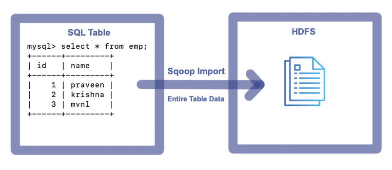
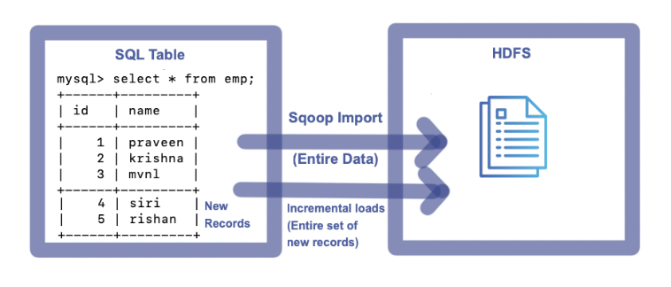
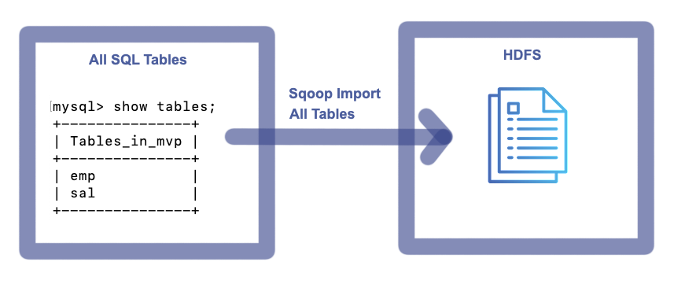

# Sqoop Commands
pb2pb
Advantages of Sqoop
- Direct Imports are possible
- Portion Imports are possible
- Incremental Imports are possible
- Modified Imports are possible
- Serialized Imports are possible
- Exports are possible


<br>

> Import --> Data from RDBMS to HDFS

> Export --> Data from HDFS to RDBMS


## 1. Sqoop Import

Following seven basic details are required to perform sqoop import
- Hostname
- PortNumber
- Database
- Username
- Password
- Table
- Target

**_Sqoop Import Template:_**

```sh
sqoop import --connect jdbc:mysql://<Hostname>:<PortNumber>/<Database> --username <Username> --password <Password> --table <TableName> --target-dir <TargetDirectory>
```

### 1.1. Sqoop Full Import

Import entire table data from source system to HDFS.

#### 1.1.1. Sqoop Full Import from a single table


<br>

To import entire table data to HDFS, execute the following Command

```sh
sqoop import --connect jdbc:mysql://localhost:3306/mvp --username root --password cloudera --m 1 --table emp --delete-target-dir --target-dir /user/cloudera/mvp/tablefullimp
```

**_Console:_**

```sh
Warning: /usr/lib/sqoop/../accumulo does not exist! Accumulo imports will fail.
Please set $ACCUMULO_HOME to the root of your Accumulo installation.
25/03/03 03:45:46 INFO sqoop.Sqoop: Running Sqoop version: 1.4.6-cdh5.12.0
25/03/03 03:45:46 WARN tool.BaseSqoopTool: Setting your password on the command-line is insecure. Consider using -P instead.
25/03/03 03:45:47 INFO manager.MySQLManager: Preparing to use a MySQL streaming resultset.
25/03/03 03:45:47 INFO tool.CodeGenTool: Beginning code generation
25/03/03 03:45:49 INFO manager.SqlManager: Executing SQL statement: SELECT t.* FROM `emp` AS t LIMIT 1
25/03/03 03:45:49 INFO manager.SqlManager: Executing SQL statement: SELECT t.* FROM `emp` AS t LIMIT 1
25/03/03 03:45:49 INFO orm.CompilationManager: HADOOP_MAPRED_HOME is /usr/lib/hadoop-mapreduce
Note: /tmp/sqoop-cloudera/compile/56f4fb74c0ce26d17218cb543be8263e/emp.java uses or overrides a deprecated API.
Note: Recompile with -Xlint:deprecation for details.
25/03/03 03:45:59 INFO orm.CompilationManager: Writing jar file: /tmp/sqoop-cloudera/compile/56f4fb74c0ce26d17218cb543be8263e/emp.jar
25/03/03 03:46:04 INFO tool.ImportTool: Destination directory /user/cloudera/mvp/tablefullimp deleted.
25/03/03 03:46:04 WARN manager.MySQLManager: It looks like you are importing from mysql.
25/03/03 03:46:04 WARN manager.MySQLManager: This transfer can be faster! Use the --direct
25/03/03 03:46:04 WARN manager.MySQLManager: option to exercise a MySQL-specific fast path.
25/03/03 03:46:04 INFO manager.MySQLManager: Setting zero DATETIME behavior to convertToNull (mysql)
25/03/03 03:46:04 INFO mapreduce.ImportJobBase: Beginning import of emp
25/03/03 03:46:04 INFO Configuration.deprecation: mapred.job.tracker is deprecated. Instead, use mapreduce.jobtracker.address
25/03/03 03:46:05 INFO Configuration.deprecation: mapred.jar is deprecated. Instead, use mapreduce.job.jar
25/03/03 03:46:05 INFO Configuration.deprecation: mapred.map.tasks is deprecated. Instead, use mapreduce.job.maps
25/03/03 03:46:05 INFO client.RMProxy: Connecting to ResourceManager at /0.0.0.0:8032
25/03/03 03:46:12 INFO db.DBInputFormat: Using read commited transaction isolation
25/03/03 03:46:12 INFO mapreduce.JobSubmitter: number of splits:1
25/03/03 03:46:13 INFO mapreduce.JobSubmitter: Submitting tokens for job: job_1741002007813_0001
25/03/03 03:46:16 INFO impl.YarnClientImpl: Submitted application application_1741002007813_0001
25/03/03 03:46:16 INFO mapreduce.Job: The url to track the job: http://quickstart.cloudera:8088/proxy/application_1741002007813_0001/
25/03/03 03:46:16 INFO mapreduce.Job: Running job: job_1741002007813_0001
25/03/03 03:47:05 INFO mapreduce.Job: Job job_1741002007813_0001 running in uber mode : false
25/03/03 03:47:05 INFO mapreduce.Job:  map 0% reduce 0%
25/03/03 03:47:43 INFO mapreduce.Job:  map 100% reduce 0%
25/03/03 03:47:45 INFO mapreduce.Job: Job job_1741002007813_0001 completed successfully
25/03/03 03:47:45 INFO mapreduce.Job: Counters: 30
	File System Counters
		FILE: Number of bytes read=0
		FILE: Number of bytes written=151398
		FILE: Number of read operations=0
		FILE: Number of large read operations=0
		FILE: Number of write operations=0
		HDFS: Number of bytes read=87
		HDFS: Number of bytes written=27
		HDFS: Number of read operations=4
		HDFS: Number of large read operations=0
		HDFS: Number of write operations=2
	Job Counters
		Launched map tasks=1
		Other local map tasks=1
		Total time spent by all maps in occupied slots (ms)=32862
		Total time spent by all reduces in occupied slots (ms)=0
		Total time spent by all map tasks (ms)=32862
		Total vcore-milliseconds taken by all map tasks=32862
		Total megabyte-milliseconds taken by all map tasks=33650688
	Map-Reduce Framework
		Map input records=3
		Map output records=3
		Input split bytes=87
		Spilled Records=0
		Failed Shuffles=0
		Merged Map outputs=0
		GC time elapsed (ms)=303
		CPU time spent (ms)=9110
		Physical memory (bytes) snapshot=214011904
		Virtual memory (bytes) snapshot=1576812544
		Total committed heap usage (bytes)=137887744
	File Input Format Counters
		Bytes Read=0
	File Output Format Counters
		Bytes Written=27
25/03/03 03:47:45 INFO mapreduce.ImportJobBase: Transferred 27 bytes in 100.815 seconds (0.2678 bytes/sec)
25/03/03 03:47:45 INFO mapreduce.ImportJobBase: Retrieved 3 records.
```

**_Imported File on HDFS:_**

```sh
[cloudera@quickstart ~]$ hadoop fs -ls /user/cloudera/mvp/tablefullimp
Found 2 items
-rw-r--r--   1 cloudera cloudera          0 2025-03-03 03:47 /user/cloudera/mvp/tablefullimp/_SUCCESS
-rw-r--r--   1 cloudera cloudera         27 2025-03-03 03:47 /user/cloudera/mvp/tablefullimp/part-m-00000
[cloudera@quickstart ~]$ hadoop fs -cat /user/cloudera/mvp/tablefullimp/part-m-00000
1,praveen
2,krishna
3,mvnl
```

#### 1.1.2. Sqoop Full Import from single table with specific columns


<br>

To import specific columns data from a table to HDFS, execute the following Command

```sh
sqoop import --connect jdbc:mysql://localhost:3306/mvp --username root --password cloudera --m 1 --table emp --delete-target-dir --target-dir /user/cloudera/mvp/tablefullimpreqcols --columns "name"
```

**_Console:_**

```sh
Warning: /usr/lib/sqoop/../accumulo does not exist! Accumulo imports will fail.
Please set $ACCUMULO_HOME to the root of your Accumulo installation.
25/03/03 03:50:06 INFO sqoop.Sqoop: Running Sqoop version: 1.4.6-cdh5.12.0
25/03/03 03:50:07 WARN tool.BaseSqoopTool: Setting your password on the command-line is insecure. Consider using -P instead.
25/03/03 03:50:08 INFO manager.MySQLManager: Preparing to use a MySQL streaming resultset.
25/03/03 03:50:08 INFO tool.CodeGenTool: Beginning code generation
25/03/03 03:50:10 INFO manager.SqlManager: Executing SQL statement: SELECT t.* FROM `emp` AS t LIMIT 1
25/03/03 03:50:10 INFO manager.SqlManager: Executing SQL statement: SELECT t.* FROM `emp` AS t LIMIT 1
25/03/03 03:50:10 INFO orm.CompilationManager: HADOOP_MAPRED_HOME is /usr/lib/hadoop-mapreduce
Note: /tmp/sqoop-cloudera/compile/898b0b8d777561291863f68cbf790402/emp.java uses or overrides a deprecated API.
Note: Recompile with -Xlint:deprecation for details.
25/03/03 03:50:19 INFO orm.CompilationManager: Writing jar file: /tmp/sqoop-cloudera/compile/898b0b8d777561291863f68cbf790402/emp.jar
25/03/03 03:50:25 INFO tool.ImportTool: Destination directory /user/cloudera/mvp/tablefullimpreqcols deleted.
25/03/03 03:50:25 WARN manager.MySQLManager: It looks like you are importing from mysql.
25/03/03 03:50:25 WARN manager.MySQLManager: This transfer can be faster! Use the --direct
25/03/03 03:50:25 WARN manager.MySQLManager: option to exercise a MySQL-specific fast path.
25/03/03 03:50:25 INFO manager.MySQLManager: Setting zero DATETIME behavior to convertToNull (mysql)
25/03/03 03:50:25 INFO mapreduce.ImportJobBase: Beginning import of emp
25/03/03 03:50:25 INFO Configuration.deprecation: mapred.job.tracker is deprecated. Instead, use mapreduce.jobtracker.address
25/03/03 03:50:26 INFO Configuration.deprecation: mapred.jar is deprecated. Instead, use mapreduce.job.jar
25/03/03 03:50:26 INFO Configuration.deprecation: mapred.map.tasks is deprecated. Instead, use mapreduce.job.maps
25/03/03 03:50:26 INFO client.RMProxy: Connecting to ResourceManager at /0.0.0.0:8032
25/03/03 03:50:34 INFO db.DBInputFormat: Using read commited transaction isolation
25/03/03 03:50:35 INFO mapreduce.JobSubmitter: number of splits:1
25/03/03 03:50:35 INFO mapreduce.JobSubmitter: Submitting tokens for job: job_1741002007813_0002
25/03/03 03:50:38 INFO impl.YarnClientImpl: Submitted application application_1741002007813_0002
25/03/03 03:50:38 INFO mapreduce.Job: The url to track the job: http://quickstart.cloudera:8088/proxy/application_1741002007813_0002/
25/03/03 03:50:38 INFO mapreduce.Job: Running job: job_1741002007813_0002
25/03/03 03:51:12 INFO mapreduce.Job: Job job_1741002007813_0002 running in uber mode : false
25/03/03 03:51:12 INFO mapreduce.Job:  map 0% reduce 0%
25/03/03 03:51:41 INFO mapreduce.Job:  map 100% reduce 0%
25/03/03 03:51:42 INFO mapreduce.Job: Job job_1741002007813_0002 completed successfully
25/03/03 03:51:43 INFO mapreduce.Job: Counters: 30
	File System Counters
		FILE: Number of bytes read=0
		FILE: Number of bytes written=151541
		FILE: Number of read operations=0
		FILE: Number of large read operations=0
		FILE: Number of write operations=0
		HDFS: Number of bytes read=87
		HDFS: Number of bytes written=21
		HDFS: Number of read operations=4
		HDFS: Number of large read operations=0
		HDFS: Number of write operations=2
	Job Counters
		Launched map tasks=1
		Other local map tasks=1
		Total time spent by all maps in occupied slots (ms)=25355
		Total time spent by all reduces in occupied slots (ms)=0
		Total time spent by all map tasks (ms)=25355
		Total vcore-milliseconds taken by all map tasks=25355
		Total megabyte-milliseconds taken by all map tasks=25963520
	Map-Reduce Framework
		Map input records=3
		Map output records=3
		Input split bytes=87
		Spilled Records=0
		Failed Shuffles=0
		Merged Map outputs=0
		GC time elapsed (ms)=511
		CPU time spent (ms)=6470
		Physical memory (bytes) snapshot=177508352
		Virtual memory (bytes) snapshot=1576955904
		Total committed heap usage (bytes)=141033472
	File Input Format Counters
		Bytes Read=0
	File Output Format Counters
		Bytes Written=21
25/03/03 03:51:43 INFO mapreduce.ImportJobBase: Transferred 21 bytes in 77.2228 seconds (0.2719 bytes/sec)
25/03/03 03:51:43 INFO mapreduce.ImportJobBase: Retrieved 3 records.
```

**_Imported File on HDFS:_**

```sh
[cloudera@quickstart ~]$ hadoop fs -ls /user/cloudera/mvp/tablefullimpreqcols
Found 2 items
-rw-r--r--   1 cloudera cloudera          0 2025-03-03 03:51 /user/cloudera/mvp/tablefullimpreqcols/_SUCCESS
-rw-r--r--   1 cloudera cloudera         21 2025-03-03 03:51 /user/cloudera/mvp/tablefullimpreqcols/part-m-00000
[cloudera@quickstart ~]$ hadoop fs -cat /user/cloudera/mvp/tablefullimpreqcols/part-m-00000
praveen
krishna
mvnl
```

#### 1.1.3. Sqoop Full import using Query clause


<br>

To import entire table data to HDFS, execute the following Command

```sh
sqoop import --connect jdbc:mysql://localhost:3306/mvp --username root --password cloudera --m 1 --delete-target-dir --target-dir /user/cloudera/mvp/queryfullimp --query "select * from emp where \$CONDITIONS"
```

**_Console:_**

```sh
Warning: /usr/lib/sqoop/../accumulo does not exist! Accumulo imports will fail.
Please set $ACCUMULO_HOME to the root of your Accumulo installation.
25/03/03 03:54:33 INFO sqoop.Sqoop: Running Sqoop version: 1.4.6-cdh5.12.0
25/03/03 03:54:33 WARN tool.BaseSqoopTool: Setting your password on the command-line is insecure. Consider using -P instead.
25/03/03 03:54:34 INFO manager.MySQLManager: Preparing to use a MySQL streaming resultset.
25/03/03 03:54:34 INFO tool.CodeGenTool: Beginning code generation
25/03/03 03:54:36 INFO manager.SqlManager: Executing SQL statement: select * from emp where  (1 = 0)
25/03/03 03:54:36 INFO manager.SqlManager: Executing SQL statement: select * from emp where  (1 = 0)
25/03/03 03:54:36 INFO manager.SqlManager: Executing SQL statement: select * from emp where  (1 = 0)
25/03/03 03:54:36 INFO orm.CompilationManager: HADOOP_MAPRED_HOME is /usr/lib/hadoop-mapreduce
Note: /tmp/sqoop-cloudera/compile/48da60cd9f7f8dde2b4405c482f68566/QueryResult.java uses or overrides a deprecated API.
Note: Recompile with -Xlint:deprecation for details.
25/03/03 03:54:45 INFO orm.CompilationManager: Writing jar file: /tmp/sqoop-cloudera/compile/48da60cd9f7f8dde2b4405c482f68566/QueryResult.jar
25/03/03 03:54:50 INFO tool.ImportTool: Destination directory /user/cloudera/mvp/queryfullimp deleted.
25/03/03 03:54:50 INFO mapreduce.ImportJobBase: Beginning query import.
25/03/03 03:54:50 INFO Configuration.deprecation: mapred.job.tracker is deprecated. Instead, use mapreduce.jobtracker.address
25/03/03 03:54:50 INFO Configuration.deprecation: mapred.jar is deprecated. Instead, use mapreduce.job.jar
25/03/03 03:54:51 INFO Configuration.deprecation: mapred.map.tasks is deprecated. Instead, use mapreduce.job.maps
25/03/03 03:54:51 INFO client.RMProxy: Connecting to ResourceManager at /0.0.0.0:8032
25/03/03 03:54:58 INFO db.DBInputFormat: Using read commited transaction isolation
25/03/03 03:54:58 INFO mapreduce.JobSubmitter: number of splits:1
25/03/03 03:54:59 INFO mapreduce.JobSubmitter: Submitting tokens for job: job_1741002007813_0003
25/03/03 03:55:01 INFO impl.YarnClientImpl: Submitted application application_1741002007813_0003
25/03/03 03:55:01 INFO mapreduce.Job: The url to track the job: http://quickstart.cloudera:8088/proxy/application_1741002007813_0003/
25/03/03 03:55:01 INFO mapreduce.Job: Running job: job_1741002007813_0003
25/03/03 03:55:30 INFO mapreduce.Job: Job job_1741002007813_0003 running in uber mode : false
25/03/03 03:55:30 INFO mapreduce.Job:  map 0% reduce 0%
25/03/03 03:55:57 INFO mapreduce.Job:  map 100% reduce 0%
25/03/03 03:55:58 INFO mapreduce.Job: Job job_1741002007813_0003 completed successfully
25/03/03 03:55:59 INFO mapreduce.Job: Counters: 30
	File System Counters
		FILE: Number of bytes read=0
		FILE: Number of bytes written=151252
		FILE: Number of read operations=0
		FILE: Number of large read operations=0
		FILE: Number of write operations=0
		HDFS: Number of bytes read=87
		HDFS: Number of bytes written=27
		HDFS: Number of read operations=4
		HDFS: Number of large read operations=0
		HDFS: Number of write operations=2
	Job Counters
		Launched map tasks=1
		Other local map tasks=1
		Total time spent by all maps in occupied slots (ms)=24710
		Total time spent by all reduces in occupied slots (ms)=0
		Total time spent by all map tasks (ms)=24710
		Total vcore-milliseconds taken by all map tasks=24710
		Total megabyte-milliseconds taken by all map tasks=25303040
	Map-Reduce Framework
		Map input records=3
		Map output records=3
		Input split bytes=87
		Spilled Records=0
		Failed Shuffles=0
		Merged Map outputs=0
		GC time elapsed (ms)=266
		CPU time spent (ms)=5880
		Physical memory (bytes) snapshot=189493248
		Virtual memory (bytes) snapshot=1573457920
		Total committed heap usage (bytes)=137887744
	File Input Format Counters
		Bytes Read=0
	File Output Format Counters
		Bytes Written=27
25/03/03 03:55:59 INFO mapreduce.ImportJobBase: Transferred 27 bytes in 68.2823 seconds (0.3954 bytes/sec)
25/03/03 03:55:59 INFO mapreduce.ImportJobBase: Retrieved 3 records.
```

**_Imported File on HDFS:_**

```sh
[cloudera@quickstart ~]$ hadoop fs -ls /user/cloudera/mvp/queryfullimp
Found 2 items
-rw-r--r--   1 cloudera cloudera          0 2025-03-03 03:55 /user/cloudera/mvp/queryfullimp/_SUCCESS
-rw-r--r--   1 cloudera cloudera         27 2025-03-03 03:55 /user/cloudera/mvp/queryfullimp/part-m-00000
[cloudera@quickstart ~]$ hadoop fs -cat /user/cloudera/mvp/queryfullimp/part-m-00000
1,praveen
2,krishna
3,mvnl
```

#### 1.1.4. Sqoop Full import using Query clause with specific columns


<br>

To import specific columns data from a table to HDFS, execute the following Command

```sh
sqoop import --connect jdbc:mysql://localhost:3306/mvp --username root --password cloudera --m 1 --delete-target-dir --target-dir /user/cloudera/mvp/queryfullimpreqcols --query "select name from emp where \$CONDITIONS"
```

**_Console:_**

```sh
Warning: /usr/lib/sqoop/../accumulo does not exist! Accumulo imports will fail.
Please set $ACCUMULO_HOME to the root of your Accumulo installation.
25/03/03 03:57:49 INFO sqoop.Sqoop: Running Sqoop version: 1.4.6-cdh5.12.0
25/03/03 03:57:49 WARN tool.BaseSqoopTool: Setting your password on the command-line is insecure. Consider using -P instead.
25/03/03 03:57:50 INFO manager.MySQLManager: Preparing to use a MySQL streaming resultset.
25/03/03 03:57:50 INFO tool.CodeGenTool: Beginning code generation
25/03/03 03:57:52 INFO manager.SqlManager: Executing SQL statement: select name from emp where  (1 = 0)
25/03/03 03:57:52 INFO manager.SqlManager: Executing SQL statement: select name from emp where  (1 = 0)
25/03/03 03:57:52 INFO manager.SqlManager: Executing SQL statement: select name from emp where  (1 = 0)
25/03/03 03:57:52 INFO orm.CompilationManager: HADOOP_MAPRED_HOME is /usr/lib/hadoop-mapreduce
Note: /tmp/sqoop-cloudera/compile/f6d4746202e6b6bd672bc91248ca8503/QueryResult.java uses or overrides a deprecated API.
Note: Recompile with -Xlint:deprecation for details.
25/03/03 03:58:01 INFO orm.CompilationManager: Writing jar file: /tmp/sqoop-cloudera/compile/f6d4746202e6b6bd672bc91248ca8503/QueryResult.jar
25/03/03 03:58:07 INFO tool.ImportTool: Destination directory /user/cloudera/mvp/queryfullimpreqcols deleted.
25/03/03 03:58:07 INFO mapreduce.ImportJobBase: Beginning query import.
25/03/03 03:58:07 INFO Configuration.deprecation: mapred.job.tracker is deprecated. Instead, use mapreduce.jobtracker.address
25/03/03 03:58:07 INFO Configuration.deprecation: mapred.jar is deprecated. Instead, use mapreduce.job.jar
25/03/03 03:58:07 INFO Configuration.deprecation: mapred.map.tasks is deprecated. Instead, use mapreduce.job.maps
25/03/03 03:58:08 INFO client.RMProxy: Connecting to ResourceManager at /0.0.0.0:8032
25/03/03 03:58:15 INFO db.DBInputFormat: Using read commited transaction isolation
25/03/03 03:58:15 INFO mapreduce.JobSubmitter: number of splits:1
25/03/03 03:58:16 INFO mapreduce.JobSubmitter: Submitting tokens for job: job_1741002007813_0004
25/03/03 03:58:18 INFO impl.YarnClientImpl: Submitted application application_1741002007813_0004
25/03/03 03:58:18 INFO mapreduce.Job: The url to track the job: http://quickstart.cloudera:8088/proxy/application_1741002007813_0004/
25/03/03 03:58:18 INFO mapreduce.Job: Running job: job_1741002007813_0004
25/03/03 03:58:46 INFO mapreduce.Job: Job job_1741002007813_0004 running in uber mode : false
25/03/03 03:58:46 INFO mapreduce.Job:  map 0% reduce 0%
25/03/03 03:59:12 INFO mapreduce.Job:  map 100% reduce 0%
25/03/03 03:59:13 INFO mapreduce.Job: Job job_1741002007813_0004 completed successfully
25/03/03 03:59:14 INFO mapreduce.Job: Counters: 30
	File System Counters
		FILE: Number of bytes read=0
		FILE: Number of bytes written=151272
		FILE: Number of read operations=0
		FILE: Number of large read operations=0
		FILE: Number of write operations=0
		HDFS: Number of bytes read=87
		HDFS: Number of bytes written=21
		HDFS: Number of read operations=4
		HDFS: Number of large read operations=0
		HDFS: Number of write operations=2
	Job Counters
		Launched map tasks=1
		Other local map tasks=1
		Total time spent by all maps in occupied slots (ms)=23066
		Total time spent by all reduces in occupied slots (ms)=0
		Total time spent by all map tasks (ms)=23066
		Total vcore-milliseconds taken by all map tasks=23066
		Total megabyte-milliseconds taken by all map tasks=23619584
	Map-Reduce Framework
		Map input records=3
		Map output records=3
		Input split bytes=87
		Spilled Records=0
		Failed Shuffles=0
		Merged Map outputs=0
		GC time elapsed (ms)=550
		CPU time spent (ms)=6790
		Physical memory (bytes) snapshot=190480384
		Virtual memory (bytes) snapshot=1571811328
		Total committed heap usage (bytes)=141557760
	File Input Format Counters
		Bytes Read=0
	File Output Format Counters
		Bytes Written=21
25/03/03 03:59:14 INFO mapreduce.ImportJobBase: Transferred 21 bytes in 66.8762 seconds (0.314 bytes/sec)
25/03/03 03:59:14 INFO mapreduce.ImportJobBase: Retrieved 3 records.
```

**_Imported File on HDFS:_**

```sh
[cloudera@quickstart ~]$ hadoop fs -ls /user/cloudera/mvp/queryfullimpreqcols
Found 2 items
-rw-r--r--   1 cloudera cloudera          0 2025-03-03 03:59 /user/cloudera/mvp/queryfullimpreqcols/_SUCCESS
-rw-r--r--   1 cloudera cloudera         21 2025-03-03 03:59 /user/cloudera/mvp/queryfullimpreqcols/part-m-00000
[cloudera@quickstart ~]$ hadoop fs -cat /user/cloudera/mvp/queryfullimpreqcols/part-m-00000
praveen
krishna
mvnl
```

#### 1.1.5.	Sqoop Query Full Imports using Joins


<br>

To import entire join records data to HDFS, execute the following Command

```sh
sqoop import --connect jdbc:mysql://localhost:3306/mvp --username root --password cloudera --m 1 --delete-target-dir --target-dir /user/cloudera/mvp/queryfullimpusingjoins --query "select e.*,s.amount from emp e join sal s on e.id= s.id where \$CONDITIONS"
```

**_Console:_**

```sh
Warning: /usr/lib/sqoop/../accumulo does not exist! Accumulo imports will fail.
Please set $ACCUMULO_HOME to the root of your Accumulo installation.
25/03/03 04:01:19 INFO sqoop.Sqoop: Running Sqoop version: 1.4.6-cdh5.12.0
25/03/03 04:01:19 WARN tool.BaseSqoopTool: Setting your password on the command-line is insecure. Consider using -P instead.
25/03/03 04:01:20 INFO manager.MySQLManager: Preparing to use a MySQL streaming resultset.
25/03/03 04:01:20 INFO tool.CodeGenTool: Beginning code generation
25/03/03 04:01:22 INFO manager.SqlManager: Executing SQL statement: select e.*,s.amount from emp e join sal s on e.id= s.id where  (1 = 0)
25/03/03 04:01:22 INFO manager.SqlManager: Executing SQL statement: select e.*,s.amount from emp e join sal s on e.id= s.id where  (1 = 0)
25/03/03 04:01:22 INFO manager.SqlManager: Executing SQL statement: select e.*,s.amount from emp e join sal s on e.id= s.id where  (1 = 0)
25/03/03 04:01:23 INFO orm.CompilationManager: HADOOP_MAPRED_HOME is /usr/lib/hadoop-mapreduce
Note: /tmp/sqoop-cloudera/compile/f5eaa598074eddec161501f3801afa17/QueryResult.java uses or overrides a deprecated API.
Note: Recompile with -Xlint:deprecation for details.
25/03/03 04:01:32 INFO orm.CompilationManager: Writing jar file: /tmp/sqoop-cloudera/compile/f5eaa598074eddec161501f3801afa17/QueryResult.jar
25/03/03 04:01:37 INFO tool.ImportTool: Destination directory /user/cloudera/mvp/queryfullimpusingjoins deleted.
25/03/03 04:01:37 INFO mapreduce.ImportJobBase: Beginning query import.
25/03/03 04:01:37 INFO Configuration.deprecation: mapred.job.tracker is deprecated. Instead, use mapreduce.jobtracker.address
25/03/03 04:01:37 INFO Configuration.deprecation: mapred.jar is deprecated. Instead, use mapreduce.job.jar
25/03/03 04:01:37 INFO Configuration.deprecation: mapred.map.tasks is deprecated. Instead, use mapreduce.job.maps
25/03/03 04:01:37 INFO client.RMProxy: Connecting to ResourceManager at /0.0.0.0:8032
25/03/03 04:01:44 INFO db.DBInputFormat: Using read commited transaction isolation
25/03/03 04:01:44 INFO mapreduce.JobSubmitter: number of splits:1
25/03/03 04:01:45 INFO mapreduce.JobSubmitter: Submitting tokens for job: job_1741002007813_0005
25/03/03 04:01:47 INFO impl.YarnClientImpl: Submitted application application_1741002007813_0005
25/03/03 04:01:47 INFO mapreduce.Job: The url to track the job: http://quickstart.cloudera:8088/proxy/application_1741002007813_0005/
25/03/03 04:01:47 INFO mapreduce.Job: Running job: job_1741002007813_0005
25/03/03 04:02:17 INFO mapreduce.Job: Job job_1741002007813_0005 running in uber mode : false
25/03/03 04:02:17 INFO mapreduce.Job:  map 0% reduce 0%
25/03/03 04:02:42 INFO mapreduce.Job:  map 100% reduce 0%
25/03/03 04:02:43 INFO mapreduce.Job: Job job_1741002007813_0005 completed successfully
25/03/03 04:02:44 INFO mapreduce.Job: Counters: 30
	File System Counters
		FILE: Number of bytes read=0
		FILE: Number of bytes written=151348
		FILE: Number of read operations=0
		FILE: Number of large read operations=0
		FILE: Number of write operations=0
		HDFS: Number of bytes read=87
		HDFS: Number of bytes written=45
		HDFS: Number of read operations=4
		HDFS: Number of large read operations=0
		HDFS: Number of write operations=2
	Job Counters
		Launched map tasks=1
		Other local map tasks=1
		Total time spent by all maps in occupied slots (ms)=23203
		Total time spent by all reduces in occupied slots (ms)=0
		Total time spent by all map tasks (ms)=23203
		Total vcore-milliseconds taken by all map tasks=23203
		Total megabyte-milliseconds taken by all map tasks=23759872
	Map-Reduce Framework
		Map input records=3
		Map output records=3
		Input split bytes=87
		Spilled Records=0
		Failed Shuffles=0
		Merged Map outputs=0
		GC time elapsed (ms)=300
		CPU time spent (ms)=5490
		Physical memory (bytes) snapshot=185606144
		Virtual memory (bytes) snapshot=1574625280
		Total committed heap usage (bytes)=137887744
	File Input Format Counters
		Bytes Read=0
	File Output Format Counters
		Bytes Written=45
25/03/03 04:02:44 INFO mapreduce.ImportJobBase: Transferred 45 bytes in 66.655 seconds (0.6751 bytes/sec)
25/03/03 04:02:44 INFO mapreduce.ImportJobBase: Retrieved 3 records.
```

**_Imported File on HDFS:_**

```sh
[cloudera@quickstart ~]$ hadoop fs -ls /user/cloudera/mvp/queryfullimpusingjoins
Found 2 items
-rw-r--r--   1 cloudera cloudera          0 2025-03-03 04:02 /user/cloudera/mvp/queryfullimpusingjoins/_SUCCESS
-rw-r--r--   1 cloudera cloudera         45 2025-03-03 04:02 /user/cloudera/mvp/queryfullimpusingjoins/part-m-00000
[cloudera@quickstart ~]$ hadoop fs -cat /user/cloudera/mvp/queryfullimpusingjoins/part-m-00000
1,praveen,20000
2,krishna,10000
3,mvnl,15000
```

#### 1.1.6. Sqoop Query Full Imports with specific columns using Joins


<br>

To import specific columns of join records to HDFS, execute the following Command

```sh
sqoop import --connect jdbc:mysql://localhost:3306/mvp --username root --password cloudera --m 1 --delete-target-dir --target-dir /user/cloudera/mvp/queryfullimpusingjoinsreqcols --query "select e.name,s.amount from emp e join sal s on e.id= s.id where \$CONDITIONS"
```

**_Console:_**

```sh
Warning: /usr/lib/sqoop/../accumulo does not exist! Accumulo imports will fail.
Please set $ACCUMULO_HOME to the root of your Accumulo installation.
25/03/03 04:05:05 INFO sqoop.Sqoop: Running Sqoop version: 1.4.6-cdh5.12.0
25/03/03 04:05:05 WARN tool.BaseSqoopTool: Setting your password on the command-line is insecure. Consider using -P instead.
25/03/03 04:05:06 INFO manager.MySQLManager: Preparing to use a MySQL streaming resultset.
25/03/03 04:05:06 INFO tool.CodeGenTool: Beginning code generation
25/03/03 04:05:08 INFO manager.SqlManager: Executing SQL statement: select e.name,s.amount from emp e join sal s on e.id= s.id where  (1 = 0)
25/03/03 04:05:08 INFO manager.SqlManager: Executing SQL statement: select e.name,s.amount from emp e join sal s on e.id= s.id where  (1 = 0)
25/03/03 04:05:08 INFO manager.SqlManager: Executing SQL statement: select e.name,s.amount from emp e join sal s on e.id= s.id where  (1 = 0)
25/03/03 04:05:08 INFO orm.CompilationManager: HADOOP_MAPRED_HOME is /usr/lib/hadoop-mapreduce
Note: /tmp/sqoop-cloudera/compile/27f5333ed9f208f7467f5f77750ce3a1/QueryResult.java uses or overrides a deprecated API.
Note: Recompile with -Xlint:deprecation for details.
25/03/03 04:05:17 INFO orm.CompilationManager: Writing jar file: /tmp/sqoop-cloudera/compile/27f5333ed9f208f7467f5f77750ce3a1/QueryResult.jar
25/03/03 04:05:22 INFO tool.ImportTool: Destination directory /user/cloudera/mvp/queryfullimpusingjoinsreqcols deleted.
25/03/03 04:05:22 INFO mapreduce.ImportJobBase: Beginning query import.
25/03/03 04:05:22 INFO Configuration.deprecation: mapred.job.tracker is deprecated. Instead, use mapreduce.jobtracker.address
25/03/03 04:05:22 INFO Configuration.deprecation: mapred.jar is deprecated. Instead, use mapreduce.job.jar
25/03/03 04:05:22 INFO Configuration.deprecation: mapred.map.tasks is deprecated. Instead, use mapreduce.job.maps
25/03/03 04:05:23 INFO client.RMProxy: Connecting to ResourceManager at /0.0.0.0:8032
25/03/03 04:05:30 INFO db.DBInputFormat: Using read commited transaction isolation
25/03/03 04:05:30 INFO mapreduce.JobSubmitter: number of splits:1
25/03/03 04:05:31 INFO mapreduce.JobSubmitter: Submitting tokens for job: job_1741002007813_0006
25/03/03 04:05:33 INFO impl.YarnClientImpl: Submitted application application_1741002007813_0006
25/03/03 04:05:33 INFO mapreduce.Job: The url to track the job: http://quickstart.cloudera:8088/proxy/application_1741002007813_0006/
25/03/03 04:05:33 INFO mapreduce.Job: Running job: job_1741002007813_0006
25/03/03 04:06:00 INFO mapreduce.Job: Job job_1741002007813_0006 running in uber mode : false
25/03/03 04:06:00 INFO mapreduce.Job:  map 0% reduce 0%
25/03/03 04:06:27 INFO mapreduce.Job:  map 100% reduce 0%
25/03/03 04:06:28 INFO mapreduce.Job: Job job_1741002007813_0006 completed successfully
25/03/03 04:06:29 INFO mapreduce.Job: Counters: 30
	File System Counters
		FILE: Number of bytes read=0
		FILE: Number of bytes written=151368
		FILE: Number of read operations=0
		FILE: Number of large read operations=0
		FILE: Number of write operations=0
		HDFS: Number of bytes read=87
		HDFS: Number of bytes written=39
		HDFS: Number of read operations=4
		HDFS: Number of large read operations=0
		HDFS: Number of write operations=2
	Job Counters
		Launched map tasks=1
		Other local map tasks=1
		Total time spent by all maps in occupied slots (ms)=22785
		Total time spent by all reduces in occupied slots (ms)=0
		Total time spent by all map tasks (ms)=22785
		Total vcore-milliseconds taken by all map tasks=22785
		Total megabyte-milliseconds taken by all map tasks=23331840
	Map-Reduce Framework
		Map input records=3
		Map output records=3
		Input split bytes=87
		Spilled Records=0
		Failed Shuffles=0
		Merged Map outputs=0
		GC time elapsed (ms)=228
		CPU time spent (ms)=5980
		Physical memory (bytes) snapshot=185454592
		Virtual memory (bytes) snapshot=1576235008
		Total committed heap usage (bytes)=137887744
	File Input Format Counters
		Bytes Read=0
	File Output Format Counters
		Bytes Written=39
25/03/03 04:06:29 INFO mapreduce.ImportJobBase: Transferred 39 bytes in 66.638 seconds (0.5853 bytes/sec)
25/03/03 04:06:29 INFO mapreduce.ImportJobBase: Retrieved 3 records.
```

**_Imported File on HDFS:_**

```sh
[cloudera@quickstart ~]$ hadoop fs -ls /user/cloudera/mvp/queryfullimpusingjoinsreqcols
Found 2 items
-rw-r--r--   1 cloudera cloudera          0 2025-03-03 04:06 /user/cloudera/mvp/queryfullimpusingjoinsreqcols/_SUCCESS
-rw-r--r--   1 cloudera cloudera         39 2025-03-03 04:06 /user/cloudera/mvp/queryfullimpusingjoinsreqcols/part-m-00000
[cloudera@quickstart ~]$ hadoop fs -cat /user/cloudera/mvp/queryfullimpusingjoinsreqcols/part-m-00000
praveen,20000
krishna,10000
mvnl,15000
```

### 1.2. Sqoop Portion Imports

Import specific/filtered records from a source system to HDFS.

#### 1.2.1. Sqoop Portion Imports from a single table


<br>

To import specific records from a table to HDFS, execute the following Command

```sh
sqoop import --connect jdbc:mysql://localhost:3306/mvp --username root --password cloudera --m 1 --table emp --delete-target-dir --target-dir /user/cloudera/mvp/tableportionimp --where "name='praveen'"
```

**_Console:_**

```sh
Warning: /usr/lib/sqoop/../accumulo does not exist! Accumulo imports will fail.
Please set $ACCUMULO_HOME to the root of your Accumulo installation.
25/03/03 04:09:15 INFO sqoop.Sqoop: Running Sqoop version: 1.4.6-cdh5.12.0
25/03/03 04:09:15 WARN tool.BaseSqoopTool: Setting your password on the command-line is insecure. Consider using -P instead.
25/03/03 04:09:16 INFO manager.MySQLManager: Preparing to use a MySQL streaming resultset.
25/03/03 04:09:16 INFO tool.CodeGenTool: Beginning code generation
25/03/03 04:09:18 INFO manager.SqlManager: Executing SQL statement: SELECT t.* FROM `emp` AS t LIMIT 1
25/03/03 04:09:18 INFO manager.SqlManager: Executing SQL statement: SELECT t.* FROM `emp` AS t LIMIT 1
25/03/03 04:09:18 INFO orm.CompilationManager: HADOOP_MAPRED_HOME is /usr/lib/hadoop-mapreduce
Note: /tmp/sqoop-cloudera/compile/0f902cf9a91f57911e86e880aa7d5958/emp.java uses or overrides a deprecated API.
Note: Recompile with -Xlint:deprecation for details.
25/03/03 04:09:27 INFO orm.CompilationManager: Writing jar file: /tmp/sqoop-cloudera/compile/0f902cf9a91f57911e86e880aa7d5958/emp.jar
25/03/03 04:09:32 INFO tool.ImportTool: Destination directory /user/cloudera/mvp/tableportionimp deleted.
25/03/03 04:09:32 WARN manager.MySQLManager: It looks like you are importing from mysql.
25/03/03 04:09:32 WARN manager.MySQLManager: This transfer can be faster! Use the --direct
25/03/03 04:09:32 WARN manager.MySQLManager: option to exercise a MySQL-specific fast path.
25/03/03 04:09:32 INFO manager.MySQLManager: Setting zero DATETIME behavior to convertToNull (mysql)
25/03/03 04:09:32 INFO mapreduce.ImportJobBase: Beginning import of emp
25/03/03 04:09:32 INFO Configuration.deprecation: mapred.job.tracker is deprecated. Instead, use mapreduce.jobtracker.address
25/03/03 04:09:33 INFO Configuration.deprecation: mapred.jar is deprecated. Instead, use mapreduce.job.jar
25/03/03 04:09:33 INFO Configuration.deprecation: mapred.map.tasks is deprecated. Instead, use mapreduce.job.maps
25/03/03 04:09:33 INFO client.RMProxy: Connecting to ResourceManager at /0.0.0.0:8032
25/03/03 04:09:40 INFO db.DBInputFormat: Using read commited transaction isolation
25/03/03 04:09:41 INFO mapreduce.JobSubmitter: number of splits:1
25/03/03 04:09:42 INFO mapreduce.JobSubmitter: Submitting tokens for job: job_1741002007813_0007
25/03/03 04:09:44 INFO impl.YarnClientImpl: Submitted application application_1741002007813_0007
25/03/03 04:09:44 INFO mapreduce.Job: The url to track the job: http://quickstart.cloudera:8088/proxy/application_1741002007813_0007/
25/03/03 04:09:44 INFO mapreduce.Job: Running job: job_1741002007813_0007
25/03/03 04:10:13 INFO mapreduce.Job: Job job_1741002007813_0007 running in uber mode : false
25/03/03 04:10:13 INFO mapreduce.Job:  map 0% reduce 0%
25/03/03 04:10:39 INFO mapreduce.Job:  map 100% reduce 0%
25/03/03 04:10:39 INFO mapreduce.Job: Job job_1741002007813_0007 completed successfully
25/03/03 04:10:40 INFO mapreduce.Job: Counters: 30
	File System Counters
		FILE: Number of bytes read=0
		FILE: Number of bytes written=151700
		FILE: Number of read operations=0
		FILE: Number of large read operations=0
		FILE: Number of write operations=0
		HDFS: Number of bytes read=87
		HDFS: Number of bytes written=10
		HDFS: Number of read operations=4
		HDFS: Number of large read operations=0
		HDFS: Number of write operations=2
	Job Counters
		Launched map tasks=1
		Other local map tasks=1
		Total time spent by all maps in occupied slots (ms)=23328
		Total time spent by all reduces in occupied slots (ms)=0
		Total time spent by all map tasks (ms)=23328
		Total vcore-milliseconds taken by all map tasks=23328
		Total megabyte-milliseconds taken by all map tasks=23887872
	Map-Reduce Framework
		Map input records=1
		Map output records=1
		Input split bytes=87
		Spilled Records=0
		Failed Shuffles=0
		Merged Map outputs=0
		GC time elapsed (ms)=581
		CPU time spent (ms)=7020
		Physical memory (bytes) snapshot=189689856
		Virtual memory (bytes) snapshot=1574309888
		Total committed heap usage (bytes)=141557760
	File Input Format Counters
		Bytes Read=0
	File Output Format Counters
		Bytes Written=10
25/03/03 04:10:40 INFO mapreduce.ImportJobBase: Transferred 10 bytes in 67.098 seconds (0.149 bytes/sec)
25/03/03 04:10:40 INFO mapreduce.ImportJobBase: Retrieved 1 records.
```

**_Imported File on HDFS:_**

```sh
[cloudera@quickstart ~]$ hadoop fs -ls /user/cloudera/mvp/tableportionimp
Found 2 items
-rw-r--r--   1 cloudera cloudera          0 2025-03-03 04:10 /user/cloudera/mvp/tableportionimp/_SUCCESS
-rw-r--r--   1 cloudera cloudera         10 2025-03-03 04:10 /user/cloudera/mvp/tableportionimp/part-m-00000
[cloudera@quickstart ~]$ hadoop fs -cat /user/cloudera/mvp/tableportionimp/part-m-00000
1,praveen
```

#### 1.2.2. Sqoop Portion Imports from a single table with specific columns


<br>

To import specific columns of specific records from a table to HDFS, execute the following Command

```sh
sqoop import --connect jdbc:mysql://localhost:3306/mvp --username root --password cloudera --m 1 --table emp --delete-target-dir --target-dir /user/cloudera/mvp/tableportionimpreqcols --where "name='praveen'" --columns "name"
```

**_Console:_**

```sh
Warning: /usr/lib/sqoop/../accumulo does not exist! Accumulo imports will fail.
Please set $ACCUMULO_HOME to the root of your Accumulo installation.
25/03/03 04:12:20 INFO sqoop.Sqoop: Running Sqoop version: 1.4.6-cdh5.12.0
25/03/03 04:12:20 WARN tool.BaseSqoopTool: Setting your password on the command-line is insecure. Consider using -P instead.
25/03/03 04:12:21 INFO manager.MySQLManager: Preparing to use a MySQL streaming resultset.
25/03/03 04:12:21 INFO tool.CodeGenTool: Beginning code generation
25/03/03 04:12:23 INFO manager.SqlManager: Executing SQL statement: SELECT t.* FROM `emp` AS t LIMIT 1
25/03/03 04:12:23 INFO manager.SqlManager: Executing SQL statement: SELECT t.* FROM `emp` AS t LIMIT 1
25/03/03 04:12:23 INFO orm.CompilationManager: HADOOP_MAPRED_HOME is /usr/lib/hadoop-mapreduce
Note: /tmp/sqoop-cloudera/compile/fb7bf81a5f4714aed335f9fa76c7b54d/emp.java uses or overrides a deprecated API.
Note: Recompile with -Xlint:deprecation for details.
25/03/03 04:12:32 INFO orm.CompilationManager: Writing jar file: /tmp/sqoop-cloudera/compile/fb7bf81a5f4714aed335f9fa76c7b54d/emp.jar
25/03/03 04:12:38 INFO tool.ImportTool: Destination directory /user/cloudera/mvp/tableportionimpreqcols deleted.
25/03/03 04:12:38 WARN manager.MySQLManager: It looks like you are importing from mysql.
25/03/03 04:12:38 WARN manager.MySQLManager: This transfer can be faster! Use the --direct
25/03/03 04:12:38 WARN manager.MySQLManager: option to exercise a MySQL-specific fast path.
25/03/03 04:12:38 INFO manager.MySQLManager: Setting zero DATETIME behavior to convertToNull (mysql)
25/03/03 04:12:38 INFO mapreduce.ImportJobBase: Beginning import of emp
25/03/03 04:12:38 INFO Configuration.deprecation: mapred.job.tracker is deprecated. Instead, use mapreduce.jobtracker.address
25/03/03 04:12:38 INFO Configuration.deprecation: mapred.jar is deprecated. Instead, use mapreduce.job.jar
25/03/03 04:12:38 INFO Configuration.deprecation: mapred.map.tasks is deprecated. Instead, use mapreduce.job.maps
25/03/03 04:12:38 INFO client.RMProxy: Connecting to ResourceManager at /0.0.0.0:8032
25/03/03 04:12:46 INFO db.DBInputFormat: Using read commited transaction isolation
25/03/03 04:12:46 INFO mapreduce.JobSubmitter: number of splits:1
25/03/03 04:12:47 INFO mapreduce.JobSubmitter: Submitting tokens for job: job_1741002007813_0008
25/03/03 04:12:49 INFO impl.YarnClientImpl: Submitted application application_1741002007813_0008
25/03/03 04:12:49 INFO mapreduce.Job: The url to track the job: http://quickstart.cloudera:8088/proxy/application_1741002007813_0008/
25/03/03 04:12:49 INFO mapreduce.Job: Running job: job_1741002007813_0008
25/03/03 04:13:17 INFO mapreduce.Job: Job job_1741002007813_0008 running in uber mode : false
25/03/03 04:13:17 INFO mapreduce.Job:  map 0% reduce 0%
25/03/03 04:13:43 INFO mapreduce.Job:  map 100% reduce 0%
25/03/03 04:13:44 INFO mapreduce.Job: Job job_1741002007813_0008 completed successfully
25/03/03 04:13:44 INFO mapreduce.Job: Counters: 30
	File System Counters
		FILE: Number of bytes read=0
		FILE: Number of bytes written=151847
		FILE: Number of read operations=0
		FILE: Number of large read operations=0
		FILE: Number of write operations=0
		HDFS: Number of bytes read=87
		HDFS: Number of bytes written=8
		HDFS: Number of read operations=4
		HDFS: Number of large read operations=0
		HDFS: Number of write operations=2
	Job Counters
		Launched map tasks=1
		Other local map tasks=1
		Total time spent by all maps in occupied slots (ms)=22772
		Total time spent by all reduces in occupied slots (ms)=0
		Total time spent by all map tasks (ms)=22772
		Total vcore-milliseconds taken by all map tasks=22772
		Total megabyte-milliseconds taken by all map tasks=23318528
	Map-Reduce Framework
		Map input records=1
		Map output records=1
		Input split bytes=87
		Spilled Records=0
		Failed Shuffles=0
		Merged Map outputs=0
		GC time elapsed (ms)=283
		CPU time spent (ms)=6120
		Physical memory (bytes) snapshot=193761280
		Virtual memory (bytes) snapshot=1578532864
		Total committed heap usage (bytes)=137887744
	File Input Format Counters
		Bytes Read=0
	File Output Format Counters
		Bytes Written=8
25/03/03 04:13:44 INFO mapreduce.ImportJobBase: Transferred 8 bytes in 66.617 seconds (0.1201 bytes/sec)
25/03/03 04:13:45 INFO mapreduce.ImportJobBase: Retrieved 1 records.
```

**_Imported File on HDFS:_**

```sh
[cloudera@quickstart ~]$ hadoop fs -ls /user/cloudera/mvp/tableportionimpreqcols
Found 2 items
-rw-r--r--   1 cloudera cloudera          0 2025-03-03 04:13 /user/cloudera/mvp/tableportionimpreqcols/_SUCCESS
-rw-r--r--   1 cloudera cloudera          8 2025-03-03 04:13 /user/cloudera/mvp/tableportionimpreqcols/part-m-00000
[cloudera@quickstart ~]$ hadoop fs -cat /user/cloudera/mvp/tableportionimpreqcols/part-m-00000
praveen
```

#### 1.2.3. Sqoop Portion import using Query clause


<br>

To import specific records from a table to HDFS, execute the following Command

```sh
sqoop import --connect jdbc:mysql://localhost:3306/mvp --username root --password cloudera --m 1 --delete-target-dir --target-dir /user/cloudera/mvp/queryportionimp --query "select * from emp where name='praveen' and \$CONDITIONS"
```

**_Console:_**

```sh
Warning: /usr/lib/sqoop/../accumulo does not exist! Accumulo imports will fail.
Please set $ACCUMULO_HOME to the root of your Accumulo installation.
25/03/03 04:16:31 INFO sqoop.Sqoop: Running Sqoop version: 1.4.6-cdh5.12.0
25/03/03 04:16:31 WARN tool.BaseSqoopTool: Setting your password on the command-line is insecure. Consider using -P instead.
25/03/03 04:16:32 INFO manager.MySQLManager: Preparing to use a MySQL streaming resultset.
25/03/03 04:16:32 INFO tool.CodeGenTool: Beginning code generation
25/03/03 04:16:34 INFO manager.SqlManager: Executing SQL statement: select * from emp where name='praveen' and  (1 = 0)
25/03/03 04:16:34 INFO manager.SqlManager: Executing SQL statement: select * from emp where name='praveen' and  (1 = 0)
25/03/03 04:16:35 INFO manager.SqlManager: Executing SQL statement: select * from emp where name='praveen' and  (1 = 0)
25/03/03 04:16:35 INFO orm.CompilationManager: HADOOP_MAPRED_HOME is /usr/lib/hadoop-mapreduce
Note: /tmp/sqoop-cloudera/compile/e84bbeccc0725080607991c79f5d469c/QueryResult.java uses or overrides a deprecated API.
Note: Recompile with -Xlint:deprecation for details.
25/03/03 04:16:44 INFO orm.CompilationManager: Writing jar file: /tmp/sqoop-cloudera/compile/e84bbeccc0725080607991c79f5d469c/QueryResult.jar
25/03/03 04:16:49 INFO tool.ImportTool: Destination directory /user/cloudera/mvp/queryportionimp deleted.
25/03/03 04:16:49 INFO mapreduce.ImportJobBase: Beginning query import.
25/03/03 04:16:49 INFO Configuration.deprecation: mapred.job.tracker is deprecated. Instead, use mapreduce.jobtracker.address
25/03/03 04:16:49 INFO Configuration.deprecation: mapred.jar is deprecated. Instead, use mapreduce.job.jar
25/03/03 04:16:49 INFO Configuration.deprecation: mapred.map.tasks is deprecated. Instead, use mapreduce.job.maps
25/03/03 04:16:50 INFO client.RMProxy: Connecting to ResourceManager at /0.0.0.0:8032
25/03/03 04:16:57 INFO db.DBInputFormat: Using read commited transaction isolation
25/03/03 04:16:57 INFO mapreduce.JobSubmitter: number of splits:1
25/03/03 04:16:58 INFO mapreduce.JobSubmitter: Submitting tokens for job: job_1741002007813_0009
25/03/03 04:17:00 INFO impl.YarnClientImpl: Submitted application application_1741002007813_0009
25/03/03 04:17:00 INFO mapreduce.Job: The url to track the job: http://quickstart.cloudera:8088/proxy/application_1741002007813_0009/
25/03/03 04:17:00 INFO mapreduce.Job: Running job: job_1741002007813_0009
25/03/03 04:17:29 INFO mapreduce.Job: Job job_1741002007813_0009 running in uber mode : false
25/03/03 04:17:29 INFO mapreduce.Job:  map 0% reduce 0%
25/03/03 04:17:51 INFO mapreduce.Job:  map 100% reduce 0%
25/03/03 04:17:52 INFO mapreduce.Job: Job job_1741002007813_0009 completed successfully
25/03/03 04:17:53 INFO mapreduce.Job: Counters: 30
	File System Counters
		FILE: Number of bytes read=0
		FILE: Number of bytes written=151296
		FILE: Number of read operations=0
		FILE: Number of large read operations=0
		FILE: Number of write operations=0
		HDFS: Number of bytes read=87
		HDFS: Number of bytes written=10
		HDFS: Number of read operations=4
		HDFS: Number of large read operations=0
		HDFS: Number of write operations=2
	Job Counters
		Launched map tasks=1
		Other local map tasks=1
		Total time spent by all maps in occupied slots (ms)=20116
		Total time spent by all reduces in occupied slots (ms)=0
		Total time spent by all map tasks (ms)=20116
		Total vcore-milliseconds taken by all map tasks=20116
		Total megabyte-milliseconds taken by all map tasks=20598784
	Map-Reduce Framework
		Map input records=1
		Map output records=1
		Input split bytes=87
		Spilled Records=0
		Failed Shuffles=0
		Merged Map outputs=0
		GC time elapsed (ms)=114
		CPU time spent (ms)=5540
		Physical memory (bytes) snapshot=190218240
		Virtual memory (bytes) snapshot=1566130176
		Total committed heap usage (bytes)=137887744
	File Input Format Counters
		Bytes Read=0
	File Output Format Counters
		Bytes Written=10
25/03/03 04:17:53 INFO mapreduce.ImportJobBase: Transferred 10 bytes in 62.9928 seconds (0.1587 bytes/sec)
25/03/03 04:17:53 INFO mapreduce.ImportJobBase: Retrieved 1 records.
```

**_Imported File on HDFS:_**

```sh
[cloudera@quickstart ~]$ hadoop fs -ls /user/cloudera/mvp/queryportionimp
Found 2 items
-rw-r--r--   1 cloudera cloudera          0 2025-03-03 04:17 /user/cloudera/mvp/queryportionimp/_SUCCESS
-rw-r--r--   1 cloudera cloudera         10 2025-03-03 04:17 /user/cloudera/mvp/queryportionimp/part-m-00000
[cloudera@quickstart ~]$ hadoop fs -cat /user/cloudera/mvp/queryportionimp/part-m-00000
1,praveen
```

#### 1.2.4. Sqoop Portion import using Query clause with specific columns


<br>

To import specific columns of specific records from a table to HDFS, execute the following Command

```sh
sqoop import --connect jdbc:mysql://localhost:3306/mvp --username root --password cloudera --m 1 --delete-target-dir --target-dir /user/cloudera/mvp/queryportionimpreqcols --query "select name from emp where name='praveen' and \$CONDITIONS"
```

**_Console:_**

```sh
Warning: /usr/lib/sqoop/../accumulo does not exist! Accumulo imports will fail.
Please set $ACCUMULO_HOME to the root of your Accumulo installation.
25/03/03 04:19:20 INFO sqoop.Sqoop: Running Sqoop version: 1.4.6-cdh5.12.0
25/03/03 04:19:20 WARN tool.BaseSqoopTool: Setting your password on the command-line is insecure. Consider using -P instead.
25/03/03 04:19:21 INFO manager.MySQLManager: Preparing to use a MySQL streaming resultset.
25/03/03 04:19:21 INFO tool.CodeGenTool: Beginning code generation
25/03/03 04:19:23 INFO manager.SqlManager: Executing SQL statement: select name from emp where name='praveen' and  (1 = 0)
25/03/03 04:19:23 INFO manager.SqlManager: Executing SQL statement: select name from emp where name='praveen' and  (1 = 0)
25/03/03 04:19:23 INFO manager.SqlManager: Executing SQL statement: select name from emp where name='praveen' and  (1 = 0)
25/03/03 04:19:23 INFO orm.CompilationManager: HADOOP_MAPRED_HOME is /usr/lib/hadoop-mapreduce
Note: /tmp/sqoop-cloudera/compile/360adad1f68d240ea5270913fe4a53ff/QueryResult.java uses or overrides a deprecated API.
Note: Recompile with -Xlint:deprecation for details.
25/03/03 04:19:32 INFO orm.CompilationManager: Writing jar file: /tmp/sqoop-cloudera/compile/360adad1f68d240ea5270913fe4a53ff/QueryResult.jar
25/03/03 04:19:37 INFO tool.ImportTool: Destination directory /user/cloudera/mvp/queryportionimpreqcols deleted.
25/03/03 04:19:37 INFO mapreduce.ImportJobBase: Beginning query import.
25/03/03 04:19:37 INFO Configuration.deprecation: mapred.job.tracker is deprecated. Instead, use mapreduce.jobtracker.address
25/03/03 04:19:38 INFO Configuration.deprecation: mapred.jar is deprecated. Instead, use mapreduce.job.jar
25/03/03 04:19:38 INFO Configuration.deprecation: mapred.map.tasks is deprecated. Instead, use mapreduce.job.maps
25/03/03 04:19:38 INFO client.RMProxy: Connecting to ResourceManager at /0.0.0.0:8032
25/03/03 04:19:44 INFO db.DBInputFormat: Using read commited transaction isolation
25/03/03 04:19:45 INFO mapreduce.JobSubmitter: number of splits:1
25/03/03 04:19:46 INFO mapreduce.JobSubmitter: Submitting tokens for job: job_1741002007813_0010
25/03/03 04:19:48 INFO impl.YarnClientImpl: Submitted application application_1741002007813_0010
25/03/03 04:19:48 INFO mapreduce.Job: The url to track the job: http://quickstart.cloudera:8088/proxy/application_1741002007813_0010/
25/03/03 04:19:48 INFO mapreduce.Job: Running job: job_1741002007813_0010
25/03/03 04:20:16 INFO mapreduce.Job: Job job_1741002007813_0010 running in uber mode : false
25/03/03 04:20:16 INFO mapreduce.Job:  map 0% reduce 0%
25/03/03 04:20:39 INFO mapreduce.Job:  map 100% reduce 0%
25/03/03 04:20:40 INFO mapreduce.Job: Job job_1741002007813_0010 completed successfully
25/03/03 04:20:41 INFO mapreduce.Job: Counters: 30
	File System Counters
		FILE: Number of bytes read=0
		FILE: Number of bytes written=151316
		FILE: Number of read operations=0
		FILE: Number of large read operations=0
		FILE: Number of write operations=0
		HDFS: Number of bytes read=87
		HDFS: Number of bytes written=8
		HDFS: Number of read operations=4
		HDFS: Number of large read operations=0
		HDFS: Number of write operations=2
	Job Counters
		Launched map tasks=1
		Other local map tasks=1
		Total time spent by all maps in occupied slots (ms)=20428
		Total time spent by all reduces in occupied slots (ms)=0
		Total time spent by all map tasks (ms)=20428
		Total vcore-milliseconds taken by all map tasks=20428
		Total megabyte-milliseconds taken by all map tasks=20918272
	Map-Reduce Framework
		Map input records=1
		Map output records=1
		Input split bytes=87
		Spilled Records=0
		Failed Shuffles=0
		Merged Map outputs=0
		GC time elapsed (ms)=832
		CPU time spent (ms)=7350
		Physical memory (bytes) snapshot=209752064
		Virtual memory (bytes) snapshot=1578692608
		Total committed heap usage (bytes)=141557760
	File Input Format Counters
		Bytes Read=0
	File Output Format Counters
		Bytes Written=8
25/03/03 04:20:41 INFO mapreduce.ImportJobBase: Transferred 8 bytes in 62.7991 seconds (0.1274 bytes/sec)
25/03/03 04:20:41 INFO mapreduce.ImportJobBase: Retrieved 1 records.
```

**_Imported File on HDFS:_**

```sh
[cloudera@quickstart ~]$ hadoop fs -ls /user/cloudera/mvp/queryportionimpreqcols
Found 2 items
-rw-r--r--   1 cloudera cloudera          0 2025-03-03 04:20 /user/cloudera/mvp/queryportionimpreqcols/_SUCCESS
-rw-r--r--   1 cloudera cloudera          8 2025-03-03 04:20 /user/cloudera/mvp/queryportionimpreqcols/part-m-00000
[cloudera@quickstart ~]$ hadoop fs -cat /user/cloudera/mvp/queryportionimpreqcols/part-m-00000
praveen
```

#### 1.2.5.	Sqoop Query Portion Imports using Joins


<br>

To import specific join records to HDFS, execute the following Command

```sh
sqoop import --connect jdbc:mysql://localhost:3306/mvp --username root --password cloudera --m 1 --delete-target-dir --target-dir /user/cloudera/mvp/queryportionimpusingjoins --query "select e.*,s.amount from emp e join sal s on e.id= s.id where s.amount>10000 and \$CONDITIONS"
```

**_Console:_**

```sh
Warning: /usr/lib/sqoop/../accumulo does not exist! Accumulo imports will fail.
Please set $ACCUMULO_HOME to the root of your Accumulo installation.
25/03/03 04:22:02 INFO sqoop.Sqoop: Running Sqoop version: 1.4.6-cdh5.12.0
25/03/03 04:22:03 WARN tool.BaseSqoopTool: Setting your password on the command-line is insecure. Consider using -P instead.
25/03/03 04:22:04 INFO manager.MySQLManager: Preparing to use a MySQL streaming resultset.
25/03/03 04:22:04 INFO tool.CodeGenTool: Beginning code generation
25/03/03 04:22:06 INFO manager.SqlManager: Executing SQL statement: select e.*,s.amount from emp e join sal s on e.id= s.id where s.amount>10000 and  (1 = 0)
25/03/03 04:22:06 INFO manager.SqlManager: Executing SQL statement: select e.*,s.amount from emp e join sal s on e.id= s.id where s.amount>10000 and  (1 = 0)
25/03/03 04:22:06 INFO manager.SqlManager: Executing SQL statement: select e.*,s.amount from emp e join sal s on e.id= s.id where s.amount>10000 and  (1 = 0)
25/03/03 04:22:06 INFO orm.CompilationManager: HADOOP_MAPRED_HOME is /usr/lib/hadoop-mapreduce
Note: /tmp/sqoop-cloudera/compile/4ab25af47820458c8768d7689bee047c/QueryResult.java uses or overrides a deprecated API.
Note: Recompile with -Xlint:deprecation for details.
25/03/03 04:22:15 INFO orm.CompilationManager: Writing jar file: /tmp/sqoop-cloudera/compile/4ab25af47820458c8768d7689bee047c/QueryResult.jar
25/03/03 04:22:20 INFO tool.ImportTool: Destination directory /user/cloudera/mvp/queryportionimpusingjoins deleted.
25/03/03 04:22:20 INFO mapreduce.ImportJobBase: Beginning query import.
25/03/03 04:22:20 INFO Configuration.deprecation: mapred.job.tracker is deprecated. Instead, use mapreduce.jobtracker.address
25/03/03 04:22:20 INFO Configuration.deprecation: mapred.jar is deprecated. Instead, use mapreduce.job.jar
25/03/03 04:22:20 INFO Configuration.deprecation: mapred.map.tasks is deprecated. Instead, use mapreduce.job.maps
25/03/03 04:22:21 INFO client.RMProxy: Connecting to ResourceManager at /0.0.0.0:8032
25/03/03 04:22:27 INFO db.DBInputFormat: Using read commited transaction isolation
25/03/03 04:22:28 INFO mapreduce.JobSubmitter: number of splits:1
25/03/03 04:22:28 INFO mapreduce.JobSubmitter: Submitting tokens for job: job_1741002007813_0011
25/03/03 04:22:31 INFO impl.YarnClientImpl: Submitted application application_1741002007813_0011
25/03/03 04:22:31 INFO mapreduce.Job: The url to track the job: http://quickstart.cloudera:8088/proxy/application_1741002007813_0011/
25/03/03 04:22:31 INFO mapreduce.Job: Running job: job_1741002007813_0011
25/03/03 04:22:57 INFO mapreduce.Job: Job job_1741002007813_0011 running in uber mode : false
25/03/03 04:22:57 INFO mapreduce.Job:  map 0% reduce 0%
25/03/03 04:23:20 INFO mapreduce.Job:  map 100% reduce 0%
25/03/03 04:23:21 INFO mapreduce.Job: Job job_1741002007813_0011 completed successfully
25/03/03 04:23:22 INFO mapreduce.Job: Counters: 30
	File System Counters
		FILE: Number of bytes read=0
		FILE: Number of bytes written=151398
		FILE: Number of read operations=0
		FILE: Number of large read operations=0
		FILE: Number of write operations=0
		HDFS: Number of bytes read=87
		HDFS: Number of bytes written=29
		HDFS: Number of read operations=4
		HDFS: Number of large read operations=0
		HDFS: Number of write operations=2
	Job Counters
		Launched map tasks=1
		Other local map tasks=1
		Total time spent by all maps in occupied slots (ms)=19616
		Total time spent by all reduces in occupied slots (ms)=0
		Total time spent by all map tasks (ms)=19616
		Total vcore-milliseconds taken by all map tasks=19616
		Total megabyte-milliseconds taken by all map tasks=20086784
	Map-Reduce Framework
		Map input records=2
		Map output records=2
		Input split bytes=87
		Spilled Records=0
		Failed Shuffles=0
		Merged Map outputs=0
		GC time elapsed (ms)=459
		CPU time spent (ms)=6690
		Physical memory (bytes) snapshot=213004288
		Virtual memory (bytes) snapshot=1575190528
		Total committed heap usage (bytes)=141557760
	File Input Format Counters
		Bytes Read=0
	File Output Format Counters
		Bytes Written=29
25/03/03 04:23:22 INFO mapreduce.ImportJobBase: Transferred 29 bytes in 61.6336 seconds (0.4705 bytes/sec)
25/03/03 04:23:22 INFO mapreduce.ImportJobBase: Retrieved 2 records.
```

**_Imported File on HDFS:_**

```sh
[cloudera@quickstart ~]$ hadoop fs -ls /user/cloudera/mvp/queryportionimpusingjoins
Found 2 items
-rw-r--r--   1 cloudera cloudera          0 2025-03-03 04:23 /user/cloudera/mvp/queryportionimpusingjoins/_SUCCESS
-rw-r--r--   1 cloudera cloudera         29 2025-03-03 04:23 /user/cloudera/mvp/queryportionimpusingjoins/part-m-00000
[cloudera@quickstart ~]$ hadoop fs -cat /user/cloudera/mvp/queryportionimpusingjoins/part-m-00000
1,praveen,20000
3,mvnl,15000
```

#### 1.2.6.	Sqoop Query Portion Imports with specific columns using Joins


<br>

To import specific columns of specific records to HDFS, execute the following Command

```sh
sqoop import --connect jdbc:mysql://localhost:3306/mvp --username root --password cloudera --m 1 --delete-target-dir --target-dir /user/cloudera/mvp/queryportionimpusingjoinsreqcols --query "select e.name,s.amount from emp e join sal s on e.id= s.id where s.amount>10000 and \$CONDITIONS"
```

**_Console:_**

```sh
Warning: /usr/lib/sqoop/../accumulo does not exist! Accumulo imports will fail.
Please set $ACCUMULO_HOME to the root of your Accumulo installation.
25/03/03 04:24:46 INFO sqoop.Sqoop: Running Sqoop version: 1.4.6-cdh5.12.0
25/03/03 04:24:46 WARN tool.BaseSqoopTool: Setting your password on the command-line is insecure. Consider using -P instead.
25/03/03 04:24:47 INFO manager.MySQLManager: Preparing to use a MySQL streaming resultset.
25/03/03 04:24:47 INFO tool.CodeGenTool: Beginning code generation
25/03/03 04:24:49 INFO manager.SqlManager: Executing SQL statement: select e.name,s.amount from emp e join sal s on e.id= s.id where s.amount>10000 and  (1 = 0)
25/03/03 04:24:49 INFO manager.SqlManager: Executing SQL statement: select e.name,s.amount from emp e join sal s on e.id= s.id where s.amount>10000 and  (1 = 0)
25/03/03 04:24:49 INFO manager.SqlManager: Executing SQL statement: select e.name,s.amount from emp e join sal s on e.id= s.id where s.amount>10000 and  (1 = 0)
25/03/03 04:24:49 INFO orm.CompilationManager: HADOOP_MAPRED_HOME is /usr/lib/hadoop-mapreduce
Note: /tmp/sqoop-cloudera/compile/fa197dd2ed99717c571fb300b3eb6568/QueryResult.java uses or overrides a deprecated API.
Note: Recompile with -Xlint:deprecation for details.
25/03/03 04:24:58 INFO orm.CompilationManager: Writing jar file: /tmp/sqoop-cloudera/compile/fa197dd2ed99717c571fb300b3eb6568/QueryResult.jar
25/03/03 04:25:03 INFO tool.ImportTool: Destination directory /user/cloudera/mvp/queryportionimpusingjoinsreqcols deleted.
25/03/03 04:25:03 INFO mapreduce.ImportJobBase: Beginning query import.
25/03/03 04:25:03 INFO Configuration.deprecation: mapred.job.tracker is deprecated. Instead, use mapreduce.jobtracker.address
25/03/03 04:25:03 INFO Configuration.deprecation: mapred.jar is deprecated. Instead, use mapreduce.job.jar
25/03/03 04:25:03 INFO Configuration.deprecation: mapred.map.tasks is deprecated. Instead, use mapreduce.job.maps
25/03/03 04:25:04 INFO client.RMProxy: Connecting to ResourceManager at /0.0.0.0:8032
25/03/03 04:25:11 INFO db.DBInputFormat: Using read commited transaction isolation
25/03/03 04:25:11 INFO mapreduce.JobSubmitter: number of splits:1
25/03/03 04:25:12 INFO mapreduce.JobSubmitter: Submitting tokens for job: job_1741002007813_0012
25/03/03 04:25:14 INFO impl.YarnClientImpl: Submitted application application_1741002007813_0012
25/03/03 04:25:14 INFO mapreduce.Job: The url to track the job: http://quickstart.cloudera:8088/proxy/application_1741002007813_0012/
25/03/03 04:25:14 INFO mapreduce.Job: Running job: job_1741002007813_0012
25/03/03 04:25:41 INFO mapreduce.Job: Job job_1741002007813_0012 running in uber mode : false
25/03/03 04:25:41 INFO mapreduce.Job:  map 0% reduce 0%
25/03/03 04:26:04 INFO mapreduce.Job:  map 100% reduce 0%
25/03/03 04:26:05 INFO mapreduce.Job: Job job_1741002007813_0012 completed successfully
25/03/03 04:26:06 INFO mapreduce.Job: Counters: 30
	File System Counters
		FILE: Number of bytes read=0
		FILE: Number of bytes written=151418
		FILE: Number of read operations=0
		FILE: Number of large read operations=0
		FILE: Number of write operations=0
		HDFS: Number of bytes read=87
		HDFS: Number of bytes written=25
		HDFS: Number of read operations=4
		HDFS: Number of large read operations=0
		HDFS: Number of write operations=2
	Job Counters
		Launched map tasks=1
		Other local map tasks=1
		Total time spent by all maps in occupied slots (ms)=19367
		Total time spent by all reduces in occupied slots (ms)=0
		Total time spent by all map tasks (ms)=19367
		Total vcore-milliseconds taken by all map tasks=19367
		Total megabyte-milliseconds taken by all map tasks=19831808
	Map-Reduce Framework
		Map input records=2
		Map output records=2
		Input split bytes=87
		Spilled Records=0
		Failed Shuffles=0
		Merged Map outputs=0
		GC time elapsed (ms)=208
		CPU time spent (ms)=6180
		Physical memory (bytes) snapshot=196493312
		Virtual memory (bytes) snapshot=1574461440
		Total committed heap usage (bytes)=141557760
	File Input Format Counters
		Bytes Read=0
	File Output Format Counters
		Bytes Written=25
25/03/03 04:26:06 INFO mapreduce.ImportJobBase: Transferred 25 bytes in 62.7656 seconds (0.3983 bytes/sec)
25/03/03 04:26:06 INFO mapreduce.ImportJobBase: Retrieved 2 records.
```

**_Imported File on HDFS:_**

```sh
[cloudera@quickstart ~]$ hadoop fs -ls /user/cloudera/mvp/queryportionimpusingjoinsreqcols
Found 2 items
-rw-r--r--   1 cloudera cloudera          0 2025-03-03 04:26 /user/cloudera/mvp/queryportionimpusingjoinsreqcols/_SUCCESS
-rw-r--r--   1 cloudera cloudera         25 2025-03-03 04:26 /user/cloudera/mvp/queryportionimpusingjoinsreqcols/part-m-00000
[cloudera@quickstart ~]$ hadoop fs -cat /user/cloudera/mvp/queryportionimpusingjoinsreqcols/part-m-00000
praveen,20000
mvnl,15000
```

### 1.3. Sqoop Incremental Import

Import entire data on first run and newly inserted records on subsequent runs from SQL table to HDFS.

#### 1.3.1. Sqoop Incremental Import from a single table


<br>

**_Full Import:_**

To import entire data from a table to HDFS, execute the following Command

```sh
sqoop import --connect jdbc:mysql://localhost:3306/mvp --username root --password cloudera --m 1 --table emp --delete-target-dir --target-dir /user/cloudera/mvp/tableincimp
```

**_Console:_**

```sh
Warning: /usr/lib/sqoop/../accumulo does not exist! Accumulo imports will fail.
Please set $ACCUMULO_HOME to the root of your Accumulo installation.
25/03/03 05:35:03 INFO sqoop.Sqoop: Running Sqoop version: 1.4.6-cdh5.12.0
25/03/03 05:35:03 WARN tool.BaseSqoopTool: Setting your password on the command-line is insecure. Consider using -P instead.
25/03/03 05:35:04 INFO manager.MySQLManager: Preparing to use a MySQL streaming resultset.
25/03/03 05:35:04 INFO tool.CodeGenTool: Beginning code generation
25/03/03 05:35:06 INFO manager.SqlManager: Executing SQL statement: SELECT t.* FROM `emp` AS t LIMIT 1
25/03/03 05:35:06 INFO manager.SqlManager: Executing SQL statement: SELECT t.* FROM `emp` AS t LIMIT 1
25/03/03 05:35:06 INFO orm.CompilationManager: HADOOP_MAPRED_HOME is /usr/lib/hadoop-mapreduce
Note: /tmp/sqoop-cloudera/compile/f51283e59b578c06d1c617bc493ead7f/emp.java uses or overrides a deprecated API.
Note: Recompile with -Xlint:deprecation for details.
25/03/03 05:35:16 INFO orm.CompilationManager: Writing jar file: /tmp/sqoop-cloudera/compile/f51283e59b578c06d1c617bc493ead7f/emp.jar
25/03/03 05:35:21 INFO tool.ImportTool: Destination directory /user/cloudera/mvp/tableincimp deleted.
25/03/03 05:35:21 WARN manager.MySQLManager: It looks like you are importing from mysql.
25/03/03 05:35:21 WARN manager.MySQLManager: This transfer can be faster! Use the --direct
25/03/03 05:35:21 WARN manager.MySQLManager: option to exercise a MySQL-specific fast path.
25/03/03 05:35:21 INFO manager.MySQLManager: Setting zero DATETIME behavior to convertToNull (mysql)
25/03/03 05:35:21 INFO mapreduce.ImportJobBase: Beginning import of emp
25/03/03 05:35:21 INFO Configuration.deprecation: mapred.job.tracker is deprecated. Instead, use mapreduce.jobtracker.address
25/03/03 05:35:21 INFO Configuration.deprecation: mapred.jar is deprecated. Instead, use mapreduce.job.jar
25/03/03 05:35:21 INFO Configuration.deprecation: mapred.map.tasks is deprecated. Instead, use mapreduce.job.maps
25/03/03 05:35:22 INFO client.RMProxy: Connecting to ResourceManager at /0.0.0.0:8032
25/03/03 05:35:30 INFO db.DBInputFormat: Using read commited transaction isolation
25/03/03 05:35:30 INFO mapreduce.JobSubmitter: number of splits:1
25/03/03 05:35:31 INFO mapreduce.JobSubmitter: Submitting tokens for job: job_1741002007813_0029
25/03/03 05:35:33 INFO impl.YarnClientImpl: Submitted application application_1741002007813_0029
25/03/03 05:35:33 INFO mapreduce.Job: The url to track the job: http://quickstart.cloudera:8088/proxy/application_1741002007813_0029/
25/03/03 05:35:33 INFO mapreduce.Job: Running job: job_1741002007813_0029
25/03/03 05:36:03 INFO mapreduce.Job: Job job_1741002007813_0029 running in uber mode : false
25/03/03 05:36:03 INFO mapreduce.Job:  map 0% reduce 0%
25/03/03 05:36:23 INFO mapreduce.Job:  map 100% reduce 0%
25/03/03 05:36:24 INFO mapreduce.Job: Job job_1741002007813_0029 completed successfully
25/03/03 05:36:25 INFO mapreduce.Job: Counters: 30
	File System Counters
		FILE: Number of bytes read=0
		FILE: Number of bytes written=151396
		FILE: Number of read operations=0
		FILE: Number of large read operations=0
		FILE: Number of write operations=0
		HDFS: Number of bytes read=87
		HDFS: Number of bytes written=27
		HDFS: Number of read operations=4
		HDFS: Number of large read operations=0
		HDFS: Number of write operations=2
	Job Counters
		Launched map tasks=1
		Other local map tasks=1
		Total time spent by all maps in occupied slots (ms)=18464
		Total time spent by all reduces in occupied slots (ms)=0
		Total time spent by all map tasks (ms)=18464
		Total vcore-milliseconds taken by all map tasks=18464
		Total megabyte-milliseconds taken by all map tasks=18907136
	Map-Reduce Framework
		Map input records=3
		Map output records=3
		Input split bytes=87
		Spilled Records=0
		Failed Shuffles=0
		Merged Map outputs=0
		GC time elapsed (ms)=132
		CPU time spent (ms)=5500
		Physical memory (bytes) snapshot=207572992
		Virtual memory (bytes) snapshot=1573490688
		Total committed heap usage (bytes)=137887744
	File Input Format Counters
		Bytes Read=0
	File Output Format Counters
		Bytes Written=27
25/03/03 05:36:25 INFO mapreduce.ImportJobBase: Transferred 27 bytes in 63.4688 seconds (0.4254 bytes/sec)
25/03/03 05:36:25 INFO mapreduce.ImportJobBase: Retrieved 3 records.
```

**_Imported File on HDFS:_**

```sh
[cloudera@quickstart ~]$ hadoop fs -ls /user/cloudera/mvp/tableincimp
Found 2 items
-rw-r--r--   1 cloudera cloudera          0 2025-03-03 05:36 /user/cloudera/mvp/tableincimp/_SUCCESS
-rw-r--r--   1 cloudera cloudera         27 2025-03-03 05:36 /user/cloudera/mvp/tableincimp/part-m-00000
[cloudera@quickstart ~]$ hadoop fs -cat /user/cloudera/mvp/tableincimp/part-m-00000
1,praveen
2,krishna
3,mvnl
```

**_Run Incrmental:_**

To perform incremental loads(for newly inserted records) from a table to HDFS, execute the following Command

```sh
sqoop import --connect jdbc:mysql://localhost:3306/mvp --username root --password cloudera --m 1 --table emp --target-dir /user/cloudera/mvp/tableincimp --incremental append --check-column id --last-value 3
```

> last value -> previous imported last record value.

**_Console:_**

```sh
Warning: /usr/lib/sqoop/../accumulo does not exist! Accumulo imports will fail.
Please set $ACCUMULO_HOME to the root of your Accumulo installation.
25/03/03 05:39:43 INFO sqoop.Sqoop: Running Sqoop version: 1.4.6-cdh5.12.0
25/03/03 05:39:43 WARN tool.BaseSqoopTool: Setting your password on the command-line is insecure. Consider using -P instead.
25/03/03 05:39:44 INFO manager.MySQLManager: Preparing to use a MySQL streaming resultset.
25/03/03 05:39:44 INFO tool.CodeGenTool: Beginning code generation
25/03/03 05:39:47 INFO manager.SqlManager: Executing SQL statement: SELECT t.* FROM `emp` AS t LIMIT 1
25/03/03 05:39:47 INFO manager.SqlManager: Executing SQL statement: SELECT t.* FROM `emp` AS t LIMIT 1
25/03/03 05:39:47 INFO orm.CompilationManager: HADOOP_MAPRED_HOME is /usr/lib/hadoop-mapreduce
Note: /tmp/sqoop-cloudera/compile/d80deae5286b9ae4038da2aba1d2449f/emp.java uses or overrides a deprecated API.
Note: Recompile with -Xlint:deprecation for details.
25/03/03 05:39:56 INFO orm.CompilationManager: Writing jar file: /tmp/sqoop-cloudera/compile/d80deae5286b9ae4038da2aba1d2449f/emp.jar
25/03/03 05:40:01 INFO tool.ImportTool: Maximal id query for free form incremental import: SELECT MAX(`id`) FROM `emp`
25/03/03 05:40:01 INFO tool.ImportTool: Incremental import based on column `id`
25/03/03 05:40:01 INFO tool.ImportTool: Lower bound value: 3
25/03/03 05:40:01 INFO tool.ImportTool: Upper bound value: 5
25/03/03 05:40:01 WARN manager.MySQLManager: It looks like you are importing from mysql.
25/03/03 05:40:01 WARN manager.MySQLManager: This transfer can be faster! Use the --direct
25/03/03 05:40:01 WARN manager.MySQLManager: option to exercise a MySQL-specific fast path.
25/03/03 05:40:01 INFO manager.MySQLManager: Setting zero DATETIME behavior to convertToNull (mysql)
25/03/03 05:40:01 INFO mapreduce.ImportJobBase: Beginning import of emp
25/03/03 05:40:01 INFO Configuration.deprecation: mapred.job.tracker is deprecated. Instead, use mapreduce.jobtracker.address
25/03/03 05:40:01 INFO Configuration.deprecation: mapred.jar is deprecated. Instead, use mapreduce.job.jar
25/03/03 05:40:01 INFO Configuration.deprecation: mapred.map.tasks is deprecated. Instead, use mapreduce.job.maps
25/03/03 05:40:01 INFO client.RMProxy: Connecting to ResourceManager at /0.0.0.0:8032
25/03/03 05:40:08 INFO db.DBInputFormat: Using read commited transaction isolation
25/03/03 05:40:09 INFO mapreduce.JobSubmitter: number of splits:1
25/03/03 05:40:09 INFO mapreduce.JobSubmitter: Submitting tokens for job: job_1741002007813_0030
25/03/03 05:40:12 INFO impl.YarnClientImpl: Submitted application application_1741002007813_0030
25/03/03 05:40:12 INFO mapreduce.Job: The url to track the job: http://quickstart.cloudera:8088/proxy/application_1741002007813_0030/
25/03/03 05:40:12 INFO mapreduce.Job: Running job: job_1741002007813_0030
25/03/03 05:40:40 INFO mapreduce.Job: Job job_1741002007813_0030 running in uber mode : false
25/03/03 05:40:40 INFO mapreduce.Job:  map 0% reduce 0%
25/03/03 05:41:02 INFO mapreduce.Job:  map 100% reduce 0%
25/03/03 05:41:03 INFO mapreduce.Job: Job job_1741002007813_0030 completed successfully
25/03/03 05:41:04 INFO mapreduce.Job: Counters: 30
	File System Counters
		FILE: Number of bytes read=0
		FILE: Number of bytes written=152030
		FILE: Number of read operations=0
		FILE: Number of large read operations=0
		FILE: Number of write operations=0
		HDFS: Number of bytes read=87
		HDFS: Number of bytes written=16
		HDFS: Number of read operations=4
		HDFS: Number of large read operations=0
		HDFS: Number of write operations=2
	Job Counters
		Launched map tasks=1
		Other local map tasks=1
		Total time spent by all maps in occupied slots (ms)=18622
		Total time spent by all reduces in occupied slots (ms)=0
		Total time spent by all map tasks (ms)=18622
		Total vcore-milliseconds taken by all map tasks=18622
		Total megabyte-milliseconds taken by all map tasks=19068928
	Map-Reduce Framework
		Map input records=2
		Map output records=2
		Input split bytes=87
		Spilled Records=0
		Failed Shuffles=0
		Merged Map outputs=0
		GC time elapsed (ms)=358
		CPU time spent (ms)=4920
		Physical memory (bytes) snapshot=209989632
		Virtual memory (bytes) snapshot=1571659776
		Total committed heap usage (bytes)=141557760
	File Input Format Counters
		Bytes Read=0
	File Output Format Counters
		Bytes Written=16
25/03/03 05:41:04 INFO mapreduce.ImportJobBase: Transferred 16 bytes in 62.8725 seconds (0.2545 bytes/sec)
25/03/03 05:41:04 INFO mapreduce.ImportJobBase: Retrieved 2 records.
25/03/03 05:41:04 INFO util.AppendUtils: Appending to directory tableincimp
25/03/03 05:41:04 INFO util.AppendUtils: Using found partition 1
25/03/03 05:41:04 INFO tool.ImportTool: Incremental import complete! To run another incremental import of all data following this import, supply the following arguments:
25/03/03 05:41:04 INFO tool.ImportTool:  --incremental append
25/03/03 05:41:04 INFO tool.ImportTool:   --check-column id
25/03/03 05:41:04 INFO tool.ImportTool:   --last-value 5
25/03/03 05:41:04 INFO tool.ImportTool: (Consider saving this with 'sqoop job --create')
```

**_Imported File on HDFS:_**

```sh
[cloudera@quickstart ~]$ hadoop fs -ls /user/cloudera/mvp/tableincimp
Found 3 items
-rw-r--r--   1 cloudera cloudera          0 2025-03-03 05:36 /user/cloudera/mvp/tableincimp/_SUCCESS
-rw-r--r--   1 cloudera cloudera         27 2025-03-03 05:36 /user/cloudera/mvp/tableincimp/part-m-00000
-rw-r--r--   1 cloudera cloudera         16 2025-03-03 05:41 /user/cloudera/mvp/tableincimp/part-m-00001
[cloudera@quickstart ~]$ hadoop fs -cat /user/cloudera/mvp/tableincimp/part-m-00000
1,praveen
2,krishna
3,mvnl
[cloudera@quickstart ~]$ hadoop fs -cat /user/cloudera/mvp/tableincimp/part-m-00001
4,siri
5,rishan
```

> A new part file gets created for each incremental run.

> Last value has to be noted down, in case incremental run is executed manually.

#### 1.3.2.	Sqoop Incremental Imports using query clause


<br>

**_Full Import:_**

To import entire data from a table to HDFS, execute the following Command

```sh
sqoop import --connect jdbc:mysql://localhost:3306/mvp --username root --password cloudera --m 1 --delete-target-dir --target-dir /user/cloudera/mvp/queryincimp --query "select * from emp where \$CONDITIONS"
```

**_Console:_**

```sh
Warning: /usr/lib/sqoop/../accumulo does not exist! Accumulo imports will fail.
Please set $ACCUMULO_HOME to the root of your Accumulo installation.
25/03/03 05:44:08 INFO sqoop.Sqoop: Running Sqoop version: 1.4.6-cdh5.12.0
25/03/03 05:44:09 WARN tool.BaseSqoopTool: Setting your password on the command-line is insecure. Consider using -P instead.
25/03/03 05:44:10 INFO manager.MySQLManager: Preparing to use a MySQL streaming resultset.
25/03/03 05:44:10 INFO tool.CodeGenTool: Beginning code generation
25/03/03 05:44:12 INFO manager.SqlManager: Executing SQL statement: select * from emp where  (1 = 0)
25/03/03 05:44:12 INFO manager.SqlManager: Executing SQL statement: select * from emp where  (1 = 0)
25/03/03 05:44:12 INFO manager.SqlManager: Executing SQL statement: select * from emp where  (1 = 0)
25/03/03 05:44:12 INFO orm.CompilationManager: HADOOP_MAPRED_HOME is /usr/lib/hadoop-mapreduce
Note: /tmp/sqoop-cloudera/compile/a50637e0eab34ecb2761936668db0da3/QueryResult.java uses or overrides a deprecated API.
Note: Recompile with -Xlint:deprecation for details.
25/03/03 05:44:21 INFO orm.CompilationManager: Writing jar file: /tmp/sqoop-cloudera/compile/a50637e0eab34ecb2761936668db0da3/QueryResult.jar
25/03/03 05:44:26 INFO tool.ImportTool: Destination directory /user/cloudera/mvp/queryincimp deleted.
25/03/03 05:44:26 INFO mapreduce.ImportJobBase: Beginning query import.
25/03/03 05:44:26 INFO Configuration.deprecation: mapred.job.tracker is deprecated. Instead, use mapreduce.jobtracker.address
25/03/03 05:44:27 INFO Configuration.deprecation: mapred.jar is deprecated. Instead, use mapreduce.job.jar
25/03/03 05:44:27 INFO Configuration.deprecation: mapred.map.tasks is deprecated. Instead, use mapreduce.job.maps
25/03/03 05:44:27 INFO client.RMProxy: Connecting to ResourceManager at /0.0.0.0:8032
25/03/03 05:44:33 INFO db.DBInputFormat: Using read commited transaction isolation
25/03/03 05:44:33 INFO mapreduce.JobSubmitter: number of splits:1
25/03/03 05:44:34 INFO mapreduce.JobSubmitter: Submitting tokens for job: job_1741002007813_0031
25/03/03 05:44:36 INFO impl.YarnClientImpl: Submitted application application_1741002007813_0031
25/03/03 05:44:37 INFO mapreduce.Job: The url to track the job: http://quickstart.cloudera:8088/proxy/application_1741002007813_0031/
25/03/03 05:44:37 INFO mapreduce.Job: Running job: job_1741002007813_0031
25/03/03 05:45:04 INFO mapreduce.Job: Job job_1741002007813_0031 running in uber mode : false
25/03/03 05:45:04 INFO mapreduce.Job:  map 0% reduce 0%
25/03/03 05:45:27 INFO mapreduce.Job:  map 100% reduce 0%
25/03/03 05:45:28 INFO mapreduce.Job: Job job_1741002007813_0031 completed successfully
25/03/03 05:45:28 INFO mapreduce.Job: Counters: 30
	File System Counters
		FILE: Number of bytes read=0
		FILE: Number of bytes written=151250
		FILE: Number of read operations=0
		FILE: Number of large read operations=0
		FILE: Number of write operations=0
		HDFS: Number of bytes read=87
		HDFS: Number of bytes written=27
		HDFS: Number of read operations=4
		HDFS: Number of large read operations=0
		HDFS: Number of write operations=2
	Job Counters
		Launched map tasks=1
		Other local map tasks=1
		Total time spent by all maps in occupied slots (ms)=19059
		Total time spent by all reduces in occupied slots (ms)=0
		Total time spent by all map tasks (ms)=19059
		Total vcore-milliseconds taken by all map tasks=19059
		Total megabyte-milliseconds taken by all map tasks=19516416
	Map-Reduce Framework
		Map input records=3
		Map output records=3
		Input split bytes=87
		Spilled Records=0
		Failed Shuffles=0
		Merged Map outputs=0
		GC time elapsed (ms)=112
		CPU time spent (ms)=5770
		Physical memory (bytes) snapshot=214351872
		Virtual memory (bytes) snapshot=1577062400
		Total committed heap usage (bytes)=137887744
	File Input Format Counters
		Bytes Read=0
	File Output Format Counters
		Bytes Written=27
25/03/03 05:45:28 INFO mapreduce.ImportJobBase: Transferred 27 bytes in 61.6954 seconds (0.4376 bytes/sec)
25/03/03 05:45:28 INFO mapreduce.ImportJobBase: Retrieved 3 records.
```

**_Imported File on HDFS:_**

```sh
[cloudera@quickstart ~]$ hadoop fs -ls /user/cloudera/mvp/queryincimp
Found 2 items
-rw-r--r--   1 cloudera cloudera          0 2025-03-03 05:45 /user/cloudera/mvp/queryincimp/_SUCCESS
-rw-r--r--   1 cloudera cloudera         27 2025-03-03 05:45 /user/cloudera/mvp/queryincimp/part-m-00000
[cloudera@quickstart ~]$ hadoop fs -cat /user/cloudera/mvp/queryincimp/part-m-00000
1,praveen
2,krishna
3,mvnl
```

**_Run Incremental:_**

To perform incremental loads for newly iserted records from a table to HDFS, execute the following Command

```sh
sqoop import --connect jdbc:mysql://localhost:3306/mvp --username root --password cloudera --m 1 --target-dir /user/cloudera/mvp/queryincimp --query "select * from emp where \$CONDITIONS" --incremental append --check-column id --last-value 3
```

> last value -> previous imported last record value.

**_Console:_**

```sh
Warning: /usr/lib/sqoop/../accumulo does not exist! Accumulo imports will fail.
Please set $ACCUMULO_HOME to the root of your Accumulo installation.
25/03/03 05:47:32 INFO sqoop.Sqoop: Running Sqoop version: 1.4.6-cdh5.12.0
25/03/03 05:47:32 WARN tool.BaseSqoopTool: Setting your password on the command-line is insecure. Consider using -P instead.
25/03/03 05:47:33 INFO manager.MySQLManager: Preparing to use a MySQL streaming resultset.
25/03/03 05:47:33 INFO tool.CodeGenTool: Beginning code generation
25/03/03 05:47:35 INFO manager.SqlManager: Executing SQL statement: select * from emp where  (1 = 0)
25/03/03 05:47:35 INFO manager.SqlManager: Executing SQL statement: select * from emp where  (1 = 0)
25/03/03 05:47:35 INFO manager.SqlManager: Executing SQL statement: select * from emp where  (1 = 0)
25/03/03 05:47:35 INFO orm.CompilationManager: HADOOP_MAPRED_HOME is /usr/lib/hadoop-mapreduce
Note: /tmp/sqoop-cloudera/compile/c09b6c93dd8d9b274c3c33c330853d6e/QueryResult.java uses or overrides a deprecated API.
Note: Recompile with -Xlint:deprecation for details.
25/03/03 05:47:44 INFO orm.CompilationManager: Writing jar file: /tmp/sqoop-cloudera/compile/c09b6c93dd8d9b274c3c33c330853d6e/QueryResult.jar
25/03/03 05:47:49 INFO tool.ImportTool: Maximal id query for free form incremental import: SELECT MAX(`id`) FROM (select * from emp where (1 = 1)) sqoop_import_query_alias
25/03/03 05:47:49 INFO tool.ImportTool: Incremental import based on column `id`
25/03/03 05:47:49 INFO tool.ImportTool: Lower bound value: 3
25/03/03 05:47:49 INFO tool.ImportTool: Upper bound value: 5
25/03/03 05:47:49 INFO mapreduce.ImportJobBase: Beginning query import.
25/03/03 05:47:49 INFO Configuration.deprecation: mapred.job.tracker is deprecated. Instead, use mapreduce.jobtracker.address
25/03/03 05:47:49 INFO Configuration.deprecation: mapred.jar is deprecated. Instead, use mapreduce.job.jar
25/03/03 05:47:49 INFO Configuration.deprecation: mapred.map.tasks is deprecated. Instead, use mapreduce.job.maps
25/03/03 05:47:50 INFO client.RMProxy: Connecting to ResourceManager at /0.0.0.0:8032
25/03/03 05:47:56 INFO db.DBInputFormat: Using read commited transaction isolation
25/03/03 05:47:56 INFO mapreduce.JobSubmitter: number of splits:1
25/03/03 05:47:57 INFO mapreduce.JobSubmitter: Submitting tokens for job: job_1741002007813_0032
25/03/03 05:48:00 INFO impl.YarnClientImpl: Submitted application application_1741002007813_0032
25/03/03 05:48:00 INFO mapreduce.Job: The url to track the job: http://quickstart.cloudera:8088/proxy/application_1741002007813_0032/
25/03/03 05:48:00 INFO mapreduce.Job: Running job: job_1741002007813_0032
25/03/03 05:48:27 INFO mapreduce.Job: Job job_1741002007813_0032 running in uber mode : false
25/03/03 05:48:27 INFO mapreduce.Job:  map 0% reduce 0%
25/03/03 05:48:49 INFO mapreduce.Job:  map 100% reduce 0%
25/03/03 05:48:50 INFO mapreduce.Job: Job job_1741002007813_0032 completed successfully
25/03/03 05:48:51 INFO mapreduce.Job: Counters: 30
	File System Counters
		FILE: Number of bytes read=0
		FILE: Number of bytes written=151627
		FILE: Number of read operations=0
		FILE: Number of large read operations=0
		FILE: Number of write operations=0
		HDFS: Number of bytes read=87
		HDFS: Number of bytes written=16
		HDFS: Number of read operations=4
		HDFS: Number of large read operations=0
		HDFS: Number of write operations=2
	Job Counters
		Launched map tasks=1
		Other local map tasks=1
		Total time spent by all maps in occupied slots (ms)=18311
		Total time spent by all reduces in occupied slots (ms)=0
		Total time spent by all map tasks (ms)=18311
		Total vcore-milliseconds taken by all map tasks=18311
		Total megabyte-milliseconds taken by all map tasks=18750464
	Map-Reduce Framework
		Map input records=2
		Map output records=2
		Input split bytes=87
		Spilled Records=0
		Failed Shuffles=0
		Merged Map outputs=0
		GC time elapsed (ms)=181
		CPU time spent (ms)=5850
		Physical memory (bytes) snapshot=207286272
		Virtual memory (bytes) snapshot=1567080448
		Total committed heap usage (bytes)=141557760
	File Input Format Counters
		Bytes Read=0
	File Output Format Counters
		Bytes Written=16
25/03/03 05:48:51 INFO mapreduce.ImportJobBase: Transferred 16 bytes in 61.4834 seconds (0.2602 bytes/sec)
25/03/03 05:48:51 INFO mapreduce.ImportJobBase: Retrieved 2 records.
25/03/03 05:48:51 INFO util.AppendUtils: Appending to directory queryincimp
25/03/03 05:48:51 INFO util.AppendUtils: Using found partition 1
25/03/03 05:48:51 INFO tool.ImportTool: Incremental import complete! To run another incremental import of all data following this import, supply the following arguments:
25/03/03 05:48:51 INFO tool.ImportTool:  --incremental append
25/03/03 05:48:51 INFO tool.ImportTool:   --check-column id
25/03/03 05:48:51 INFO tool.ImportTool:   --last-value 5
25/03/03 05:48:51 INFO tool.ImportTool: (Consider saving this with 'sqoop job --create')
```

**_Imported File on HDFS:_**

```sh
[cloudera@quickstart ~]$ hadoop fs -ls /user/cloudera/mvp/queryincimp
Found 3 items
-rw-r--r--   1 cloudera cloudera          0 2025-03-03 05:45 /user/cloudera/mvp/queryincimp/_SUCCESS
-rw-r--r--   1 cloudera cloudera         27 2025-03-03 05:45 /user/cloudera/mvp/queryincimp/part-m-00000
-rw-r--r--   1 cloudera cloudera         16 2025-03-03 05:48 /user/cloudera/mvp/queryincimp/part-m-00001
[cloudera@quickstart ~]$ hadoop fs -cat /user/cloudera/mvp/queryincimp/part-m-00000
1,praveen
2,krishna
3,mvnl
[cloudera@quickstart ~]$ hadoop fs -cat /user/cloudera/mvp/queryincimp/part-m-00001
4,siri
5,rishan
```

> A new part file gets created for each incremental run.

> Last value has to be noted down, in case incremental run is executed manually.


#### 1.3.3.	Sqoop Query Incremental Imports using Joins


<br>

**_Full Import:_**

To import entire join records to HDFS, execute the following Command

```sh
sqoop import --connect jdbc:mysql://localhost:3306/mvp --username root --password cloudera --m 1 --delete-target-dir --target-dir /user/cloudera/mvp/queryincimpusingjoins --query "select e.*,s.amount from emp e join sal s on e.id= s.id where \$CONDITIONS"
```

**_Console:_**

```sh
Warning: /usr/lib/sqoop/../accumulo does not exist! Accumulo imports will fail.
Please set $ACCUMULO_HOME to the root of your Accumulo installation.
25/03/03 05:51:18 INFO sqoop.Sqoop: Running Sqoop version: 1.4.6-cdh5.12.0
25/03/03 05:51:18 WARN tool.BaseSqoopTool: Setting your password on the command-line is insecure. Consider using -P instead.
25/03/03 05:51:19 INFO manager.MySQLManager: Preparing to use a MySQL streaming resultset.
25/03/03 05:51:19 INFO tool.CodeGenTool: Beginning code generation
25/03/03 05:51:21 INFO manager.SqlManager: Executing SQL statement: select e.*,s.amount from emp e join sal s on e.id= s.id where  (1 = 0)
25/03/03 05:51:21 INFO manager.SqlManager: Executing SQL statement: select e.*,s.amount from emp e join sal s on e.id= s.id where  (1 = 0)
25/03/03 05:51:21 INFO manager.SqlManager: Executing SQL statement: select e.*,s.amount from emp e join sal s on e.id= s.id where  (1 = 0)
25/03/03 05:51:21 INFO orm.CompilationManager: HADOOP_MAPRED_HOME is /usr/lib/hadoop-mapreduce
Note: /tmp/sqoop-cloudera/compile/29e4fab98ada7dbac1a16230c81382da/QueryResult.java uses or overrides a deprecated API.
Note: Recompile with -Xlint:deprecation for details.
25/03/03 05:51:30 INFO orm.CompilationManager: Writing jar file: /tmp/sqoop-cloudera/compile/29e4fab98ada7dbac1a16230c81382da/QueryResult.jar
25/03/03 05:51:36 INFO tool.ImportTool: Destination directory /user/cloudera/mvp/queryincimpusingjoins deleted.
25/03/03 05:51:36 INFO mapreduce.ImportJobBase: Beginning query import.
25/03/03 05:51:36 INFO Configuration.deprecation: mapred.job.tracker is deprecated. Instead, use mapreduce.jobtracker.address
25/03/03 05:51:36 INFO Configuration.deprecation: mapred.jar is deprecated. Instead, use mapreduce.job.jar
25/03/03 05:51:36 INFO Configuration.deprecation: mapred.map.tasks is deprecated. Instead, use mapreduce.job.maps
25/03/03 05:51:36 INFO client.RMProxy: Connecting to ResourceManager at /0.0.0.0:8032
25/03/03 05:51:42 INFO db.DBInputFormat: Using read commited transaction isolation
25/03/03 05:51:43 INFO mapreduce.JobSubmitter: number of splits:1
25/03/03 05:51:43 INFO mapreduce.JobSubmitter: Submitting tokens for job: job_1741002007813_0033
25/03/03 05:51:46 INFO impl.YarnClientImpl: Submitted application application_1741002007813_0033
25/03/03 05:51:46 INFO mapreduce.Job: The url to track the job: http://quickstart.cloudera:8088/proxy/application_1741002007813_0033/
25/03/03 05:51:46 INFO mapreduce.Job: Running job: job_1741002007813_0033
25/03/03 05:52:15 INFO mapreduce.Job: Job job_1741002007813_0033 running in uber mode : false
25/03/03 05:52:15 INFO mapreduce.Job:  map 0% reduce 0%
25/03/03 05:52:37 INFO mapreduce.Job:  map 100% reduce 0%
25/03/03 05:52:38 INFO mapreduce.Job: Job job_1741002007813_0033 completed successfully
25/03/03 05:52:38 INFO mapreduce.Job: Counters: 30
	File System Counters
		FILE: Number of bytes read=0
		FILE: Number of bytes written=151346
		FILE: Number of read operations=0
		FILE: Number of large read operations=0
		FILE: Number of write operations=0
		HDFS: Number of bytes read=87
		HDFS: Number of bytes written=45
		HDFS: Number of read operations=4
		HDFS: Number of large read operations=0
		HDFS: Number of write operations=2
	Job Counters
		Launched map tasks=1
		Other local map tasks=1
		Total time spent by all maps in occupied slots (ms)=20145
		Total time spent by all reduces in occupied slots (ms)=0
		Total time spent by all map tasks (ms)=20145
		Total vcore-milliseconds taken by all map tasks=20145
		Total megabyte-milliseconds taken by all map tasks=20628480
	Map-Reduce Framework
		Map input records=3
		Map output records=3
		Input split bytes=87
		Spilled Records=0
		Failed Shuffles=0
		Merged Map outputs=0
		GC time elapsed (ms)=118
		CPU time spent (ms)=6040
		Physical memory (bytes) snapshot=217669632
		Virtual memory (bytes) snapshot=1567240192
		Total committed heap usage (bytes)=137887744
	File Input Format Counters
		Bytes Read=0
	File Output Format Counters
		Bytes Written=45
25/03/03 05:52:38 INFO mapreduce.ImportJobBase: Transferred 45 bytes in 62.498 seconds (0.72 bytes/sec)
25/03/03 05:52:38 INFO mapreduce.ImportJobBase: Retrieved 3 records.
```

**_Imported File on HDFS:_**

```sh
[cloudera@quickstart ~]$ hadoop fs -ls /user/cloudera/mvp/queryincimpusingjoins
Found 2 items
-rw-r--r--   1 cloudera cloudera          0 2025-03-03 05:52 /user/cloudera/mvp/queryincimpusingjoins/_SUCCESS
-rw-r--r--   1 cloudera cloudera         45 2025-03-03 05:52 /user/cloudera/mvp/queryincimpusingjoins/part-m-00000
[cloudera@quickstart ~]$ hadoop fs -cat /user/cloudera/mvp/queryincimpusingjoins/part-m-00000
1,praveen,20000
2,krishna,10000
3,mvnl,15000
```

**_Run Incremental:_**

To perform incremental loads for new inserted records by joins from a table to HDFS, execute the following Command

```sh
sqoop import --connect jdbc:mysql://localhost:3306/mvp --username root --password cloudera --m 1 --target-dir /user/cloudera/mvp/queryincimpusingjoins --query "select e.*,s.amount from emp e join sal s using (id) where \$CONDITIONS" --incremental append --check-column id --last-value 3
```

> last value -> previous imported last record value.

**_Console:_**

```sh
Warning: /usr/lib/sqoop/../accumulo does not exist! Accumulo imports will fail.
Please set $ACCUMULO_HOME to the root of your Accumulo installation.
25/03/03 05:55:28 INFO sqoop.Sqoop: Running Sqoop version: 1.4.6-cdh5.12.0
25/03/03 05:55:28 WARN tool.BaseSqoopTool: Setting your password on the command-line is insecure. Consider using -P instead.
25/03/03 05:55:29 INFO manager.MySQLManager: Preparing to use a MySQL streaming resultset.
25/03/03 05:55:29 INFO tool.CodeGenTool: Beginning code generation
25/03/03 05:55:31 INFO manager.SqlManager: Executing SQL statement: select e.*,s.amount from emp e join sal s using (id) where  (1 = 0)
25/03/03 05:55:31 INFO manager.SqlManager: Executing SQL statement: select e.*,s.amount from emp e join sal s using (id) where  (1 = 0)
25/03/03 05:55:32 INFO manager.SqlManager: Executing SQL statement: select e.*,s.amount from emp e join sal s using (id) where  (1 = 0)
25/03/03 05:55:32 INFO orm.CompilationManager: HADOOP_MAPRED_HOME is /usr/lib/hadoop-mapreduce
Note: /tmp/sqoop-cloudera/compile/8a6ae566b24f9c5646136a503d10325b/QueryResult.java uses or overrides a deprecated API.
Note: Recompile with -Xlint:deprecation for details.
25/03/03 05:55:41 INFO orm.CompilationManager: Writing jar file: /tmp/sqoop-cloudera/compile/8a6ae566b24f9c5646136a503d10325b/QueryResult.jar
25/03/03 05:55:45 INFO tool.ImportTool: Maximal id query for free form incremental import: SELECT MAX(`id`) FROM (select e.*,s.amount from emp e join sal s using (id) where (1 = 1)) sqoop_import_query_alias
25/03/03 05:55:45 INFO tool.ImportTool: Incremental import based on column `id`
25/03/03 05:55:45 INFO tool.ImportTool: Lower bound value: 3
25/03/03 05:55:45 INFO tool.ImportTool: Upper bound value: 4
25/03/03 05:55:45 INFO mapreduce.ImportJobBase: Beginning query import.
25/03/03 05:55:45 INFO Configuration.deprecation: mapred.job.tracker is deprecated. Instead, use mapreduce.jobtracker.address
25/03/03 05:55:46 INFO Configuration.deprecation: mapred.jar is deprecated. Instead, use mapreduce.job.jar
25/03/03 05:55:46 INFO Configuration.deprecation: mapred.map.tasks is deprecated. Instead, use mapreduce.job.maps
25/03/03 05:55:46 INFO client.RMProxy: Connecting to ResourceManager at /0.0.0.0:8032
25/03/03 05:55:53 INFO db.DBInputFormat: Using read commited transaction isolation
25/03/03 05:55:53 INFO mapreduce.JobSubmitter: number of splits:1
25/03/03 05:55:54 INFO mapreduce.JobSubmitter: Submitting tokens for job: job_1741002007813_0034
25/03/03 05:55:57 INFO impl.YarnClientImpl: Submitted application application_1741002007813_0034
25/03/03 05:55:57 INFO mapreduce.Job: The url to track the job: http://quickstart.cloudera:8088/proxy/application_1741002007813_0034/
25/03/03 05:55:57 INFO mapreduce.Job: Running job: job_1741002007813_0034
25/03/03 05:56:24 INFO mapreduce.Job: Job job_1741002007813_0034 running in uber mode : false
25/03/03 05:56:24 INFO mapreduce.Job:  map 0% reduce 0%
25/03/03 05:56:48 INFO mapreduce.Job:  map 100% reduce 0%
25/03/03 05:56:49 INFO mapreduce.Job: Job job_1741002007813_0034 completed successfully
25/03/03 05:56:49 INFO mapreduce.Job: Counters: 30
	File System Counters
		FILE: Number of bytes read=0
		FILE: Number of bytes written=151707
		FILE: Number of read operations=0
		FILE: Number of large read operations=0
		FILE: Number of write operations=0
		HDFS: Number of bytes read=87
		HDFS: Number of bytes written=13
		HDFS: Number of read operations=4
		HDFS: Number of large read operations=0
		HDFS: Number of write operations=2
	Job Counters
		Launched map tasks=1
		Other local map tasks=1
		Total time spent by all maps in occupied slots (ms)=19183
		Total time spent by all reduces in occupied slots (ms)=0
		Total time spent by all map tasks (ms)=19183
		Total vcore-milliseconds taken by all map tasks=19183
		Total megabyte-milliseconds taken by all map tasks=19643392
	Map-Reduce Framework
		Map input records=1
		Map output records=1
		Input split bytes=87
		Spilled Records=0
		Failed Shuffles=0
		Merged Map outputs=0
		GC time elapsed (ms)=1020
		CPU time spent (ms)=6540
		Physical memory (bytes) snapshot=217120768
		Virtual memory (bytes) snapshot=1576976384
		Total committed heap usage (bytes)=141557760
	File Input Format Counters
		Bytes Read=0
	File Output Format Counters
		Bytes Written=13
25/03/03 05:56:49 INFO mapreduce.ImportJobBase: Transferred 13 bytes in 63.5145 seconds (0.2047 bytes/sec)
25/03/03 05:56:49 INFO mapreduce.ImportJobBase: Retrieved 1 records.
25/03/03 05:56:49 INFO util.AppendUtils: Appending to directory queryincimpusingjoins
25/03/03 05:56:49 INFO util.AppendUtils: Using found partition 1
25/03/03 05:56:49 INFO tool.ImportTool: Incremental import complete! To run another incremental import of all data following this import, supply the following arguments:
25/03/03 05:56:49 INFO tool.ImportTool:  --incremental append
25/03/03 05:56:49 INFO tool.ImportTool:   --check-column id
25/03/03 05:56:49 INFO tool.ImportTool:   --last-value 4
25/03/03 05:56:49 INFO tool.ImportTool: (Consider saving this with 'sqoop job --create')
```

**_Imported File on HDFS:_**

```sh
[cloudera@quickstart ~]$ hadoop fs -ls /user/cloudera/mvp/queryincimpusingjoins
Found 3 items
-rw-r--r--   1 cloudera cloudera          0 2025-03-03 05:52 /user/cloudera/mvp/queryincimpusingjoins/_SUCCESS
-rw-r--r--   1 cloudera cloudera         45 2025-03-03 05:52 /user/cloudera/mvp/queryincimpusingjoins/part-m-00000
-rw-r--r--   1 cloudera cloudera         13 2025-03-03 05:56 /user/cloudera/mvp/queryincimpusingjoins/part-m-00001
[cloudera@quickstart ~]$ hadoop fs -cat /user/cloudera/mvp/queryincimpusingjoins/part-m-00000
1,praveen,20000
2,krishna,10000
3,mvnl,15000
[cloudera@quickstart ~]$ hadoop fs -cat /user/cloudera/mvp/queryincimpusingjoins/part-m-00001
4,siri,20000
```

> A new part file gets created for each incremental run.

> Last value has to be noted down, in case incremental run is executed manually.

### 1.4.	Automations using Sqoop Job

It is a three step process

- Password file creation
- Create Sqoop Job
- Keep Executing the Job

**_Password File Creation:_**

- Create a new file.
- Type the password in this file and save it
- Make Sure there is no new line character or space character at the end of the password.

Example:

```sh
echo -n cloudera>passfile
```

**_Create a Sqoop Job Template:_**

Single table:

```sh
sqoop job --create <JobName> -- import --connect jdbc:mysql://<HostName>:<PortNo>/<Database> --username <Username> --password-file <FileLocation> --m 1 --table <TableName> --target-dir <TargetDirectory> --incremental append --check-column id --last-value 0
```

Multiple tables using query clause:


```sh
sqoop job --create <JobName> -- import --connect jdbc:mysql://<HostName>:<PortNo>/<Database> --username <Username> --password-file <FileLocation> --m 1 --query <Query> --target-dir <TargetDirectory> --incremental append --check-column id --last-value 0
```

**_Execute the Job:_**

```sh
sqoop job --exec <JobName>
```

**_Basic job commands:_**

> Job usage instructions

```sh
sqoop job --help
```

> List all jobs

```sh
sqoop job --list
```

> Show the parameters of saved job

```sh
sqoop job --show <JobId>
```

> Execute a Job

```sh
sqoop job --exec <JobId>
```

> Delete a Job

```sh
sqoop job --delete <JobId>
```

#### 1.4.1. Sqoop job on single table


<br>

For creating a Sqoop Job, execute the following Command

```sh
sqoop job --create tablejob -- import --connect jdbc:mysql://localhost:3306/mvp --username root --password-file file:///home/cloudera/passfile --m 1 --table emp --target-dir /user/cloudera/mvp/tablejob --incremental append --check-column id --last-value 0
```

**_Console:_**

```sh
Warning: /usr/lib/sqoop/../accumulo does not exist! Accumulo imports will fail.
Please set $ACCUMULO_HOME to the root of your Accumulo installation.
25/03/03 04:29:41 INFO sqoop.Sqoop: Running Sqoop version: 1.4.6-cdh5.12.0
```

> The above console Does not give any error -> sqoop job gets created.

Keep Executing the job
- when executed first time -> it will load all records.
- from next execution onwards it will load the newly inserted records.

Execute job: (First execution will load entire data -> Full Import)

```sh
sqoop job --exec tablejob
```

**_Console:_**

```sh
Warning: /usr/lib/sqoop/../accumulo does not exist! Accumulo imports will fail.
Please set $ACCUMULO_HOME to the root of your Accumulo installation.
25/03/03 04:29:41 INFO sqoop.Sqoop: Running Sqoop version: 1.4.6-cdh5.12.0
[cloudera@quickstart ~]$ sqoop job --exec tablejob
Warning: /usr/lib/sqoop/../accumulo does not exist! Accumulo imports will fail.
Please set $ACCUMULO_HOME to the root of your Accumulo installation.
25/03/03 04:30:51 INFO sqoop.Sqoop: Running Sqoop version: 1.4.6-cdh5.12.0
25/03/03 04:30:58 INFO manager.MySQLManager: Preparing to use a MySQL streaming resultset.
25/03/03 04:30:58 INFO tool.CodeGenTool: Beginning code generation
25/03/03 04:30:59 INFO manager.SqlManager: Executing SQL statement: SELECT t.* FROM `emp` AS t LIMIT 1
25/03/03 04:30:59 INFO manager.SqlManager: Executing SQL statement: SELECT t.* FROM `emp` AS t LIMIT 1
25/03/03 04:30:59 INFO orm.CompilationManager: HADOOP_MAPRED_HOME is /usr/lib/hadoop-mapreduce
Note: /tmp/sqoop-cloudera/compile/29b1f8bb03dd266de98af3f9dcccbd40/emp.java uses or overrides a deprecated API.
Note: Recompile with -Xlint:deprecation for details.
25/03/03 04:31:08 INFO orm.CompilationManager: Writing jar file: /tmp/sqoop-cloudera/compile/29b1f8bb03dd266de98af3f9dcccbd40/emp.jar
25/03/03 04:31:10 INFO tool.ImportTool: Maximal id query for free form incremental import: SELECT MAX(`id`) FROM `emp`
25/03/03 04:31:10 INFO tool.ImportTool: Incremental import based on column `id`
25/03/03 04:31:10 INFO tool.ImportTool: Lower bound value: 0
25/03/03 04:31:10 INFO tool.ImportTool: Upper bound value: 3
25/03/03 04:31:10 WARN manager.MySQLManager: It looks like you are importing from mysql.
25/03/03 04:31:10 WARN manager.MySQLManager: This transfer can be faster! Use the --direct
25/03/03 04:31:10 WARN manager.MySQLManager: option to exercise a MySQL-specific fast path.
25/03/03 04:31:10 INFO manager.MySQLManager: Setting zero DATETIME behavior to convertToNull (mysql)
25/03/03 04:31:10 INFO mapreduce.ImportJobBase: Beginning import of emp
25/03/03 04:31:10 INFO Configuration.deprecation: mapred.job.tracker is deprecated. Instead, use mapreduce.jobtracker.address
25/03/03 04:31:10 INFO Configuration.deprecation: mapred.jar is deprecated. Instead, use mapreduce.job.jar
25/03/03 04:31:10 INFO Configuration.deprecation: mapred.map.tasks is deprecated. Instead, use mapreduce.job.maps
25/03/03 04:31:11 INFO client.RMProxy: Connecting to ResourceManager at /0.0.0.0:8032
25/03/03 04:31:18 INFO db.DBInputFormat: Using read commited transaction isolation
25/03/03 04:31:18 INFO mapreduce.JobSubmitter: number of splits:1
25/03/03 04:31:19 INFO mapreduce.JobSubmitter: Submitting tokens for job: job_1741002007813_0013
25/03/03 04:31:21 INFO impl.YarnClientImpl: Submitted application application_1741002007813_0013
25/03/03 04:31:21 INFO mapreduce.Job: The url to track the job: http://quickstart.cloudera:8088/proxy/application_1741002007813_0013/
25/03/03 04:31:21 INFO mapreduce.Job: Running job: job_1741002007813_0013
25/03/03 04:31:48 INFO mapreduce.Job: Job job_1741002007813_0013 running in uber mode : false
25/03/03 04:31:48 INFO mapreduce.Job:  map 0% reduce 0%
25/03/03 04:32:10 INFO mapreduce.Job:  map 100% reduce 0%
25/03/03 04:32:11 INFO mapreduce.Job: Job job_1741002007813_0013 completed successfully
25/03/03 04:32:11 INFO mapreduce.Job: Counters: 30
	File System Counters
		FILE: Number of bytes read=0
		FILE: Number of bytes written=152446
		FILE: Number of read operations=0
		FILE: Number of large read operations=0
		FILE: Number of write operations=0
		HDFS: Number of bytes read=87
		HDFS: Number of bytes written=27
		HDFS: Number of read operations=4
		HDFS: Number of large read operations=0
		HDFS: Number of write operations=2
	Job Counters
		Launched map tasks=1
		Other local map tasks=1
		Total time spent by all maps in occupied slots (ms)=18942
		Total time spent by all reduces in occupied slots (ms)=0
		Total time spent by all map tasks (ms)=18942
		Total vcore-milliseconds taken by all map tasks=18942
		Total megabyte-milliseconds taken by all map tasks=19396608
	Map-Reduce Framework
		Map input records=3
		Map output records=3
		Input split bytes=87
		Spilled Records=0
		Failed Shuffles=0
		Merged Map outputs=0
		GC time elapsed (ms)=211
		CPU time spent (ms)=5620
		Physical memory (bytes) snapshot=203091968
		Virtual memory (bytes) snapshot=1577345024
		Total committed heap usage (bytes)=137887744
	File Input Format Counters
		Bytes Read=0
	File Output Format Counters
		Bytes Written=27
25/03/03 04:32:11 INFO mapreduce.ImportJobBase: Transferred 27 bytes in 60.9992 seconds (0.4426 bytes/sec)
25/03/03 04:32:11 INFO mapreduce.ImportJobBase: Retrieved 3 records.
25/03/03 04:32:11 INFO util.AppendUtils: Creating missing output directory - tablejob
25/03/03 04:32:12 INFO tool.ImportTool: Saving incremental import state to the metastore
25/03/03 04:32:12 INFO tool.ImportTool: Updated data for job: tablejob
```

**_Imported File on HDFS:_**

```sh
[cloudera@quickstart ~]$ hadoop fs -ls /user/cloudera/mvp/tablejob
Found 1 items
-rw-r--r--   1 cloudera cloudera         27 2025-03-03 04:32 /user/cloudera/mvp/tablejob/part-m-00000
[cloudera@quickstart ~]$ hadoop fs -cat /user/cloudera/mvp/tablejob/part-m-00000
1,praveen
2,krishna
3,mvnl
```

Keep Executing job: (Subsequent execution will load newly inserted records -> Incremental Import)

```sh
sqoop job --exec tablejob
```

**_Console:_**

```sh
Warning: /usr/lib/sqoop/../accumulo does not exist! Accumulo imports will fail.
Please set $ACCUMULO_HOME to the root of your Accumulo installation.
25/03/03 04:34:30 INFO sqoop.Sqoop: Running Sqoop version: 1.4.6-cdh5.12.0
25/03/03 04:34:36 INFO manager.MySQLManager: Preparing to use a MySQL streaming resultset.
25/03/03 04:34:36 INFO tool.CodeGenTool: Beginning code generation
25/03/03 04:34:38 INFO manager.SqlManager: Executing SQL statement: SELECT t.* FROM `emp` AS t LIMIT 1
25/03/03 04:34:38 INFO manager.SqlManager: Executing SQL statement: SELECT t.* FROM `emp` AS t LIMIT 1
25/03/03 04:34:38 INFO orm.CompilationManager: HADOOP_MAPRED_HOME is /usr/lib/hadoop-mapreduce
Note: /tmp/sqoop-cloudera/compile/7db1666e4d774da079d905fc4603ce1e/emp.java uses or overrides a deprecated API.
Note: Recompile with -Xlint:deprecation for details.
25/03/03 04:34:47 INFO orm.CompilationManager: Writing jar file: /tmp/sqoop-cloudera/compile/7db1666e4d774da079d905fc4603ce1e/emp.jar
25/03/03 04:34:49 INFO tool.ImportTool: Maximal id query for free form incremental import: SELECT MAX(`id`) FROM `emp`
25/03/03 04:34:49 INFO tool.ImportTool: Incremental import based on column `id`
25/03/03 04:34:49 INFO tool.ImportTool: Lower bound value: 3
25/03/03 04:34:49 INFO tool.ImportTool: Upper bound value: 4
25/03/03 04:34:49 WARN manager.MySQLManager: It looks like you are importing from mysql.
25/03/03 04:34:49 WARN manager.MySQLManager: This transfer can be faster! Use the --direct
25/03/03 04:34:49 WARN manager.MySQLManager: option to exercise a MySQL-specific fast path.
25/03/03 04:34:49 INFO manager.MySQLManager: Setting zero DATETIME behavior to convertToNull (mysql)
25/03/03 04:34:49 INFO mapreduce.ImportJobBase: Beginning import of emp
25/03/03 04:34:49 INFO Configuration.deprecation: mapred.job.tracker is deprecated. Instead, use mapreduce.jobtracker.address
25/03/03 04:34:49 INFO Configuration.deprecation: mapred.jar is deprecated. Instead, use mapreduce.job.jar
25/03/03 04:34:49 INFO Configuration.deprecation: mapred.map.tasks is deprecated. Instead, use mapreduce.job.maps
25/03/03 04:34:49 INFO client.RMProxy: Connecting to ResourceManager at /0.0.0.0:8032
25/03/03 04:34:56 INFO db.DBInputFormat: Using read commited transaction isolation
25/03/03 04:34:56 INFO mapreduce.JobSubmitter: number of splits:1
25/03/03 04:34:57 INFO mapreduce.JobSubmitter: Submitting tokens for job: job_1741002007813_0014
25/03/03 04:34:59 INFO impl.YarnClientImpl: Submitted application application_1741002007813_0014
25/03/03 04:34:59 INFO mapreduce.Job: The url to track the job: http://quickstart.cloudera:8088/proxy/application_1741002007813_0014/
25/03/03 04:34:59 INFO mapreduce.Job: Running job: job_1741002007813_0014
25/03/03 04:35:26 INFO mapreduce.Job: Job job_1741002007813_0014 running in uber mode : false
25/03/03 04:35:26 INFO mapreduce.Job:  map 0% reduce 0%
25/03/03 04:35:49 INFO mapreduce.Job:  map 100% reduce 0%
25/03/03 04:35:49 INFO mapreduce.Job: Job job_1741002007813_0014 completed successfully
25/03/03 04:35:50 INFO mapreduce.Job: Counters: 30
	File System Counters
		FILE: Number of bytes read=0
		FILE: Number of bytes written=152446
		FILE: Number of read operations=0
		FILE: Number of large read operations=0
		FILE: Number of write operations=0
		HDFS: Number of bytes read=87
		HDFS: Number of bytes written=7
		HDFS: Number of read operations=4
		HDFS: Number of large read operations=0
		HDFS: Number of write operations=2
	Job Counters
		Launched map tasks=1
		Other local map tasks=1
		Total time spent by all maps in occupied slots (ms)=19260
		Total time spent by all reduces in occupied slots (ms)=0
		Total time spent by all map tasks (ms)=19260
		Total vcore-milliseconds taken by all map tasks=19260
		Total megabyte-milliseconds taken by all map tasks=19722240
	Map-Reduce Framework
		Map input records=1
		Map output records=1
		Input split bytes=87
		Spilled Records=0
		Failed Shuffles=0
		Merged Map outputs=0
		GC time elapsed (ms)=217
		CPU time spent (ms)=5780
		Physical memory (bytes) snapshot=199417856
		Virtual memory (bytes) snapshot=1574891520
		Total committed heap usage (bytes)=141557760
	File Input Format Counters
		Bytes Read=0
	File Output Format Counters
		Bytes Written=7
25/03/03 04:35:50 INFO mapreduce.ImportJobBase: Transferred 7 bytes in 61.1843 seconds (0.1144 bytes/sec)
25/03/03 04:35:50 INFO mapreduce.ImportJobBase: Retrieved 1 records.
25/03/03 04:35:50 INFO util.AppendUtils: Appending to directory tablejob
25/03/03 04:35:50 INFO util.AppendUtils: Using found partition 1
25/03/03 04:35:50 INFO tool.ImportTool: Saving incremental import state to the metastore
25/03/03 04:35:50 INFO tool.ImportTool: Updated data for job: tablejob
```


**_Imported File on HDFS:_**

```sh
[cloudera@quickstart ~]$ hadoop fs -ls /user/cloudera/mvp/tablejob
Found 2 items
-rw-r--r--   1 cloudera cloudera         27 2025-03-03 04:32 /user/cloudera/mvp/tablejob/part-m-00000
-rw-r--r--   1 cloudera cloudera          7 2025-03-03 04:35 /user/cloudera/mvp/tablejob/part-m-00001
[cloudera@quickstart ~]$ hadoop fs -cat /user/cloudera/mvp/tablejob/part-m-00000
1,praveen
2,krishna
3,mvnl
[cloudera@quickstart ~]$ hadoop fs -cat /user/cloudera/mvp/tablejob/part-m-00001
4,siri
```

> First Part file has Full Import Data

> Subsequent Part files has Incremental Data

#### 1.4.2. Sqoop job using query clause joins


<br>

For creating a Sqoop Job, execute the following Command

```sh
sqoop job --create queryjob -- import --connect jdbc:mysql://localhost:3306/mvp --username root --password-file file:///home/cloudera/passfile --m 1 --query "select e.*,s.amount from emp e join sal s using (id) where \$CONDITIONS" --target-dir /user/cloudera/mvp/queryjob --incremental append --check-column id --last-value 0
```

**_Console:_**

```sh
Warning: /usr/lib/sqoop/../accumulo does not exist! Accumulo imports will fail.
Please set $ACCUMULO_HOME to the root of your Accumulo installation.
25/03/03 04:44:43 INFO sqoop.Sqoop: Running Sqoop version: 1.4.6-cdh5.12.0
```

> The above console Does not give any error -> sqoop job gets created.

Keep Executing the job
- when executed first time -> it will load all records.
- from next execution onwards it will load the newly inserted records.

Execute job: (First execution will load entire data -> Full Import)

```sh
sqoop job --exec queryjob
```

**_Console:_**

```sh
Warning: /usr/lib/sqoop/../accumulo does not exist! Accumulo imports will fail.
Please set $ACCUMULO_HOME to the root of your Accumulo installation.
25/03/03 04:45:35 INFO sqoop.Sqoop: Running Sqoop version: 1.4.6-cdh5.12.0
25/03/03 04:45:41 INFO manager.MySQLManager: Preparing to use a MySQL streaming resultset.
25/03/03 04:45:41 INFO tool.CodeGenTool: Beginning code generation
25/03/03 04:45:42 INFO manager.SqlManager: Executing SQL statement: select e.*,s.amount from emp e join sal s using (id) where  (1 = 0)
25/03/03 04:45:42 INFO manager.SqlManager: Executing SQL statement: select e.*,s.amount from emp e join sal s using (id) where  (1 = 0)
25/03/03 04:45:43 INFO manager.SqlManager: Executing SQL statement: select e.*,s.amount from emp e join sal s using (id) where  (1 = 0)
25/03/03 04:45:43 INFO orm.CompilationManager: HADOOP_MAPRED_HOME is /usr/lib/hadoop-mapreduce
Note: /tmp/sqoop-cloudera/compile/056d174e20ba7f7dba6b03dceb45591b/QueryResult.java uses or overrides a deprecated API.
Note: Recompile with -Xlint:deprecation for details.
25/03/03 04:45:52 INFO orm.CompilationManager: Writing jar file: /tmp/sqoop-cloudera/compile/056d174e20ba7f7dba6b03dceb45591b/QueryResult.jar
25/03/03 04:45:54 INFO tool.ImportTool: Maximal id query for free form incremental import: SELECT MAX(`id`) FROM (select e.*,s.amount from emp e join sal s using (id) where (1 = 1)) sqoop_import_query_alias
25/03/03 04:45:54 INFO tool.ImportTool: Incremental import based on column `id`
25/03/03 04:45:54 INFO tool.ImportTool: Lower bound value: 0
25/03/03 04:45:54 INFO tool.ImportTool: Upper bound value: 3
25/03/03 04:45:54 INFO mapreduce.ImportJobBase: Beginning query import.
25/03/03 04:45:54 INFO Configuration.deprecation: mapred.job.tracker is deprecated. Instead, use mapreduce.jobtracker.address
25/03/03 04:45:54 INFO Configuration.deprecation: mapred.jar is deprecated. Instead, use mapreduce.job.jar
25/03/03 04:45:54 INFO Configuration.deprecation: mapred.map.tasks is deprecated. Instead, use mapreduce.job.maps
25/03/03 04:45:55 INFO client.RMProxy: Connecting to ResourceManager at /0.0.0.0:8032
25/03/03 04:46:03 INFO db.DBInputFormat: Using read commited transaction isolation
25/03/03 04:46:03 INFO mapreduce.JobSubmitter: number of splits:1
25/03/03 04:46:04 INFO mapreduce.JobSubmitter: Submitting tokens for job: job_1741002007813_0016
25/03/03 04:46:06 INFO impl.YarnClientImpl: Submitted application application_1741002007813_0016
25/03/03 04:46:06 INFO mapreduce.Job: The url to track the job: http://quickstart.cloudera:8088/proxy/application_1741002007813_0016/
25/03/03 04:46:06 INFO mapreduce.Job: Running job: job_1741002007813_0016
25/03/03 04:46:35 INFO mapreduce.Job: Job job_1741002007813_0016 running in uber mode : false
25/03/03 04:46:35 INFO mapreduce.Job:  map 0% reduce 0%
25/03/03 04:47:00 INFO mapreduce.Job:  map 100% reduce 0%
25/03/03 04:47:01 INFO mapreduce.Job: Job job_1741002007813_0016 completed successfully
25/03/03 04:47:02 INFO mapreduce.Job: Counters: 30
	File System Counters
		FILE: Number of bytes read=0
		FILE: Number of bytes written=152113
		FILE: Number of read operations=0
		FILE: Number of large read operations=0
		FILE: Number of write operations=0
		HDFS: Number of bytes read=87
		HDFS: Number of bytes written=45
		HDFS: Number of read operations=4
		HDFS: Number of large read operations=0
		HDFS: Number of write operations=2
	Job Counters
		Launched map tasks=1
		Other local map tasks=1
		Total time spent by all maps in occupied slots (ms)=21976
		Total time spent by all reduces in occupied slots (ms)=0
		Total time spent by all map tasks (ms)=21976
		Total vcore-milliseconds taken by all map tasks=21976
		Total megabyte-milliseconds taken by all map tasks=22503424
	Map-Reduce Framework
		Map input records=3
		Map output records=3
		Input split bytes=87
		Spilled Records=0
		Failed Shuffles=0
		Merged Map outputs=0
		GC time elapsed (ms)=589
		CPU time spent (ms)=6580
		Physical memory (bytes) snapshot=187383808
		Virtual memory (bytes) snapshot=1572941824
		Total committed heap usage (bytes)=141557760
	File Input Format Counters
		Bytes Read=0
	File Output Format Counters
		Bytes Written=45
25/03/03 04:47:02 INFO mapreduce.ImportJobBase: Transferred 45 bytes in 67.2707 seconds (0.6689 bytes/sec)
25/03/03 04:47:02 INFO mapreduce.ImportJobBase: Retrieved 3 records.
25/03/03 04:47:02 INFO util.AppendUtils: Creating missing output directory - queryjob
25/03/03 04:47:02 INFO tool.ImportTool: Saving incremental import state to the metastore
25/03/03 04:47:02 INFO tool.ImportTool: Updated data for job: queryjob
```

**_Imported File on HDFS:_**

```sh
[cloudera@quickstart ~]$ hadoop fs -ls /user/cloudera/mvp/queryjob
Found 1 items
-rw-r--r--   1 cloudera cloudera         45 2025-03-03 04:46 /user/cloudera/mvp/queryjob/part-m-00000
[cloudera@quickstart ~]$ hadoop fs -cat /user/cloudera/mvp/queryjob/part-m-00000
1,praveen,20000
2,krishna,10000
3,mvnl,15000
```

Keep Executing job: (Subsequent execution will load newly inserted records -> Incremental Import)

```sh
sqoop job --exec queryjob
```

**_Console:_**

```sh
Warning: /usr/lib/sqoop/../accumulo does not exist! Accumulo imports will fail.
Please set $ACCUMULO_HOME to the root of your Accumulo installation.
25/03/03 04:49:56 INFO sqoop.Sqoop: Running Sqoop version: 1.4.6-cdh5.12.0
25/03/03 04:50:03 INFO manager.MySQLManager: Preparing to use a MySQL streaming resultset.
25/03/03 04:50:03 INFO tool.CodeGenTool: Beginning code generation
25/03/03 04:50:04 INFO manager.SqlManager: Executing SQL statement: select e.*,s.amount from emp e join sal s using (id) where  (1 = 0)
25/03/03 04:50:04 INFO manager.SqlManager: Executing SQL statement: select e.*,s.amount from emp e join sal s using (id) where  (1 = 0)
25/03/03 04:50:04 INFO manager.SqlManager: Executing SQL statement: select e.*,s.amount from emp e join sal s using (id) where  (1 = 0)
25/03/03 04:50:04 INFO orm.CompilationManager: HADOOP_MAPRED_HOME is /usr/lib/hadoop-mapreduce
Note: /tmp/sqoop-cloudera/compile/74525f8f5fab0c25d2f627694433eb79/QueryResult.java uses or overrides a deprecated API.
Note: Recompile with -Xlint:deprecation for details.
25/03/03 04:50:13 INFO orm.CompilationManager: Writing jar file: /tmp/sqoop-cloudera/compile/74525f8f5fab0c25d2f627694433eb79/QueryResult.jar
25/03/03 04:50:15 INFO tool.ImportTool: Maximal id query for free form incremental import: SELECT MAX(`id`) FROM (select e.*,s.amount from emp e join sal s using (id) where (1 = 1)) sqoop_import_query_alias
25/03/03 04:50:15 INFO tool.ImportTool: Incremental import based on column `id`
25/03/03 04:50:15 INFO tool.ImportTool: Lower bound value: 3
25/03/03 04:50:15 INFO tool.ImportTool: Upper bound value: 4
25/03/03 04:50:15 INFO mapreduce.ImportJobBase: Beginning query import.
25/03/03 04:50:15 INFO Configuration.deprecation: mapred.job.tracker is deprecated. Instead, use mapreduce.jobtracker.address
25/03/03 04:50:15 INFO Configuration.deprecation: mapred.jar is deprecated. Instead, use mapreduce.job.jar
25/03/03 04:50:15 INFO Configuration.deprecation: mapred.map.tasks is deprecated. Instead, use mapreduce.job.maps
25/03/03 04:50:16 INFO client.RMProxy: Connecting to ResourceManager at /0.0.0.0:8032
25/03/03 04:50:23 INFO db.DBInputFormat: Using read commited transaction isolation
25/03/03 04:50:23 INFO mapreduce.JobSubmitter: number of splits:1
25/03/03 04:50:24 INFO mapreduce.JobSubmitter: Submitting tokens for job: job_1741002007813_0017
25/03/03 04:50:26 INFO impl.YarnClientImpl: Submitted application application_1741002007813_0017
25/03/03 04:50:26 INFO mapreduce.Job: The url to track the job: http://quickstart.cloudera:8088/proxy/application_1741002007813_0017/
25/03/03 04:50:26 INFO mapreduce.Job: Running job: job_1741002007813_0017
25/03/03 04:50:55 INFO mapreduce.Job: Job job_1741002007813_0017 running in uber mode : false
25/03/03 04:50:55 INFO mapreduce.Job:  map 0% reduce 0%
25/03/03 04:51:22 INFO mapreduce.Job:  map 100% reduce 0%
25/03/03 04:51:23 INFO mapreduce.Job: Job job_1741002007813_0017 completed successfully
25/03/03 04:51:24 INFO mapreduce.Job: Counters: 30
	File System Counters
		FILE: Number of bytes read=0
		FILE: Number of bytes written=152113
		FILE: Number of read operations=0
		FILE: Number of large read operations=0
		FILE: Number of write operations=0
		HDFS: Number of bytes read=87
		HDFS: Number of bytes written=13
		HDFS: Number of read operations=4
		HDFS: Number of large read operations=0
		HDFS: Number of write operations=2
	Job Counters
		Launched map tasks=1
		Other local map tasks=1
		Total time spent by all maps in occupied slots (ms)=24456
		Total time spent by all reduces in occupied slots (ms)=0
		Total time spent by all map tasks (ms)=24456
		Total vcore-milliseconds taken by all map tasks=24456
		Total megabyte-milliseconds taken by all map tasks=25042944
	Map-Reduce Framework
		Map input records=1
		Map output records=1
		Input split bytes=87
		Spilled Records=0
		Failed Shuffles=0
		Merged Map outputs=0
		GC time elapsed (ms)=557
		CPU time spent (ms)=6790
		Physical memory (bytes) snapshot=184107008
		Virtual memory (bytes) snapshot=1566867456
		Total committed heap usage (bytes)=141557760
	File Input Format Counters
		Bytes Read=0
	File Output Format Counters
		Bytes Written=13
25/03/03 04:51:24 INFO mapreduce.ImportJobBase: Transferred 13 bytes in 68.1504 seconds (0.1908 bytes/sec)
25/03/03 04:51:24 INFO mapreduce.ImportJobBase: Retrieved 1 records.
25/03/03 04:51:24 INFO util.AppendUtils: Appending to directory queryjob
25/03/03 04:51:24 INFO util.AppendUtils: Using found partition 1
25/03/03 04:51:24 INFO tool.ImportTool: Saving incremental import state to the metastore
25/03/03 04:51:24 INFO tool.ImportTool: Updated data for job: queryjob
```

**_Imported File on HDFS:_**

```sh
[cloudera@quickstart ~]$ hadoop fs -ls /user/cloudera/mvp/queryjob
Found 2 items
-rw-r--r--   1 cloudera cloudera         45 2025-03-03 04:46 /user/cloudera/mvp/queryjob/part-m-00000
-rw-r--r--   1 cloudera cloudera         13 2025-03-03 04:51 /user/cloudera/mvp/queryjob/part-m-00001
[cloudera@quickstart ~]$ hadoop fs -cat /user/cloudera/mvp/queryjob/part-m-00000
1,praveen,20000
2,krishna,10000
3,mvnl,15000
[cloudera@quickstart ~]$ hadoop fs -cat /user/cloudera/mvp/queryjob/part-m-00001
4,siri,20000
```

### 1.5.	Sqoop Import all tables


<br>

To import specific records from a table to HDFS, execute the following Command

```sh
sqoop import-all-tables --connect jdbc:mysql://localhost:3306/mvp --username root --password-file file:///home/cloudera/passfile --m 1 --warehouse-dir /user/cloudera/alltables
```

**_Console:_**

```sh
Warning: /usr/lib/sqoop/../accumulo does not exist! Accumulo imports will fail.
Please set $ACCUMULO_HOME to the root of your Accumulo installation.
25/03/03 04:57:51 INFO sqoop.Sqoop: Running Sqoop version: 1.4.6-cdh5.12.0
25/03/03 04:57:56 INFO manager.MySQLManager: Preparing to use a MySQL streaming resultset.
25/03/03 04:57:58 INFO tool.CodeGenTool: Beginning code generation
25/03/03 04:57:58 INFO manager.SqlManager: Executing SQL statement: SELECT t.* FROM `emp` AS t LIMIT 1
25/03/03 04:57:58 INFO manager.SqlManager: Executing SQL statement: SELECT t.* FROM `emp` AS t LIMIT 1
25/03/03 04:57:58 INFO orm.CompilationManager: HADOOP_MAPRED_HOME is /usr/lib/hadoop-mapreduce
Note: /tmp/sqoop-cloudera/compile/80d9b38a8a40bc7f28632bf834008022/emp.java uses or overrides a deprecated API.
Note: Recompile with -Xlint:deprecation for details.
25/03/03 04:58:08 INFO orm.CompilationManager: Writing jar file: /tmp/sqoop-cloudera/compile/80d9b38a8a40bc7f28632bf834008022/emp.jar
25/03/03 04:58:08 WARN manager.MySQLManager: It looks like you are importing from mysql.
25/03/03 04:58:08 WARN manager.MySQLManager: This transfer can be faster! Use the --direct
25/03/03 04:58:08 WARN manager.MySQLManager: option to exercise a MySQL-specific fast path.
25/03/03 04:58:08 INFO manager.MySQLManager: Setting zero DATETIME behavior to convertToNull (mysql)
25/03/03 04:58:08 INFO mapreduce.ImportJobBase: Beginning import of emp
25/03/03 04:58:08 INFO Configuration.deprecation: mapred.job.tracker is deprecated. Instead, use mapreduce.jobtracker.address
25/03/03 04:58:08 INFO Configuration.deprecation: mapred.jar is deprecated. Instead, use mapreduce.job.jar
25/03/03 04:58:10 INFO Configuration.deprecation: mapred.map.tasks is deprecated. Instead, use mapreduce.job.maps
25/03/03 04:58:11 INFO client.RMProxy: Connecting to ResourceManager at /0.0.0.0:8032
25/03/03 04:58:17 INFO db.DBInputFormat: Using read commited transaction isolation
25/03/03 04:58:17 INFO mapreduce.JobSubmitter: number of splits:1
25/03/03 04:58:18 INFO mapreduce.JobSubmitter: Submitting tokens for job: job_1741002007813_0021
25/03/03 04:58:20 INFO impl.YarnClientImpl: Submitted application application_1741002007813_0021
25/03/03 04:58:20 INFO mapreduce.Job: The url to track the job: http://quickstart.cloudera:8088/proxy/application_1741002007813_0021/
25/03/03 04:58:20 INFO mapreduce.Job: Running job: job_1741002007813_0021
25/03/03 04:58:55 INFO mapreduce.Job: Job job_1741002007813_0021 running in uber mode : false
25/03/03 04:58:55 INFO mapreduce.Job:  map 0% reduce 0%
25/03/03 04:59:24 INFO mapreduce.Job:  map 100% reduce 0%
25/03/03 04:59:25 INFO mapreduce.Job: Job job_1741002007813_0021 completed successfully
25/03/03 04:59:26 INFO mapreduce.Job: Counters: 30
	File System Counters
		FILE: Number of bytes read=0
		FILE: Number of bytes written=151295
		FILE: Number of read operations=0
		FILE: Number of large read operations=0
		FILE: Number of write operations=0
		HDFS: Number of bytes read=87
		HDFS: Number of bytes written=27
		HDFS: Number of read operations=4
		HDFS: Number of large read operations=0
		HDFS: Number of write operations=2
	Job Counters
		Launched map tasks=1
		Other local map tasks=1
		Total time spent by all maps in occupied slots (ms)=25852
		Total time spent by all reduces in occupied slots (ms)=0
		Total time spent by all map tasks (ms)=25852
		Total vcore-milliseconds taken by all map tasks=25852
		Total megabyte-milliseconds taken by all map tasks=26472448
	Map-Reduce Framework
		Map input records=3
		Map output records=3
		Input split bytes=87
		Spilled Records=0
		Failed Shuffles=0
		Merged Map outputs=0
		GC time elapsed (ms)=137
		CPU time spent (ms)=5950
		Physical memory (bytes) snapshot=182075392
		Virtual memory (bytes) snapshot=1558089728
		Total committed heap usage (bytes)=137887744
	File Input Format Counters
		Bytes Read=0
	File Output Format Counters
		Bytes Written=27
25/03/03 04:59:26 INFO mapreduce.ImportJobBase: Transferred 27 bytes in 75.8697 seconds (0.3559 bytes/sec)
25/03/03 04:59:26 INFO mapreduce.ImportJobBase: Retrieved 3 records.
25/03/03 04:59:26 INFO tool.CodeGenTool: Beginning code generation
25/03/03 04:59:26 INFO manager.SqlManager: Executing SQL statement: SELECT t.* FROM `sal` AS t LIMIT 1
25/03/03 04:59:26 INFO orm.CompilationManager: HADOOP_MAPRED_HOME is /usr/lib/hadoop-mapreduce
Note: /tmp/sqoop-cloudera/compile/80d9b38a8a40bc7f28632bf834008022/sal.java uses or overrides a deprecated API.
Note: Recompile with -Xlint:deprecation for details.
25/03/03 04:59:28 INFO orm.CompilationManager: Writing jar file: /tmp/sqoop-cloudera/compile/80d9b38a8a40bc7f28632bf834008022/sal.jar
25/03/03 04:59:28 INFO mapreduce.ImportJobBase: Beginning import of sal
25/03/03 04:59:28 INFO Configuration.deprecation: mapred.job.tracker is deprecated. Instead, use mapreduce.jobtracker.address
25/03/03 04:59:29 INFO client.RMProxy: Connecting to ResourceManager at /0.0.0.0:8032
25/03/03 04:59:34 INFO db.DBInputFormat: Using read commited transaction isolation
25/03/03 04:59:34 INFO mapreduce.JobSubmitter: number of splits:1
25/03/03 04:59:34 INFO mapreduce.JobSubmitter: Submitting tokens for job: job_1741002007813_0022
25/03/03 04:59:35 INFO impl.YarnClientImpl: Submitted application application_1741002007813_0022
25/03/03 04:59:35 INFO mapreduce.Job: The url to track the job: http://quickstart.cloudera:8088/proxy/application_1741002007813_0022/
25/03/03 04:59:35 INFO mapreduce.Job: Running job: job_1741002007813_0022
25/03/03 05:00:04 INFO mapreduce.Job: Job job_1741002007813_0022 running in uber mode : false
25/03/03 05:00:04 INFO mapreduce.Job:  map 0% reduce 0%
25/03/03 05:00:28 INFO mapreduce.Job:  map 100% reduce 0%
25/03/03 05:00:30 INFO mapreduce.Job: Job job_1741002007813_0022 completed successfully
25/03/03 05:00:30 INFO mapreduce.Job: Counters: 30
	File System Counters
		FILE: Number of bytes read=0
		FILE: Number of bytes written=151297
		FILE: Number of read operations=0
		FILE: Number of large read operations=0
		FILE: Number of write operations=0
		HDFS: Number of bytes read=87
		HDFS: Number of bytes written=24
		HDFS: Number of read operations=4
		HDFS: Number of large read operations=0
		HDFS: Number of write operations=2
	Job Counters
		Launched map tasks=1
		Other local map tasks=1
		Total time spent by all maps in occupied slots (ms)=20742
		Total time spent by all reduces in occupied slots (ms)=0
		Total time spent by all map tasks (ms)=20742
		Total vcore-milliseconds taken by all map tasks=20742
		Total megabyte-milliseconds taken by all map tasks=21239808
	Map-Reduce Framework
		Map input records=3
		Map output records=3
		Input split bytes=87
		Spilled Records=0
		Failed Shuffles=0
		Merged Map outputs=0
		GC time elapsed (ms)=283
		CPU time spent (ms)=6990
		Physical memory (bytes) snapshot=183709696
		Virtual memory (bytes) snapshot=1569595392
		Total committed heap usage (bytes)=141033472
	File Input Format Counters
		Bytes Read=0
	File Output Format Counters
		Bytes Written=24
25/03/03 05:00:30 INFO mapreduce.ImportJobBase: Transferred 24 bytes in 61.6825 seconds (0.3891 bytes/sec)
25/03/03 05:00:30 INFO mapreduce.ImportJobBase: Retrieved 3 records.
```

**_Imported File on HDFS:_**

```sh
[cloudera@quickstart ~]$ hadoop fs -ls /user/cloudera/alltables
Found 2 items
drwxr-xr-x   - cloudera cloudera          0 2025-03-03 04:59 /user/cloudera/alltables/emp
drwxr-xr-x   - cloudera cloudera          0 2025-03-03 05:00 /user/cloudera/alltables/sal
[cloudera@quickstart ~]$ hadoop fs -ls /user/cloudera/alltables/emp
Found 2 items
-rw-r--r--   1 cloudera cloudera          0 2025-03-03 04:59 /user/cloudera/alltables/emp/_SUCCESS
-rw-r--r--   1 cloudera cloudera         27 2025-03-03 04:59 /user/cloudera/alltables/emp/part-m-00000
[cloudera@quickstart ~]$ hadoop fs -cat /user/cloudera/alltables/emp/part-m-00000
1,praveen
2,krishna
3,mvnl
[cloudera@quickstart ~]$ hadoop fs -ls /user/cloudera/alltables/sal
Found 2 items
-rw-r--r--   1 cloudera cloudera          0 2025-03-03 05:00 /user/cloudera/alltables/sal/_SUCCESS
-rw-r--r--   1 cloudera cloudera         24 2025-03-03 05:00 /user/cloudera/alltables/sal/part-m-00000
[cloudera@quickstart ~]$ hadoop fs -cat /user/cloudera/alltables/sal/part-m-00000
1,20000
2,10000
3,15000
```

## 2.	Sqoop Export


<br>

**_Create a new table where data is to be exported:_**

```sh
mysql> show tables;
+---------------+
| Tables_in_mvp |
+---------------+
| emp           |
| sal           |
+---------------+
2 rows in set (0.02 sec)

mysql> create table export_emp (id int, name varchar(100));
Query OK, 0 rows affected (0.21 sec)

mysql> show tables;
+---------------+
| Tables_in_mvp |
+---------------+
| emp           |
| export_emp    |
| sal           |
+---------------+
3 rows in set (0.04 sec)

mysql> select * from export_emp;
Empty set (0.02 sec)
```

To export data from HDFS to RDBMS(SQL table), execute the following Command

```sh
sqoop export --connect jdbc:mysql://localhost:3306/mvp --username root --password cloudera --m 1 --table export_emp --export-dir /user/cloudera/mvp/data
```

**_Console:_**

```sh
Warning: /usr/lib/sqoop/../accumulo does not exist! Accumulo imports will fail.
Please set $ACCUMULO_HOME to the root of your Accumulo installation.
25/03/03 05:06:05 INFO sqoop.Sqoop: Running Sqoop version: 1.4.6-cdh5.12.0
25/03/03 05:06:05 WARN tool.BaseSqoopTool: Setting your password on the command-line is insecure. Consider using -P instead.
25/03/03 05:06:06 INFO manager.MySQLManager: Preparing to use a MySQL streaming resultset.
25/03/03 05:06:06 INFO tool.CodeGenTool: Beginning code generation
25/03/03 05:06:08 INFO manager.SqlManager: Executing SQL statement: SELECT t.* FROM `export_emp` AS t LIMIT 1
25/03/03 05:06:08 INFO manager.SqlManager: Executing SQL statement: SELECT t.* FROM `export_emp` AS t LIMIT 1
25/03/03 05:06:08 INFO orm.CompilationManager: HADOOP_MAPRED_HOME is /usr/lib/hadoop-mapreduce
Note: /tmp/sqoop-cloudera/compile/64f67c0518ff4706005a8112cb98886d/export_emp.java uses or overrides a deprecated API.
Note: Recompile with -Xlint:deprecation for details.
25/03/03 05:06:17 INFO orm.CompilationManager: Writing jar file: /tmp/sqoop-cloudera/compile/64f67c0518ff4706005a8112cb98886d/export_emp.jar
25/03/03 05:06:17 INFO mapreduce.ExportJobBase: Beginning export of export_emp
25/03/03 05:06:17 INFO Configuration.deprecation: mapred.job.tracker is deprecated. Instead, use mapreduce.jobtracker.address
25/03/03 05:06:18 INFO Configuration.deprecation: mapred.jar is deprecated. Instead, use mapreduce.job.jar
25/03/03 05:06:24 INFO Configuration.deprecation: mapred.reduce.tasks.speculative.execution is deprecated. Instead, use mapreduce.reduce.speculative
25/03/03 05:06:24 INFO Configuration.deprecation: mapred.map.tasks.speculative.execution is deprecated. Instead, use mapreduce.map.speculative
25/03/03 05:06:24 INFO Configuration.deprecation: mapred.map.tasks is deprecated. Instead, use mapreduce.job.maps
25/03/03 05:06:24 INFO client.RMProxy: Connecting to ResourceManager at /0.0.0.0:8032
25/03/03 05:06:31 INFO input.FileInputFormat: Total input paths to process : 1
25/03/03 05:06:31 INFO input.FileInputFormat: Total input paths to process : 1
25/03/03 05:06:31 INFO mapreduce.JobSubmitter: number of splits:1
25/03/03 05:06:31 INFO Configuration.deprecation: mapred.map.tasks.speculative.execution is deprecated. Instead, use mapreduce.map.speculative
25/03/03 05:06:32 INFO mapreduce.JobSubmitter: Submitting tokens for job: job_1741002007813_0023
25/03/03 05:06:33 INFO impl.YarnClientImpl: Submitted application application_1741002007813_0023
25/03/03 05:06:33 INFO mapreduce.Job: The url to track the job: http://quickstart.cloudera:8088/proxy/application_1741002007813_0023/
25/03/03 05:06:33 INFO mapreduce.Job: Running job: job_1741002007813_0023
25/03/03 05:07:01 INFO mapreduce.Job: Job job_1741002007813_0023 running in uber mode : false
25/03/03 05:07:01 INFO mapreduce.Job:  map 0% reduce 0%
25/03/03 05:07:27 INFO mapreduce.Job:  map 100% reduce 0%
25/03/03 05:07:27 INFO mapreduce.Job: Job job_1741002007813_0023 completed successfully
25/03/03 05:07:28 INFO mapreduce.Job: Counters: 30
	File System Counters
		FILE: Number of bytes read=0
		FILE: Number of bytes written=151194
		FILE: Number of read operations=0
		FILE: Number of large read operations=0
		FILE: Number of write operations=0
		HDFS: Number of bytes read=178
		HDFS: Number of bytes written=0
		HDFS: Number of read operations=4
		HDFS: Number of large read operations=0
		HDFS: Number of write operations=0
	Job Counters
		Launched map tasks=1
		Data-local map tasks=1
		Total time spent by all maps in occupied slots (ms)=22189
		Total time spent by all reduces in occupied slots (ms)=0
		Total time spent by all map tasks (ms)=22189
		Total vcore-milliseconds taken by all map tasks=22189
		Total megabyte-milliseconds taken by all map tasks=22721536
	Map-Reduce Framework
		Map input records=3
		Map output records=3
		Input split bytes=148
		Spilled Records=0
		Failed Shuffles=0
		Merged Map outputs=0
		GC time elapsed (ms)=175
		CPU time spent (ms)=4290
		Physical memory (bytes) snapshot=180105216
		Virtual memory (bytes) snapshot=1568927744
		Total committed heap usage (bytes)=137887744
	File Input Format Counters
		Bytes Read=0
	File Output Format Counters
		Bytes Written=0
25/03/03 05:07:28 INFO mapreduce.ExportJobBase: Transferred 178 bytes in 63.932 seconds (2.7842 bytes/sec)
25/03/03 05:07:28 INFO mapreduce.ExportJobBase: Exported 3 records.
```

**_Exported Table:_**

```sh
mysql> select * from export_emp;
+------+---------+
| id   | name    |
+------+---------+
|    1 | praveen |
|    2 | krishna |
|    3 | mvnl    |
+------+---------+
3 rows in set (0.02 sec)
```

## 3.	Sqoop Mappers

- They increase the performance (More mappers better work distribution)
- As you keep increasing the mappers, it will distribute the work accordingly
- Default mappers is 4 (if mappers is not specified)
- There is no specific rule to determine the max no. of mappers value (Identified by trial and error)

> Note: Max records a part file can have is calculated as below

> max records size = recordCount/noOfMappers

> Each Part file can have a records count of max records size

### 3.1.	Single Mappers

To import data from table to HDFS, execute the following Command

```sh
sqoop import --connect jdbc:mysql://localhost:3306/mvp --username root --password cloudera --m 1 --table emp --delete-target-dir --target-dir /user/cloudera/mvp/singlemapper
```

**_Console:_**

```sh
Warning: /usr/lib/sqoop/../accumulo does not exist! Accumulo imports will fail.
Please set $ACCUMULO_HOME to the root of your Accumulo installation.
25/03/03 05:09:14 INFO sqoop.Sqoop: Running Sqoop version: 1.4.6-cdh5.12.0
25/03/03 05:09:14 WARN tool.BaseSqoopTool: Setting your password on the command-line is insecure. Consider using -P instead.
25/03/03 05:09:15 INFO manager.MySQLManager: Preparing to use a MySQL streaming resultset.
25/03/03 05:09:15 INFO tool.CodeGenTool: Beginning code generation
25/03/03 05:09:18 INFO manager.SqlManager: Executing SQL statement: SELECT t.* FROM `emp` AS t LIMIT 1
25/03/03 05:09:18 INFO manager.SqlManager: Executing SQL statement: SELECT t.* FROM `emp` AS t LIMIT 1
25/03/03 05:09:18 INFO orm.CompilationManager: HADOOP_MAPRED_HOME is /usr/lib/hadoop-mapreduce
Note: /tmp/sqoop-cloudera/compile/eb6be1e40adc086f98083ef961066005/emp.java uses or overrides a deprecated API.
Note: Recompile with -Xlint:deprecation for details.
25/03/03 05:09:27 INFO orm.CompilationManager: Writing jar file: /tmp/sqoop-cloudera/compile/eb6be1e40adc086f98083ef961066005/emp.jar
25/03/03 05:09:32 INFO tool.ImportTool: Destination directory /user/cloudera/mvp/singlemapper deleted.
25/03/03 05:09:32 WARN manager.MySQLManager: It looks like you are importing from mysql.
25/03/03 05:09:32 WARN manager.MySQLManager: This transfer can be faster! Use the --direct
25/03/03 05:09:32 WARN manager.MySQLManager: option to exercise a MySQL-specific fast path.
25/03/03 05:09:32 INFO manager.MySQLManager: Setting zero DATETIME behavior to convertToNull (mysql)
25/03/03 05:09:32 INFO mapreduce.ImportJobBase: Beginning import of emp
25/03/03 05:09:32 INFO Configuration.deprecation: mapred.job.tracker is deprecated. Instead, use mapreduce.jobtracker.address
25/03/03 05:09:32 INFO Configuration.deprecation: mapred.jar is deprecated. Instead, use mapreduce.job.jar
25/03/03 05:09:32 INFO Configuration.deprecation: mapred.map.tasks is deprecated. Instead, use mapreduce.job.maps
25/03/03 05:09:33 INFO client.RMProxy: Connecting to ResourceManager at /0.0.0.0:8032
25/03/03 05:09:39 INFO db.DBInputFormat: Using read commited transaction isolation
25/03/03 05:09:39 INFO mapreduce.JobSubmitter: number of splits:1
25/03/03 05:09:40 INFO mapreduce.JobSubmitter: Submitting tokens for job: job_1741002007813_0024
25/03/03 05:09:42 INFO impl.YarnClientImpl: Submitted application application_1741002007813_0024
25/03/03 05:09:42 INFO mapreduce.Job: The url to track the job: http://quickstart.cloudera:8088/proxy/application_1741002007813_0024/
25/03/03 05:09:42 INFO mapreduce.Job: Running job: job_1741002007813_0024
25/03/03 05:10:13 INFO mapreduce.Job: Job job_1741002007813_0024 running in uber mode : false
25/03/03 05:10:13 INFO mapreduce.Job:  map 0% reduce 0%
25/03/03 05:10:39 INFO mapreduce.Job:  map 100% reduce 0%
25/03/03 05:10:40 INFO mapreduce.Job: Job job_1741002007813_0024 completed successfully
25/03/03 05:10:40 INFO mapreduce.Job: Counters: 30
	File System Counters
		FILE: Number of bytes read=0
		FILE: Number of bytes written=151398
		FILE: Number of read operations=0
		FILE: Number of large read operations=0
		FILE: Number of write operations=0
		HDFS: Number of bytes read=87
		HDFS: Number of bytes written=27
		HDFS: Number of read operations=4
		HDFS: Number of large read operations=0
		HDFS: Number of write operations=2
	Job Counters
		Launched map tasks=1
		Other local map tasks=1
		Total time spent by all maps in occupied slots (ms)=23501
		Total time spent by all reduces in occupied slots (ms)=0
		Total time spent by all map tasks (ms)=23501
		Total vcore-milliseconds taken by all map tasks=23501
		Total megabyte-milliseconds taken by all map tasks=24065024
	Map-Reduce Framework
		Map input records=3
		Map output records=3
		Input split bytes=87
		Spilled Records=0
		Failed Shuffles=0
		Merged Map outputs=0
		GC time elapsed (ms)=452
		CPU time spent (ms)=6700
		Physical memory (bytes) snapshot=195801088
		Virtual memory (bytes) snapshot=1577426944
		Total committed heap usage (bytes)=141557760
	File Input Format Counters
		Bytes Read=0
	File Output Format Counters
		Bytes Written=27
25/03/03 05:10:40 INFO mapreduce.ImportJobBase: Transferred 27 bytes in 67.7815 seconds (0.3983 bytes/sec)
25/03/03 05:10:40 INFO mapreduce.ImportJobBase: Retrieved 3 records.
```

**_Exported Table:_**

```sh
[cloudera@quickstart ~]$ hadoop fs -ls /user/cloudera/mvp/singlemapper
Found 2 items
-rw-r--r--   1 cloudera cloudera          0 2025-03-03 05:10 /user/cloudera/mvp/singlemapper/_SUCCESS
-rw-r--r--   1 cloudera cloudera         27 2025-03-03 05:10 /user/cloudera/mvp/singlemapper/part-m-00000
[cloudera@quickstart ~]$ hadoop fs -cat /user/cloudera/mvp/singlemapper/part-m-00000
1,praveen
2,krishna
3,mvnl
```

> No. of records are 3

> No. of mappers 1

> 3/1 = 3

> So each part file can have a max of 3 Records

> Hence 1 part file with 3 records is created

### 3.2.	Two Mappers

To import data from table to HDFS, execute the following Command

```sh
sqoop import --connect jdbc:mysql://localhost:3306/mvp --username root --password cloudera --m 2 --table emp --delete-target-dir --target-dir /user/cloudera/mvp/twomappers --split-by id
```

**_Console:_**

```sh
Warning: /usr/lib/sqoop/../accumulo does not exist! Accumulo imports will fail.
Please set $ACCUMULO_HOME to the root of your Accumulo installation.
25/03/03 05:12:44 INFO sqoop.Sqoop: Running Sqoop version: 1.4.6-cdh5.12.0
25/03/03 05:12:44 WARN tool.BaseSqoopTool: Setting your password on the command-line is insecure. Consider using -P instead.
25/03/03 05:12:45 INFO manager.MySQLManager: Preparing to use a MySQL streaming resultset.
25/03/03 05:12:45 INFO tool.CodeGenTool: Beginning code generation
25/03/03 05:12:47 INFO manager.SqlManager: Executing SQL statement: SELECT t.* FROM `emp` AS t LIMIT 1
25/03/03 05:12:47 INFO manager.SqlManager: Executing SQL statement: SELECT t.* FROM `emp` AS t LIMIT 1
25/03/03 05:12:47 INFO orm.CompilationManager: HADOOP_MAPRED_HOME is /usr/lib/hadoop-mapreduce
Note: /tmp/sqoop-cloudera/compile/eb3289b3e547243516d81dcb3683dfc4/emp.java uses or overrides a deprecated API.
Note: Recompile with -Xlint:deprecation for details.
25/03/03 05:12:56 INFO orm.CompilationManager: Writing jar file: /tmp/sqoop-cloudera/compile/eb3289b3e547243516d81dcb3683dfc4/emp.jar
25/03/03 05:13:01 INFO tool.ImportTool: Destination directory /user/cloudera/mvp/twomappers deleted.
25/03/03 05:13:01 WARN manager.MySQLManager: It looks like you are importing from mysql.
25/03/03 05:13:01 WARN manager.MySQLManager: This transfer can be faster! Use the --direct
25/03/03 05:13:01 WARN manager.MySQLManager: option to exercise a MySQL-specific fast path.
25/03/03 05:13:01 INFO manager.MySQLManager: Setting zero DATETIME behavior to convertToNull (mysql)
25/03/03 05:13:01 INFO mapreduce.ImportJobBase: Beginning import of emp
25/03/03 05:13:01 INFO Configuration.deprecation: mapred.job.tracker is deprecated. Instead, use mapreduce.jobtracker.address
25/03/03 05:13:01 INFO Configuration.deprecation: mapred.jar is deprecated. Instead, use mapreduce.job.jar
25/03/03 05:13:01 INFO Configuration.deprecation: mapred.map.tasks is deprecated. Instead, use mapreduce.job.maps
25/03/03 05:13:02 INFO client.RMProxy: Connecting to ResourceManager at /0.0.0.0:8032
25/03/03 05:13:09 INFO db.DBInputFormat: Using read commited transaction isolation
25/03/03 05:13:09 INFO db.DataDrivenDBInputFormat: BoundingValsQuery: SELECT MIN(`id`), MAX(`id`) FROM `emp`
25/03/03 05:13:09 INFO db.IntegerSplitter: Split size: 1; Num splits: 2 from: 1 to: 3
25/03/03 05:13:10 INFO mapreduce.JobSubmitter: number of splits:3
25/03/03 05:13:10 INFO mapreduce.JobSubmitter: Submitting tokens for job: job_1741002007813_0025
25/03/03 05:13:13 INFO impl.YarnClientImpl: Submitted application application_1741002007813_0025
25/03/03 05:13:13 INFO mapreduce.Job: The url to track the job: http://quickstart.cloudera:8088/proxy/application_1741002007813_0025/
25/03/03 05:13:13 INFO mapreduce.Job: Running job: job_1741002007813_0025
25/03/03 05:13:40 INFO mapreduce.Job: Job job_1741002007813_0025 running in uber mode : false
25/03/03 05:13:40 INFO mapreduce.Job:  map 0% reduce 0%
25/03/03 05:14:33 INFO mapreduce.Job:  map 67% reduce 0%
25/03/03 05:14:34 INFO mapreduce.Job:  map 100% reduce 0%
25/03/03 05:14:35 INFO mapreduce.Job: Job job_1741002007813_0025 completed successfully
25/03/03 05:14:36 INFO mapreduce.Job: Counters: 30
	File System Counters
		FILE: Number of bytes read=0
		FILE: Number of bytes written=454995
		FILE: Number of read operations=0
		FILE: Number of large read operations=0
		FILE: Number of write operations=0
		HDFS: Number of bytes read=295
		HDFS: Number of bytes written=27
		HDFS: Number of read operations=12
		HDFS: Number of large read operations=0
		HDFS: Number of write operations=6
	Job Counters
		Launched map tasks=3
		Other local map tasks=3
		Total time spent by all maps in occupied slots (ms)=148969
		Total time spent by all reduces in occupied slots (ms)=0
		Total time spent by all map tasks (ms)=148969
		Total vcore-milliseconds taken by all map tasks=148969
		Total megabyte-milliseconds taken by all map tasks=152544256
	Map-Reduce Framework
		Map input records=3
		Map output records=3
		Input split bytes=295
		Spilled Records=0
		Failed Shuffles=0
		Merged Map outputs=0
		GC time elapsed (ms)=2026
		CPU time spent (ms)=19950
		Physical memory (bytes) snapshot=554369024
		Virtual memory (bytes) snapshot=4727906304
		Total committed heap usage (bytes)=423624704
	File Input Format Counters
		Bytes Read=0
	File Output Format Counters
		Bytes Written=27
25/03/03 05:14:36 INFO mapreduce.ImportJobBase: Transferred 27 bytes in 94.7991 seconds (0.2848 bytes/sec)
25/03/03 05:14:36 INFO mapreduce.ImportJobBase: Retrieved 3 records.
```

**_Exported Table:_**

```sh
[cloudera@quickstart ~]$ hadoop fs -ls /user/cloudera/mvp/twomappers
Found 4 items
-rw-r--r--   1 cloudera cloudera          0 2025-03-03 05:14 /user/cloudera/mvp/twomappers/_SUCCESS
-rw-r--r--   1 cloudera cloudera         10 2025-03-03 05:14 /user/cloudera/mvp/twomappers/part-m-00000
-rw-r--r--   1 cloudera cloudera         10 2025-03-03 05:14 /user/cloudera/mvp/twomappers/part-m-00001
-rw-r--r--   1 cloudera cloudera          7 2025-03-03 05:14 /user/cloudera/mvp/twomappers/part-m-00002
[cloudera@quickstart ~]$ hadoop fs -cat /user/cloudera/mvp/twomappers/part-m-00000
1,praveen
[cloudera@quickstart ~]$ hadoop fs -cat /user/cloudera/mvp/twomappers/part-m-00001
2,krishna
[cloudera@quickstart ~]$ hadoop fs -cat /user/cloudera/mvp/twomappers/part-m-00002
3,mvnl
```

> No. of records are 3

> No. of mappers 2

> 3/2 = 1

> So each part file can have a max of 1 Record

> Hence 3 part file with 1 record each is created

### 3.3.	Three Mappers

To import data from table to HDFS, execute the following Command

```sh
sqoop import --connect jdbc:mysql://localhost:3306/mvp --username root --password cloudera --m 3 --table emp --delete-target-dir --target-dir /user/cloudera/mvp/threemappers --split-by id
```

**_Console:_**

```sh
Warning: /usr/lib/sqoop/../accumulo does not exist! Accumulo imports will fail.
Please set $ACCUMULO_HOME to the root of your Accumulo installation.
25/03/03 05:18:17 INFO sqoop.Sqoop: Running Sqoop version: 1.4.6-cdh5.12.0
25/03/03 05:18:17 WARN tool.BaseSqoopTool: Setting your password on the command-line is insecure. Consider using -P instead.
25/03/03 05:18:18 INFO manager.MySQLManager: Preparing to use a MySQL streaming resultset.
25/03/03 05:18:18 INFO tool.CodeGenTool: Beginning code generation
25/03/03 05:18:20 INFO manager.SqlManager: Executing SQL statement: SELECT t.* FROM `emp` AS t LIMIT 1
25/03/03 05:18:20 INFO manager.SqlManager: Executing SQL statement: SELECT t.* FROM `emp` AS t LIMIT 1
25/03/03 05:18:20 INFO orm.CompilationManager: HADOOP_MAPRED_HOME is /usr/lib/hadoop-mapreduce
Note: /tmp/sqoop-cloudera/compile/42acfe00323df4760dd0bb10cad9889e/emp.java uses or overrides a deprecated API.
Note: Recompile with -Xlint:deprecation for details.
25/03/03 05:18:29 INFO orm.CompilationManager: Writing jar file: /tmp/sqoop-cloudera/compile/42acfe00323df4760dd0bb10cad9889e/emp.jar
25/03/03 05:18:35 INFO tool.ImportTool: Destination directory /user/cloudera/mvp/threemappers deleted.
25/03/03 05:18:35 WARN manager.MySQLManager: It looks like you are importing from mysql.
25/03/03 05:18:35 WARN manager.MySQLManager: This transfer can be faster! Use the --direct
25/03/03 05:18:35 WARN manager.MySQLManager: option to exercise a MySQL-specific fast path.
25/03/03 05:18:35 INFO manager.MySQLManager: Setting zero DATETIME behavior to convertToNull (mysql)
25/03/03 05:18:35 INFO mapreduce.ImportJobBase: Beginning import of emp
25/03/03 05:18:35 INFO Configuration.deprecation: mapred.job.tracker is deprecated. Instead, use mapreduce.jobtracker.address
25/03/03 05:18:35 INFO Configuration.deprecation: mapred.jar is deprecated. Instead, use mapreduce.job.jar
25/03/03 05:18:35 INFO Configuration.deprecation: mapred.map.tasks is deprecated. Instead, use mapreduce.job.maps
25/03/03 05:18:35 INFO client.RMProxy: Connecting to ResourceManager at /0.0.0.0:8032
25/03/03 05:18:42 INFO db.DBInputFormat: Using read commited transaction isolation
25/03/03 05:18:42 INFO db.DataDrivenDBInputFormat: BoundingValsQuery: SELECT MIN(`id`), MAX(`id`) FROM `emp`
25/03/03 05:18:42 INFO db.IntegerSplitter: Split size: 0; Num splits: 3 from: 1 to: 3
25/03/03 05:18:42 INFO mapreduce.JobSubmitter: number of splits:3
25/03/03 05:18:43 INFO mapreduce.JobSubmitter: Submitting tokens for job: job_1741002007813_0026
25/03/03 05:18:45 INFO impl.YarnClientImpl: Submitted application application_1741002007813_0026
25/03/03 05:18:45 INFO mapreduce.Job: The url to track the job: http://quickstart.cloudera:8088/proxy/application_1741002007813_0026/
25/03/03 05:18:45 INFO mapreduce.Job: Running job: job_1741002007813_0026
25/03/03 05:19:12 INFO mapreduce.Job: Job job_1741002007813_0026 running in uber mode : false
25/03/03 05:19:12 INFO mapreduce.Job:  map 0% reduce 0%
25/03/03 05:19:59 INFO mapreduce.Job:  map 100% reduce 0%
25/03/03 05:20:01 INFO mapreduce.Job: Job job_1741002007813_0026 completed successfully
25/03/03 05:20:02 INFO mapreduce.Job: Counters: 30
	File System Counters
		FILE: Number of bytes read=0
		FILE: Number of bytes written=455007
		FILE: Number of read operations=0
		FILE: Number of large read operations=0
		FILE: Number of write operations=0
		HDFS: Number of bytes read=295
		HDFS: Number of bytes written=27
		HDFS: Number of read operations=12
		HDFS: Number of large read operations=0
		HDFS: Number of write operations=6
	Job Counters
		Launched map tasks=3
		Other local map tasks=3
		Total time spent by all maps in occupied slots (ms)=128876
		Total time spent by all reduces in occupied slots (ms)=0
		Total time spent by all map tasks (ms)=128876
		Total vcore-milliseconds taken by all map tasks=128876
		Total megabyte-milliseconds taken by all map tasks=131969024
	Map-Reduce Framework
		Map input records=3
		Map output records=3
		Input split bytes=295
		Spilled Records=0
		Failed Shuffles=0
		Merged Map outputs=0
		GC time elapsed (ms)=1879
		CPU time spent (ms)=19110
		Physical memory (bytes) snapshot=608325632
		Virtual memory (bytes) snapshot=4715888640
		Total committed heap usage (bytes)=413663232
	File Input Format Counters
		Bytes Read=0
	File Output Format Counters
		Bytes Written=27
25/03/03 05:20:02 INFO mapreduce.ImportJobBase: Transferred 27 bytes in 86.6164 seconds (0.3117 bytes/sec)
25/03/03 05:20:02 INFO mapreduce.ImportJobBase: Retrieved 3 records.
```

**_Exported Table:_**

```sh
[cloudera@quickstart ~]$ hadoop fs -ls /user/cloudera/mvp/threemappers
Found 4 items
-rw-r--r--   1 cloudera cloudera          0 2025-03-03 05:19 /user/cloudera/mvp/threemappers/_SUCCESS
-rw-r--r--   1 cloudera cloudera         10 2025-03-03 05:19 /user/cloudera/mvp/threemappers/part-m-00000
-rw-r--r--   1 cloudera cloudera         10 2025-03-03 05:19 /user/cloudera/mvp/threemappers/part-m-00001
-rw-r--r--   1 cloudera cloudera          7 2025-03-03 05:19 /user/cloudera/mvp/threemappers/part-m-00002
[cloudera@quickstart ~]$ hadoop fs -cat /user/cloudera/mvp/threemappers/part-m-00000
1,praveen
[cloudera@quickstart ~]$ hadoop fs -cat /user/cloudera/mvp/threemappers/part-m-00001
2,krishna
[cloudera@quickstart ~]$ hadoop fs -cat /user/cloudera/mvp/threemappers/part-m-00002
3,mvnl
```

> No. of records are 3

> No. of mappers 3

> 3/3 = 1

> So each part file can have a max of 1 Record

> Hence 3 part file with 1 record each is created

### 3.4.	Four Mappers

To import data from table to HDFS, execute the following Command

```sh
sqoop import --connect jdbc:mysql://localhost:3306/mvp --username root --password cloudera --m 4 --table emp --delete-target-dir --target-dir /user/cloudera/mvp/fourmappers --split-by id
```

**_Console:_**

```sh
Warning: /usr/lib/sqoop/../accumulo does not exist! Accumulo imports will fail.
Please set $ACCUMULO_HOME to the root of your Accumulo installation.
25/03/03 05:22:24 INFO sqoop.Sqoop: Running Sqoop version: 1.4.6-cdh5.12.0
25/03/03 05:22:24 WARN tool.BaseSqoopTool: Setting your password on the command-line is insecure. Consider using -P instead.
25/03/03 05:22:25 INFO manager.MySQLManager: Preparing to use a MySQL streaming resultset.
25/03/03 05:22:25 INFO tool.CodeGenTool: Beginning code generation
25/03/03 05:22:27 INFO manager.SqlManager: Executing SQL statement: SELECT t.* FROM `emp` AS t LIMIT 1
25/03/03 05:22:27 INFO manager.SqlManager: Executing SQL statement: SELECT t.* FROM `emp` AS t LIMIT 1
25/03/03 05:22:27 INFO orm.CompilationManager: HADOOP_MAPRED_HOME is /usr/lib/hadoop-mapreduce
Note: /tmp/sqoop-cloudera/compile/1f86f53285931634aaecb4364c1eabe7/emp.java uses or overrides a deprecated API.
Note: Recompile with -Xlint:deprecation for details.
25/03/03 05:22:37 INFO orm.CompilationManager: Writing jar file: /tmp/sqoop-cloudera/compile/1f86f53285931634aaecb4364c1eabe7/emp.jar
25/03/03 05:22:42 INFO tool.ImportTool: Destination directory /user/cloudera/mvp/fourmappers deleted.
25/03/03 05:22:42 WARN manager.MySQLManager: It looks like you are importing from mysql.
25/03/03 05:22:42 WARN manager.MySQLManager: This transfer can be faster! Use the --direct
25/03/03 05:22:42 WARN manager.MySQLManager: option to exercise a MySQL-specific fast path.
25/03/03 05:22:42 INFO manager.MySQLManager: Setting zero DATETIME behavior to convertToNull (mysql)
25/03/03 05:22:42 INFO mapreduce.ImportJobBase: Beginning import of emp
25/03/03 05:22:42 INFO Configuration.deprecation: mapred.job.tracker is deprecated. Instead, use mapreduce.jobtracker.address
25/03/03 05:22:42 INFO Configuration.deprecation: mapred.jar is deprecated. Instead, use mapreduce.job.jar
25/03/03 05:22:43 INFO Configuration.deprecation: mapred.map.tasks is deprecated. Instead, use mapreduce.job.maps
25/03/03 05:22:43 INFO client.RMProxy: Connecting to ResourceManager at /0.0.0.0:8032
25/03/03 05:22:50 INFO db.DBInputFormat: Using read commited transaction isolation
25/03/03 05:22:50 INFO db.DataDrivenDBInputFormat: BoundingValsQuery: SELECT MIN(`id`), MAX(`id`) FROM `emp`
25/03/03 05:22:50 INFO db.IntegerSplitter: Split size: 0; Num splits: 4 from: 1 to: 3
25/03/03 05:22:50 INFO mapreduce.JobSubmitter: number of splits:3
25/03/03 05:22:51 INFO mapreduce.JobSubmitter: Submitting tokens for job: job_1741002007813_0027
25/03/03 05:22:53 INFO impl.YarnClientImpl: Submitted application application_1741002007813_0027
25/03/03 05:22:53 INFO mapreduce.Job: The url to track the job: http://quickstart.cloudera:8088/proxy/application_1741002007813_0027/
25/03/03 05:22:53 INFO mapreduce.Job: Running job: job_1741002007813_0027
25/03/03 05:23:22 INFO mapreduce.Job: Job job_1741002007813_0027 running in uber mode : false
25/03/03 05:23:22 INFO mapreduce.Job:  map 0% reduce 0%
25/03/03 05:24:07 INFO mapreduce.Job:  map 100% reduce 0%
25/03/03 05:24:09 INFO mapreduce.Job: Job job_1741002007813_0027 completed successfully
25/03/03 05:24:10 INFO mapreduce.Job: Counters: 30
	File System Counters
		FILE: Number of bytes read=0
		FILE: Number of bytes written=455001
		FILE: Number of read operations=0
		FILE: Number of large read operations=0
		FILE: Number of write operations=0
		HDFS: Number of bytes read=295
		HDFS: Number of bytes written=27
		HDFS: Number of read operations=12
		HDFS: Number of large read operations=0
		HDFS: Number of write operations=6
	Job Counters
		Launched map tasks=3
		Other local map tasks=3
		Total time spent by all maps in occupied slots (ms)=126392
		Total time spent by all reduces in occupied slots (ms)=0
		Total time spent by all map tasks (ms)=126392
		Total vcore-milliseconds taken by all map tasks=126392
		Total megabyte-milliseconds taken by all map tasks=129425408
	Map-Reduce Framework
		Map input records=3
		Map output records=3
		Input split bytes=295
		Spilled Records=0
		Failed Shuffles=0
		Merged Map outputs=0
		GC time elapsed (ms)=1210
		CPU time spent (ms)=19900
		Physical memory (bytes) snapshot=604934144
		Virtual memory (bytes) snapshot=4744269824
		Total committed heap usage (bytes)=417333248
	File Input Format Counters
		Bytes Read=0
	File Output Format Counters
		Bytes Written=27
25/03/03 05:24:10 INFO mapreduce.ImportJobBase: Transferred 27 bytes in 87.3369 seconds (0.3091 bytes/sec)
25/03/03 05:24:10 INFO mapreduce.ImportJobBase: Retrieved 3 records.
```

**_Exported Table:_**

```sh
[cloudera@quickstart ~]$ hadoop fs -ls /user/cloudera/mvp/fourmappers
Found 4 items
-rw-r--r--   1 cloudera cloudera          0 2025-03-03 05:24 /user/cloudera/mvp/fourmappers/_SUCCESS
-rw-r--r--   1 cloudera cloudera         10 2025-03-03 05:24 /user/cloudera/mvp/fourmappers/part-m-00000
-rw-r--r--   1 cloudera cloudera         10 2025-03-03 05:24 /user/cloudera/mvp/fourmappers/part-m-00001
-rw-r--r--   1 cloudera cloudera          7 2025-03-03 05:24 /user/cloudera/mvp/fourmappers/part-m-00002
[cloudera@quickstart ~]$ hadoop fs -cat /user/cloudera/mvp/fourmappers/part-m-00000
1,praveen
[cloudera@quickstart ~]$ hadoop fs -cat /user/cloudera/mvp/fourmappers/part-m-00001
2,krishna
[cloudera@quickstart ~]$ hadoop fs -cat /user/cloudera/mvp/fourmappers/part-m-00002
3,mvnl
```

> No. of records are 3

> No. of mappers 4

> 3/4 = 0

> So each part file can have a min of 1 Record

> Hence 3 part file with 1 record each is created

### 3.5.	Default Mappers

To import data from table to HDFS, execute the following Command

```sh
sqoop import --connect jdbc:mysql://localhost:3306/mvp --username root --password cloudera --table emp --delete-target-dir --target-dir /user/cloudera/mvp/defaultmappers --split-by id
```

**_Console:_**

```sh
Warning: /usr/lib/sqoop/../accumulo does not exist! Accumulo imports will fail.
Please set $ACCUMULO_HOME to the root of your Accumulo installation.
25/03/03 05:26:11 INFO sqoop.Sqoop: Running Sqoop version: 1.4.6-cdh5.12.0
25/03/03 05:26:11 WARN tool.BaseSqoopTool: Setting your password on the command-line is insecure. Consider using -P instead.
25/03/03 05:26:12 INFO manager.MySQLManager: Preparing to use a MySQL streaming resultset.
25/03/03 05:26:12 INFO tool.CodeGenTool: Beginning code generation
25/03/03 05:26:14 INFO manager.SqlManager: Executing SQL statement: SELECT t.* FROM `emp` AS t LIMIT 1
25/03/03 05:26:15 INFO manager.SqlManager: Executing SQL statement: SELECT t.* FROM `emp` AS t LIMIT 1
25/03/03 05:26:15 INFO orm.CompilationManager: HADOOP_MAPRED_HOME is /usr/lib/hadoop-mapreduce
Note: /tmp/sqoop-cloudera/compile/5b87724835ace9537b7f5bf5ce5b88b9/emp.java uses or overrides a deprecated API.
Note: Recompile with -Xlint:deprecation for details.
25/03/03 05:26:24 INFO orm.CompilationManager: Writing jar file: /tmp/sqoop-cloudera/compile/5b87724835ace9537b7f5bf5ce5b88b9/emp.jar
25/03/03 05:26:29 INFO tool.ImportTool: Destination directory /user/cloudera/mvp/defaultmappers deleted.
25/03/03 05:26:29 WARN manager.MySQLManager: It looks like you are importing from mysql.
25/03/03 05:26:29 WARN manager.MySQLManager: This transfer can be faster! Use the --direct
25/03/03 05:26:29 WARN manager.MySQLManager: option to exercise a MySQL-specific fast path.
25/03/03 05:26:29 INFO manager.MySQLManager: Setting zero DATETIME behavior to convertToNull (mysql)
25/03/03 05:26:29 INFO mapreduce.ImportJobBase: Beginning import of emp
25/03/03 05:26:29 INFO Configuration.deprecation: mapred.job.tracker is deprecated. Instead, use mapreduce.jobtracker.address
25/03/03 05:26:29 INFO Configuration.deprecation: mapred.jar is deprecated. Instead, use mapreduce.job.jar
25/03/03 05:26:29 INFO Configuration.deprecation: mapred.map.tasks is deprecated. Instead, use mapreduce.job.maps
25/03/03 05:26:30 INFO client.RMProxy: Connecting to ResourceManager at /0.0.0.0:8032
25/03/03 05:26:36 INFO db.DBInputFormat: Using read commited transaction isolation
25/03/03 05:26:36 INFO db.DataDrivenDBInputFormat: BoundingValsQuery: SELECT MIN(`id`), MAX(`id`) FROM `emp`
25/03/03 05:26:36 INFO db.IntegerSplitter: Split size: 0; Num splits: 4 from: 1 to: 3
25/03/03 05:26:37 INFO mapreduce.JobSubmitter: number of splits:3
25/03/03 05:26:38 INFO mapreduce.JobSubmitter: Submitting tokens for job: job_1741002007813_0028
25/03/03 05:26:40 INFO impl.YarnClientImpl: Submitted application application_1741002007813_0028
25/03/03 05:26:41 INFO mapreduce.Job: The url to track the job: http://quickstart.cloudera:8088/proxy/application_1741002007813_0028/
25/03/03 05:26:41 INFO mapreduce.Job: Running job: job_1741002007813_0028
25/03/03 05:27:08 INFO mapreduce.Job: Job job_1741002007813_0028 running in uber mode : false
25/03/03 05:27:08 INFO mapreduce.Job:  map 0% reduce 0%
25/03/03 05:27:52 INFO mapreduce.Job:  map 67% reduce 0%
25/03/03 05:27:55 INFO mapreduce.Job:  map 100% reduce 0%
25/03/03 05:27:57 INFO mapreduce.Job: Job job_1741002007813_0028 completed successfully
25/03/03 05:27:57 INFO mapreduce.Job: Counters: 31
	File System Counters
		FILE: Number of bytes read=0
		FILE: Number of bytes written=455019
		FILE: Number of read operations=0
		FILE: Number of large read operations=0
		FILE: Number of write operations=0
		HDFS: Number of bytes read=295
		HDFS: Number of bytes written=27
		HDFS: Number of read operations=12
		HDFS: Number of large read operations=0
		HDFS: Number of write operations=6
	Job Counters
		Killed map tasks=1
		Launched map tasks=4
		Other local map tasks=4
		Total time spent by all maps in occupied slots (ms)=126552
		Total time spent by all reduces in occupied slots (ms)=0
		Total time spent by all map tasks (ms)=126552
		Total vcore-milliseconds taken by all map tasks=126552
		Total megabyte-milliseconds taken by all map tasks=129589248
	Map-Reduce Framework
		Map input records=3
		Map output records=3
		Input split bytes=295
		Spilled Records=0
		Failed Shuffles=0
		Merged Map outputs=0
		GC time elapsed (ms)=960
		CPU time spent (ms)=20420
		Physical memory (bytes) snapshot=585682944
		Virtual memory (bytes) snapshot=4721254400
		Total committed heap usage (bytes)=417333248
	File Input Format Counters
		Bytes Read=0
	File Output Format Counters
		Bytes Written=27
25/03/03 05:27:57 INFO mapreduce.ImportJobBase: Transferred 27 bytes in 88.1337 seconds (0.3064 bytes/sec)
25/03/03 05:27:57 INFO mapreduce.ImportJobBase: Retrieved 3 records.
```

**_Exported Table:_**

```sh
[cloudera@quickstart ~]$ hadoop fs -ls /user/cloudera/mvp/defaultmappers
Found 4 items
-rw-r--r--   1 cloudera cloudera          0 2025-03-03 05:27 /user/cloudera/mvp/defaultmappers/_SUCCESS
-rw-r--r--   1 cloudera cloudera         10 2025-03-03 05:27 /user/cloudera/mvp/defaultmappers/part-m-00000
-rw-r--r--   1 cloudera cloudera         10 2025-03-03 05:27 /user/cloudera/mvp/defaultmappers/part-m-00001
-rw-r--r--   1 cloudera cloudera          7 2025-03-03 05:27 /user/cloudera/mvp/defaultmappers/part-m-00002
[cloudera@quickstart ~]$ hadoop fs -cat /user/cloudera/mvp/defaultmappers/part-m-00000
1,praveen
[cloudera@quickstart ~]$ hadoop fs -cat /user/cloudera/mvp/defaultmappers/part-m-00001
2,krishna
[cloudera@quickstart ~]$ hadoop fs -cat /user/cloudera/mvp/defaultmappers/part-m-00002
3,mvnl
[cloudera@quickstart ~]$ hadoop fs -cat /user/cloudera/mvp/defaultmappers/part-m-00002
3,mvnl
```

> No. of records are 3

> Default No. of mappers 4

> 3/4 = 0

> So each part file can have a min of 1 Record

> Hence 3 part file with 1 record each is created


## 4.	Serialization


<br>

**_Serialization:_**

> Process of converting readable data to formatted data which can be then stored or transmitted.

**_DeSerialization:_**

> Process of converting formatted data to its original state.

**_Advantages of Serialization:_**

- Easy transfer of Data
- Good Compression
- Helps in faster querying and processing
- Better storage
- Supports schema evolutions

**_File Formats:_**

> Four major types of file formats - Sequence, avro, parquet, orc

> Note: Java Serialization is the base template for all other file formats.

### 4.1.	Default format

No Format Specified -> imports as text file
To import data from table to HDFS in a text file format, execute the following Command

```sh
sqoop import --connect jdbc:mysql://localhost:3306/mvp --username root --password cloudera --table emp --delete-target-dir --target-dir /user/cloudera/mvp/defaultfileformat --m 1
```

**_Console:_**

```sh
Warning: /usr/lib/sqoop/../accumulo does not exist! Accumulo imports will fail.
Please set $ACCUMULO_HOME to the root of your Accumulo installation.
25/03/02 06:36:28 INFO sqoop.Sqoop: Running Sqoop version: 1.4.6-cdh5.12.0
25/03/02 06:36:28 WARN tool.BaseSqoopTool: Setting your password on the command-line is insecure. Consider using -P instead.
25/03/02 06:36:31 INFO manager.MySQLManager: Preparing to use a MySQL streaming resultset.
25/03/02 06:36:31 INFO tool.CodeGenTool: Beginning code generation
25/03/02 06:36:36 INFO manager.SqlManager: Executing SQL statement: SELECT t.* FROM `emp` AS t LIMIT 1
25/03/02 06:36:37 INFO manager.SqlManager: Executing SQL statement: SELECT t.* FROM `emp` AS t LIMIT 1
25/03/02 06:36:37 INFO orm.CompilationManager: HADOOP_MAPRED_HOME is /usr/lib/hadoop-mapreduce
Note: /tmp/sqoop-cloudera/compile/179f605ab4a9520f4de72fe463ed9d7e/emp.java uses or overrides a deprecated API.
Note: Recompile with -Xlint:deprecation for details.
25/03/02 06:36:52 INFO orm.CompilationManager: Writing jar file: /tmp/sqoop-cloudera/compile/179f605ab4a9520f4de72fe463ed9d7e/emp.jar
25/03/02 06:37:00 INFO tool.ImportTool: Destination directory /user/cloudera/mvp/defaultfileformat deleted.
25/03/02 06:37:00 WARN manager.MySQLManager: It looks like you are importing from mysql.
25/03/02 06:37:00 WARN manager.MySQLManager: This transfer can be faster! Use the --direct
25/03/02 06:37:00 WARN manager.MySQLManager: option to exercise a MySQL-specific fast path.
25/03/02 06:37:00 INFO manager.MySQLManager: Setting zero DATETIME behavior to convertToNull (mysql)
25/03/02 06:37:00 INFO mapreduce.ImportJobBase: Beginning import of emp
25/03/02 06:37:00 INFO Configuration.deprecation: mapred.job.tracker is deprecated. Instead, use mapreduce.jobtracker.address
25/03/02 06:37:00 INFO Configuration.deprecation: mapred.jar is deprecated. Instead, use mapreduce.job.jar
25/03/02 06:37:00 INFO Configuration.deprecation: mapred.map.tasks is deprecated. Instead, use mapreduce.job.maps
25/03/02 06:37:01 INFO client.RMProxy: Connecting to ResourceManager at /0.0.0.0:8032
25/03/02 06:37:08 INFO db.DBInputFormat: Using read commited transaction isolation
25/03/02 06:37:08 INFO mapreduce.JobSubmitter: number of splits:1
25/03/02 06:37:09 INFO mapreduce.JobSubmitter: Submitting tokens for job: job_1740925954008_0001
25/03/02 06:37:12 INFO impl.YarnClientImpl: Submitted application application_1740925954008_0001
25/03/02 06:37:12 INFO mapreduce.Job: The url to track the job: http://quickstart.cloudera:8088/proxy/application_1740925954008_0001/
25/03/02 06:37:12 INFO mapreduce.Job: Running job: job_1740925954008_0001
25/03/02 06:37:58 INFO mapreduce.Job: Job job_1740925954008_0001 running in uber mode : false
25/03/02 06:37:58 INFO mapreduce.Job:  map 0% reduce 0%
25/03/02 06:38:29 INFO mapreduce.Job:  map 100% reduce 0%
25/03/02 06:38:31 INFO mapreduce.Job: Job job_1740925954008_0001 completed successfully
25/03/02 06:38:31 INFO mapreduce.Job: Counters: 30
	File System Counters
		FILE: Number of bytes read=0
		FILE: Number of bytes written=151408
		FILE: Number of read operations=0
		FILE: Number of large read operations=0
		FILE: Number of write operations=0
		HDFS: Number of bytes read=87
		HDFS: Number of bytes written=27
		HDFS: Number of read operations=4
		HDFS: Number of large read operations=0
		HDFS: Number of write operations=2
	Job Counters
		Launched map tasks=1
		Other local map tasks=1
		Total time spent by all maps in occupied slots (ms)=29163
		Total time spent by all reduces in occupied slots (ms)=0
		Total time spent by all map tasks (ms)=29163
		Total vcore-milliseconds taken by all map tasks=29163
		Total megabyte-milliseconds taken by all map tasks=29862912
	Map-Reduce Framework
		Map input records=3
		Map output records=3
		Input split bytes=87
		Spilled Records=0
		Failed Shuffles=0
		Merged Map outputs=0
		GC time elapsed (ms)=862
		CPU time spent (ms)=6630
		Physical memory (bytes) snapshot=189493248
		Virtual memory (bytes) snapshot=1576038400
		Total committed heap usage (bytes)=137887744
	File Input Format Counters
		Bytes Read=0
	File Output Format Counters
		Bytes Written=27
25/03/02 06:38:31 INFO mapreduce.ImportJobBase: Transferred 27 bytes in 90.8914 seconds (0.2971 bytes/sec)
25/03/02 06:38:31 INFO mapreduce.ImportJobBase: Retrieved 3 records.
```

**_Imported File on HDFS:_**

```sh
[cloudera@quickstart ~]$ hadoop fs -ls /user/cloudera/mvp/defaultfileformat
Found 2 items
-rw-r--r--   1 cloudera cloudera          0 2025-03-02 06:38 /user/cloudera/mvp/defaultfileformat/_SUCCESS
-rw-r--r--   1 cloudera cloudera         27 2025-03-02 06:38 /user/cloudera/mvp/defaultfileformat/part-m-00000
[cloudera@quickstart ~]$ hadoop fs -cat /user/cloudera/mvp/defaultfileformat/part-m-00000
1,praveen
2,krishna
3,mvnl
```

### 4.2.	Text format

To import data from table to HDFS in a text file format, execute the following Command

```sh
sqoop import --connect jdbc:mysql://localhost:3306/mvp --username root --password cloudera --table emp --delete-target-dir --target-dir /user/cloudera/mvp/textfileformat --m 1 --as-textfile
```

**_Console:_**

```sh
Warning: /usr/lib/sqoop/../accumulo does not exist! Accumulo imports will fail.
Please set $ACCUMULO_HOME to the root of your Accumulo installation.
25/03/02 06:41:48 INFO sqoop.Sqoop: Running Sqoop version: 1.4.6-cdh5.12.0
25/03/02 06:41:48 WARN tool.BaseSqoopTool: Setting your password on the command-line is insecure. Consider using -P instead.
25/03/02 06:41:49 INFO manager.MySQLManager: Preparing to use a MySQL streaming resultset.
25/03/02 06:41:49 INFO tool.CodeGenTool: Beginning code generation
25/03/02 06:41:52 INFO manager.SqlManager: Executing SQL statement: SELECT t.* FROM `emp` AS t LIMIT 1
25/03/02 06:41:52 INFO manager.SqlManager: Executing SQL statement: SELECT t.* FROM `emp` AS t LIMIT 1
25/03/02 06:41:52 INFO orm.CompilationManager: HADOOP_MAPRED_HOME is /usr/lib/hadoop-mapreduce
Note: /tmp/sqoop-cloudera/compile/b195c2e4649af855715af13273355655/emp.java uses or overrides a deprecated API.
Note: Recompile with -Xlint:deprecation for details.
25/03/02 06:42:01 INFO orm.CompilationManager: Writing jar file: /tmp/sqoop-cloudera/compile/b195c2e4649af855715af13273355655/emp.jar
25/03/02 06:42:06 INFO tool.ImportTool: Destination directory /user/cloudera/mvp/textfileformat deleted.
25/03/02 06:42:06 WARN manager.MySQLManager: It looks like you are importing from mysql.
25/03/02 06:42:06 WARN manager.MySQLManager: This transfer can be faster! Use the --direct
25/03/02 06:42:06 WARN manager.MySQLManager: option to exercise a MySQL-specific fast path.
25/03/02 06:42:06 INFO manager.MySQLManager: Setting zero DATETIME behavior to convertToNull (mysql)
25/03/02 06:42:06 INFO mapreduce.ImportJobBase: Beginning import of emp
25/03/02 06:42:06 INFO Configuration.deprecation: mapred.job.tracker is deprecated. Instead, use mapreduce.jobtracker.address
25/03/02 06:42:06 INFO Configuration.deprecation: mapred.jar is deprecated. Instead, use mapreduce.job.jar
25/03/02 06:42:06 INFO Configuration.deprecation: mapred.map.tasks is deprecated. Instead, use mapreduce.job.maps
25/03/02 06:42:07 INFO client.RMProxy: Connecting to ResourceManager at /0.0.0.0:8032
25/03/02 06:42:14 INFO db.DBInputFormat: Using read commited transaction isolation
25/03/02 06:42:14 INFO mapreduce.JobSubmitter: number of splits:1
25/03/02 06:42:15 INFO mapreduce.JobSubmitter: Submitting tokens for job: job_1740925954008_0002
25/03/02 06:42:18 INFO impl.YarnClientImpl: Submitted application application_1740925954008_0002
25/03/02 06:42:18 INFO mapreduce.Job: The url to track the job: http://quickstart.cloudera:8088/proxy/application_1740925954008_0002/
25/03/02 06:42:18 INFO mapreduce.Job: Running job: job_1740925954008_0002
25/03/02 06:42:58 INFO mapreduce.Job: Job job_1740925954008_0002 running in uber mode : false
25/03/02 06:42:58 INFO mapreduce.Job:  map 0% reduce 0%
25/03/02 06:43:26 INFO mapreduce.Job:  map 100% reduce 0%
25/03/02 06:43:27 INFO mapreduce.Job: Job job_1740925954008_0002 completed successfully
25/03/02 06:43:28 INFO mapreduce.Job: Counters: 30
	File System Counters
		FILE: Number of bytes read=0
		FILE: Number of bytes written=151402
		FILE: Number of read operations=0
		FILE: Number of large read operations=0
		FILE: Number of write operations=0
		HDFS: Number of bytes read=87
		HDFS: Number of bytes written=27
		HDFS: Number of read operations=4
		HDFS: Number of large read operations=0
		HDFS: Number of write operations=2
	Job Counters
		Launched map tasks=1
		Other local map tasks=1
		Total time spent by all maps in occupied slots (ms)=26228
		Total time spent by all reduces in occupied slots (ms)=0
		Total time spent by all map tasks (ms)=26228
		Total vcore-milliseconds taken by all map tasks=26228
		Total megabyte-milliseconds taken by all map tasks=26857472
	Map-Reduce Framework
		Map input records=3
		Map output records=3
		Input split bytes=87
		Spilled Records=0
		Failed Shuffles=0
		Merged Map outputs=0
		GC time elapsed (ms)=253
		CPU time spent (ms)=6070
		Physical memory (bytes) snapshot=198795264
		Virtual memory (bytes) snapshot=1557958656
		Total committed heap usage (bytes)=137887744
	File Input Format Counters
		Bytes Read=0
	File Output Format Counters
		Bytes Written=27
25/03/02 06:43:28 INFO mapreduce.ImportJobBase: Transferred 27 bytes in 81.2037 seconds (0.3325 bytes/sec)
25/03/02 06:43:28 INFO mapreduce.ImportJobBase: Retrieved 3 records.
```

**_Imported File on HDFS:_**

```sh
[cloudera@quickstart ~]$ hadoop fs -ls /user/cloudera/mvp/textfileformat
Found 2 items
-rw-r--r--   1 cloudera cloudera          0 2025-03-02 06:43 /user/cloudera/mvp/textfileformat/_SUCCESS
-rw-r--r--   1 cloudera cloudera         27 2025-03-02 06:43 /user/cloudera/mvp/textfileformat/part-m-00000
[cloudera@quickstart ~]$ hadoop fs -cat /user/cloudera/mvp/textfileformat/part-m-00000
1,praveen
2,krishna
3,mvnl
```

### 4.3.	Text format using delimiter

To import data from table to HDFS in a text file format with fields seperated by specified delimiter, execute the following Command

> Delimiters can be like space, comma etc.

```sh
sqoop import --connect jdbc:mysql://localhost:3306/mvp --username root --password cloudera --table emp --delete-target-dir --target-dir /user/cloudera/mvp/textfileformatspacedelimiter --m 1 --fields-terminated-by ' '
```

**_Console:_**

```sh
Warning: /usr/lib/sqoop/../accumulo does not exist! Accumulo imports will fail.
Please set $ACCUMULO_HOME to the root of your Accumulo installation.
25/03/02 06:47:07 INFO sqoop.Sqoop: Running Sqoop version: 1.4.6-cdh5.12.0
25/03/02 06:47:07 WARN tool.BaseSqoopTool: Setting your password on the command-line is insecure. Consider using -P instead.
25/03/02 06:47:08 INFO manager.MySQLManager: Preparing to use a MySQL streaming resultset.
25/03/02 06:47:08 INFO tool.CodeGenTool: Beginning code generation
25/03/02 06:47:11 INFO manager.SqlManager: Executing SQL statement: SELECT t.* FROM `emp` AS t LIMIT 1
25/03/02 06:47:11 INFO manager.SqlManager: Executing SQL statement: SELECT t.* FROM `emp` AS t LIMIT 1
25/03/02 06:47:11 INFO orm.CompilationManager: HADOOP_MAPRED_HOME is /usr/lib/hadoop-mapreduce
Note: /tmp/sqoop-cloudera/compile/ab622111d9704bd8a2bc91a59f3d4730/emp.java uses or overrides a deprecated API.
Note: Recompile with -Xlint:deprecation for details.
25/03/02 06:47:20 INFO orm.CompilationManager: Writing jar file: /tmp/sqoop-cloudera/compile/ab622111d9704bd8a2bc91a59f3d4730/emp.jar
25/03/02 06:47:25 INFO tool.ImportTool: Destination directory /user/cloudera/mvp/textfileformatspacedelimiter deleted.
25/03/02 06:47:25 WARN manager.MySQLManager: It looks like you are importing from mysql.
25/03/02 06:47:25 WARN manager.MySQLManager: This transfer can be faster! Use the --direct
25/03/02 06:47:25 WARN manager.MySQLManager: option to exercise a MySQL-specific fast path.
25/03/02 06:47:25 INFO manager.MySQLManager: Setting zero DATETIME behavior to convertToNull (mysql)
25/03/02 06:47:25 INFO mapreduce.ImportJobBase: Beginning import of emp
25/03/02 06:47:25 INFO Configuration.deprecation: mapred.job.tracker is deprecated. Instead, use mapreduce.jobtracker.address
25/03/02 06:47:25 INFO Configuration.deprecation: mapred.jar is deprecated. Instead, use mapreduce.job.jar
25/03/02 06:47:25 INFO Configuration.deprecation: mapred.map.tasks is deprecated. Instead, use mapreduce.job.maps
25/03/02 06:47:26 INFO client.RMProxy: Connecting to ResourceManager at /0.0.0.0:8032
25/03/02 06:47:33 INFO db.DBInputFormat: Using read commited transaction isolation
25/03/02 06:47:33 INFO mapreduce.JobSubmitter: number of splits:1
25/03/02 06:47:34 INFO mapreduce.JobSubmitter: Submitting tokens for job: job_1740925954008_0003
25/03/02 06:47:37 INFO impl.YarnClientImpl: Submitted application application_1740925954008_0003
25/03/02 06:47:37 INFO mapreduce.Job: The url to track the job: http://quickstart.cloudera:8088/proxy/application_1740925954008_0003/
25/03/02 06:47:37 INFO mapreduce.Job: Running job: job_1740925954008_0003
25/03/02 06:48:06 INFO mapreduce.Job: Job job_1740925954008_0003 running in uber mode : false
25/03/02 06:48:06 INFO mapreduce.Job:  map 0% reduce 0%
25/03/02 06:48:35 INFO mapreduce.Job:  map 100% reduce 0%
25/03/02 06:48:36 INFO mapreduce.Job: Job job_1740925954008_0003 completed successfully
25/03/02 06:48:37 INFO mapreduce.Job: Counters: 30
	File System Counters
		FILE: Number of bytes read=0
		FILE: Number of bytes written=151430
		FILE: Number of read operations=0
		FILE: Number of large read operations=0
		FILE: Number of write operations=0
		HDFS: Number of bytes read=87
		HDFS: Number of bytes written=27
		HDFS: Number of read operations=4
		HDFS: Number of large read operations=0
		HDFS: Number of write operations=2
	Job Counters
		Launched map tasks=1
		Other local map tasks=1
		Total time spent by all maps in occupied slots (ms)=25395
		Total time spent by all reduces in occupied slots (ms)=0
		Total time spent by all map tasks (ms)=25395
		Total vcore-milliseconds taken by all map tasks=25395
		Total megabyte-milliseconds taken by all map tasks=26004480
	Map-Reduce Framework
		Map input records=3
		Map output records=3
		Input split bytes=87
		Spilled Records=0
		Failed Shuffles=0
		Merged Map outputs=0
		GC time elapsed (ms)=420
		CPU time spent (ms)=7220
		Physical memory (bytes) snapshot=185929728
		Virtual memory (bytes) snapshot=1576656896
		Total committed heap usage (bytes)=141557760
	File Input Format Counters
		Bytes Read=0
	File Output Format Counters
		Bytes Written=27
25/03/02 06:48:37 INFO mapreduce.ImportJobBase: Transferred 27 bytes in 71.1224 seconds (0.3796 bytes/sec)
25/03/02 06:48:37 INFO mapreduce.ImportJobBase: Retrieved 3 records.
```

**_Imported File on HDFS:_**

```sh
[cloudera@quickstart ~]$ hadoop fs -ls /user/cloudera/mvp/textfileformatspacedelimiter
Found 2 items
-rw-r--r--   1 cloudera cloudera          0 2025-03-02 06:48 /user/cloudera/mvp/textfileformatspacedelimiter/_SUCCESS
-rw-r--r--   1 cloudera cloudera         27 2025-03-02 06:48 /user/cloudera/mvp/textfileformatspacedelimiter/part-m-00000
[cloudera@quickstart ~]$ hadoop fs -cat /user/cloudera/mvp/textfileformatspacedelimiter/part-m-00000
1 praveen
2 krishna
3 mvnl
```

### 4.4.	Sequence format

To import data from table to HDFS in a sequence file format, execute the following Command

```sh
sqoop import --connect jdbc:mysql://localhost:3306/mvp --username root --password cloudera --table emp --delete-target-dir --target-dir /user/cloudera/mvp/sequencefileformat --m 1 --as-sequencefile
```

**_Console:_**

```sh
Warning: /usr/lib/sqoop/../accumulo does not exist! Accumulo imports will fail.
Please set $ACCUMULO_HOME to the root of your Accumulo installation.
25/03/02 06:51:39 INFO sqoop.Sqoop: Running Sqoop version: 1.4.6-cdh5.12.0
25/03/02 06:51:39 WARN tool.BaseSqoopTool: Setting your password on the command-line is insecure. Consider using -P instead.
25/03/02 06:51:40 INFO manager.MySQLManager: Preparing to use a MySQL streaming resultset.
25/03/02 06:51:40 INFO tool.CodeGenTool: Beginning code generation
25/03/02 06:51:43 INFO manager.SqlManager: Executing SQL statement: SELECT t.* FROM `emp` AS t LIMIT 1
25/03/02 06:51:43 INFO manager.SqlManager: Executing SQL statement: SELECT t.* FROM `emp` AS t LIMIT 1
25/03/02 06:51:43 INFO orm.CompilationManager: HADOOP_MAPRED_HOME is /usr/lib/hadoop-mapreduce
Note: /tmp/sqoop-cloudera/compile/3cb8ba5163828574e0009cdfcc0b2076/emp.java uses or overrides a deprecated API.
Note: Recompile with -Xlint:deprecation for details.
25/03/02 06:51:54 INFO orm.CompilationManager: Writing jar file: /tmp/sqoop-cloudera/compile/3cb8ba5163828574e0009cdfcc0b2076/emp.jar
25/03/02 06:51:59 INFO tool.ImportTool: Destination directory /user/cloudera/mvp/sequencefileformat deleted.
25/03/02 06:51:59 WARN manager.MySQLManager: It looks like you are importing from mysql.
25/03/02 06:51:59 WARN manager.MySQLManager: This transfer can be faster! Use the --direct
25/03/02 06:51:59 WARN manager.MySQLManager: option to exercise a MySQL-specific fast path.
25/03/02 06:51:59 INFO manager.MySQLManager: Setting zero DATETIME behavior to convertToNull (mysql)
25/03/02 06:51:59 INFO mapreduce.ImportJobBase: Beginning import of emp
25/03/02 06:51:59 INFO Configuration.deprecation: mapred.job.tracker is deprecated. Instead, use mapreduce.jobtracker.address
25/03/02 06:51:59 INFO Configuration.deprecation: mapred.jar is deprecated. Instead, use mapreduce.job.jar
25/03/02 06:52:00 INFO Configuration.deprecation: mapred.output.value.class is deprecated. Instead, use mapreduce.job.output.value.class
25/03/02 06:52:00 INFO Configuration.deprecation: mapred.map.tasks is deprecated. Instead, use mapreduce.job.maps
25/03/02 06:52:00 INFO client.RMProxy: Connecting to ResourceManager at /0.0.0.0:8032
25/03/02 06:52:07 INFO db.DBInputFormat: Using read commited transaction isolation
25/03/02 06:52:07 INFO mapreduce.JobSubmitter: number of splits:1
25/03/02 06:52:08 INFO mapreduce.JobSubmitter: Submitting tokens for job: job_1740925954008_0004
25/03/02 06:52:10 INFO impl.YarnClientImpl: Submitted application application_1740925954008_0004
25/03/02 06:52:11 INFO mapreduce.Job: The url to track the job: http://quickstart.cloudera:8088/proxy/application_1740925954008_0004/
25/03/02 06:52:11 INFO mapreduce.Job: Running job: job_1740925954008_0004
25/03/02 06:52:46 INFO mapreduce.Job: Job job_1740925954008_0004 running in uber mode : false
25/03/02 06:52:46 INFO mapreduce.Job:  map 0% reduce 0%
25/03/02 06:53:11 INFO mapreduce.Job:  map 100% reduce 0%
25/03/02 06:53:12 INFO mapreduce.Job: Job job_1740925954008_0004 completed successfully
25/03/02 06:53:13 INFO mapreduce.Job: Counters: 30
	File System Counters
		FILE: Number of bytes read=0
		FILE: Number of bytes written=151277
		FILE: Number of read operations=0
		FILE: Number of large read operations=0
		FILE: Number of write operations=0
		HDFS: Number of bytes read=87
		HDFS: Number of bytes written=151
		HDFS: Number of read operations=4
		HDFS: Number of large read operations=0
		HDFS: Number of write operations=2
	Job Counters
		Launched map tasks=1
		Other local map tasks=1
		Total time spent by all maps in occupied slots (ms)=23792
		Total time spent by all reduces in occupied slots (ms)=0
		Total time spent by all map tasks (ms)=23792
		Total vcore-milliseconds taken by all map tasks=23792
		Total megabyte-milliseconds taken by all map tasks=24363008
	Map-Reduce Framework
		Map input records=3
		Map output records=3
		Input split bytes=87
		Spilled Records=0
		Failed Shuffles=0
		Merged Map outputs=0
		GC time elapsed (ms)=297
		CPU time spent (ms)=6290
		Physical memory (bytes) snapshot=184430592
		Virtual memory (bytes) snapshot=1576128512
		Total committed heap usage (bytes)=137887744
	File Input Format Counters
		Bytes Read=0
	File Output Format Counters
		Bytes Written=151
25/03/02 06:53:13 INFO mapreduce.ImportJobBase: Transferred 151 bytes in 73.6599 seconds (2.05 bytes/sec)
25/03/02 06:53:13 INFO mapreduce.ImportJobBase: Retrieved 3 records.
```

**_Imported File on HDFS:_**

```sh
[cloudera@quickstart ~]$ hadoop fs -ls /user/cloudera/mvp/sequencefileformat
Found 2 items
-rw-r--r--   1 cloudera cloudera          0 2025-03-02 06:53 /user/cloudera/mvp/sequencefileformat/_SUCCESS
-rw-r--r--   1 cloudera cloudera        151 2025-03-02 06:53 /user/cloudera/mvp/sequencefileformat/part-m-00000
[cloudera@quickstart ~]$ hadoop fs -cat /user/cloudera/mvp/sequencefileformat/part-m-00000
SEQ!org.apache.hadoop.io.LongWritableemp	?`$zP?praveekrishnmvnl
```

### 4.5.	Avro format

To import data from table to HDFS in a avro file format, execute the following Command

```sh
sqoop import --connect jdbc:mysql://localhost:3306/mvp --username root --password cloudera --table emp --delete-target-dir --target-dir /user/cloudera/mvp/avrofileformat --m 1 --as-avrodatafile
```

**_Console:_**

```sh
Warning: /usr/lib/sqoop/../accumulo does not exist! Accumulo imports will fail.
Please set $ACCUMULO_HOME to the root of your Accumulo installation.
25/03/02 06:57:49 INFO sqoop.Sqoop: Running Sqoop version: 1.4.6-cdh5.12.0
25/03/02 06:57:49 WARN tool.BaseSqoopTool: Setting your password on the command-line is insecure. Consider using -P instead.
25/03/02 06:57:50 INFO manager.MySQLManager: Preparing to use a MySQL streaming resultset.
25/03/02 06:57:50 INFO tool.CodeGenTool: Beginning code generation
25/03/02 06:57:52 INFO manager.SqlManager: Executing SQL statement: SELECT t.* FROM `emp` AS t LIMIT 1
25/03/02 06:57:52 INFO manager.SqlManager: Executing SQL statement: SELECT t.* FROM `emp` AS t LIMIT 1
25/03/02 06:57:53 INFO orm.CompilationManager: HADOOP_MAPRED_HOME is /usr/lib/hadoop-mapreduce
Note: /tmp/sqoop-cloudera/compile/7cf338ad4a03b24e2bf274eb83ef62d5/emp.java uses or overrides a deprecated API.
Note: Recompile with -Xlint:deprecation for details.
25/03/02 06:58:02 INFO orm.CompilationManager: Writing jar file: /tmp/sqoop-cloudera/compile/7cf338ad4a03b24e2bf274eb83ef62d5/emp.jar
25/03/02 06:58:08 INFO tool.ImportTool: Destination directory /user/cloudera/mvp/avrofileformat deleted.
25/03/02 06:58:08 WARN manager.MySQLManager: It looks like you are importing from mysql.
25/03/02 06:58:08 WARN manager.MySQLManager: This transfer can be faster! Use the --direct
25/03/02 06:58:08 WARN manager.MySQLManager: option to exercise a MySQL-specific fast path.
25/03/02 06:58:08 INFO manager.MySQLManager: Setting zero DATETIME behavior to convertToNull (mysql)
25/03/02 06:58:08 INFO mapreduce.ImportJobBase: Beginning import of emp
25/03/02 06:58:08 INFO Configuration.deprecation: mapred.job.tracker is deprecated. Instead, use mapreduce.jobtracker.address
25/03/02 06:58:08 INFO Configuration.deprecation: mapred.jar is deprecated. Instead, use mapreduce.job.jar
25/03/02 06:58:08 INFO manager.SqlManager: Executing SQL statement: SELECT t.* FROM `emp` AS t LIMIT 1
25/03/02 06:58:08 INFO manager.SqlManager: Executing SQL statement: SELECT t.* FROM `emp` AS t LIMIT 1
25/03/02 06:58:09 INFO mapreduce.DataDrivenImportJob: Writing Avro schema file: /tmp/sqoop-cloudera/compile/7cf338ad4a03b24e2bf274eb83ef62d5/emp.avsc
25/03/02 06:58:09 INFO Configuration.deprecation: mapred.map.tasks is deprecated. Instead, use mapreduce.job.maps
25/03/02 06:58:09 INFO client.RMProxy: Connecting to ResourceManager at /0.0.0.0:8032
25/03/02 06:58:16 INFO db.DBInputFormat: Using read commited transaction isolation
25/03/02 06:58:17 INFO mapreduce.JobSubmitter: number of splits:1
25/03/02 06:58:19 INFO mapreduce.JobSubmitter: Submitting tokens for job: job_1740925954008_0005
25/03/02 06:58:20 INFO impl.YarnClientImpl: Submitted application application_1740925954008_0005
25/03/02 06:58:20 INFO mapreduce.Job: The url to track the job: http://quickstart.cloudera:8088/proxy/application_1740925954008_0005/
25/03/02 06:58:20 INFO mapreduce.Job: Running job: job_1740925954008_0005
25/03/02 06:58:49 INFO mapreduce.Job: Job job_1740925954008_0005 running in uber mode : false
25/03/02 06:58:49 INFO mapreduce.Job:  map 0% reduce 0%
25/03/02 06:59:20 INFO mapreduce.Job:  map 100% reduce 0%
25/03/02 06:59:21 INFO mapreduce.Job: Job job_1740925954008_0005 completed successfully
25/03/02 06:59:22 INFO mapreduce.Job: Counters: 30
	File System Counters
		FILE: Number of bytes read=0
		FILE: Number of bytes written=151457
		FILE: Number of read operations=0
		FILE: Number of large read operations=0
		FILE: Number of write operations=0
		HDFS: Number of bytes read=87
		HDFS: Number of bytes written=345
		HDFS: Number of read operations=4
		HDFS: Number of large read operations=0
		HDFS: Number of write operations=2
	Job Counters
		Launched map tasks=1
		Other local map tasks=1
		Total time spent by all maps in occupied slots (ms)=27430
		Total time spent by all reduces in occupied slots (ms)=0
		Total time spent by all map tasks (ms)=27430
		Total vcore-milliseconds taken by all map tasks=27430
		Total megabyte-milliseconds taken by all map tasks=28088320
	Map-Reduce Framework
		Map input records=3
		Map output records=3
		Input split bytes=87
		Spilled Records=0
		Failed Shuffles=0
		Merged Map outputs=0
		GC time elapsed (ms)=437
		CPU time spent (ms)=9440
		Physical memory (bytes) snapshot=202326016
		Virtual memory (bytes) snapshot=1585070080
		Total committed heap usage (bytes)=140509184
	File Input Format Counters
		Bytes Read=0
	File Output Format Counters
		Bytes Written=345
25/03/02 06:59:22 INFO mapreduce.ImportJobBase: Transferred 345 bytes in 73.0022 seconds (4.7259 bytes/sec)
25/03/02 06:59:22 INFO mapreduce.ImportJobBase: Retrieved 3 records.
```

**_Imported File on HDFS:_**

```sh
[cloudera@quickstart ~]$ hadoop fs -ls /user/cloudera/mvp/avrofileformat
Found 2 items
-rw-r--r--   1 cloudera cloudera          0 2025-03-02 06:59 /user/cloudera/mvp/avrofileformat/_SUCCESS
-rw-r--r--   1 cloudera cloudera        345 2025-03-02 06:59 /user/cloudera/mvp/avrofileformat/part-m-00000.avro
[cloudera@quickstart ~]$ hadoop fs -cat /user/cloudera/mvp/avrofileformat/part-m-00000.avro
Objavro.schema?{"type":"record","name":"emp","doc":"Sqoop import of emp","fields":[{"name":"id","type":["null","int"],"default":null,"columnName":"id","sqlType":"4"},{"name":"name","type":["null","string"],"default":null,"columnName":"name","sqlType":"12"}],"tableName":"emp"}?6?R3??,??IJeL<praveenkrishnmvnl?6?R3??,??IJeL
```

### 4.6.	Parquet format

To import data from table to HDFS in a parquet file format, execute the following Command

```sh
sqoop import --connect jdbc:mysql://localhost:3306/mvp --username root --password cloudera --m 1 --table emp --delete-target-dir --target-dir /user/cloudera/mvp/parquetfileformat --as-parquetfile
```

**_Console:_**

```sh
Warning: /usr/lib/sqoop/../accumulo does not exist! Accumulo imports will fail.
Please set $ACCUMULO_HOME to the root of your Accumulo installation.
25/03/02 07:02:11 INFO sqoop.Sqoop: Running Sqoop version: 1.4.6-cdh5.12.0
25/03/02 07:02:11 WARN tool.BaseSqoopTool: Setting your password on the command-line is insecure. Consider using -P instead.
25/03/02 07:02:12 INFO manager.MySQLManager: Preparing to use a MySQL streaming resultset.
25/03/02 07:02:12 INFO tool.CodeGenTool: Beginning code generation
25/03/02 07:02:12 INFO tool.CodeGenTool: Will generate java class as codegen_emp
25/03/02 07:02:14 INFO manager.SqlManager: Executing SQL statement: SELECT t.* FROM `emp` AS t LIMIT 1
25/03/02 07:02:14 INFO manager.SqlManager: Executing SQL statement: SELECT t.* FROM `emp` AS t LIMIT 1
25/03/02 07:02:14 INFO orm.CompilationManager: HADOOP_MAPRED_HOME is /usr/lib/hadoop-mapreduce
Note: /tmp/sqoop-cloudera/compile/e5bc055bd096e6b0c4acaf1e9b36e30d/codegen_emp.java uses or overrides a deprecated API.
Note: Recompile with -Xlint:deprecation for details.
25/03/02 07:02:23 INFO orm.CompilationManager: Writing jar file: /tmp/sqoop-cloudera/compile/e5bc055bd096e6b0c4acaf1e9b36e30d/codegen_emp.jar
25/03/02 07:02:28 INFO tool.ImportTool: Destination directory /user/cloudera/mvp/parquetfileformat deleted.
25/03/02 07:02:28 WARN manager.MySQLManager: It looks like you are importing from mysql.
25/03/02 07:02:28 WARN manager.MySQLManager: This transfer can be faster! Use the --direct
25/03/02 07:02:28 WARN manager.MySQLManager: option to exercise a MySQL-specific fast path.
25/03/02 07:02:28 INFO manager.MySQLManager: Setting zero DATETIME behavior to convertToNull (mysql)
25/03/02 07:02:28 INFO mapreduce.ImportJobBase: Beginning import of emp
25/03/02 07:02:28 INFO Configuration.deprecation: mapred.job.tracker is deprecated. Instead, use mapreduce.jobtracker.address
25/03/02 07:02:29 INFO Configuration.deprecation: mapred.jar is deprecated. Instead, use mapreduce.job.jar
25/03/02 07:02:29 INFO manager.SqlManager: Executing SQL statement: SELECT t.* FROM `emp` AS t LIMIT 1
25/03/02 07:02:29 INFO manager.SqlManager: Executing SQL statement: SELECT t.* FROM `emp` AS t LIMIT 1
25/03/02 07:02:33 INFO Configuration.deprecation: mapred.map.tasks is deprecated. Instead, use mapreduce.job.maps
25/03/02 07:02:33 INFO client.RMProxy: Connecting to ResourceManager at /0.0.0.0:8032
25/03/02 07:02:41 INFO db.DBInputFormat: Using read commited transaction isolation
25/03/02 07:02:41 INFO mapreduce.JobSubmitter: number of splits:1
25/03/02 07:02:42 INFO mapreduce.JobSubmitter: Submitting tokens for job: job_1740925954008_0006
25/03/02 07:02:43 INFO impl.YarnClientImpl: Submitted application application_1740925954008_0006
25/03/02 07:02:43 INFO mapreduce.Job: The url to track the job: http://quickstart.cloudera:8088/proxy/application_1740925954008_0006/
25/03/02 07:02:43 INFO mapreduce.Job: Running job: job_1740925954008_0006
25/03/02 07:03:15 INFO mapreduce.Job: Job job_1740925954008_0006 running in uber mode : false
25/03/02 07:03:15 INFO mapreduce.Job:  map 0% reduce 0%
25/03/02 07:03:49 INFO mapreduce.Job:  map 100% reduce 0%
25/03/02 07:03:50 INFO mapreduce.Job: Job job_1740925954008_0006 completed successfully
25/03/02 07:03:51 INFO mapreduce.Job: Counters: 30
	File System Counters
		FILE: Number of bytes read=0
		FILE: Number of bytes written=152331
		FILE: Number of read operations=0
		FILE: Number of large read operations=0
		FILE: Number of write operations=0
		HDFS: Number of bytes read=4922
		HDFS: Number of bytes written=1683
		HDFS: Number of read operations=68
		HDFS: Number of large read operations=0
		HDFS: Number of write operations=10
	Job Counters
		Launched map tasks=1
		Other local map tasks=1
		Total time spent by all maps in occupied slots (ms)=29898
		Total time spent by all reduces in occupied slots (ms)=0
		Total time spent by all map tasks (ms)=29898
		Total vcore-milliseconds taken by all map tasks=29898
		Total megabyte-milliseconds taken by all map tasks=30615552
	Map-Reduce Framework
		Map input records=3
		Map output records=3
		Input split bytes=87
		Spilled Records=0
		Failed Shuffles=0
		Merged Map outputs=0
		GC time elapsed (ms)=633
		CPU time spent (ms)=7020
		Physical memory (bytes) snapshot=226971648
		Virtual memory (bytes) snapshot=1577054208
		Total committed heap usage (bytes)=225443840
	File Input Format Counters
		Bytes Read=0
	File Output Format Counters
		Bytes Written=0
25/03/02 07:03:51 INFO mapreduce.ImportJobBase: Transferred 1.6436 KB in 78.073 seconds (21.5567 bytes/sec)
25/03/02 07:03:51 INFO mapreduce.ImportJobBase: Retrieved 3 records.
```

**_Imported File on HDFS:_**

```sh
[cloudera@quickstart ~]$ hadoop fs -ls /user/cloudera/mvp/parquetfileformat
Found 3 items
drwxr-xr-x   - cloudera cloudera          0 2025-03-02 07:02 /user/cloudera/mvp/parquetfileformat/.metadata
drwxr-xr-x   - cloudera cloudera          0 2025-03-02 07:03 /user/cloudera/mvp/parquetfileformat/.signals
-rw-r--r--   1 cloudera cloudera        631 2025-03-02 07:03 /user/cloudera/mvp/parquetfileformat/4d503835-93e7-4f7e-85e4-a3217506daf8.parquet
[cloudera@quickstart ~]$ hadoop fs -cat /user/cloudera/mvp/parquetfileformat/4d503835-93e7-4f7e-85e4-a3217506daf8.parquet
PAR1$(DHJpraveenkrishna$@praveen
                                8krishnamvnl<Hemp%id
                                                    %name%,idfj<&r
                                                                  name??&r<praveenkrishna?parquet.avro.schema?{"type":"record","name":"emp","doc":"Sqoop import of emp","fields":[{"name":"id","type":["null","int"],"default":null,"columnName":"id","sqlType":"4"},{"name":"name","type":["null","string"],"default":null,"columnName":"name","sqlType":"12"}],"tableName":"emp"}9parquet-mr version 1.5.0-cdh5.12.0 (build ${buildNumber})?PAR1
```

### 4.7.	ORC format

To import data from table to HDFS in a orc file format, execute the following Command

> Sqoop 1.4.6 or higher

```sh
sqoop import --connect jdbc:mysql://localhost:3306/mvp --username root --password cloudera --m 1 --table emp --delete-target-dir --target-dir /user/cloudera/mvp/orcfileformat --as-orcfile
```

### 4.8.	JSON format

To import data from table to HDFS in a json file format, execute the following Command

> Not Supported in most of the distributions

```sh
sqoop import --connect jdbc:mysql://localhost:3306/mvp --username root --password cloudera --m 1 --table emp --delete-target-dir --target-dir /user/cloudera/mvp/orcfileformat --as-jsonfile
```

## 5.	Sqoop Cloud Import

Need Extra three details
- Access Key
- Secret Key
- Endpoint

To import data from table to Cloud storage, execute the following Command

```sh
sqoop import -Dfs.s3a.access.key=<access_key> -Dfs.s3a.secret.key=<secret_key> -Dfs.s3a.endpoint=<endpoint> --connect jdbc:mysql://<HostName>:<PortNo>/<Database> --username <username> --password <password> --m 1 --table <table_name> --delete-target-dir --target-dir s3://your-bucket-name/
```
