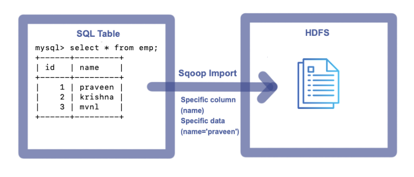

# Sqoop Import & Export Commands

Using Sqoop
- Direct Imports are possible
- Portion Imports are possible
- Incremental Imports are possible
- Modified Imports are possible
- Serialized Imports are possible
- Exports are possible

> Import --> Data from RDBMS to HDFS
> Export --> Data from HDFS to RDBMS


## 1. Sqoop Import Command
Following basic details are required
- Hostname
- PortNumber
- Database
- Username
- Password
- Table
- Target

### Sqoop Import Template
```sh
sqoop import --connect jdbc:mysql://<Hostname>:<PortNumber>/<Database> --username <Username> --password <Password> --table <TableName> --target-dir <TargetDirectory>
```

### 1.1 Sqoop full import from a single table


To import entire table data to HDFS, execute the following Command

```sh
sqoop import --connect jdbc:mysql://localhost:3306/mvp --username root --password cloudera --m 1 --table emp --delete-target-dir --target-dir /user/cloudera/mvp/tablefullimp
```

Console:
```sh
Warning: /usr/lib/sqoop/../accumulo does not exist! Accumulo imports will fail.
Please set $ACCUMULO_HOME to the root of your Accumulo installation.
25/02/28 19:36:03 INFO sqoop.Sqoop: Running Sqoop version: 1.4.6-cdh5.12.0
25/02/28 19:36:03 WARN tool.BaseSqoopTool: Setting your password on the command-line is insecure. Consider using -P instead.
25/02/28 19:36:04 INFO manager.MySQLManager: Preparing to use a MySQL streaming resultset.
25/02/28 19:36:04 INFO tool.CodeGenTool: Beginning code generation
25/02/28 19:36:06 INFO manager.SqlManager: Executing SQL statement: SELECT t.* FROM `emp` AS t LIMIT 1
25/02/28 19:36:06 INFO manager.SqlManager: Executing SQL statement: SELECT t.* FROM `emp` AS t LIMIT 1
25/02/28 19:36:06 INFO orm.CompilationManager: HADOOP_MAPRED_HOME is /usr/lib/hadoop-mapreduce
Note: /tmp/sqoop-cloudera/compile/246a4c39472ecd2a52f1874420880399/emp.java uses or overrides a deprecated API.
Note: Recompile with -Xlint:deprecation for details.
25/02/28 19:36:15 INFO orm.CompilationManager: Writing jar file: /tmp/sqoop-cloudera/compile/246a4c39472ecd2a52f1874420880399/emp.jar
25/02/28 19:36:21 INFO tool.ImportTool: Destination directory /user/cloudera/mvp/tablefullimp deleted.
25/02/28 19:36:21 WARN manager.MySQLManager: It looks like you are importing from mysql.
25/02/28 19:36:21 WARN manager.MySQLManager: This transfer can be faster! Use the --direct
25/02/28 19:36:21 WARN manager.MySQLManager: option to exercise a MySQL-specific fast path.
25/02/28 19:36:21 INFO manager.MySQLManager: Setting zero DATETIME behavior to convertToNull (mysql)
25/02/28 19:36:21 INFO mapreduce.ImportJobBase: Beginning import of emp
25/02/28 19:36:21 INFO Configuration.deprecation: mapred.job.tracker is deprecated. Instead, use mapreduce.jobtracker.address
25/02/28 19:36:21 INFO Configuration.deprecation: mapred.jar is deprecated. Instead, use mapreduce.job.jar
25/02/28 19:36:22 INFO Configuration.deprecation: mapred.map.tasks is deprecated. Instead, use mapreduce.job.maps
25/02/28 19:36:22 INFO client.RMProxy: Connecting to ResourceManager at /0.0.0.0:8032
25/02/28 19:36:36 INFO db.DBInputFormat: Using read commited transaction isolation
25/02/28 19:36:36 INFO mapreduce.JobSubmitter: number of splits:1
25/02/28 19:36:37 INFO mapreduce.JobSubmitter: Submitting tokens for job: job_1740798011012_0001
25/02/28 19:36:41 INFO impl.YarnClientImpl: Submitted application application_1740798011012_0001
25/02/28 19:36:41 INFO mapreduce.Job: The url to track the job: http://quickstart.cloudera:8088/proxy/application_1740798011012_0001/
25/02/28 19:36:41 INFO mapreduce.Job: Running job: job_1740798011012_0001
25/02/28 19:37:29 INFO mapreduce.Job: Job job_1740798011012_0001 running in uber mode : false
25/02/28 19:37:29 INFO mapreduce.Job:  map 0% reduce 0%
25/02/28 19:37:59 INFO mapreduce.Job:  map 100% reduce 0%
25/02/28 19:38:00 INFO mapreduce.Job: Job job_1740798011012_0001 completed successfully
25/02/28 19:38:01 INFO mapreduce.Job: Counters: 30
	File System Counters
		FILE: Number of bytes read=0
		FILE: Number of bytes written=151398
		FILE: Number of read operations=0
		FILE: Number of large read operations=0
		FILE: Number of write operations=0
		HDFS: Number of bytes read=87
		HDFS: Number of bytes written=27
		HDFS: Number of read operations=4
		HDFS: Number of large read operations=0
		HDFS: Number of write operations=2
	Job Counters
		Launched map tasks=1
		Other local map tasks=1
		Total time spent by all maps in occupied slots (ms)=25414
		Total time spent by all reduces in occupied slots (ms)=0
		Total time spent by all map tasks (ms)=25414
		Total vcore-milliseconds taken by all map tasks=25414
		Total megabyte-milliseconds taken by all map tasks=26023936
	Map-Reduce Framework
		Map input records=3
		Map output records=3
		Input split bytes=87
		Spilled Records=0
		Failed Shuffles=0
		Merged Map outputs=0
		GC time elapsed (ms)=224
		CPU time spent (ms)=6400
		Physical memory (bytes) snapshot=192737280
		Virtual memory (bytes) snapshot=1583419392
		Total committed heap usage (bytes)=137887744
	File Input Format Counters
		Bytes Read=0
	File Output Format Counters
		Bytes Written=27
25/02/28 19:38:01 INFO mapreduce.ImportJobBase: Transferred 27 bytes in 99.5933 seconds (0.2711 bytes/sec)
25/02/28 19:38:01 INFO mapreduce.ImportJobBase: Retrieved 3 records.
```

Imported File on HDFS:


### 1.2 Sqoop Full Import from single table with specific columns

To import specific columns data from a table to HDFS, execute the following Command
```sh
sqoop import --connect jdbc:mysql://localhost:3306/mvp --username root --password cloudera --m 1 --table emp --delete-target-dir --target-dir /user/cloudera/mvp/tablefullimpreqcols --columns "name"
```
Console:
```sh
Warning: /usr/lib/sqoop/../accumulo does not exist! Accumulo imports will fail.
Please set $ACCUMULO_HOME to the root of your Accumulo installation.
25/02/28 19:55:58 INFO sqoop.Sqoop: Running Sqoop version: 1.4.6-cdh5.12.0
25/02/28 19:55:58 WARN tool.BaseSqoopTool: Setting your password on the command-line is insecure. Consider using -P instead.
25/02/28 19:55:59 INFO manager.MySQLManager: Preparing to use a MySQL streaming resultset.
25/02/28 19:55:59 INFO tool.CodeGenTool: Beginning code generation
25/02/28 19:56:01 INFO manager.SqlManager: Executing SQL statement: SELECT t.* FROM `emp` AS t LIMIT 1
25/02/28 19:56:01 INFO manager.SqlManager: Executing SQL statement: SELECT t.* FROM `emp` AS t LIMIT 1
25/02/28 19:56:01 INFO orm.CompilationManager: HADOOP_MAPRED_HOME is /usr/lib/hadoop-mapreduce
Note: /tmp/sqoop-cloudera/compile/ea27d9644e6043629fb8b8f0e1df5f98/emp.java uses or overrides a deprecated API.
Note: Recompile with -Xlint:deprecation for details.
25/02/28 19:56:10 INFO orm.CompilationManager: Writing jar file: /tmp/sqoop-cloudera/compile/ea27d9644e6043629fb8b8f0e1df5f98/emp.jar
25/02/28 19:56:16 INFO tool.ImportTool: Destination directory /user/cloudera/mvp/tablefullimpreqcols deleted.
25/02/28 19:56:16 WARN manager.MySQLManager: It looks like you are importing from mysql.
25/02/28 19:56:16 WARN manager.MySQLManager: This transfer can be faster! Use the --direct
25/02/28 19:56:16 WARN manager.MySQLManager: option to exercise a MySQL-specific fast path.
25/02/28 19:56:16 INFO manager.MySQLManager: Setting zero DATETIME behavior to convertToNull (mysql)
25/02/28 19:56:16 INFO mapreduce.ImportJobBase: Beginning import of emp
25/02/28 19:56:16 INFO Configuration.deprecation: mapred.job.tracker is deprecated. Instead, use mapreduce.jobtracker.address
25/02/28 19:56:16 INFO Configuration.deprecation: mapred.jar is deprecated. Instead, use mapreduce.job.jar
25/02/28 19:56:16 INFO Configuration.deprecation: mapred.map.tasks is deprecated. Instead, use mapreduce.job.maps
25/02/28 19:56:16 INFO client.RMProxy: Connecting to ResourceManager at /0.0.0.0:8032
25/02/28 19:56:23 INFO db.DBInputFormat: Using read commited transaction isolation
25/02/28 19:56:23 INFO mapreduce.JobSubmitter: number of splits:1
25/02/28 19:56:24 INFO mapreduce.JobSubmitter: Submitting tokens for job: job_1740798011012_0002
25/02/28 19:56:26 INFO impl.YarnClientImpl: Submitted application application_1740798011012_0002
25/02/28 19:56:27 INFO mapreduce.Job: The url to track the job: http://quickstart.cloudera:8088/proxy/application_1740798011012_0002/
25/02/28 19:56:27 INFO mapreduce.Job: Running job: job_1740798011012_0002
25/02/28 19:57:00 INFO mapreduce.Job: Job job_1740798011012_0002 running in uber mode : false
25/02/28 19:57:00 INFO mapreduce.Job:  map 0% reduce 0%
25/02/28 19:57:33 INFO mapreduce.Job:  map 100% reduce 0%
25/02/28 19:57:34 INFO mapreduce.Job: Job job_1740798011012_0002 completed successfully
25/02/28 19:57:34 INFO mapreduce.Job: Counters: 30
	File System Counters
		FILE: Number of bytes read=0
		FILE: Number of bytes written=151541
		FILE: Number of read operations=0
		FILE: Number of large read operations=0
		FILE: Number of write operations=0
		HDFS: Number of bytes read=87
		HDFS: Number of bytes written=21
		HDFS: Number of read operations=4
		HDFS: Number of large read operations=0
		HDFS: Number of write operations=2
	Job Counters
		Launched map tasks=1
		Other local map tasks=1
		Total time spent by all maps in occupied slots (ms)=30135
		Total time spent by all reduces in occupied slots (ms)=0
		Total time spent by all map tasks (ms)=30135
		Total vcore-milliseconds taken by all map tasks=30135
		Total megabyte-milliseconds taken by all map tasks=30858240
	Map-Reduce Framework
		Map input records=3
		Map output records=3
		Input split bytes=87
		Spilled Records=0
		Failed Shuffles=0
		Merged Map outputs=0
		GC time elapsed (ms)=446
		CPU time spent (ms)=6510
		Physical memory (bytes) snapshot=185925632
		Virtual memory (bytes) snapshot=1558097920
		Total committed heap usage (bytes)=137887744
	File Input Format Counters
		Bytes Read=0
	File Output Format Counters
		Bytes Written=21
25/02/28 19:57:34 INFO mapreduce.ImportJobBase: Transferred 21 bytes in 78.2253 seconds (0.2685 bytes/sec)
25/02/28 19:57:34 INFO mapreduce.ImportJobBase: Retrieved 3 records.
```
Imported File on HDFS:


### 1.3. Sqoop Portion Imports from a single table

To import specific data(records) from a table to HDFS, execute the following Command
```sh
sqoop import --connect jdbc:mysql://localhost:3306/mvp --username root --password cloudera --m 1 --table emp --delete-target-dir --target-dir /user/cloudera/mvp/tableportionimp --where "name='praveen'"
```
Console:
```sh
Warning: /usr/lib/sqoop/../accumulo does not exist! Accumulo imports will fail.
Please set $ACCUMULO_HOME to the root of your Accumulo installation.
25/02/28 20:27:21 INFO sqoop.Sqoop: Running Sqoop version: 1.4.6-cdh5.12.0
25/02/28 20:27:21 WARN tool.BaseSqoopTool: Setting your password on the command-line is insecure. Consider using -P instead.
25/02/28 20:27:22 INFO manager.MySQLManager: Preparing to use a MySQL streaming resultset.
25/02/28 20:27:22 INFO tool.CodeGenTool: Beginning code generation
25/02/28 20:27:24 INFO manager.SqlManager: Executing SQL statement: SELECT t.* FROM `emp` AS t LIMIT 1
25/02/28 20:27:25 INFO manager.SqlManager: Executing SQL statement: SELECT t.* FROM `emp` AS t LIMIT 1
25/02/28 20:27:25 INFO orm.CompilationManager: HADOOP_MAPRED_HOME is /usr/lib/hadoop-mapreduce
Note: /tmp/sqoop-cloudera/compile/64dc7b3d60b45dbc506f18daec0b2316/emp.java uses or overrides a deprecated API.
Note: Recompile with -Xlint:deprecation for details.
25/02/28 20:27:34 INFO orm.CompilationManager: Writing jar file: /tmp/sqoop-cloudera/compile/64dc7b3d60b45dbc506f18daec0b2316/emp.jar
25/02/28 20:27:39 INFO tool.ImportTool: Destination directory /user/cloudera/mvp/tableportionimp deleted.
25/02/28 20:27:39 WARN manager.MySQLManager: It looks like you are importing from mysql.
25/02/28 20:27:39 WARN manager.MySQLManager: This transfer can be faster! Use the --direct
25/02/28 20:27:39 WARN manager.MySQLManager: option to exercise a MySQL-specific fast path.
25/02/28 20:27:39 INFO manager.MySQLManager: Setting zero DATETIME behavior to convertToNull (mysql)
25/02/28 20:27:39 INFO mapreduce.ImportJobBase: Beginning import of emp
25/02/28 20:27:39 INFO Configuration.deprecation: mapred.job.tracker is deprecated. Instead, use mapreduce.jobtracker.address
25/02/28 20:27:39 INFO Configuration.deprecation: mapred.jar is deprecated. Instead, use mapreduce.job.jar
25/02/28 20:27:39 INFO Configuration.deprecation: mapred.map.tasks is deprecated. Instead, use mapreduce.job.maps
25/02/28 20:27:40 INFO client.RMProxy: Connecting to ResourceManager at /0.0.0.0:8032
25/02/28 20:27:47 INFO db.DBInputFormat: Using read commited transaction isolation
25/02/28 20:27:47 INFO mapreduce.JobSubmitter: number of splits:1
25/02/28 20:27:48 INFO mapreduce.JobSubmitter: Submitting tokens for job: job_1740798011012_0003
25/02/28 20:27:50 INFO impl.YarnClientImpl: Submitted application application_1740798011012_0003
25/02/28 20:27:50 INFO mapreduce.Job: The url to track the job: http://quickstart.cloudera:8088/proxy/application_1740798011012_0003/
25/02/28 20:27:50 INFO mapreduce.Job: Running job: job_1740798011012_0003
25/02/28 20:28:26 INFO mapreduce.Job: Job job_1740798011012_0003 running in uber mode : false
25/02/28 20:28:26 INFO mapreduce.Job:  map 0% reduce 0%
25/02/28 20:28:54 INFO mapreduce.Job:  map 100% reduce 0%
25/02/28 20:28:55 INFO mapreduce.Job: Job job_1740798011012_0003 completed successfully
25/02/28 20:28:55 INFO mapreduce.Job: Counters: 30
	File System Counters
		FILE: Number of bytes read=0
		FILE: Number of bytes written=151700
		FILE: Number of read operations=0
		FILE: Number of large read operations=0
		FILE: Number of write operations=0
		HDFS: Number of bytes read=87
		HDFS: Number of bytes written=10
		HDFS: Number of read operations=4
		HDFS: Number of large read operations=0
		HDFS: Number of write operations=2
	Job Counters
		Launched map tasks=1
		Other local map tasks=1
		Total time spent by all maps in occupied slots (ms)=25249
		Total time spent by all reduces in occupied slots (ms)=0
		Total time spent by all map tasks (ms)=25249
		Total vcore-milliseconds taken by all map tasks=25249
		Total megabyte-milliseconds taken by all map tasks=25854976
	Map-Reduce Framework
		Map input records=1
		Map output records=1
		Input split bytes=87
		Spilled Records=0
		Failed Shuffles=0
		Merged Map outputs=0
		GC time elapsed (ms)=264
		CPU time spent (ms)=5770
		Physical memory (bytes) snapshot=191295488
		Virtual memory (bytes) snapshot=1575731200
		Total committed heap usage (bytes)=137887744
	File Input Format Counters
		Bytes Read=0
	File Output Format Counters
		Bytes Written=10
25/02/28 20:28:55 INFO mapreduce.ImportJobBase: Transferred 10 bytes in 75.7572 seconds (0.132 bytes/sec)
25/02/28 20:28:55 INFO mapreduce.ImportJobBase: Retrieved 1 records.
```
Imported File on HDFS:


### 1.4. Sqoop Portion Imports from a single table with specific columns

To import specific columns of specific data(records) from a table to HDFS, execute the following Command
```sh
sqoop import --connect jdbc:mysql://localhost:3306/mvp --username root --password cloudera --m 1 --table emp --delete-target-dir --target-dir /user/cloudera/mvp/tableportionimpreqcols --where "name='praveen'" --columns "name"
```
Console:
```sh
Warning: /usr/lib/sqoop/../accumulo does not exist! Accumulo imports will fail.
Please set $ACCUMULO_HOME to the root of your Accumulo installation.
25/02/28 20:45:55 INFO sqoop.Sqoop: Running Sqoop version: 1.4.6-cdh5.12.0
25/02/28 20:45:55 WARN tool.BaseSqoopTool: Setting your password on the command-line is insecure. Consider using -P instead.
25/02/28 20:45:56 INFO manager.MySQLManager: Preparing to use a MySQL streaming resultset.
25/02/28 20:45:56 INFO tool.CodeGenTool: Beginning code generation
25/02/28 20:45:59 INFO manager.SqlManager: Executing SQL statement: SELECT t.* FROM `emp` AS t LIMIT 1
25/02/28 20:45:59 INFO manager.SqlManager: Executing SQL statement: SELECT t.* FROM `emp` AS t LIMIT 1
25/02/28 20:45:59 INFO orm.CompilationManager: HADOOP_MAPRED_HOME is /usr/lib/hadoop-mapreduce
Note: /tmp/sqoop-cloudera/compile/688644f01568b30bc65cee3a0a712835/emp.java uses or overrides a deprecated API.
Note: Recompile with -Xlint:deprecation for details.
25/02/28 20:46:07 INFO orm.CompilationManager: Writing jar file: /tmp/sqoop-cloudera/compile/688644f01568b30bc65cee3a0a712835/emp.jar
25/02/28 20:46:12 INFO tool.ImportTool: Destination directory /user/cloudera/mvp/tableportionimpreqcols deleted.
25/02/28 20:46:12 WARN manager.MySQLManager: It looks like you are importing from mysql.
25/02/28 20:46:12 WARN manager.MySQLManager: This transfer can be faster! Use the --direct
25/02/28 20:46:12 WARN manager.MySQLManager: option to exercise a MySQL-specific fast path.
25/02/28 20:46:12 INFO manager.MySQLManager: Setting zero DATETIME behavior to convertToNull (mysql)
25/02/28 20:46:12 INFO mapreduce.ImportJobBase: Beginning import of emp
25/02/28 20:46:12 INFO Configuration.deprecation: mapred.job.tracker is deprecated. Instead, use mapreduce.jobtracker.address
25/02/28 20:46:13 INFO Configuration.deprecation: mapred.jar is deprecated. Instead, use mapreduce.job.jar
25/02/28 20:46:13 INFO Configuration.deprecation: mapred.map.tasks is deprecated. Instead, use mapreduce.job.maps
25/02/28 20:46:13 INFO client.RMProxy: Connecting to ResourceManager at /0.0.0.0:8032
25/02/28 20:46:20 INFO db.DBInputFormat: Using read commited transaction isolation
25/02/28 20:46:20 INFO mapreduce.JobSubmitter: number of splits:1
25/02/28 20:46:21 INFO mapreduce.JobSubmitter: Submitting tokens for job: job_1740798011012_0004
25/02/28 20:46:23 INFO impl.YarnClientImpl: Submitted application application_1740798011012_0004
25/02/28 20:46:23 INFO mapreduce.Job: The url to track the job: http://quickstart.cloudera:8088/proxy/application_1740798011012_0004/
25/02/28 20:46:23 INFO mapreduce.Job: Running job: job_1740798011012_0004
25/02/28 20:46:52 INFO mapreduce.Job: Job job_1740798011012_0004 running in uber mode : false
25/02/28 20:46:52 INFO mapreduce.Job:  map 0% reduce 0%
25/02/28 20:47:20 INFO mapreduce.Job:  map 100% reduce 0%
25/02/28 20:47:21 INFO mapreduce.Job: Job job_1740798011012_0004 completed successfully
25/02/28 20:47:22 INFO mapreduce.Job: Counters: 30
	File System Counters
		FILE: Number of bytes read=0
		FILE: Number of bytes written=151847
		FILE: Number of read operations=0
		FILE: Number of large read operations=0
		FILE: Number of write operations=0
		HDFS: Number of bytes read=87
		HDFS: Number of bytes written=8
		HDFS: Number of read operations=4
		HDFS: Number of large read operations=0
		HDFS: Number of write operations=2
	Job Counters
		Launched map tasks=1
		Other local map tasks=1
		Total time spent by all maps in occupied slots (ms)=24128
		Total time spent by all reduces in occupied slots (ms)=0
		Total time spent by all map tasks (ms)=24128
		Total vcore-milliseconds taken by all map tasks=24128
		Total megabyte-milliseconds taken by all map tasks=24707072
	Map-Reduce Framework
		Map input records=1
		Map output records=1
		Input split bytes=87
		Spilled Records=0
		Failed Shuffles=0
		Merged Map outputs=0
		GC time elapsed (ms)=351
		CPU time spent (ms)=6460
		Physical memory (bytes) snapshot=185425920
		Virtual memory (bytes) snapshot=1569693696
		Total committed heap usage (bytes)=140509184
	File Input Format Counters
		Bytes Read=0
	File Output Format Counters
		Bytes Written=8
25/02/28 20:47:22 INFO mapreduce.ImportJobBase: Transferred 8 bytes in 69.3222 seconds (0.1154 bytes/sec)
25/02/28 20:47:22 INFO mapreduce.ImportJobBase: Retrieved 1 records.
```
Imported File on HDFS:


